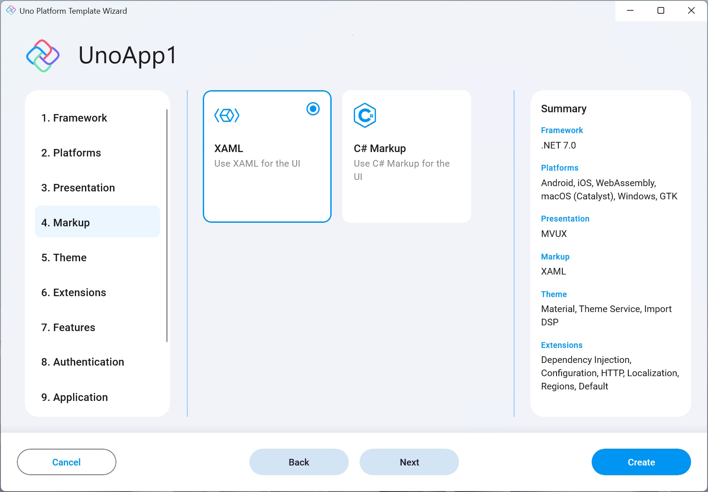

This setting allows you to choose the markup to use for declaring the UI of the application.

- #### XAML
    Use XAML for the declaration of UI.

- #### C# Markup
    Use C# Markup for the declaration of UI.

