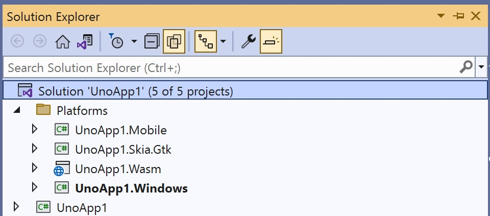
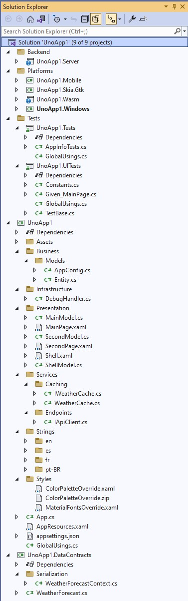
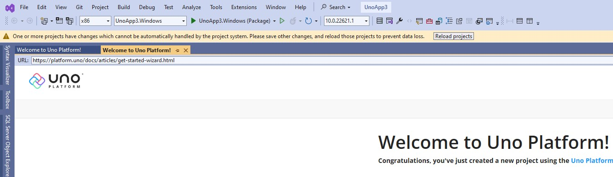

The main page of the wizard shows and the default template is selected.

This is an introductory page to the wizard and lets you choose between the blank or default template, and also enables you to customize that selection even further if you click *Customize*.

## Main options

- **Blank**  
    The *Blank* template generates a minimal Uno Platform app that targets the following platforms:  
    - Windows
    - Android
    - iOS
    - macOS
    - GTK
    - WASM

    Click "Create" or hit <kbd>Enter</kbd> to accept the selected choice and generate the project, or select the Default template.

    This is the structure of the generated blank project:

        

- **Default**  
    The default Project also consists of the above platforms: Windows, Android, iOS, Mac Catalyst, GTK, and WebAssembly, however, this template is preselected with additional features and pre-installed packages to help save even more saving you from typing redundant boilerplate code.
    This includes an ASP.NET Core server app backend which you can use to write your server API endpoints and is also used to host the WASM app.  
    It also includes a project with Uno.UITest preinstalled. This package includes important UI testing features, which you can learn about [here](xref:Uno.UITest.GetStarted).  

    In addition, it includes baked-in support provided by Uno.Extensions. Uno Extensions extends [Microsoft.Extensions.*](https://learn.microsoft.com/en-us/dotnet/standard/runtime-libraries-overview#extensions-to-the-runtime-libraries) by making sure it runs smoothly on all platforms and adding additional features and utils.

    This template is generated with Uno Platform's flagship products pre-installed, these include Extensions and Toolkit.
    The topics are briefly explained in this list but are further explained in depth further down on this page. Feel free to click the titles to scroll down to that topic.

    - [Configuration](#configuration)  
        This extension provides a way to load application configuration data from and to various sources using the [Options Pattern](https://learn.microsoft.com/en-us/dotnet/core/extensions/options).
        Refer to the [Uno Configuration](xref:Overview.Configuration) documentation for more information.

    - [App Hosting](#app-hosting)  
        Hosting keeps the central entry point of the app and encapsulates its core building blocks, such as [DI](#dependency-injection), [Logging](#logging), as well as controlling its state and shutdown.

    - [Dependency Injection](#dependency-injection)  
        Dependency Injection (DI) is an Inversion of Control (IoC) technique that ensures consuming classes' dependencies without them worrying about creating them.
        Learn more about DI [here](xref:Overview.DependencyInjection).

    - [Logging](#logging)  
        Logging is a crucial component in an app that enables the developer to emit log messages whenever an important action or execution is taken by the app. This then lets you trace back any errors or issues that may arise in the future.  
        The default template generates an app configured to write debug-level logging information to the Console and sets it up using Configuration, Hosting, and DI.
        Uno.Extensions.Logging is covered in more detail [here](xref:Overview.Logging).

    - [Navigation](#navigation)  
        Uno.Extensions.Navigation provides powerful navigation tools for your app.  
        The default template uses Uno's region navigation.  
        Learn more about Uno's Navigation library [here](xref:Overview.Navigation).

    - [HttpClient factory](#http)  
        Uno.Extensions.Http allows for the registration of API endpoints as multiple typed HttpClient instances.

        The [Refit library](https://github.com/reactiveui/refit) is also included as part of the HTTP extension, it enables mapping REST APIs into .NET interfaces.  
        For more documentation on HTTP requests, [read the documentation](xref:Overview.Http).  

    - [Localization](#localization)  
        The Localization extension is responsible for managing globalization in your app.  
        This enables keeping all translations of your app in a single place and enables the user to easily switch the UI language.

        The default template comes with the following pre-set languages: English (*en*), Spanish (*es*), French (*fr*), and Portuguese - Brazil (*pt-BR*).

        Read the full Localization documentation [here](xref:Overview.Localization) or learn more about [Globalization](https://learn.microsoft.com/en-us/dotnet/core/extensions/globalization).

    - [Serialization](#serialization)  
        Serialization is the act of serializing data. The default serializer is used with Uno.Extensions.Serialization is the new System.Text.Json, but you can easily configure it to use other serializers (such as XML, etc.), or your custom ones.
        This subject is discussed in more detail [here](xref:Overview.Serialization).

    - [The MVUX pattern](#mvux)  
        The MVUX pattern is a new programming architecture by Uno Platform. It stands for ***M**odel **V**iew **U**pdate e**X**tended*.  
        To learn more about the MVUX pattern, read [this](xref:Overview.Mvux.Overview).

    - Uno Toolkit  
        The [Uno Toolkit](https://platform.uno/uno-toolkit) provides a set of controls and UI utils.  
        It enables you to easily switch themes (Fluent, Material, Cupertino), provides many UI controls and components, UI graphics utilities, and access to device sensors and other features.  

    The generated project has the following structure:
    
    

## Customization
                    
The *Customize* button lets you customize the selected template and fine-tune which features should be included with the generated project.  
When clicking *Customize*, a wizard opens with the pre-selected settings per the choice on the first page (*Blank* or *Default*).

> [!NOTE]  
> When the project opens for the first time, a popup may show up asking to Reload the projects, this is normal.
>
> 
