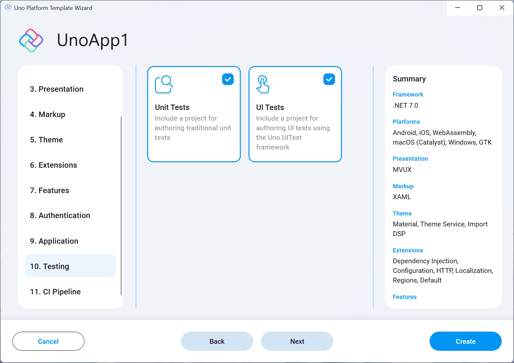

- **Unit tests**  
    Adds an [NUnit](https://nunit.org) test project that targets the main (shared) head project.  
    The project also comes with [FluentAssertions](https://fluentassertions.com) pre-installed.

- **UI tests**  
    Adds an NUnit-powered test app that provides UI testing capabilities using Uno Platform's UI testing tools (Uno.UITest).  
    To learn more about UI Testing in Uno Platform apps, read [this](xref:Uno.UITest.GetStarted).

