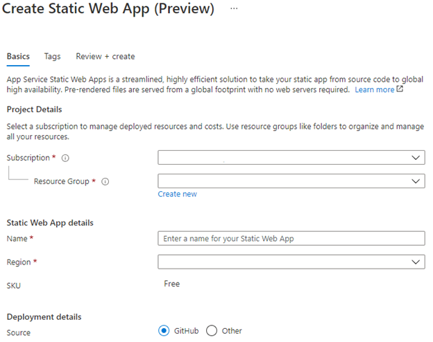
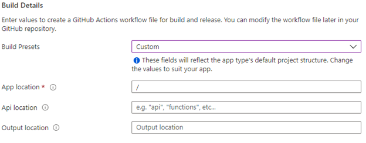

# Hosting Uno Platform WebAssembly apps on Azure Static Web Apps

Deploying and hosting of Uno Platform WebApps can be accomplished using [Azure Static Web Apps](https://learn.microsoft.com/azure/static-web-apps/overview).

This Azure service allows the publication of GitHub and Azure DevOps Git repositories to a service specialized for static web apps. It uses GitHub Actions or Azure DevOps to build and publish the application. The integration also supports the creation of temporary environments for Pull Requests, giving the ability to perform validations while a Pull Request is opened.

You can review [Configure Azure Static Web Apps from Azure documentation](https://learn.microsoft.com/azure/static-web-apps/configuration) to configure the server-side behavior of the application.

## Publishing Uno Platform WebAssembly app on Azure

Here is how to publish an app from GitHub, using Uno Platform:

- In a new repository, create an Uno Platform app using the following command:

    ```bash
    cd <repository-name>
    dotnet new -i Uno.Templates
    dotnet new unoapp -o MyApp
    ```

- If the `<TargetFrameworks>` value in the `MyApp.csproj` does not contain `net10.0-browserwasm`, [make sure to upgrade to the latest Uno release by following these steps](xref:Uno.Development.MigratingFromPreviousReleases).

- If in the `MyApp/wwwroot`, you find a `web.config` file, delete it. This will enable brotli compression in Azure Static Web Apps.
- Search for [Static Web Apps](https://portal.azure.com/#create/Microsoft.StaticApp) in the Azure Portal
- Fill the required fields in the creation form:

    

- Select your repository using the **Sign in with GitHub** button
- Select your organization, repository, and branch
- In the build presets, select **Custom**, and keep the default values

    

- Then click on **Review+Create** button. Azure will automatically create a new **GitHub Actions Workflow** in your repository. The workflow will automatically be started and will fail for this first run, as some parameters need to be adjusted.
- In your repository’s newly added github workflow (in `.github/workflows`), add the following two steps, after the checkout step:

    ```yaml
    - name: Setup dotnet
      uses: actions/setup-dotnet@v4
      with:
        dotnet-version: '9.0.x'

    - run: 
        cd src/MyApp
        dotnet publish -c Release -f net10.0-browserwasm
    ```

- In the Deploy step that was automatically added, change the `app_location` parameter to the following:

    ```yaml
    app_location: "src/MyApp/bin/Release/net10.0-browserwasm/publish/wwwroot"
    ```

- Once changed, the application will be built and deployed on your Azure Static Web App instance.

## Configuring Deep Linking with Fallback Routes

Azure Static Web Apps provides the [ability to configure many parts](https://learn.microsoft.com/azure/static-web-apps/configuration) of the application's behavior, and one particular feature is very useful to enable deep linking in applications.

You will need to [enable fallback routes](https://learn.microsoft.com/azure/static-web-apps/configuration#fallback-routes) in your application this way:

- In the `wwwroot` folder, [create a file named `staticwebapp.config.json`](https://learn.microsoft.com/azure/static-web-apps/configuration#file-location), with the following content:

  ```json
  {
    "navigationFallback": {
      "rewrite": "/index.html",
      "exclude": ["/package_*"]
    },
    "routes": [
      {
        "route": "/_framework/blazor.boot.*",
        "headers": {
          "cache-control": "must-revalidate, max-age=3600"
        }
      },
      {
        "route": "/_framework/dotnet.js",
        "headers": {
          "cache-control": "must-revalidate, max-age=3600"
        }
      },
      {
        "route": "/_framework/*",
        "headers": {
          "cache-control": "public, immutable, max-age=31536000"
        }
      },
      {
        "route": "/package_*",
        "headers": {
          "cache-control": "public, immutable, max-age=31536000"
        }
      },
      {
        "route": "/*",
        "headers": {
          "cache-control": "must-revalidate, max-age=3600"
        }
      }
    ]
  }
  ```

- In your application, you'll need to get the active url of the browser this way:

  ```csharp
  if (System.Uri.TryCreate(
      Uno.Foundation.WebAssemblyRuntime.InvokeJS("document.location.search"),
      UriKind.RelativeOrAbsolute,
      out var browserUrl))
  {
      var appPath = browserUrl.GetComponents(System.UriComponents.Path, UriFormat.Unescaped);
      // TODO: Process the path in your application
  }
  ```
