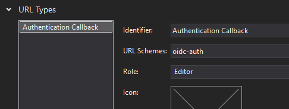

# Authentication using OpenID Connect

OpenID Connect is a layer over OAuth 2.0, allowing a simpler integration into applications, especially when the OpenID  Connect Discovery is used.

This article will document the usage of `IdentityModel.OidcClient` into an Uno application using the [`WebAuthenticationBroker`](../features/web-authentication-broker.md). You can find [the IdentityModel.OidcClient documentation here](https://identitymodel.readthedocs.io/en/latest/native/overview.html).

> The code of this article can be found in the Uno Samples at the following address: https://github.com/unoplatform/Uno.Samples/tree/master/UI/Authentication.OidcDemo

## Limitations

- **Platforms**: The `WebAuthenticationBroker` is not supported on all platforms yet. For Uno 3.6 it is implemented only on WebAssembly, Android, iOS and macOS.
- **Return URI on WebAssembly**: Because of browser security restrictions, on WebAssembly, the return URL must be on the same origin as the application. On other platforms the best approach is to use a custom protocol scheme (like `my-application:`). For most applications, you may simply use the automatic discovery of return URLs, which will use the [`WebAuthenticationBroker.GetCurrentApplicationCallbackUri()` method](https://docs.microsoft.com/en-us/uwp/api/windows.security.authentication.web.webauthenticationbroker.getcurrentapplicationcallbackuri).
- **Browser Anti-Popup Protection**: On WebAssembly, a foreign/public web site is usually used to authenticate the user. Doing this without losing the application context requires the opening of a new browser window. To ensure the window will open on all browsers without being denied, this new window **must be opened using the handling of a user interaction**. For this reason the IdentityModel.OidcClient's *automatic mode* can't be used because it's doing async processing (fetching the discovery endpoint) before opening the authentication browser.

## Demo Endpoint

This code uses the _IdentityServer_ demonstration endpoint with the following parameters:

| Field     | Value                                     |
| --------- | ----------------------------------------- |
| Authority | `https://demo.duendesoftware.com/`        |
| ClientId  | `interactive.confidential`                |
| Secret    | `secret`                                  |
| Scopes    | `openid profile email api offline_access` |

>  Note: this endpoint allows any return URIs. It's acceptable for demo purposes, but production application will usually requires to register return addresses.

## Step 0 - Install Uno + Create an Application

Please refer to the [Getting Started documentation](../get-started.md) to install Uno and create a new application. For the sample below, an application named `OidcDemo` has been created.

For platforms supporting it, the custom protocol "oidc-auth:" will be used.

## Step 1 - Add Reference to OidcClient package

Add the package [`IdentityModel.OidcClient`](https://www.nuget.org/packages/IdentityModel.OidcClient) to all relevant _head_ projects of the solution.

## Step 2 - Prepare for Return Uri

**Android**

Add the following class in the project of the Android Head.

``` csharp
[Activity(NoHistory = true, LaunchMode = LaunchMode.SingleTop, Exported = true)]
[IntentFilter(
	new[] {Android.Content.Intent.ActionView},
	Categories = new[] {Android.Content.Intent.CategoryDefault, Android.Content.Intent.CategoryBrowsable},
	DataScheme = "oidc-auth")]
public class WebAuthenticationBrokerActivity : WebAuthenticationBrokerActivityBase
{
}
```

Note the `[Activity]` attribute needs to include `Exported = true` if you are targeting Android 12.

This activity will intercept the return URI and forward it to any waiting `WebAuthenticationBroker`.

Note: it's using the system browser. Check the [WebAuthenticationBroker documentation](../features/web-authentication-broker.md) to use another mechanism.

**iOS & macOS**

Add the `oidc-auth:` custom scheme in `Info.plist` file.

``` csharp
<key>CFBundleURLTypes</key>
<array>
	<dict>
		<key>CFBundleURLName</key>
		<string>Authentication Callback</string>
		<key>CFBundleURLSchemes</key>
		<array>
			<string>oidc-auth</string>
		</array>
	</dict>
</array>
```

Alternatively, you can use the editor integrated in Visual Studio to set it, in the _advanced_ tab:



**UWP**

There's nothing special for UWP. Any return Uri will work.  You can force it to `oidc-auth:` if you want, but you won't have any special registration to do to support it.

**WebAssembly**

There's nothing special for WASM. The default _return Uri_ of the platform (`WebAuthenticationBroker.GetCurrentApplicationCallbackUri()`) will work with this sample and will default to `<origin>/authentication-callback`. It should be something like `http://localhost:5000/authentication-callback` when running locally using Kestrel.

## Step 3 - Prepare the UI

Add the following lines in your application, in `[Project-name]/MainPage.xaml`:

``` xml

<!--Add this line with the other dependencies-->
xmlns:toolkit="using:Uno.UI.Toolkit"

<!--This will replace the initial Grid-->
<Border toolkit:VisibleBoundsPadding.PaddingMask="All">
        <StackPanel Spacing="10" Margin="10">
            <StackPanel Orientation="Horizontal" Spacing="5">
                <Button Click="SignIn_Clicked" x:Name="btnSignin" IsEnabled="False">Sign In</Button>
                <Button Click="SignOut_Clicked" x:Name="btnSignout" IsEnabled="False">Sign Out</Button>
            </StackPanel>
            <TextBlock x:Name="txtAuthResult" />
        </StackPanel>
    </Border>
```

## Step 4 - Prepare the Requesting Code

Add the following code to the main page of your application:

``` csharp
//add this namespace on top of the class
using IdentityModel.OidcClient;
// Put this code in the class of MainPage.xaml.cs

public MainPage()
{
	this.InitializeComponent();
	PrepareClient();
}

private OidcClient _oidcClient;
private AuthorizeState _loginState;
private Uri _logoutUrl;

private async void PrepareClient()
{
	var redirectUri = WebAuthenticationBroker.GetCurrentApplicationCallbackUri().OriginalString;

	// Create options for endpoint discovery
	var options = new OidcClientOptions
	{
		Authority = "https://demo.duendesoftware.com/",
		ClientId = "interactive.confidential",
		ClientSecret = "secret",
		Scope = "openid profile email api offline_access",
		RedirectUri = redirectUri,
		PostLogoutRedirectUri = redirectUri,
	};

    // Create the client. In production application, this is often created and stored
    // directly in the Application class.
	_oidcClient = new OidcClient(options);

    // Invoke Discovery and prepare a request state, containing the nonce.
    // This is done here to ensure the discovery mechanism is done before
    // the user clicks on the SignIn button. Since the opening of a web window
    // should be done during the handling of a user interaction (here it's the button click),
    // it will be too late to reach the discovery endpoint.
    // Not doing this could trigger popup blocker mechanisms in browsers.
	_loginState = await _oidcClient.PrepareLoginAsync();
    btnSignin.IsEnabled = true;

    // Same for logout url.
    _logoutUrl = new Uri(await _oidcClient.PrepareLogoutAsync(new LogoutRequest()));
    btnSignout.IsEnabled = true;
}
```

## Step 5 - Proceed to Authentication

Add following button handlers:

``` csharp
private async void SignIn_Clicked(object sender, RoutedEventArgs e)
{
    var startUri = new Uri(_loginState.StartUrl);

	// Important: there should be NO await before calling .AuthenticateAsync() - at least
	// on WebAssembly, in order to prevent triggering the popup blocker mechanisms.
    var userResult = await WebAuthenticationBroker.AuthenticateAsync(WebAuthenticationOptions.None, startUri);
 
	if(userResult.ResponseStatus != WebAuthenticationStatus.Success)
    {
		txtAuthResult.Text = "Canceled";
        // Error or user cancellation
        return;
    }

    // User authentication process completed successfully.
    // Now we need to get authorization tokens from the response
    var authenticationResult = await _oidcClient.ProcessResponseAsync(userResult.ResponseData, _loginState);
 	
 	if(authenticationResult.IsError)
    {
        var errorMessage = authenticationResult.Error;
        // TODO: do something with error message
		txtAuthResult.Text = $"Error {errorMessage}";
        return;
    }

 	// That's completed. Here you have to token, ready to do something
 	var token = authenticationResult.AccessToken;
 	var refreshToken = authenticationResult.RefreshToken;

	// TODO: make something useful with the tokens
	txtAuthResult.Text = $"Success, token is {token}";
}

private async void SignOut_Clicked(object sender, RoutedEventArgs e)
{
	// Important: there should be NO await before calling .AuthenticateAsync() - at least
	// on WebAssembly, in order to prevent triggering the popup blocker mechanisms.
	await WebAuthenticationBroker.AuthenticateAsync(WebAuthenticationOptions.None, _logoutUrl);
}
```

## Step 6 - Finalize & Compile

**IMPORTANT FOR WEBASSEMBLY**

On WebAssembly, it's important to configure the linker to prevent the removal of some important part of the _OIDC Connect_ client library:

`LinkerConfig.xml`:

``` xml
<linker>
  <assembly fullname="My.Oidc.Client.App.Wasm" />
  <assembly fullname="Uno.UI" />

  <!-- ADD THE FOLLOWING 2 LINES -->
  <assembly fullname="IdentityModel" />
  <assembly fullname="System.IdentityModel.Tokens.Jwt" />

  <assembly fullname="System.Net.Http" />

  <assembly fullname="System.Core">
	<!-- This is required by JSon.NET and any expression.Compile caller -->
	<type fullname="System.Linq.Expressions*" />
  </assembly>
</linker>
```

Now compile & Run!
