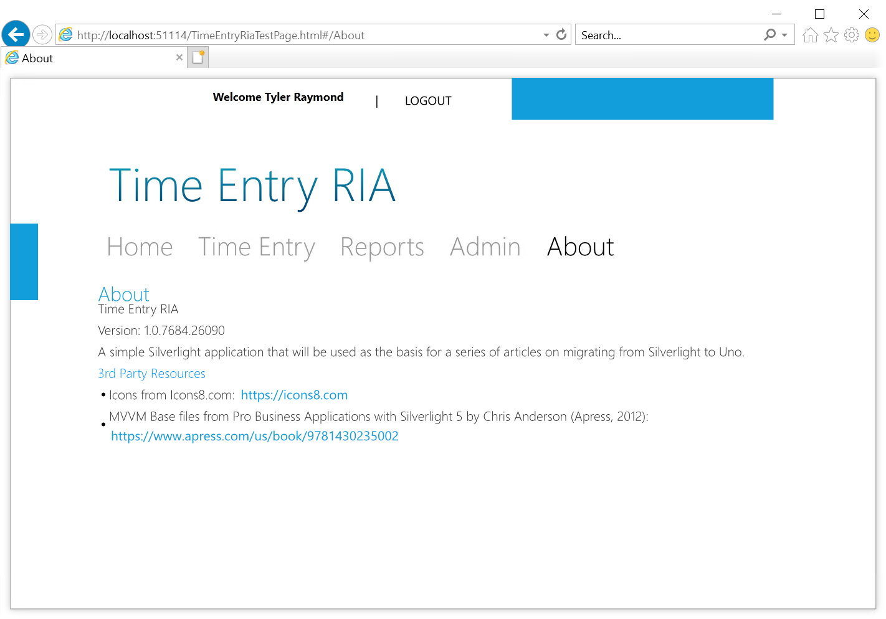

# Silverlight to Uno Migration

## Introduction

Despite the last version of Silverlight 5 being released back in 2011, the platform continued to be popular and there are a number of applications that have been developed and remain in use. Unfortunately, Silverlight will reach the end of support on October 12, 2021 and there continues to be significant limitations for Silverlight development and deployment:

* Silverlight SDK available in Visual Studio 2012
  * Can be opened in Visual Studio 2017 and 2019 with the unofficial extension [Silverlight for Visual Studio](https://marketplace.visualstudio.com/items?itemName=RamiAbughazaleh.SilverlightProjectSystem)
* Silverlight plugin runs in Internet Explorer 10 and 11 only
* No macOS browser support

If you maintain one of these Silverlight applications, it is time to consider migrating to a supported platform. For those that wish to continue with XAML and/or C#, the Uno Platform is a natural choice for continuing the delivery of such applications on Windows, iOS, Android, and WebAssembly.

> [!TIP]
> You can learn more about the Uno Platform [here](https://platform.uno/docs/articles/intro.html).

## Silverlight app review

The following video demonstrates the Silverlight **TimeEntryRia** application

## First steps - scoping the migration

When undertaking an application migration, it is important to identify the key objectives. If maximizing the re-use of existing code (C# and XAML), while minimizing the redesign of the UI layout are high on the list, strongly consider the Uno Platform.

Other things to consider include:

* Considering Navigation options
  * Many Silverlight applications used the navigation app template or the RIA Business App template. Modern apps also leverage a navigation style approach, often utilizing the "Hamburger" menu approach to navigation.

<<<<<<< HEAD
> [!TIP]
> Review the Microsoft navigation guide to learn more - [https://docs.microsoft.com/windows/uwp/design/basics/navigation-basics](https://docs.microsoft.com/windows/uwp/design/basics/navigation-basics)
=======
  > [!TIP]
  > To learn more about navigation, see [Navigation design basics for Windows apps](https://learn.microsoft.com/windows/uwp/design/basics/navigation-basics).
>>>>>>> a7a23f12bb (docs: Update Microsoft links)

* Styling choices - consider whether to migrate existing styles or adopt Fluent/Material as a new default
* Asynchronous code and threading
  * Silverlight leveraged a callback approach for asynchronous operations - later versions of C# introduced Tasks which can simplify development and debugging.
* Updating MVVM frameworks, if used (pure code-behind only still works well with UWP)
  * Decide whether to update to the UWP version or adopt a new approach - MVVMLight, Prism, etc.
  * If using a "roll-your-own" MVVM implementation, determine whether to update that to support UWP or migrate to an existing framework
* Data Access technologies - Silverlight apps commonly used WCF services and/or WCF RIA Services, both of which have been discontinued
  * Consider migrating to pure REST services, [gRPC](https://grpc.io/), or the  open-source version of WCF [CoreWCF](https://github.com/CoreWCF/CoreWCF)
* Silverlight application storage
  * UWP on Windows has many options for local storage, WASM is more limited

> [!TIP]
> To learn more about storage options, review the [Uno Windows Storage documentation](https://platform.uno/docs/articles/features/windows-storage.html).

## Why choose Uno?

You can find [50  Reasons Why](https://platform.uno/blog/50-reasons-to-use-uno-platform-for-your-next-project/) Uno is great choice, however there are some specific reasons that stand out:

* Uno uses UWP XAML which has much in common with the Silverlight version of XAML
  * Much of the XAML will port with simple namespace changes
  * Where there are not direct control matches, there are alternatives
* Uno applications are developed in C# so code-reuse is maximized
  * The C# code-behind will likely port easily
  * Pure business logic should port easily
  * There are Uno implementations of many of the MVVM implementations that were made popular by Silverlight
* Uno can target WebAssembly and modern browsers, as well as many other platforms, so the migrated application can be deployed widely
* Form factor - most Silverlight apps were modeled after desktop apps, and are therefore designed to exploit a landscape style orientation - ideal for UWP and WebAssembly apps.

 > [!NOTE]
 > Of course, UWP and, therefore, Uno, support the development of responsive applications that can exploit the portrait style designs prevalent in mobile applications, as well as responding to resizing of an application window.

## Starting migration

This guide to migration will refer to a Silverlight 5 application called **TimeEntryRIA** that utilizes the **Silverlight Business Application** solution template using the **Cosmopolitan Theme** (once referred to as **Metro**) and also includes **Authentication**, **WCF RIA Services** and **WCF services**. The sample app is a somewhat simplified Time Entry application that supports 3 roles:

* **Consultant** - can enter time
* **ReportViewer** - can view some simple charts
* **Admin** - includes the capabilities of **Consultant** and **ReportViewer** and can maintain the list of projects.

The guide will discuss the major aspects of migration as they arise during the course of creating the **TimeEntryUno** version of the application. The typical approach to writing an Uno application is the start with the UWP target, and then test with each of the other targeted platforms. As the current migration scope is only UWP and WASM, it makes sense to test the WASM version frequently as well.

> [!NOTE]
> The Silverlight **TimeEntryRIA** sample app as well as the sample migrated app **TimeEntryUno** are available for review - checkout the **TimeEntry Samples** article for details.

### Application layout

The following image shows the home page of the application. There are 3 key areas and the rest is "chrome" - the default style for Cosmopolitan was often criticized for the wasted space.

The 3 areas are:

1. Login control - when logged out, provides a **LOGIN** action. When logged in, displays the user friendly name and a logout action.
2. Navigation links - a series of styled **HyperlinkButtons** that will navigate to views.
3. The **Frame** control - manages navigation and displays content

Here is an example of the app logged in, displaying the **About** view:

The application navigation structure is as follows:

* **MainPage** - contains the **Frame**
  * **Home** - no logon required, displays 3 navigation icons
  * **Time Entry** - logon required, Consultant role, displays a read-only summary of the current users hours by project by day for the selected calendar week (defaults to current week).
    * **Add Time Entry** - logon required, Consultant role, displays a data entry form for saving a new time entry.
    * **Edit Project Time Entries** - logon required, Consultant role, displays an editable list of time entries for the selected week and project
  * **Reports** - logon required, ReportViewer role, displays a number of summary charts.
  * **Admin** - logon required, Admin role, displays an editable list of Projects.
  * **About** - no logon required, displays information about the app

### Application architecture

As this **TimeEntryRIA** is used as a sample, it demonstrates a number of approaches to constructing a Silverlight app including code-behind and MVVM, as well as using different data service implementations.

### Business logic

* **Authentication** utilizes a number of views and a service for authentication
* **Time Entry** view utilizes a code-behind only approach
* **Add Time Entry** view leverages an in-app defined MVVM approach

### Data access

* **Time Entry** view uses a WCF data service to retrieve the summary data
* **Add Time Entry** view uses WCF RIA services to retrieve projects and create time entries
* **LoginForm** uses a customized WCF RIA Services authentication service to validate users against a custom schema

The next section will walk through creating the initial Uno solution.

## Next unit: Create Uno solution

