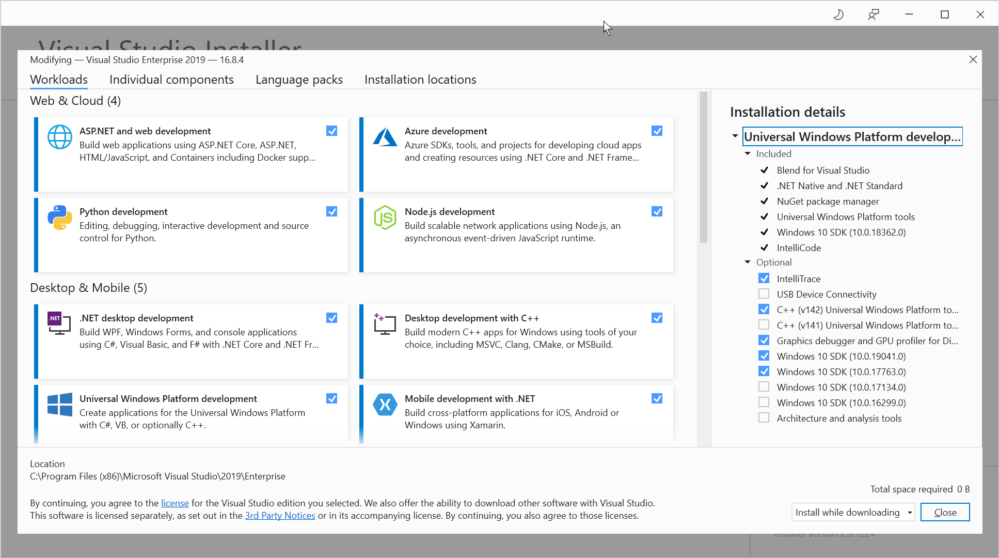

# Create the Uno solution for UWP and WASM

You can use the .NET CLI templates to create an Uno solution with just the project heads you requires. Alternatively, you can create the solution using the [Visual Studio Wizard](../../getting-started/wizard/using-wizard.md).

> [!TIP]
> See the Uno documentation for how to configure Visual Studio for Uno development:
>
> * [Getting Started on Visual Studio](../../get-started-vs-2022.md)

1. Open a command line prompt and navigate to the location you wish to create the Uno solution.

1. To install the Uno dotnet cli templates, enter the following command:

    ```dotnetcli
    dotnet new -i Uno.Templates
    ```

1. To create the Uno solution with just UWP and WASM heads, enter the following command:

    ```dotnetcli
    dotnet new unoapp -o TimeEntryUno -android=false -macos=false -ios=false --skia-wpf=false --skia-gtk=false --skia-tizen=false
    ```

    > [!NOTE]
    > As this guide is working through the migration of the **TimeEntryRIA** Silverlight app, the command above specified a solution name of **TimeEntryUno** - update the name as required.

## Upgrade NuGet packages

When working with Uno, it is important to ensure that the latest and greatest versions of a number of NuGet packages are included.

1. Open Visual Studio and open the generated solution file.

1. In the **Solution Explorer**, to update the Uno NuGet packages to the latest version, right-click on the Solution file and select **Manage NuGet Packages for Solution...** from the context menu.

    The **Manage Packages for Solution** page will open.

1. At the top-right of the **Manage Packages for Solution** page, in the **Package source** dropdown, ensure that **nuget.org** or **NuGet official package source** is selected.

1. At the top-left of page, to view solution packages available to update, click **Updates**.

1. On the **Updates** tab, to use the stable version of the packages, ensure  **Include prerelease** is unchecked.

1. From the list of available updates, select the following packages if they appear:

    * **Uno.Core**
    * **Uno.WinUI** (or **Uno.UI**)
    * **Uno.WinUI.DevServer** (or **Uno.UI.DevServer**)
    * **Uno.WinUI.WebAssembly** (or **Uno.UI.WebAssembly**)
    * **Uno.Wasm.Bootstrap**
    * **Uno.Wasm.Bootstrap.DevServer**

    > [!IMPORTANT]
    > **Do not** update the **Microsoft.Extensions.Logging.Console** and **Microsoft.Extensions.Logging.Filter** packages. Recent versions of the package use APIs that aren't supported by WebAssembly, and aren't compatible with Uno Platform.

1. Click **Update** to install the latest versions of the NuGet packages.

## Adding WinUI 2.x support

As part of the continuing evolution of desktop development on Windows, Microsoft has been working on the Windows UI library. The Windows UI Library (WinUI) is a native user experience (UX) framework for both Windows Desktop and UWP applications. There are two versions of WinUI: WinUI 2.x and WinUI 3 - WinUI 2.x is released, whereas, at the time of writing, WinUI 3 remains in preview. This article will utilize WinUI 2.5 as this represents the latest production version of the Windows controls.

> [!NOTE]
> The Uno Platform has great support for WinUI 2.x and preview support for WinUI 3:
>
> * For WinUI 2.5, see [Fluent-styled controls](/articles/features/fluent-styles.md)
> * For WinUI 3, see [Uno Platform 3.3 – Day 0 support for WinUI 3 Preview 3, Android 11](https://platform.uno/blog/uno-platform-3-3-day-0-support-for-winui-3-preview-3-android-11/).
>
> [!TIP]
> You can learn more about the Windows UI Library here:
>
> * [Windows UI Library (WinUI)](https://learn.microsoft.com/windows/apps/winui/)

There are a few steps to adding WinUI 2.5 to the Uno project:

1. To add the [Microsoft.UI.Xaml](https://www.nuget.org/packages/Microsoft.UI.Xaml/) NuGet package to the UWP head, right-click the UWP head project and click **Manage NuGet packages...**

1. In the **NuGet Manager** UI, select the **Browse** tab and search for **Microsoft.UI.Xaml**.

1. Select the latest version (at least 2.5) and click **Install**.

    After installing, a text file file will open providing instructions on how to add the WinUI resources to the application.

    > [!NOTE]
    > The [Uno.UI](https://www.nuget.org/packages/Uno.UI) NuGet package already includes the WinUI 2.x bits so there are no changes for the WASM head.

1. To add the WinUI resources to the app, open the `AppResources.xaml` or `App.xaml` file and add the following:

    ```xml
    <Application.Resources>
        <ResourceDictionary>
            <ResourceDictionary.MergedDictionaries>
                <XamlControlsResources xmlns="using:Microsoft.UI.Xaml.Controls" />
                <!-- Other merged dictionaries here -->
            </ResourceDictionary.MergedDictionaries>
            <!-- Other app resources here -->
        </ResourceDictionary>
    </Application.Resources>
    ```

1. To update the UWP target version, right-click the UWP head project and click **Properties**.

1. In the **Application** settings, update **Target version** and **Min version** to a **Windows 10, version 1903 (10.0; Build 19041)** or later.

    > [!NOTE]
    > Visual Studio will prompt to reload the project when you update the **Target version**.
    >
    > [!TIP]
    > If you do not see the desired version in the dropdown, you will need to install the appropriate version of the SDK using the Visual Studio Installer:
    >
    > 

Now that the solution is created, it is time to consider navigation and an approach to implementing a similar capability in UWP.

## Next unit: Considering navigation

[](02-considering-navigation.md)
