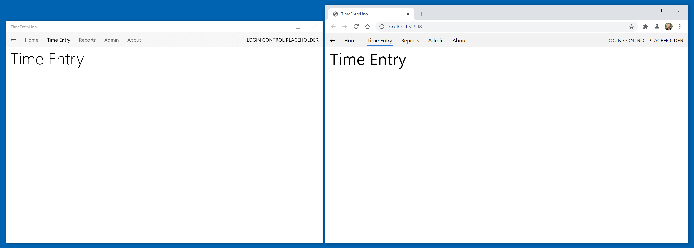

# Reviewing the app startup

Part of the initial startup for an application creates and configures navigation. The startup code and resources for both the Silverlight and UWP apps are defined in the **App.xaml** and **App.xaml.cs** files in each project. As Silverlight and UWP have different application models and life-cycles, unfortunately there is little opportunity for code-reuse here.

> [!TIP]
> It will be helpful to have both the Silverlight **TimeEntryRIA** solution and the Uno **TimeEntryUno** solution open to be able to compare and copy code as needed.

## Silverlight app startup

> [!TIP]
> Resources for the Silverlight Application Model and Application class include:
>
> * [Application Model](https://learn.microsoft.com/previous-versions/windows/silverlight/dotnet-windows-silverlight/cc872869(v=vs.95))
> * [Application Class](https://learn.microsoft.com/previous-versions/windows/silverlight/dotnet-windows-silverlight/ms588794(v=vs.95))

Briefly reviewing the Silverlight **App.xaml.cs** will reveal the following structure:

* **Constructor** - as well as initializing the application component, the  authentication components are also instantiated. As this Silverlight app is using ASP.NET authentication, this includes a **WebContext** and one of either **FormsAuthentication** or **WindowsAuthentication**.
* **Application_Startup** - the **WebContext** is added to resources for binding, an attempt is made to load a user (if using Windows auth or the Forms user chose to stay logged in), and the **InitializeRootVisual** method is called.
* **Application_UserLoaded** - this method is a callback executed once **LoadUser** completes and in a more robust application would handle errors, etc.
* **InitializeRootVisual** - this method uses a custom **BusyIndicator** control as the root visual, and then has a new instance of **MainPage** assigned as the content. **MainPage** defines the top-level application layout: chrome, login controls and navigation links and the **Frame**. Wrapping **MainPage** in a **BusyIndicator** control provides a simple way to have a global busy indicator when performing data retrieval operations, etc. A similar approach will be used in the Uno app.
* **Application_UnhandledException** - as the name suggests, this method is executed should an exception be raised by the application and be unhandled anywhere else. Although the debug code here just displays an error and allows the app to continue, it is highly likely that the app is in an unknown state. As the comments suggest, it is better to log the error and ensure the application exits.

> [!TIP]
> A common source of unhandled exceptions is asynchronous code that isn't handling exceptions correctly.

## Uno app startup

Earlier application platforms had a simple lifecycle - once launched, they continued to run and consume resources, regardless of whether they were focused, minimized, etc. The UWP app model supports a more complex and energy efficient lifecycle - an app can be suspended shortly after the user minimizes it or switches to another app. Of course, this capability  increases the complexity for managing the app startup, and introduces the need to manage suspend, resume and so on.

> [!TIP]
> Resources that cover the UWP Application Lifecycle include:
>
> * [Launching, resuming, and background tasks](https://learn.microsoft.com/windows/uwp/launch-resume/)
> * [App Lifecycle](https://learn.microsoft.com/windows/uwp/launch-resume/app-lifecycle)
> * [Application Class](https://learn.microsoft.com/uwp/api/windows.ui.xaml.application?view=winrt-19041)

The Uno template generates a basic `App.cs` and `App.xaml.cs` file that satisfies the minimum needs for app startup and suspension, and then configures the app to use a **Frame** control as the equivalent of the Silverlight RootVisual, and then navigates to the **MainPage**, which displays "Hello, World!".

Briefly reviewing the `App.cs` and `App.xaml.cs` files will reveal the following structure:

* **Constructor** - as well as initializing the application component, the app logging configuration method **ConfigureFilters** is called, and a subscription to the **Suspending** event is added.
* **OnLaunched** - this method is called if the application is launched by the user - other methods (not implemented in this template) are called for other scenarios (see resources above). The current window is retrieved and the content is checked to see if a **Frame** is already instantiated (see note below). If not, a new frame is configured and set as the window content. The code then checks to see if the app has been prelaunched (see note below) - if not, and the root frame isn't already showing content, it is navigated to the **MainPage**. Finally the window is activated, which brings it to the foreground and applying input focus.
* **OnNavigationFailed** - throws a new exception if the root frame fails to navigate
* **OnSuspending** - provides a hook for the app to save state prior to being suspended. The deferral requests that the system delays the suspension until the deferral has been completed - there is a max limit, so code here should not run for extended periods. There is no termination event, so if saving state is required, always save state here.
* **ConfigureFilters** - this method provides the means for customizing what is logged.

> [!NOTE]
>The **OnLaunched** method may appear more complex than expected, however this is due to the fact that if a user attempts to launch a UWP app more than once, subsequent launches are directed to the original running app. This means the code has to check to see if the app UI has already been setup. Additionally. as the app may have been terminated due to resource constraints, the code also provides the opportunity to reload the last saved app state.
>
> [!NOTE]
> The **OnLaunched** method checks to see if the app has been pre-launched - this is a state where Windows has automatically started commonly used apps to speed the perceived launch time for the user. In this state, the app is not expected to be displaying any UI. You can learn more about Prelaunch here:
> [Handle app prelaunch](https://learn.microsoft.com/windows/uwp/launch-resume/handle-app-prelaunch)

In the next task, the Uno application will be configured so that it can navigate to each of the top-level pages.

## Configuring the Uno app to use MainPage for navigation

In order to better align with the behavior of the Silverlight version of the app, the **OnLaunched** method must be customized.

### Customizing StartUp

1. Return to the **TimeEntryUno** solution.

1. In the **[MyApp]** project, open the **App.cs** file

1. Locate the **OnLaunched** method and replace it with the following code:

    ```csharp
    protected override void OnLaunched(LaunchActivatedEventArgs e)
    {
        var window = Windows.UI.Xaml.Window.Current;
        var rootPage = window.Content as MainPage;

        if (rootPage == null)
        {
            rootPage = new MainPage();
            window.Content = rootPage;
        }

        if (e.PrelaunchActivated == false)
        {
            window.Activate();
        }
    }
    ```

1. Review the new **OnLaunched** implementation.

    The primary difference here is that instead of creating a root frame, the app instead adds **MainPage** directly as the window content. As **MainPage** will contain a **Frame** and the navigation code, having another **Frame** at this level is unnecessary.

    Overall, it is simpler at this level, with **MainPage** taking responsibility for the initial navigation, etc.

### Adding navigation to MainPage

1. In the **[MyApp]** project, open the **MainPage.xaml** file

   The current XAML should look similar to:

    ```xml
    <Page
        x:Class="TimeEntryUno.MainPage"
        xmlns="http://schemas.microsoft.com/winfx/2006/xaml/presentation"
        xmlns:x="http://schemas.microsoft.com/winfx/2006/xaml"
        xmlns:local="using:TimeEntryUno"
        xmlns:d="http://schemas.microsoft.com/expression/blend/2008"
        xmlns:mc="http://schemas.openxmlformats.org/markup-compatibility/2006"
        mc:Ignorable="d"
        Background="{ThemeResource ApplicationPageBackgroundThemeBrush}">

        <Grid>
            <TextBlock Text="Hello, world!" Margin="20" FontSize="30" />
        </Grid>
    </Page>
    ```

1. To add the WinUI namespace (muxc), update the XAML to the following:

    ```xml
    <Page
        x:Class="TimeEntryUno.MainPage"
        xmlns="http://schemas.microsoft.com/winfx/2006/xaml/presentation"
        xmlns:x="http://schemas.microsoft.com/winfx/2006/xaml"
        xmlns:local="using:TimeEntryUno"
        xmlns:d="http://schemas.microsoft.com/expression/blend/2008"
        xmlns:mc="http://schemas.openxmlformats.org/markup-compatibility/2006"
        xmlns:muxc="using:Microsoft.UI.Xaml.Controls"
        mc:Ignorable="d"
        Background="{ThemeResource ApplicationPageBackgroundThemeBrush}">

        <Grid>
            <TextBlock Text="Hello, world!" Margin="20" FontSize="30" />
        </Grid>
    </Page>
    ```

1. To add the navigation controls. replace `<Grid>..</Grid>` with the following:

    ```xml
    <Grid>
        <muxc:NavigationView x:Name="NavView" PaneDisplayMode="Top" IsSettingsVisible="False"
                        IsBackEnabled="{Binding ElementName=ContentFrame, Path=CanGoBack}">
            <muxc:NavigationView.MenuItems>
                <muxc:NavigationViewItem Content="Home" Tag="HomePage"/>
                <muxc:NavigationViewItem Content="Time Entry" Tag="TimeEntryPage" />
                <muxc:NavigationViewItem Content="Reports" Tag="ReportsPage" />
                <muxc:NavigationViewItem Content="Admin" Tag="AdminPage" />
                <muxc:NavigationViewItem Content="About" Tag="AboutPage" />
            </muxc:NavigationView.MenuItems>
            <muxc:NavigationView.PaneFooter>
                <TextBlock VerticalAlignment="Center" Margin="12,0" Text="LOGIN CONTROL PLACEHOLDER" />
            </muxc:NavigationView.PaneFooter>
            <ScrollViewer>
                <Frame x:Name="ContentFrame" Padding="12,0,12,24" IsTabStop="True"
                       NavigationFailed="ContentFrame_NavigationFailed"/>
            </ScrollViewer>
        </muxc:NavigationView>
    </Grid>
    ```

1. Review the **MainPage** XAML:

    As mentioned earlier, the **NavigationView** control can provide a similar navigation experience to that which is available within the Silverlight Business App template if `PaneDisplayMode="Top"`, and the **Frame** control is very similar to the Silverlight version. What may come as a surprise is that there is no out-of-the-box integration between **NavigationView** and **Frame** that synchronizes the selected navigation item with the content displayed and the back button. To achieve this, additional code must be written.

    Notice that the **NavigationViewItem** elements have a **Tag** property that is set to a descriptive value for the destination page - this is used in code to map to the actual page type desired for navigation (this is not the only way to do it, but is the approach used here).

    In order to synchronize whether the back button is enabled if the **Frame** can navigate back, binding is used to update the **IsBackEnabled** property (it can also be performed in code):

    ```xml
    <muxc:NavigationView x:Name="NavView"  PaneDisplayMode="Top" IsSettingsVisible="False"
                            IsBackEnabled="{Binding ElementName=ContentFrame, Path=CanGoBack}">
    ```

    The remainder of the synchronization is performed in code and most of this code is encapsulated within a new class - **NavigationSyncHelper**.

    > [!TIP]
    > You can learn more about the **NavigationView** and the **Frame** controls here:
    >
    > * [NavigationView](https://learn.microsoft.com/windows/uwp/design/controls-and-patterns/navigationview)
    > * [Frame](https://learn.microsoft.com/uwp/api/Windows.UI.Xaml.Controls.Frame)

### Adding a class to help with navigation synchronization

1. To create a location for all helpers, add a new folder, **Helpers**, to the **[MyApp]** project.

1. Add a new class, **NavigationSyncHelper**, to the **Helpers** folder.

1. Update the **NavigationSyncHelper** class **using** statements to be the following:

    ```csharp
    using System;
    using System.Collections.Generic;
    using System.Linq;
    using Windows.UI.Xaml.Controls;
    using Windows.UI.Xaml.Navigation;
    ```

1. Add the following private variables to the class:

    ```csharp
    public class NavigationSyncHelper
    {
        private Microsoft.UI.Xaml.Controls.NavigationView _navigationView;
        private Frame _frame;
        private Microsoft.UI.Xaml.Controls.NavigationViewItem _lastInvokedMenuItem;
        private Dictionary<string, Type> _pageMap;
    ```

    Aside from maintaining references to the **NavigationView** and **Frame**, the last **NavigationViewItem** items is tracked to prevent duplicate navigation. The **_pageMap** dictionary is used to map a string descriptor for a page (stored in a **NavigationViewItem** **Tag** property) to the page **Type**.

1. Add the following constructor:

    ```csharp
    public NavigationSyncHelper(
        Microsoft.UI.Xaml.Controls.NavigationView navigationView,
        Frame frame,
        Dictionary<string, Type> pageMap)
    {
        _frame = frame;
        _navigationView = navigationView;
        _pageMap = pageMap;

        _navigationView.ItemInvoked += NavView_ItemInvoked;
        _navigationView.BackRequested += NavView_BackRequested;
        _frame.Navigated += Frame_Navigated;
    }
    ```

    As well as initializing the member variables described earlier, various events are subscribed to:

    * `_navigationView.ItemInvoked` - raised when a navigation item is selected, either in code or by a user clicking an item
    * `_navigationView.BackRequested` - raised if the **NavigationView** back button is clicked
    * `_frame.Navigated` - occurs **after** the **Frame** has navigated and is used synchronize the currently selected navigation item - necessary if a back navigation occurs.

1. Add the implementation of **NavView_ItemInvoked**:

    ```csharp
    private void NavView_ItemInvoked(
        Microsoft.UI.Xaml.Controls.NavigationView sender,
        Microsoft.UI.Xaml.Controls.NavigationViewItemInvokedEventArgs args)
    {
        var invokedMenuItem = args.InvokedItemContainer as Microsoft.UI.Xaml.Controls.NavigationViewItem;

        if (invokedMenuItem == null || invokedMenuItem == _lastInvokedMenuItem)
        {
            return;
        }

        var tag = invokedMenuItem.Tag.ToString();
        if (_pageMap.ContainsKey(tag))
        {
            var destinationType = _pageMap[tag];
            if (!_frame.Navigate(destinationType, null, args.RecommendedNavigationTransitionInfo))
            {
                return;
            }
            _lastInvokedMenuItem = invokedMenuItem;
        }
    }
    ```

1. Add the implementation of **NavView_BackRequested**:

    ```csharp
    private void NavView_BackRequested(
        Microsoft.UI.Xaml.Controls.NavigationView sender,
        Microsoft.UI.Xaml.Controls.NavigationViewBackRequestedEventArgs args)
    {
        if (_frame.CanGoBack)
        {
            _frame.GoBack();
        }
    }
    ```

    Pretty straightforward - if the **Frame** can go back, go back.

1. Add the implementation of **Frame_Navigated**:

    ```csharp
    private void Frame_Navigated(object sender, NavigationEventArgs e)
    {
        var currentSelectedItem = _navigationView.MenuItems
            .FirstOrDefault(mi => ((Microsoft.UI.Xaml.Controls.NavigationViewItem)mi).IsSelected) as Microsoft.UI.Xaml.Controls.NavigationViewItem;
        if (currentSelectedItem != null)
        {
            var tag = currentSelectedItem.Tag.ToString();
            var currentSelectedType = _pageMap[currentSelectedItem.Tag.ToString()];
            if (e.SourcePageType != currentSelectedType)
            {
                SetSelectedItem();
            }
        }
        else
        {
            SetSelectedItem();
        }

        void SetSelectedItem()
        {
            var tagToFind = _pageMap.FirstOrDefault(entry => entry.Value == e.SourcePageType).Key;
            if (_navigationView.MenuItems.FirstOrDefault(mi => ((Microsoft.UI.Xaml.Controls.NavigationViewItem)mi).Tag.Equals(tagToFind)) is Microsoft.UI.Xaml.Controls.NavigationViewItem matchedItem)
            {
                matchedItem.IsSelected = true;
                _lastInvokedMenuItem = matchedItem;
            }
        }
    }
    ```

    This code checks to see if the currently selected navigation item matches the page that the **Frame** just navigated to - if not (or there is nothing selected), the selection is updated. As it is possible to navigate to sub-views that don't appear on the top level navigation, a page that isn't in the **_pageMap** is ignored.

### Finishing the initial implementation of navigation

1. To integrate the **NavigationSyncHelper** and finish the initial implementation of navigation, switch to the **MainPage.xaml.cs** code-behind file.

1. Update the **NavigationSyncHelper** class **using** statements to be the following:

    ```csharp
    using System;
    using System.Collections.Generic;
    using TimeEntryUno.Shared.Helpers;
    using TimeEntryUno.Shared.Views;
    using Windows.UI.Xaml;
    using Windows.UI.Xaml.Controls;
    using Windows.UI.Xaml.Navigation;
    ```

1. Add the following member variable to reference and instance of the **NavigationSyncHelper** class:

    ```csharp
    private NavigationSyncHelper _navigationSyncHelper;
    ```

1. Update the constructor using the following code:

    ```csharp
    public MainPage()
    {
        this.InitializeComponent();
        this.Loaded += MainPage_Loaded;
        _navigationSyncHelper = new NavigationSyncHelper(
            NavView,
            ContentFrame,
            new Dictionary<string, Type>()
            {
                {"HomePage",        typeof(HomePage) },
                {"TimeEntryPage",   typeof(TimeEntryPage) },
                {"ReportsPage",     typeof(ReportsPage) },
                {"AdminPage",       typeof(AdminPage) },
                {"AboutPage",       typeof(AboutPage) },
            });
    }
    ```

    In this code, we subscribe to the page loaded event, which is raised after the app is launched and an instance of **MainPage** is assigned to the window content. We use this to navigate to the **HomePage**.

    The code also instantiates the **NavigationSyncHelper**, passing in references to the **NavView** and **ContentFrame** controls. It also creates the page map, associating the tag strings with the concrete page types.

1. Add the **MainPage_Loaded** method:

    ```csharp
    private void MainPage_Loaded(object sender, RoutedEventArgs e)
    {
        ContentFrame.Navigate(typeof(HomePage), null, new EntranceNavigationTransitionInfo());
    }
    ```

    This method is called when the **MainPage** is loaded with the intention of causing an initial navigation to the **HomePage**.

1. Next, add the **ContentFrame_NavigationFailed** method stub:

    ```csharp
    private void ContentFrame_NavigationFailed(object sender, NavigationFailedEventArgs e)
    {
        // log errors
        // show error window
    }
    ```

    This method is only added to support the XAML declaration so that the app compiles - the logging and error window will be added later.

    At this point, the app is ready to compile and run.

1. Build and run the project on each platform. When launching the WASM head, use 'Start without debugging' (**Ctrl+F5**).

    Try navigating to each page and using the back button. Notice that entrance animations play in UWP but are not supported in WASM. The apps should look similar to:

    

## Next unit: Migrate home page XAML and styles

[](04-migrate-home-page-xaml-and-styles.md)
