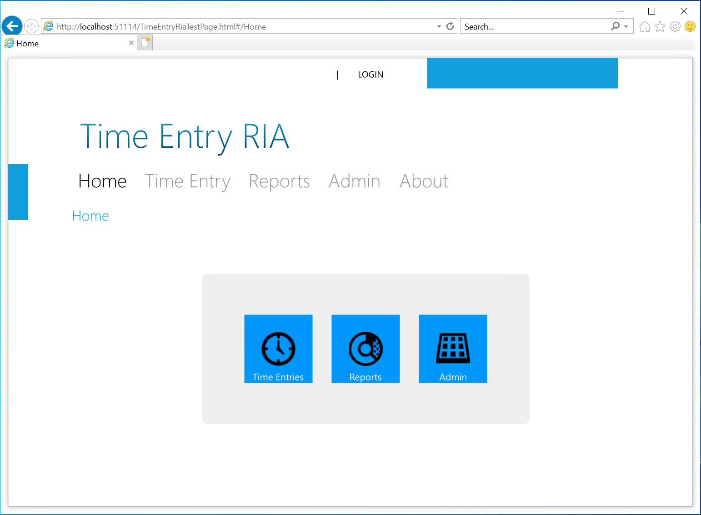
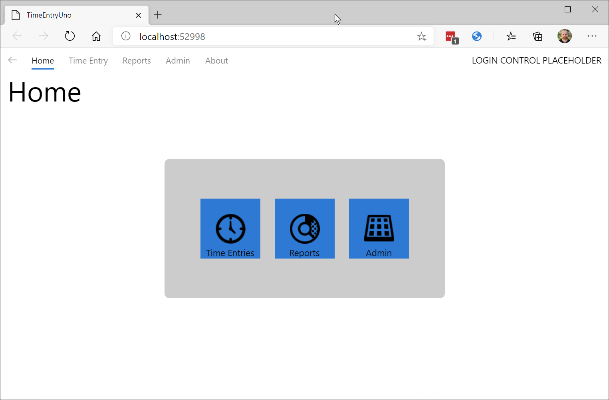

# Migrating the home page XAML and styles

The general approach for migrating a Silverlight page to UWP is to start by creating a new UWP page (as demonstrated earlier) and then copying the content XAML and associated styles from the Silverlight page to UWP. The approach would then be:

* Fix namespaces
* Migrate/updates styles
* Controls updates:
  * For those that map directly (such as **Button** or **TextBlock**), update any syntax differences
  * For those with an alternate UWP control (such as Silverlight **DataGrid** and the Windows Community Toolkit **DataGrid**), update the XAML as needed
  * For those with no alternatives, consider a custom control
* Databinding - consider migrating to **x:Bind**
* Convertors - convert or consider migrating to function bindings

In the sample Silverlight app, the home page uses 3 **HyperlinkButton** controls containing images as alternate means to navigate to the primary capabilities of the application and looks like the following:



The next task will review the similarities and differences between the Silverlight version and UWP.

## Compare the Silverlight Home XAML to the UWP XAML

If the Silverlight home page XAML is compared with the UWP XAML, it is apparent that there is much in common. Reviewing the page and namespace declarations will show that the basic controls used for layout, such as `Grid` and `StackPanel`, content controls such as `Image` and `TextBlock`, as well as the simpler interaction controls such as `TextBox`, `Button` and `HyperlinkButton` are virtually identical.

```xml
<navigation:Page
  x:Class="TimeEntryRia.Home"
  xmlns="http://schemas.microsoft.com/winfx/2006/xaml/presentation"
  xmlns:x="http://schemas.microsoft.com/winfx/2006/xaml"
  xmlns:d="http://schemas.microsoft.com/expression/blend/2008"
  xmlns:mc="http://schemas.openxmlformats.org/markup-compatibility/2006"
  xmlns:navigation="clr-namespace:System.Windows.Controls;assembly=System.Windows.Controls.Navigation"
  mc:Ignorable="d" d:DesignWidth="640" d:DesignHeight="480"
  Style="{StaticResource PageStyle}">

  <Grid x:Name="LayoutRoot">

        <TextBlock x:Name="HeaderText" Style="{StaticResource HeaderTextStyle}"
                           Text="{Binding Path=ApplicationStrings.HomePageTitle, Source={StaticResource ResourceWrapper}}"/>
        <Grid VerticalAlignment="Center" HorizontalAlignment="Center">
            <Rectangle Style="{StaticResource ContentPanelBackground}" />
            <StackPanel Orientation="Horizontal" VerticalAlignment="Center" HorizontalAlignment="Center" Margin="48">
                <HyperlinkButton Margin="12" NavigateUri="/TimeEntryPage">
                    <Grid>
                        <Rectangle Style="{StaticResource HomeNavButtonsBackground}"/>
                        <Image Source="../Assets/Images/icons8-watch-50.png" Stretch="None" />
                        <TextBlock Style="{StaticResource HomeNavButtonsText}"
                               Text="Time Entries" />
                    </Grid>
                </HyperlinkButton>
                <HyperlinkButton Margin="12" NavigateUri="/ReportsPage">
                    <Grid>
                        <Rectangle Style="{StaticResource HomeNavButtonsBackground}"/>
                        <Image Source="../Assets/Images/icons8-doughnut-chart-50.png" Stretch="None" />
                        <TextBlock Style="{StaticResource HomeNavButtonsText}"
                               Text="Reports" />
                    </Grid>
                </HyperlinkButton>
                <HyperlinkButton Margin="12" NavigateUri="/AdminPage">
                    <Grid>
                        <Rectangle Style="{StaticResource HomeNavButtonsBackground}"/>
                        <Image Source="../Assets/Images/icons8-control-panel-50.png" Stretch="None" />
                        <TextBlock Style="{StaticResource HomeNavButtonsText}"
                               Text="Admin" />
                    </Grid>
                </HyperlinkButton>
            </StackPanel>
        </Grid>
    </Grid>
</navigation:Page>
```

Compare the above Silverlight XAML to the current UWP XAML definition of the **HomePage**:

```xml
<Page
    x:Class="TimeEntryUno.Shared.Views.HomePage"
    xmlns="http://schemas.microsoft.com/winfx/2006/xaml/presentation"
    xmlns:x="http://schemas.microsoft.com/winfx/2006/xaml"
    xmlns:d="http://schemas.microsoft.com/expression/blend/2008"
    xmlns:mc="http://schemas.openxmlformats.org/markup-compatibility/2006"
    xmlns:local="using:TimeEntryUno.Shared.Views"
    mc:Ignorable="d"
    Background="{ThemeResource ApplicationPageBackgroundThemeBrush}">

    <Grid>
        <TextBlock Text="Home" Style="{StaticResource HeaderTextBlockStyle}"/>
    </Grid>
</Page>
```

First, it can be seen that UWP uses the **Page** class as the base for a page, however the attributes are very similar - both share the **x:Class** attribute that specifies the code-behind partial class that is joined with the XAML during compilation. The next four namespace declarations are identical between the two, clearly demonstrating the commonality. Next, the Silverlight page defines a namespace for navigation, as this was added to Silverlight in version 3 and was not part of the original namespaces. A key thing to note here is how the reference to assemblies has been refined:

* Silverlight: `xmlns:navigation="clr-namespace:System.Windows.Controls;assembly=System.Windows.Controls.Navigation"`
* UWP: `xmlns:local="using:TimeEntryUno.Shared.Views"`

The UWP approach is similar to that used in C#.

In the next task the Silverlight XAML will be copied over and updated to work in the Uno app.

> [!TIP]
> The approach for migrating a Silverlight namespace prefix definition to a UWP definition would be as follows:
>
> * Change "clr-namespace" to "using"
> * Delete any assembly token and semi-colon
>
> Example:
>
> `xmlns:TimeEntryModels="clr-namespace:TimeEntry.Models;assembly=TimeEntry"`
>
> Becomes:
>
> `xmlns:TimeEntryModels="using:TimeEntry.Models"`

## Convert the content XAML

1. In the **Shared** project, open the **Home.xaml** file and locate the **TextBlock**. Insert the following XAML beneath it:

    ```xml
    <Grid VerticalAlignment="Center" HorizontalAlignment="Center">
        <Rectangle Style="{StaticResource ContentPanelBackground}" />
        <StackPanel Orientation="Horizontal" VerticalAlignment="Center" HorizontalAlignment="Center" Margin="48">
            <HyperlinkButton Margin="12" NavigateUri="/TimeEntryPage">
                <Grid>
                    <Rectangle Style="{StaticResource HomeNavButtonsBackground}"/>
                    <Image Source="../Assets/Images/icons8-watch-50.png" Stretch="None" />
                    <TextBlock Style="{StaticResource HomeNavButtonsText}"
                            Text="Time Entries" />
                </Grid>
            </HyperlinkButton>
            <HyperlinkButton Margin="12" NavigateUri="/ReportsPage">
                <Grid>
                    <Rectangle Style="{StaticResource HomeNavButtonsBackground}"/>
                    <Image Source="../Assets/Images/icons8-doughnut-chart-50.png" Stretch="None" />
                    <TextBlock Style="{StaticResource HomeNavButtonsText}"
                            Text="Reports" />
                </Grid>
            </HyperlinkButton>
            <HyperlinkButton Margin="12" NavigateUri="/AdminPage">
                <Grid>
                    <Rectangle Style="{StaticResource HomeNavButtonsBackground}"/>
                    <Image Source="../Assets/Images/icons8-control-panel-50.png" Stretch="None" />
                    <TextBlock Style="{StaticResource HomeNavButtonsText}"
                            Text="Admin" />
                </Grid>
            </HyperlinkButton>
        </StackPanel>
    </Grid>
    ```

    There are a number of obvious and less obvious issues:

    * Missing styles:
      * ContentPanelBackground
      * HomeNavButtonsBackground
      * HomeNavButtonsText
    * **HyperlinkButton** controls - in Silverlight, **NavigateUri** integrates with the navigation system, whereas in UWP the click event will be used to run code-behind.
    * **Image** controls - the assets are missing and will be in different locations

## Migrating the styles

The next steps will show how migrate the Silverlight styles to work in the Uno app.

1. In the **Shared** project, add a new folder named **Resources**.

1. Right-click the new **Resources** folder, select **Add &gt; New Item**, select **Resource Dictionary** and name it **Styles.xaml**.

    To ensure the resource dictionary is loaded, it must be added to **AppResources.xaml**.

1. Open **AppResources.xaml** and the reference to the **Styles.xaml** as shown below:

    ```xml
    <Application.Resources>
        <ResourceDictionary>
            <ResourceDictionary.MergedDictionaries>
                <XamlControlsResources xmlns="using:Microsoft.UI.Xaml.Controls" />
                <!-- Other merged dictionaries here -->

                <ResourceDictionary Source="/Resources/Styles.xaml" />
            </ResourceDictionary.MergedDictionaries>
            <!-- Other app resources here -->
        </ResourceDictionary>
    </Application.Resources>
    ```

1. The first style that is missing is **ContentPanelBackground**, so review the style and any associated resources as defined in the Silverlight app. **ContentPanelBackground** is defined in the Silverlight file **Styles.xaml**:

    ```xml
    <Style x:Key="ContentPanelBackground" TargetType="Rectangle">
        <Setter Property="RadiusX" Value="{StaticResource Radius}"/>
        <Setter Property="RadiusY" Value="{StaticResource Radius}"/>
        <Setter Property="Fill" Value="{StaticResource ContentPanelBackgroundBrush}"/>
    </Style>
    ```

    This style has a dependency on other resources, the first **Radius** is also defined in **Styles.xaml**:

    ```xml
    <my:Double x:Key="Radius">8</my:Double>
    ```

    > [!NOTE]
    > This resource includes a custom namespace **my:** - this is defined as `xmlns:my="clr-namespace:System;assembly=mscorlib"`. This namespace definition will not be required in the Uno project - the **x:** namespace incorporates the primitives such as **Double**.

    The second dependency **ContentPanelBackgroundBrush**, is defined in the **Brushes.xaml** (in the sample a single resource file will be used):

    ```xml
    <SolidColorBrush x:Key="ContentPanelBackgroundBrush" Color="{StaticResource Gray1}"/>
    ```

    The brush resource is dependent on a color resource, also defined in **Brushes.xaml**:

    ```xml
    <Color x:Key="Gray1">#FFCCCCCC</Color>
    ```

    These styles are 100% compatible, so may be copied directly into the **Styles.xaml** that was just created.

1. To add the **ContentPanelBackground** style and related resources, update the Uno **Styles.xaml** as follows:

    ```xml
    <ResourceDictionary
        xmlns="http://schemas.microsoft.com/winfx/2006/xaml/presentation"
        xmlns:x="http://schemas.microsoft.com/winfx/2006/xaml">

        <!-- Primitives -->
        <x:Double x:Key="Radius">8</x:Double>

        <!-- Colors -->
        <Color x:Key="Gray1">#FFCCCCCC</Color>

        <!-- Brushes -->
        <SolidColorBrush x:Key="ContentPanelBackgroundBrush" Color="{StaticResource Gray1}"/>

        <!-- Styles -->
        <Style x:Key="ContentPanelBackground" TargetType="Rectangle">
            <Setter Property="RadiusX" Value="{StaticResource Radius}"/>
            <Setter Property="RadiusY" Value="{StaticResource Radius}"/>
            <Setter Property="Fill" Value="{StaticResource ContentPanelBackgroundBrush}"/>
        </Style>

    </ResourceDictionary>
    ```

    If you compile the application and open the **HomePage.xaml** file, you should now see the gray rectangle rendered.

1. The next resource to be added is **HomeNavButtonsBackground**. In the Silverlight app it is defined as:

    ```xml
    <Style x:Key="HomeNavButtonsBackground" TargetType="Rectangle">
        <Setter Property="Width" Value="100"/>
        <Setter Property="Height" Value="100"/>
        <Setter Property="Fill" Value="{StaticResource HighLightColorBrush}"/>
    </Style>
    ```

    This has a dependency on **HighLightColorBrush** which is defined in the same resource dictionary:

    ```xml
    <SolidColorBrush x:Key="HighLightColorBrush" Color="#FF0097FC"/>
    ```

    In Windows 10, the system provides an accent color that the user can customize, so instead of hard coding the value above, we could instead use **SystemAccentColor**.

    > [!TIP]
    > You can learn more about the available XAML theme resources here:
    >
    > * [XAML theme resources](https://learn.microsoft.com/windows/uwp/design/controls-and-patterns/xaml-theme-resources)

1. To add the **HomeNavButtonsBackground** style using the **SystemAccentColor** resource, insert the following below the **ContentPanelBackground** definition:

    ```xml
    <Style x:Key="HomeNavButtonsBackground" TargetType="Rectangle">
        <Setter Property="Width" Value="100"/>
        <Setter Property="Height" Value="100"/>
        <Setter Property="Fill" Value="{StaticResource SystemAccentColor}"/>
    </Style>
    ```

    Save the resource and the designer view should update and show the rectangle backgrounds using the system accent color (default value is blue).

1. The last resource required is the **HomeNavButtonsText** resource. In the Silverlight app it is defined as:

    ```xml
    <Style x:Key="HomeNavButtonsText" TargetType="TextBlock">
        <Setter Property="VerticalAlignment" Value="Bottom"/>
        <Setter Property="HorizontalAlignment" Value="Center"/>
        <Setter Property="Foreground" Value="White"/>
    </Style>
    ```

    In the Uno app, we will use the **SystemColorHighlightTextBrush** instead of hard-coding **White**.

1. To add the **HomeNavButtonsBackground** resource, , insert the following below the **ContentPanelBackground** definition:

    ```xml
    <Style x:Key="HomeNavButtonsText" TargetType="TextBlock">
        <Setter Property="VerticalAlignment" Value="Bottom"/>
        <Setter Property="HorizontalAlignment" Value="Center"/>
        <Setter Property="Foreground" Value="{StaticResource SystemColorHighlightTextBrush}"/>
    </Style>
    ```

    Save the resource and the designer should now display the rectangle background and the appropriate foreground text color.

## Adding the images

In the next few steps, the images will be copied to the Uno app.

1. In the **Shared** project, right-click the **Assets** folder and **Add &gt; New Folder** and name the folder **Images**.

1. Download the image assets via the following link: [Download icons.zip](https://github.com/unoplatform/uno/raw/master/doc/articles/guides/silverlight-migration/assets/icons.zip)

    > [!IMPORTANT]
    > The app uses image assets from [Icons8.com](https://icons8.com) - the free use license can be reviewed here:
    >
    > * [Icons 8 License](https://icons8.com/license)

1. Unzip the icons, open the output folder, select all of the images and copy them to the clipboard.

1. In Visual Studio, right-click the **Images** folder created above and select **Paste** - the images should be added to the project (as well as copied to the folder in the file system).

    > [!NOTE]
    > Once the images have been copied to the folder, select an image in Visual Studio and note that the **Build Action** is sent to **Content**.

1. Recompile the app - the images should appear in the designer view for **Home.xaml**

## Updating the navigation links

As mentioned earlier, the navigation implementation differs between Silverlight and UWP - Silverlight utilizes a URI-based approach, whereas UWP navigates by type. In the next few steps, the navigation will be updated to use a code-behind approach. This is just one way that navigation can be added to a **Button** control and it's variants (including the **HyperlinkButton** control):

* Code-behind via **Click** event
* Binding to the **Click** event (can be used with code-behind or a view-model)
* Binding to the **Command** property (can be used with code-behind or a view-model)

> [!NOTE]
> The binding implementations will be discussed with View-Models later in the article.

1. In the **Shared** project, open the **Home.xaml** file.

1. Find the first **HyperlinkButton** declaration:

    ```xml
    <HyperlinkButton Margin="12" NavigateUri="/TimeEntryPage">
    ```

    And update it to invoke a method on the **Click** event:

    ```xml
    <HyperlinkButton Margin="12" Click="TimeEntryClicked">
    ```

1. To add the implementation for **TimeEntryClicked**, open **Home.xaml.cs** and add the following code:

    ```csharp
    private void TimeEntryClicked(object sender, RoutedEventArgs e)
    {
        this.Frame.Navigate(typeof(TimeEntryPage));
    }
    ```

    The code above utilizes the **Frame** property of the **Page** class to access navigation. Anytime a page is navigated to, the **Frame** property is set to the **Frame** instance that controls the navigation. This makes it very convenient to navigate via the code-behind.

    > [!TIP]
    > You can learn more about the UWP page class here:
    >
    > * [Page class](https://learn.microsoft.com/uwp/api/Windows.UI.Xaml.Controls.Page)

1. Update the remaining two **HyperlinkButton** declarations to use **Click** events and add the methods to the code-behind:

    | Event                    | Method Name      | Navigation Call                             |
    | :----------------------- | :--------------- | :------------------------------------------ |
    | `Click="ReportsClicked"` | `ReportsClicked` | `this.Frame.Navigate(typeof(ReportsPage));` |
    | `Click="AdminClicked"`   | `AdminClicked`   | `this.Frame.Navigate(typeof(AdminPage));`   |

1. Compile and run both the UWP and WASM heads - notice that clicking each of the hyperlinks on the home page will navigate to desired destination page and that the back navigation works as expected.

    The WASM version of the application will look similar to:

    

## Next unit: String resources

[](05-string-resources.md)
