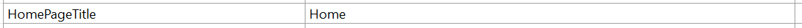
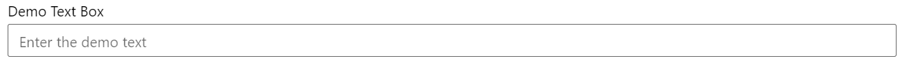
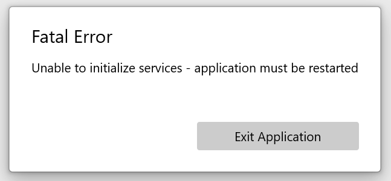

# Switching to string resources

The Silverlight Business App template includes string resources and a helper class that allows the strings to be bound to controls in the UI. Using strings resources for control content is often considered a best practice and comes into its own when an application must support multiple languages.

## Binding to string resources in Silverlight

Reviewing the Silverlight TimeEntryRia sample app UI, the navigation link content is an example of string resources (see element 2 below):


In the Silverlight project, the application string resources are found within the `Assets\Resources\ApplicationsStrings.resx` file. There are two additional resource files for error messages and security challenge questions. As an example, the **Home** navigation title is defined in the `ApplicationsStrings.resx` file as:



The **ResourceWrapper** helper is instantiated in the application resources defined in **App.xaml** as:

```xml
<ResourceDictionary>
    <app:ResourceWrapper x:Key="ResourceWrapper" />
    <app:NotOperatorValueConverter x:Key="NotOperatorValueConverter" />
</ResourceDictionary>
```

The **ResourceWrapper** helper and the desired string resource are then accessed via binding in XAML - here is how the Home navigation link is defined in XAML:

```xml
<HyperlinkButton x:Name="Link1" Style="{StaticResource LinkStyle}"
                NavigateUri="/Home" TargetName="ContentFrame" Content="{Binding Path=ApplicationStrings.HomePageTitle, Source={StaticResource ResourceWrapper}}"/>
```

Notice how the **Content** property is bound using `Content="{Binding Path=ApplicationStrings.HomePageTitle, Source={StaticResource ResourceWrapper}}"`

## Binding to string resources in UWP

If you want your app to support different display languages, and you have string literals in your code or XAML markup or app package manifest, then move those strings into a Resources File (`.resw`). You can then make a translated copy of that Resources File for each language that your app supports.

UWP has an excellent mechanism for using such string resources with controls in XAML - the **x:Uid** attribute. Rather than having to create a helper and using binding syntax, the attribute is added directly to the element and the element value identifies the control in a resource file. The entry in the resource file has a name in the format of **Uid.PropertyName**. So, consider the following XAML:

```xml
<Button x:Uid="HomeButton" Content="Home"/>
```

Assuming the application is running under an the **en** locale, then the UWP project would need to have a resource file created in a **Strings\\en\\** folder named `Resources.resw` (the Uno project template creates this resource for you). An entry would be added to the resource file similar to (comments are optional):

| Name | Value | Comment |
| :-- | :-- | :-- |
| HomeButton.Content | Home | Optional comment here |

However, the **x:Uid** mechanism doesn't just stop with string values and a single property. Multiple properties for a single control can be defined, including numerical values for width or colors for background, etc. This capability provides flexibility for adjusting the UI to cater for different size UI elements based upon the length of translation, culturally appropriate images, colors and so on. As an example, consider the following control:

```xml
<TextBox x:Uid="DemoTextBox"/>
```

If the following entries were added to `Resources.resw`:

| Name | Value | Comment |
| :-- | :-- | :-- |
| DemoTextBox.PlaceholderText | Enter the demo text |  |
| DemoTextBox.Width | 400 |  |
| DemoTextBox.Header | Demo Text Box |  |
| DemoTextBox.Background | Red |  |

Then in UWP the control would be rendered as:


In WASM, not all of the property conversions are currently supported (notably **Width** and **Background**), so the control is rendered as:



> [!IMPORTANT]
> There are some idiosyncrasies with Uno and WASM regarding the use of **x:Uid** - some properties must be defined in the XAML otherwise the resources won't be applied. This issue is documented by [Uno issue #921](https://github.com/unoplatform/uno/issues/921)
>
> [!NOTE]
> To learn more about **x:Uid** and string localization in UWP, review the following resources:
>
> * [x:Uid directive](https://learn.microsoft.com/windows/uwp/xaml-platform/x-uid-directive)
> * [Localize strings in your UI and app package manifest](https://learn.microsoft.com/windows/uwp/app-resources/localize-strings-ui-manifest)

## Update Main Page NavigationViewItem controls to use x:Uid

In order to migrate the **MainPage** **NavigationView** to use **x:Uid**, perform the following steps.

1. Open the `String\en\Resources.resw` file and add the following entries:

    | Name | Value | Comment |
    | :-- | :-- | :-- |
    | NavHome.Content | Home |  |
    | NavTimeEntry.Content | Time Entry |  |
    | NavReports.Content | Reports |  |
    | NavAdmin.Content | Admin |  |
    | NavAbout.Content | About |  |

    > [!NOTE]
    > Notice that the **Name** of each entry utilizes the dot syntax to indicate that the string resource applies to the **Content** property of the associated control.

1. Open the **MainPage.xaml** file.

1. Locate the `muxc:NavigationView.MenuItems` and update them as follows:

    ```xml
    <muxc:NavigationView.MenuItems>
        <muxc:NavigationViewItem x:Uid="NavHome" Content="Home" Tag="HomePage"/>
        <muxc:NavigationViewItem x:Uid="NavTimeEntry" Content="Time Entry" Tag="TimeEntryPage" />
        <muxc:NavigationViewItem x:Uid="NavReports" Content="Reports" Tag="ReportsPage" />
        <muxc:NavigationViewItem x:Uid="NavAdmin" Content="Admin" Tag="AdminPage" />
        <muxc:NavigationViewItem x:Uid="NavAbout" Content="About" Tag="AboutPage" />
    </muxc:NavigationView.MenuItems>
    ```

    > [!NOTE]
    > The **Content** property is still defined above to provide a default value display in the designer. If you wish to confirm that the values are replaced at run time, modify the content values by appending **`- D`** or similar and verify that when the app is executed, resource values are shown.

1. Compile and run the application - confirm that the expected values are displayed.

## Reading string resources in code

In order to access the string resources in code, the **ResourceLoader** class must be used. The **ResourceLoader** provides simplified access to app resources such as app UI strings.

> [!TIP]
> You can learn more about the **ResourceLoader** and UWP resources below:
>
> * [ResourceLoader](https://learn.microsoft.com/uwp/api/Windows.ApplicationModel.Resources.ResourceLoader)
> * [App resources and the Resource Management System](https://learn.microsoft.com/windows/uwp/app-resources/)

To access resources in the default file `Resources.resw`, you would use the following code:

```csharp
using Windows.ApplicationModel.Resources;

public class SomeClass
{
    private string _welcomeText;

    public SomeClass()
    {
        var resourceLoader = ResourceLoader.GetForCurrentView();
        _welcomeText = resourceLoader.GetString("WelcomeText");
    }
}
```

## Adding error resources

Although all resources can be added to single resource file, it is often considered a better practice to separate them into groups. In this task, you will add a resource file that is dedicated to error messages and error UI elements. You will then add a helper that will enable these resources to be access from code.

1. In the **Shared** project, navigate to the **Strings\\en** folder and add a new resource file (`*.resw`) and name it `ErrorResources.resw`.

1. Add the following resources:

    | Name | Value |
    | :--- | :---- |
    | Cancel | Cancel|
    | FatalErrorTitle | Fatal Error|
    | FatalInitializeError | Unable to initialize services - application must be restarted|
    | LoginDialogLoginFailed | The user name or password is incorrect|
    | LoginDialogUserNameRequired | User name and Password are required|
    | Ok | OK |

1. Navigate to the **Helpers** folder and add a new class - name it **ErrorMessageHelper**.

1. Update the using statements as follows:

    ```csharp
    using Windows.ApplicationModel.Resources;
    ```

1. Update the class definition as follows:

    ```csharp
    public static class ErrorMessageHelper
    {
    }
    ```

1. Add a member variable that will hold a reference to the Error Messages resource loader:

    ```csharp
    private static ResourceLoader _resourceLoader = ResourceLoader.GetForCurrentView("ErrorMessages");
    ```

    You can see that the resources are loaded by convention - the `ErrorMessages.resw` file is mapped to a key of **ErrorMessages**.

1. Finally, add a method to retrieve the required string from the resource:

    ```csharp
    public static string GetErrorMessageResource(string name)
    {
        return _resourceLoader.GetString(name);
    }
    ```

    This will return the specified resource or return an empty string if the name isn't found.

    Here is an example of using this helper:

    ```csharp
    var errorWindow = new ContentDialog
    {
        Title = ErrorMessageHelper.GetErrorMessageResource("FatalErrorTitle"),
        Content = ErrorMessageHelper.GetErrorMessageResource("FatalInitializeError")
    }.SetPrimaryButton(ErrorMessageHelper.GetErrorMessageResource("ExitApp"));
    ```

    

## Next unit: Dialogs

[](07-dialogs.md)
