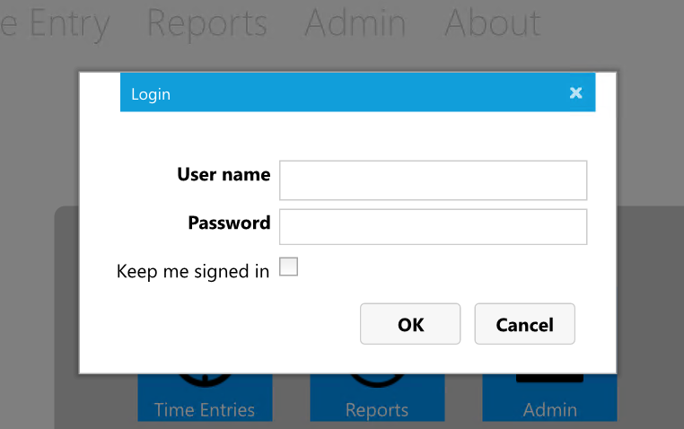
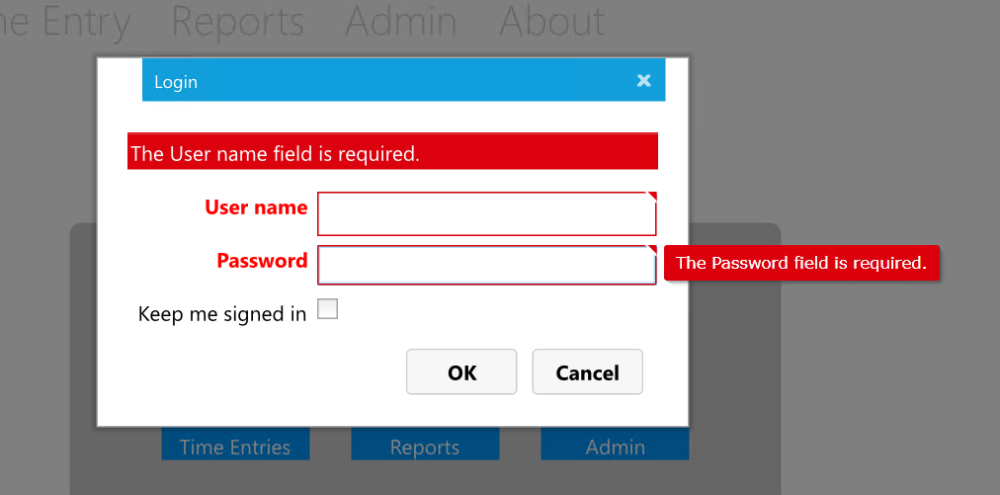
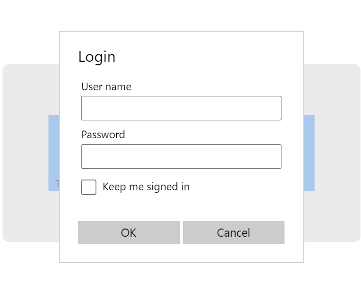
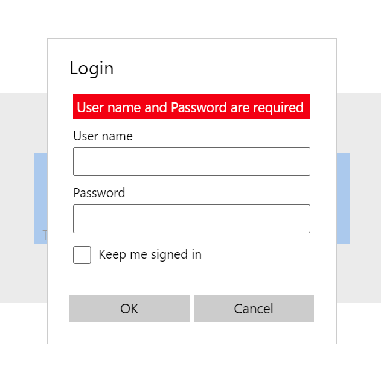
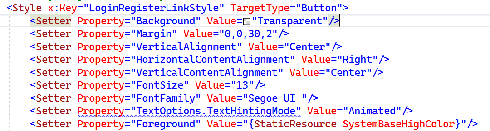

# Migrating the authentication UI

The Silverlight Business App template includes the user login and registration UI:

* **LoginForm** - uses a customized Silverlight DataForm control to render a login UI
* **RegistrationForm** - uses a customized Silverlight DataForm control to render a registration UI (unused in the TimeEntryRia sample)
* **LoginRegistrationWindow** -  a **ChildWindow** that displays either the **LoginForm** or the **RegistrationForm**
* **LoginStatus** - a **UserControl** that uses the **VisualStateManager** to display one of three layouts:
  * If using Windows authentication, the current Windows user
  * The login UI - essentially a button that displays the **LoginRegistrationWindow** and the **LoginForm**
  * The logout UI - a button to logout the current user

When looking to migrate these UI elements, an immediate challenge presents - the Silverlight Toolkit **DataForm** is used in the **LoginForm** and **RegistrationForm** and there is no direct replacement in either UWP, the Windows Community Toolkit or WinUI. The Silverlight **DataForm** control is part of the Silverlight Toolkit and dynamically generates a data entry form when bound to an object. The generated form supports data annotation attributes that influence display names, validation and displays data errors. Unfortunately, although data annotations exist in UWP, UWP is lacking support for data validation and error display.

Here is an example of a **DataForm**:



And here is the same data form with errors displayed:



And here is the associated Silverlight XAML:

```xml
<Grid>
    <Grid.RowDefinitions>
        <RowDefinition Height="Auto"/>
        <RowDefinition/>
    </Grid.RowDefinitions>

    <local:BusyIndicator x:Name="busyIndicator" BusyContent="{Binding Path=ApplicationStrings.BusyIndicatorLoggingIn, Source={StaticResource ResourceWrapper}}"
                            IsBusy="{Binding IsLoggingIn}">
        <StackPanel Orientation="Vertical">
            <local:CustomDataForm x:Name="loginForm"
                                    Padding="10,10,20,0"
                                    CurrentItem="{Binding}"
                                    IsEnabled="{Binding IsLoggingIn, Converter={StaticResource NotOperatorValueConverter}}"
                                    AutoEdit="True" CommandButtonsVisibility="None" HeaderVisibility="Collapsed"
                                    AutoGeneratingField="LoginForm_AutoGeneratingField"
                                    Style="{StaticResource LoginDataFormStyle}" />
        </StackPanel>
    </local:BusyIndicator>

    <StackPanel Grid.Row="1" Grid.Column="1" Orientation="Horizontal" HorizontalAlignment="Right" Margin="0,0,10,0">
        <Button x:Name="loginButton" Content="{Binding Path=ApplicationStrings.OKButton, Source={StaticResource ResourceWrapper}}" Click="LoginButton_Click" Style="{StaticResource RegisterLoginButtonStyle}" IsEnabled="{Binding Path=CanLogIn}" />
        <Button x:Name="loginCancel" Content="{Binding Path=ApplicationStrings.CancelButton, Source={StaticResource ResourceWrapper}}" Click="CancelButton_Click" Style="{StaticResource RegisterLoginButtonStyle}" />
    </StackPanel>
</Grid>
```

By examining the `<local:CustomDataForm x:Name="loginForm"` control we can see that there is no list of data fields, etc. - it is doing all of the heavy lifting when it comes to displaying fields, tips, errors, etc. Unfortunately, unless the **DataForm** is migrated to UWP/Uno, the only option for migration is to build the XAML for the headers, fields and data-binding explicitly.

> [!TIP]
> The source code for the Silverlight Toolkit has been archived on GitHub and some of the controls have been migrated to Uno (unfortunately, this does not include the DataForm):
>
> * [Silverlight Toolkit archive on GitHub](https://github.com/microsoftarchive/SilverlightToolkit)
> * [Uno port of Silverlight Toolkit](https://github.com/unoplatform/Uno.UI.Toolkit.SL)
>
> The Uno team also published a blog post on migrating the Silverlight Toolkit TreeView control:
>
> * [Migrating the Silverlight Toolkit TreeView control to UWP and the Uno Platform](https://platform.uno/blog/migrating-the-silverlight-toolkit-treeview-control-to-uwp-and-the-uno-platform/)

The **TimeEntryRIA** app does not utilize the **RegistrationForm**, only the **LoginForm**.

## Implementing the LoginForm

The next task will take a look at creating the **LoginForm**. As discussed above, there is no migration path for the Silverlight versions of the **LoginRegistrationWindow**, **RegistrationForm** and the **LoginForm**. As the **RegistrationForm** is unused in the **TimeEntryRIA** app, there is no need to create a version of it and, therefore, no need to create the host control **LoginRegistrationWindow**. Instead, the UWP **ContentDialog** control will be used.

> [!TIP]
> To learn more about the **ContentDialog** control, review the following resources:
> *
>
> * [ContentDialog control](https://docs.microsoft.com/uwp/api/Windows.UI.Xaml.Controls.ContentDialog)
> * [Dialog controls](https://docs.microsoft.com/windows/uwp/design/controls-and-patterns/dialogs-and-flyouts/dialogs)

### Create the LoginForm

The following steps will create the **LoginForm**.

1. In the **Shared** project, within the **Views** folder, create a new folder **Login**.

1. Within the **Views\\Login** folder, add a new **ContentDialog** and name it **LoginForm**.

1. Open the **LoginForm.xaml** file and add the following property to the **ContentDialog** control:

    * `x:Uid="LoginDialog"`

    > [!IMPORTANT]
    > Do not delete the **Title**, **PrimaryButtonText** and **SecondaryButtonText** properties. Due to an open [Uno issue #921](https://github.com/unoplatform/uno/issues/921), unless these properties are defined in XAML, the **x:Uid** resources won't be applied.

1. To add the login form string resources, open the `Strings\en\Resources.resw` file and add the following strings:

    | Name | Value |
    | :--- | :--- |
    | LoginDialog.Title | Login |
    | LoginDialog.PrimaryButtonText | OK |
    | LoginDialog.SecondaryButtonClick | Cancel |

1. Return to the **LoginForm.xaml** file and replace the empty **Grid** with the following XAML:

    ```xml
    <Grid>
        <StackPanel>
            <Border Background="Red" Margin="4" Padding="4"
                    Visibility="{x:Bind IsErrorMessageVisible(), Mode=OneWay}">
                <TextBlock Foreground="White"
                           Text="{x:Bind ErrorMessage, Mode=TwoWay}"/>
            </Border>
            <TextBox x:Uid="UserName" Margin="4"
                     Text="{x:Bind UserName, Mode=TwoWay}"/>
            <PasswordBox x:Uid="Password" Margin="4"
                         Password="{x:Bind Password, Mode=TwoWay}"/>
            <CheckBox x:Uid="StaySignedIn" Margin="4" IsThreeState="False"
                      IsChecked="{x:Bind StaySignedIn, Mode=TwoWay}"/>
        </StackPanel>
        <ProgressRing IsActive="{x:Bind IsBusy, Mode=TwoWay}"
                      Visibility="{x:Bind IsBusyVisible(), Mode=OneWay}"
                      VerticalAlignment="Center" HorizontalAlignment="Center" />
    </Grid>
    ```

    Examine the XAML - the outer **Grid** contains a **StackPanel** to layout the form controls, and the **ProgressRing** which will appear above the input controls. Within the **StackPanel**, there is a **Border** surrounding a **TextBlock** that will display error messages (this could easily be a separate UserControl for re-use), as well as the expected input controls.

    > [!TIP]
    > The code is using the modern version of binding with the `x:Bind` syntax. This approach is faster than the reflection based binding used in Silverlight and also provides improved compile time error reporting. `x:Bind` also allows the use of functions, such as **IsErrorMessageVisible()** above, which reduces the need for custom value convertors. The properties and functions referenced in the bindings will be implemented in the code-behind shortly. You can learn more about binding from the resources below:
    >
    > * [Data binding](https://docs.microsoft.com/windows/uwp/data-binding/)
    > * [Functions in x:Bind](https://docs.microsoft.com/windows/uwp/data-binding/function-bindings)
    > * [Value Converters](https://docs.microsoft.com/uwp/api/Windows.UI.Xaml.Data.IValueConverter)

1. To add the input controls string resources, open the `Strings\en\Resources.resw` file and add the following strings:

    | Name | Value |
    | :--- | :--- |
    | UserName.Header | User name |
    | Password.Header | Password |
    | StaySignedIn.Content | Keep me signed in |

    This completes the XAML. The **LoginForm** look likes this when displayed in WASM:

    

    When an error is present, the **Border** and **TextBlock** are visible:

    

### Implement the LoginForm code-behind

The business logic for the **LoginForm** is implemented in the code-behind. Of course, an MVVM approach could also be used. In principal, the login form must perform the following:

* Ensure a user name and password are entered before starting the login
* Call **AuthenticationService.LoginUser**
* Respond to **AuthenticationService** events regarding login success or failure
* Display any error messages

Let's walk through the implementation.

1. Open the **LoginForm.xaml.cs** file.

1. Update the `using` statements as follows:

    ```csharp
    using System;
    using TimeEntryUno.Shared.Helpers;
    using TimeEntryUno.Shared.Services;
    using Windows.UI.Xaml;
    using Windows.UI.Xaml.Controls;
    ```

    > [!Note]
    > Remember to up date the **TimeEntryUno.Shared.Helpers** and **TimeEntryUno.Shared.Services** to suit your project.

1. Examine the class definition `public sealed partial class LoginForm : ContentDialog` - **LoginForm** inherits from **ContentDialog** but does not implement **INotifyPropertyChanged**.

    > [!TIP]
    > The **INotifyPropertyChanged** interface implementation is a key part of data-binding and is commonly used to enable view models to inform data-bound UI elements that related data has changed and the UI element must refresh. However, as the code-behind is part of the **LoginForm**, another mechanism exists to refresh the data bindings, which will be used below. **INotifyPropertyChanged** will be addressed later in the article.

1. To expose data to the UI for binding, add the following properties:

    ```csharp
    public string ErrorMessage { get; set; }
    public string UserName { get; set; }
    public string Password { get; set; }
    public bool? StaySignedIn { get; set; } = false;
    public bool IsBusy { get; set; }
    ```

    These properties were referenced in the XAML bindings earlier - i.e.:

    ```xml
    <PasswordBox x:Uid="Password" Margin="4"
                         Password="{x:Bind Password, Mode=TwoWay}"/>
    ```

1. Locate the **LoginForm** constructor and update it as follows:

    ```csharp
    public LoginForm()
    {
        this.InitializeComponent();
        AuthenticationService.Instance.LoggedIn += Instance_LoggedIn;
        AuthenticationService.Instance.LoginFailed += Instance_LoginFailed;
        this.Closing += LoginForm_Closing;
    }
    ```

    Notice the use of the **AuthenticationService** service created earlier. The **LoggedIn** and **LoginFailed** are used to update the login form based upon the success state of the authentication process.

    The **ContentDialog.Closing** event is discussed next.

1. To add the implementation for **ContentDialog.Closing** event handler, add the following code:

    ```csharp
    private void LoginForm_Closing(ContentDialog sender, ContentDialogClosingEventArgs args)
    {
        if (IsBusy)
        {
            args.Cancel = true;
        }
        else
        {
            AuthenticationService.Instance.LoggedIn -= Instance_LoggedIn;
            AuthenticationService.Instance.LoginFailed -= Instance_LoginFailed;
        }
    }
    ```

    The **ContentDialog.Closing** event is used to ensure that the **LoginForm** can only be closed when it is not busy, and to release any event subscriptions for the **AuthenticationService**. If the `args.Cancel = true;` is executed, the act of closing the form is cancelled, meaning it will remain displayed.

1. To implement the handler for the **AuthenticationService.LoggedIn** event, add the following code:

    ```csharp
    private void Instance_LoggedIn(object sender, EventArgs e)
    {
        IsBusy = false;
        Hide();
    }
    ```

    This simple method is executed if the login attempt is successful. It changes the value of the **IsBusy** property to **false**, which controls the display of the **ProgressRing** on the UI, as well as blocks the form from closing. The **ContentDialog.Hide** method is then called. This will cause the **ContentDialog.Closing** event to be raised, which will result in the **LoginForm_Closing** method above being executed.

1. To handle the **AuthenticationService.LoginFailed** event, add the following code:

    ```csharp
    private void Instance_LoginFailed(object sender, EventArgs e)
    {
        ErrorMessage = ErrorMessageHelper.GetErrorMessageResource("LoginDialogLoginFailed");
        IsEnabled = true;
        IsBusy = false;
        Bindings.Update();
    }
    ```

    This is called whenever a login attempt fails. The **ErrorMessage** property is updated to display an error message from the string resources, using the helper created earlier. The **LoginForm** is the enabled, allowing interaction with the controls, the busy state is set to false and then the **Bindings.Update** method is called. As the form is not using **INotifyPropertyChanged**, this is an approach that forces the bound elements on the UI to refresh and react to the changes to the properties.

    > [!TIP]
    > As noted in the Microsoft documentation:
    > *If your data does not undergo fine-grained changes, and if it's likely to be updated as part of a specific action, then you can make your bindings one-time, and force a manual update at any time with a call to **Update**.*

1. To add support for the login when the **OK** (or Primary) button is clicked, update the **ContentDialog_PrimaryButtonClick** method as follows:

    ```csharp
    private void ContentDialog_PrimaryButtonClick(ContentDialog sender, ContentDialogButtonClickEventArgs args)
    {
        if (string.IsNullOrWhiteSpace(UserName) || string.IsNullOrWhiteSpace(Password))
        {
            ErrorMessage = ErrorMessageHelper.GetErrorMessageResource("LoginDialogUserNameRequired");
        }
        else
        {
            ErrorMessage = string.Empty;
            IsEnabled = false;
            IsBusy = true;

            _ = AuthenticationService.Instance.LoginUser(UserName, Password);
        }

        Bindings.Update();

        // We only close if we log in successfully or cancel
        args.Cancel = true;
    }
    ```

    The first part of this code ensures that the user has entered a username and password - if not, an error message from the string resources is displayed. Otherwise, any existing error is removed, the form is disabled (meaning the textboxes cannot be edited nor any buttons clicked), the busy flag is set to true and then the **AuthenticationService.LoginUser** service is called.

    > [!TIP]
    > Although the **AuthenticationService.LoginUser** service is asynchronous, the code does not need to wait for it here - the **AuthenticationService.LoggedIn** and **AuthenticationService.LoginFailed** will communicate the state of the login. The `_ = AuthenticationService...` code uses a C# 7 feature called **Discards** to show the intention to ignore the result. You can learn more about **Discards** below:
    >
    > * [Discards](https://docs.microsoft.com/dotnet/csharp/discards)

    Once again, **Bindings.Update** method is called to update the UI. Finally, `args.Cancel = true;` is used to ensure the dialog does not close.

1. To implement the function used by the UI to control the visibility of the **BusyIndicator**, add the following code:

    ```csharp
    public Visibility IsBusyVisible()
    {
        return IsBusy ? Visibility.Visible : Visibility.Collapsed;
    }
    ```

    This simple ternary expression converts the **IsBusy** property to a **Visibility** enum and is used in the binding:

    ```xml
    <ProgressRing IsActive="{x:Bind IsBusy, Mode=TwoWay}"
                  Visibility="{x:Bind IsBusyVisible(), Mode=OneWay}"
                  VerticalAlignment="Center" HorizontalAlignment="Center" />
    ```

    Notice how the **IsActive** value is controlled directly by the **IsBusy** property and is a boolean, whereas the **Visibility** is controlled by the value returned by the **IsBusyVisible** function. Calls to the **Bindings.Update** method result in both of these bindings being reevaluated.

1. To control the display of the error message, add the following code:

    ```csharp
    public Visibility IsErrorMessageVisible()
    {
        return string.IsNullOrWhiteSpace(ErrorMessage) ? Visibility.Collapsed : Visibility.Visible;
    }
    ```

    Similar to **IsBusyVisible**, this code determines whether there is an error message to display, and returns a **Visibility** enum value accordingly. This time, the value is used to toggle the visibility of the **Border** element and its children:

    ```xml
    <Border Background="Red" Margin="4" Padding="4"
            Visibility="{x:Bind IsErrorMessageVisible(), Mode=OneWay}">
        <TextBlock Foreground="White"
                    Text="{x:Bind ErrorMessage, Mode=TwoWay}"/>
    </Border>
    ```

Next, the **LoginStatus** control is considered.

## Migrating the LoginStatus User Control

The **LoginStatus** control appears at the top of the UI (element 1 in the image below)


In the TimeEntryRIA app, the status control displays in two states - logged out which provides a button to initiate the login process:


And logged in, which displays the logged-in user and a button to logout:


The control makes use of the **VisualStateManager** to switch between the various layouts, several custom styles, and code-behind - the vast majority of which can be migrated to UWP without change. The following steps will walk through the process of migrating the **UserControl** - an approach that can be used for migrating any **UserControl** or custom control.

> [!NOTE]
> The following steps will focus on the process of migrating the **UserControl** - i.e. the changes to XAML, styles, and code-behind, to support the controls' behavior. As there are many lines of XAML, the emphasis will be on the changes that must be made, rather than showing every line of code.

### Migrating the LoginStatus visual states

In the following steps, a UWP version of the **LoginStatus** control will be created and the XAML copied over. The **VisualStateManager** and associated states will be migrated.

1. In the **Shared** project, within the **Views** folder, create a new folder **Login**.

1. Within the **Shared** project, locate the **Views\\Login** folder, add a new **UserControl** and name it **LoginStatus**.

1. Switch to the Silverlight project and copy the **Grid** control named **LayoutRoot** and all of its content.

1. Return to the **Shared** project, open the **LoginStatus.xaml** file and replace the empty **Grid** control with the XAML copied from the Silverlight project.

    Take a moment to examine the XAML. The first child control of the grid defines the 3 **loginStates** visual states that control the visibility of two **StackPanel** controls - **loginControls** and **logoutControls**.

1. To migrate the **VisualStateManager** XAML, delete all instances of the **vsm:** namespace prefix - the **VisualStateManager** is already in scope.

    The remainder of the visual state XAML requires no changes.

    Beneath the visual state XAML are the two **StackPanel** controls - **loginControls** and **logoutControls** and their associated controls, many that use custom styles.

## Migrating the LoginStatus styles

In the following steps, the Silverlight styles used by the **LoginStatus** control will be migrated.

1. Reviewing the XAML, the following styles are referenced:

    * LoginPanelStyle
    * LoginRegisterLinkStyle
    * WelcomeTextStyle
    * SpacerStyle

1. Switch to the Silverlight project and open the **\\Assets\\Resources\\Styles.xaml** file.

1. Locate each of the styles listed above, and copy them to the **Shared** project **\\Resources\\Styles.xaml** file.

1. Review the **\\Resources\\Styles.xaml** file. The purpose is to identify any issues with the XAML, such as properties that are not found. Issues are usually indicated by a blue "squiggle" underline - the image below indicates that the **TargetType** of **Button** lacks a **TextOptions.TextHintingMode** property:

    

    The **LoginPanelStyle** and **SpacerStyle** styles require no changes.

1. The **WelcomeTextStyle** requires two minor changes, the first being the **Foreground** setter.

1. Locate the **WelcomeTextStyle Foreground** setter - this is using a static resource called **TextColor** as the value, however, this resource is actually undefined.

    > [!IMPORTANT]
    > Notice that the editor **does not** show an error or warning for missing resources. Unfortunately, missing resources are often only identified by runtime exceptions - it can be quite painful to find all such missing resources as the exception will be thrown and the application will stop on the first missing resource.

    To correct this, the missing resource could be copied over from the Silverlight project, however in this case, update the value to `{StaticResource SystemBaseHighColor}` - this is the typical foreground color.

    > [!TIP]
    > You can review the XAML theme resources that are available such as **SystemBaseHighColor** below:
    >
    > * [XAML theme resources](https://docs.microsoft.com/windows/uwp/design/controls-and-patterns/xaml-theme-resources)

1. Next, locate the **WelcomeTextStyle Margin** setter and comment out the entire setter - the offset is not required.

    **LoginPanelStyle**, **SpacerStyle** and **WelcomeTextStyle** are simple styles. The **LoginRegisterLinkStyle** style is more complex as it re-templates the control.

    > [!TIP]
    > You can learn more about control templates, how they relate to styles, and how to view the template for a control in the resource below:
    >
    > * [Control templates](https://docs.microsoft.com/windows/uwp/design/controls-and-patterns/control-templates)

1. The **LoginRegisterLinkStyle** requires a number of changes to property setters:

    * Locate the **TextOptions.TextHintingMode** setter and comment out the entire setter - this property does not exist in UWP.
    * Locate the **Cursor** setter and comment out the entire setter - this property does not exist in UWP.

        > [!Note]
        > Microsoft recommends the use of *hover effects* in the [UWP Design guidelines](https://docs.microsoft.com/windows/uwp/input-and-devices/mouse-interactions#cursors) instead of custom cursors over interactive elements. However, custom cursors can be useful in some specific scenarios, such as drag and drop, etc. If they are a must have, the Windows Community Toolkit has the [Mouse.Cursor attached property](https://docs.microsoft.com/windows/communitytoolkit/extensions/mousecursor) that can be used.

    The **LoginRegisterLinkStyle** also completely customizes the look of a **Button** control by replacing the template with a much simpler layout. Fortunately, the basic structure of the **Button** template in UWP closely matches the template in Silverlight. However, one issue that must be addressed relates to the **CommonStates** group. As UWP has been designed to support multiple input devices, such as touch, pen, etc., Silverlight visual states such as **MouseOver** have been renamed to **PointerOver**. The visual states toggle the visibility of the three controls withing the template.

1. Locate the **VisualState** element where the **x:Name** is **MouseOver** and rename it to **PointerOver**.

    This is the only change required for the visual states of this simple template. However, the colors for the controls should to be adjusted to leverage the platform resources.

1. Locate the **TextBlock** control named **Mouseover_Pressed** and update the **Foreground** property to `{StaticResource SystemColorHighlightColor}`.

1. Locate the **TextBlock** control named **DisabledOverlay** and update the **Foreground** property to `{StaticResource SystemBaseMediumLowColor}`.

The styles have now been migrated - time to consider string resources.

### Migrating the LoginStatus string resources

The Silverlight controls are using string resources - these need to be migrated to **x:uid**.

1. Return to the **Shared LoginStatus.xaml** file.

1. Examine the **Button** and **TextBlock** controls - they are using string resources. Use the steps described in **Binding to string resources in UWP** to update the controls to use **x:Uid**:

    | x:Name | x:Uid | Resource Name | Resource Value |
    | :--- | :--- | :--- | :--- |
    | loginButton | LoginButton | LoginButton.Content | `\|  LOGIN`
    | logoutButton | LogoutButton | LogoutButton.Content | `\|  LOGOUT`
    |  |  | WelcomeText | `Welcome {0}`

    > [!NOTE]
    > Some clarifications:
    >
    > * There is no associated control for the **WelcomeText** resource as it will be accessed from code.
    > * The spacer text is not defined as a string resource as there is no need for language variations. You can, of course, make it a string resource if you want.

    The control XAML should end up similar to:

    ```xml
    <StackPanel x:Name="loginControls" Style="{StaticResource LoginPanelStyle}">
        <Button x:Name="loginButton" x:Uid="LoginButton"
                Style="{StaticResource LoginRegisterLinkStyle}"
                Click="LoginButton_Click" />
    </StackPanel>

    <StackPanel x:Name="logoutControls" Style="{StaticResource LoginPanelStyle}">
        <!-- welcomeText.Text property's binding is setup in code-behind -->
        <TextBlock x:Name="welcomeText" Style="{StaticResource WelcomeTextStyle}"/>
        <TextBlock Text="  |  " Style="{StaticResource SpacerStyle}"/>
        <Button x:Name="logoutButton"
                x:Uid="LogoutButton"
                Style="{StaticResource LoginRegisterLinkStyle}"
                Click="LogoutButton_Click" />
    </StackPanel>
    ```

Now that the string resources have been migrated, it is time to implement the logic in the code-behind.

### Migrating the code-behind

As discussed earlier, the login status control has two primary states - logged out and logged in. When logged out, the control displays a button that will display the **LoginForm**. When logged in, the current user is displayed, as well as button that logs out the current user. To switch between the states, the **LoginStatus** control must monitor the **AuthenticationService** events.

Let's review the implementation.

1. Open the **LoginStatus.xaml.cs** code-behind file.

1. Update the `using` statements as follows:

    ```csharp
    using System;
    using TimeEntryUno.Shared.Helpers;
    using TimeEntryUno.Shared.Models;
    using TimeEntryUno.Shared.Services;
    using Windows.ApplicationModel.Resources;
    using Windows.UI.Xaml;
    using Windows.UI.Xaml.Controls;
    ```

    > [!Note]
    > Remember to up date the **TimeEntryUno.Shared.Helpers** and **TimeEntryUno.Shared.Services** to suit your project.

1. To store the string value for the welcome message for the logged in user, add the following member variable:

    ```csharp
    private string _welcomeText;
    ```

1. To subscribe to the **AuthenticationService** events and initialize the display, locate the constructor and update it as follows:

    ```csharp
    public LoginStatus()
    {
        this.InitializeComponent();
        AuthenticationService.Instance.LoggedIn += Instance_LoggedIn;
        AuthenticationService.Instance.LoggedOut += Instance_LoggedOut;
        var resourceLoader = ResourceLoader.GetForCurrentView();
        _welcomeText = resourceLoader.GetString("WelcomeText");
        this.UpdateLoginState();
    }
    ```

    This adds the subscription to the **AuthenticationService** events and uses the **ResourceLoader** to retrieve the **WelcomeText** string.

    The **UpdateLoginState** method ensures the correct visual state is displayed.

1. To implement the event handlers for the **AuthenticationService** events, add the following code:

    ```csharp
    private void Instance_LoggedOut(object sender, EventArgs e)
    {
        this.UpdateLoginState();
    }

    private void Instance_LoggedIn(object sender, EventArgs e)
    {
        this.UpdateLoginState();
    }
    ```

    Notice that both merely call the **UpdateLoginState** method.

1. To respond to the **LoginButton** click and initiate the login, add the following code:

    ```csharp
    private void LoginButton_Click(object sender, RoutedEventArgs e)
    {
        var loginForm = new LoginForm();
        _ = loginForm.ShowOneAtATimeAsync();
    }
    ```

    Notice the use of the **ShowOneAtATimeAsync** from **DialogExtensions** created earlier to ensure that the app is not displaying more than one dialog at a time. The login form show Task is discarded as the result is not awaited - the **AuthenticationService** events are used to update the control status.

1. To add support for the **LogoutButton** click, add the following code:

    ```csharp
    private void LogoutButton_Click(object sender, RoutedEventArgs e)
    {
        AuthenticationService.Instance.Logout();
    }
    ```

    This code merely calls the **AuthenticationService.Logout** method and relies on the events to update the UI as required.

1. Finally, to implement the code that responds to the authentication state of the application, add the following code:

    ```csharp
    private void UpdateLoginState()
    {
        if (AuthenticationService.Instance.CurrentPrincipal != null && AuthenticationService.Instance.CurrentPrincipal.Identity.IsAuthenticated)
        {
            VisualStateManager.GoToState(this, "loggedIn", true);
                welcomeText.Text = string.Format(
                    _welcomeText,
                    ((User)AuthenticationService.Instance.CurrentPrincipal.Identity).FriendlyName);

        }
        else
        {
            VisualStateManager.GoToState(this, "loggedOut", true);
            welcomeText.Text = string.Empty;
        }
    }
    ```

    This code checks the **AuthenticationService** to see if a user is logged in - if so, the **VisualStateManager** is used to switch to the **loggedIn** visual state defined in the XAML and the **welcomeText** is updated. Otherwise, the **VisualStateManager** is used to switch to the **loggedOut** state and the **welcomeText** is blanked.

    Notice the use of the string **Format** method - as the **_welcomeText** variable is assigned the value of `Welcome, {0}`, this code will inject the **FriendlyName** into the string for display.

## Running the code

In order to test this code, the web services must be running.

1. Consult the **TimeEntry Samples** article for details on how to configure these services and associated database.

1. Once the server side is running, ensure the URIs configured in the **AuthenticationService** and **TokenService** services match the running services (they should):

   * AuthenticationService

       ```csharp
       var api = new IdentityApi(
           "https://localhost:6001",
           await TokenService.Instance.GetAccessTokenAsync());
       ```

   * TokenService

       ```csharp
       _identityServerClient = new IdentityServerClient(
           identityServerBaseAddress: "https://localhost:5001",
           clientId: "TimeEntryUno",
           clientSecret: "A2W7aQVFQWRX",
           scope: "TimeEntryApi");
       ```

1. Ensure the desired head is configured as the startup - UWP or WASM and launch the client app.

    You should now be able to exercise the login. Try logging in with no user and/or password. Try random credentials. Finally, try the following account:

    * **Username**: `tylerr`
    * **Password**: `Pa$$W0rd!`

    Query the database to find other logins and their roles (whenever you login a user for the first time, the user is automatically given the password `Pa$$W0rd!`):

    ```sql
    select teu.UserName, r.Name
    from TimeEntryUsers teu
    inner join Roles r on teu.RoleId = r.Id
    ```

    > [!NOTE]
    > During the first run, additional sample data for time entries is generated. If you experience a timeout, leave the server projects running, wait a few minutes and then retry the login.

In the next task, authentication will be integrated with navigation to ensure a user can only view resources to which they have access.

## Next unit: Integrating authentication and navigation

[](13-integrating-auth-and-navigation.md)
