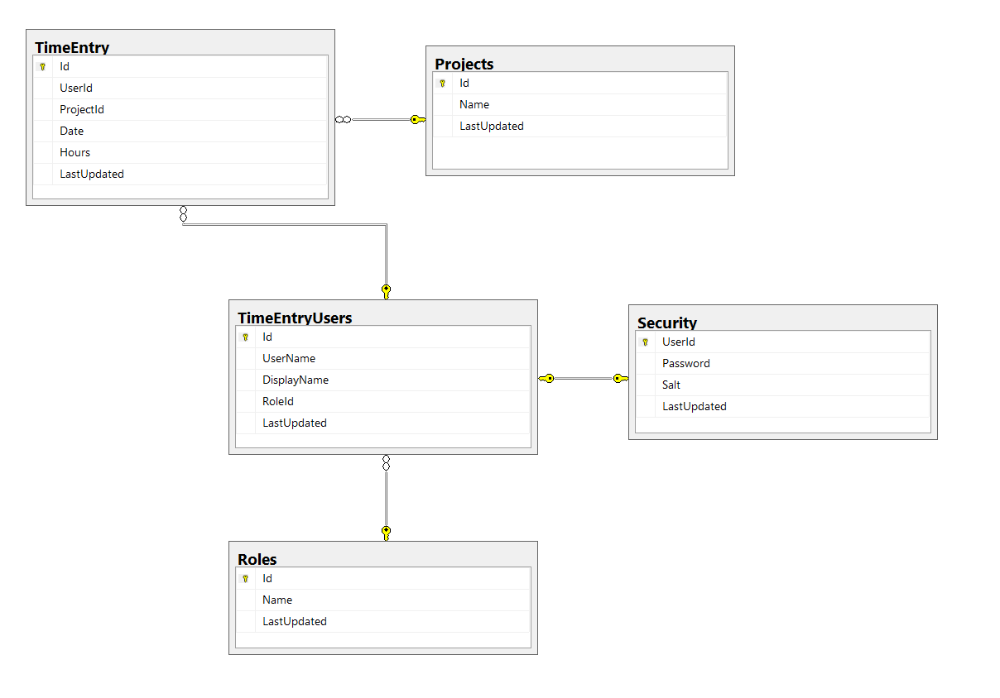

# The TimeEntry Sample apps

The sample application is made up of 3 solutions containing multiple projects and has a dependency on a SQL database. The source for the app can be found in the Uno.Platform Samples repository:

[https://github.com/unoplatform/Uno.Samples](https://github.com/unoplatform/Uno.Samples)

* Uno.Samples
  * reference
    * [TimeEntryRia](https://github.com/unoplatform/Uno.Samples/tree/master/reference/TimeEntryRia)
  * UI
    * TimeEntry
      * [TimeEntryServices](https://github.com/unoplatform/Uno.Samples/tree/master/UI/TimeEntry/TimeEntryServices)
      * [TimeEntryUno](https://github.com/unoplatform/Uno.Samples/tree/master/UI/TimeEntry/TimeEntryUno)

## Solutions

There are 3 solutions:

* **TimeEntryRia** - this is the Silverlight solution (VS 2012)
  * **TimeEntryRia** - the Silverlight 5 project
  * **TimeEntryRia.Web** - the Silverlight 5 WCF RIA Web project
* **TimeEntryUno** - this is the Uno client solution (VS 2019)
  * **TimeEntryUno.Shared** - the shared source project
  * **TimeEntryUno.Uwp** - the UWP head
  * **TimeEntryUno.Wasm** - the web assembly head
* **TimeEntryServices** - this is the web services solution for **TimeEntryUno** (VS 2019)
  * **IdentityServer** - a .NET Core 3.1 project hosting IdentityServer4
  * **TimeEntryApi** - a .NET 5 WebApi project hosting the app business services

## TimeEntry Database configuration

The applications rely upon the existence of a SQL database. Within the **TimeEntryServices** solution is a folder that contains a SQL Script that will create the tables and seed the database with sample data.

The following steps outline the approach to create the database and update the **TimeEntryApi** project to access it.

1. Open SQL Server management tools and create a database named **TimeEntry**.

1. Load the **TimeEntryServices\\Database\\CreateTablesAndData.sql** and execute.

    The script will take a few minutes to complete.

    The database schema looks like this:

    

1. Update the database security as required - i.e. add the current user as owner, configure **sa**, etc.

    Once the database is created, populated, and security is configured, the **TimeEntryApi** project must be updated to use the correct connection string.

1. Open the **TimeEntryApi** project.

1. Open the **Models\\TimeEntryContext.cs** file.

1. Locate the **OnConfiguring** method and update the connection string as required.

    ```csharp
    protected override void OnConfiguring(DbContextOptionsBuilder optionsBuilder)
    {
        if (!optionsBuilder.IsConfigured)
        {
            optionsBuilder.UseSqlServer("Server=(localdb)\\mssqllocaldb;Database=TimeEntry;Trusted_Connection=True;");
        }
    }
    ```

## Running the TimeEntryUno sample

In order to run the app, both server projects must be running as well as the client. The **TimeEntryServices** solution is configured to launch both the **IdentityServer** and **TimeEntryApi** projects. These web projects are configured to "self-host" so have no dependency on IIS, etc. Once the server projects are running, the client solution **TimeEntryUno**, configured to run as UWP or WASM, can be launched.

## Running the TimeEntryRia sample

The **TimeEntryRia** sample is a Visual Studio 2015 solution and is, of course, dependent on the **TimeEntry** database. Here is the Visual Studio configuration:

* Visual Studio 2012 Update 5
* Silverlight 5 SDK
* NuGet Package Manager extension

### Configure TimeEntryRia.Web ConnectionString

1. Open the **TimeEntryRia** solution in Visual Studio 2012.

1. Within the **TimeEntryRia.Web** project, locate and open the **Web.config** file.

1. Scroll to the bottom of the **Web.Config** file to locate the connection string. Update as required.

```xml
    <connectionStrings>
        <add name="TimeEntryEntities"
             connectionString="metadata=res://*/TimeEntryModel.csdl|res://*/TimeEntryModel.ssdl|res://*/TimeEntryModel.msl;provider=System.Data.SqlClient;provider connection string=&quot;data source=.\SQLEXPRESS;initial catalog=TimeEntry;integrated security=True;multipleactiveresultsets=True;App=EntityFramework&quot;"
             providerName="System.Data.EntityClient" />
    </connectionStrings>
```

### Running the Silverlight sample

In order to execute the Silverlight application, the Silverlight 5 SDK must be installed and **Internet Explorer 11** must be configured as your default browser. The app can be run by launching from Visual Studio 2012

## Next unit: Useful resources

[](99-useful-resources.md)
