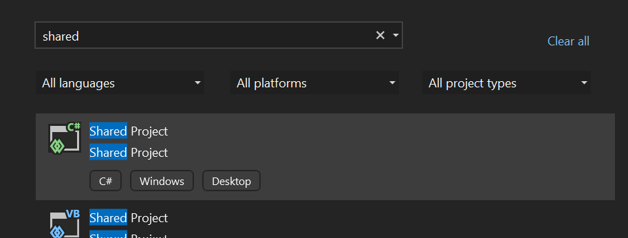
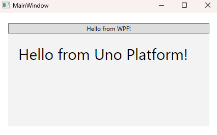
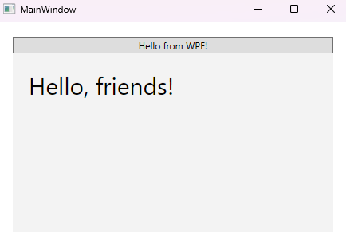
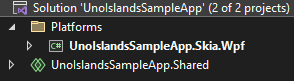
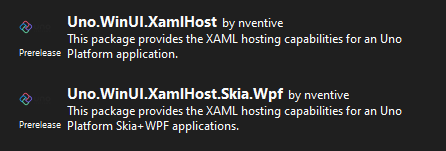

# Uno Islands

With Uno Islands, you can host Uno Platform XAML controls in an WPF application, next to existing WPF content. This feature enables you to enhance the look, feel, and functionality of your existing WPF application with the latest Windows UI features provided by their implementation within Uno Platform.

## How to use Uno Islands with existing WPF app

The most common scenario is to add Uno Islands into an existing WPF app. First, **add a Shared project** into your WPF app solution by right-clicking the solution node in Solution explorer and choosing **Add -> New Project...** and searching for "Shared Project" in the dialog. This project will be used to host our Uno Platform XAML files.



### Shared project contents

In this project, we need to add the Uno Islands Application and a page to be displayed. The easiest way to do this is to copy these files from [UnoIslandsSamplesApp in Uno.Samples GitHub repository](https://github.com/unoplatform/Uno.Samples/tree/master/UI/UnoIslandsSampleApp/UnoIslandsSampleApp.Shared). Copy and include `App.xaml`, `App.xaml.cs`, `MainPage.xaml`, and `MainPage.xaml.cs` files in the shared project, and the `Assets` folder to include the Uno Platform icon font.

### Updating the WPF application project

To light-up the Uno Islands feature, we need to reference several Uno Platform NuGet packages, reference the shared project, and include the Uno Platform icon font. Double-click the WPF project and add the following:

```xml
<ItemGroup>
    <PackageReference Include="Microsoft.Extensions.Logging" Version="5.0.0" />
    <PackageReference Include="Microsoft.Extensions.Logging.Console" Version="5.0.0" />
    <PackageReference Include="Uno.WinUI.Skia.Wpf" Version="4.5.0" />
    <PackageReference Include="Uno.WinUI.DevServer" Version="4.5.0-dev.453" Condition="'$(Configuration)'=='Debug'" />
    <PackageReference Include="Uno.UI.Adapter.Microsoft.Extensions.Logging" Version="4.5.0-dev.453" />
    <PackageReference Include="Uno.WinUI.XamlHost" Version="4.5.0-dev.453" />
    <PackageReference Include="Uno.WinUI.XamlHost.Skia.Wpf" Version="4.5.0-dev.453" />
</ItemGroup>
<ItemGroup>
    <UpToDateCheckInput Include="..\UnoIslandsSampleApp.Shared\**\*.xaml" />
</ItemGroup>
<ItemGroup>
    <Content Include="Assets\Fonts\uno-fluentui-assets.ttf" />
</ItemGroup>

<Import Project="..\UnoIslandsSampleApp.Shared\UnoIslandsSampleApp.Shared.projitems" Label="Shared" />
```

### Adding an Uno Island

Now we can add an Uno Island into our WPF app content. Open a WPF XAML file and add the following namespace declaration to the root element:

```xml
xmlns:xamlHost="clr-namespace:Uno.UI.XamlHost.Skia.Wpf;
                assembly=Uno.UI.XamlHost.Skia.Wpf"
```

And now use the `UnoXamlHost` control to host the Uno Platform island:

```xml
<Grid Margin="20">
    <Grid.RowDefinitions>
        <RowDefinition Height="Auto" />
        <RowDefinition Height="*" />
    </Grid.RowDefinitions>
    <Button>Hello from WPF!</Button>
    <xamlHost:UnoXamlHost Grid.Row="1" 
        InitialTypeName="UnoIslandsSampleApp.MainPage" />
</Grid>
```



## Data-binding

The WPF `DataContext` is automatically propagated to the Uno Island-hosted controls, which makes it possible to use an MVVM-based approach. Suppose we update the `MainWindow.xaml.cs` as follows:

```csharp
public partial class MainWindow : Window
{
    public MainWindow()
    {
        InitializeComponent();
        DataContext = "friends";
    }
}
```

Now we can use the data in the `MainPage.xaml`:

```xml
<Page
    x:Class="UnoIslandsSampleApp.MainPage"
    xmlns="http://schemas.microsoft.com/winfx/2006/xaml/presentation"
    xmlns:x="http://schemas.microsoft.com/winfx/2006/xaml"
    xmlns:local="using:UnoIslandsSampleApp"
    xmlns:d="http://schemas.microsoft.com/expression/blend/2008"
    xmlns:mc="http://schemas.openxmlformats.org/markup-compatibility/2006"
    mc:Ignorable="d"    
    Background="{ThemeResource ApplicationPageBackgroundThemeBrush}">

    <Grid>
        <TextBlock Margin="20" FontSize="30">
            <Run Text="Hello, " /><Run Text="{Binding}" /><Run Text="!" />
        </TextBlock>
    </Grid>
</Page>
```



## How to use Uno Islands in blank Uno app

The starting point for creating an Uno Islands-enabled application is to create a blank Uno Platform app. Both `Uno.WinUI`- and `Uno.UI`-based solutions are supported.

### Preparing solution

In the new solution, feel free to remove targets which are not needed for your purposes, but make sure to keep at least the Shared project and WPF project.



Right-click the solution node in Solution Explorer and select `Manage NuGet Packages for Solution...`. In the NuGet Package Manager window search for `Uno.WinUI.XamlHost` (for WinUI-based apps) or `Uno.UI.XamlHost` (for UWP-based apps).



Install the `XamlHost` package in all projects and the `XamlHost.Skia.Wpf` package in the WPF project.

### Set up `XamlApplication`

Uno Islands require a special type of `Application` class to get discovered properly. Open the `App.xaml.cs` file and make your application derive from `Uno.UI.XamlHost.XamlApplication`:

```csharp
public sealed partial class App : Uno.UI.XamlHost.XamlApplication
{
    ...
}
```

In `App.xaml` you also need to adjust the root element accordingly:

```xml
<xamlHost:XamlApplication
    x:Class="UnoIslandsSampleApp.App"
    xmlns:xamlHost="using:Uno.UI.XamlHost"
    ...>
...
</xamlHost:XamlApplication>
```

> Note that you can create a separate `XamlApplication`-derived class for Islands purposes and keep the existing `Application` class for "full" Uno Application purposes, if you want to develop a self-standing and island-hosted application simultaneously.

### Hosting Uno Platform content in WPF app

You can now host any Uno Platform content next to classic WPF content using the `Uno.UI.XamlHost.Skia.Wpf.UnoXamlHost` control. The `InitialTypeName` attribute allows you to specify the type that should be loaded in it. For example, we can host the `MainPage` in `MainWindow.xaml` as follows:

```xml
<Window x:Class="UnoIslandsSampleApp.WPF.Host.MainWindow"
        xmlns="http://schemas.microsoft.com/winfx/2006/xaml/presentation"
        xmlns:x="http://schemas.microsoft.com/winfx/2006/xaml"
        xmlns:d="http://schemas.microsoft.com/expression/blend/2008"
        xmlns:mc="http://schemas.openxmlformats.org/markup-compatibility/2006"
        xmlns:local="clr-namespace:UnoIslandsSampleApp.WPF.Host"
        xmlns:xamlHost="clr-namespace:Uno.UI.XamlHost.Skia.Wpf;assembly=Uno.UI.XamlHost.Skia.Wpf"
        mc:Ignorable="d"
        Title="MainWindow" Height="450" Width="800">
    <Grid Margin="20">
        <Grid.RowDefinitions>
            <RowDefinition Height="Auto" />
            <RowDefinition Height="*" />
        </Grid.RowDefinitions>
        <Button>Hello from WPF!</Button>
        <xamlHost:UnoXamlHost Grid.Row="1" InitialTypeName="UnoIslandsSampleApp.MainPage" />
    </Grid>
</Window>
```

Make sure to update the `MainWindow.xaml.cs` as follows to remove the initialization used by full-window Uno apps:

```csharp
public partial class MainWindow : Window
{
    public MainWindow()
    {
        InitializeComponent();
    }
}
```


## Limitations

This feature is in early preview and some functionality is not enabled yet, including:

- Focus management
- Drag and drop
- Keyboard event handling

## See Uno Islands in action

Full working sample application is available in the [Uno Samples repository](https://github.com/unoplatform/Uno.Samples/tree/master/UI).
