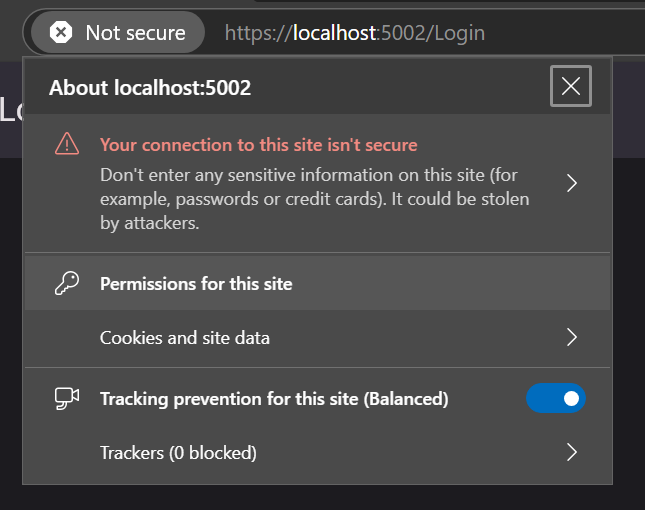

# The ASP.NET Core Server Project

As part of the uno platform templates, the server option is provided to allow the hosting of both an API server as well as a WebAssembly app. This allows you to create an API and endpoints. It can also be used as the data server and you can also choose to implement the authentication server code in it.

You will find [more information](xref:Uno.GettingStarted.UsingWizard#server) on how to use it from the solution wizard or `dotnet new` templates.

When creating an app with the server option enabled, you'll get:

- An app project, which contains a target framework with `net9.0-browserwasm`
- A server project, which references the app project and will by default host it at its root

## Using the server project

See below the specifics about the server project per IDE.

### Visual Studio

To run the project, set the server project as "startup project", then press F5 to enable the debugging.

> [!IMPORTANT]
> See the section below on HTTPS to ensure that debugging works properly

You can start debugging the app in the same way you would when starting the app project directly.

### VS Code

In order to launch the server project in VS Code:

- In a terminal, navigate to your `ReplaceMe.Server` folder
- Type `dotnet run -f net9.0 --launch-profile ReplaceMe.Server`

> [!IMPORTANT]
> See the section below on HTTPS to ensure that debugging works properly

Launching with the debugger is pending on [this issue](https://github.com/unoplatform/uno.templates/issues/1618).

### Rider

- Select the "ReplaceMe.Server" project in the top right debugger selector
- Start the app

> ![IMPORTANT]
> WebAssembly Debugging is [not yet supported](https://github.com/unoplatform/uno/issues/15226) in Rider.
> [!IMPORTANT]
> See the section below on HTTPS to ensure that debugging works properly

## Adjusting for HTTPS

As the app will run with https by default, you will get an error about "Mixed Content" not being supported.

To fix this when using Chrome or Edge:

- When the browser window opens for the first time, click on the padlock or section at the left of the address bar
  
- Click the **Permissions for this site** option
- In the window that opened, search for **Insecure content** then select **Allow**. This will enable Hot Reload and Hot Design for this specific url/port.
  
- Close the browser window, ensure that the debugger has stopped in your IDE

You may also need to [trust the developer certificates](https://learn.microsoft.com/en-us/aspnet/core/security/enforcing-ssl?view=aspnetcore-9.0&tabs=visual-studio%2Clinux-sles#trust-the-aspnet-core-https-development-certificate):

```text
dotnet dev-certs https --trust
```

## Enabling HTTPS for the app project

If you want to enable for the app project, independently from the server project, you can modify your `Properties/launchSettings.json` file this way to use https first:

```json
      "applicationUrl": "https://localhost:5001;http://localhost:5000",
```
