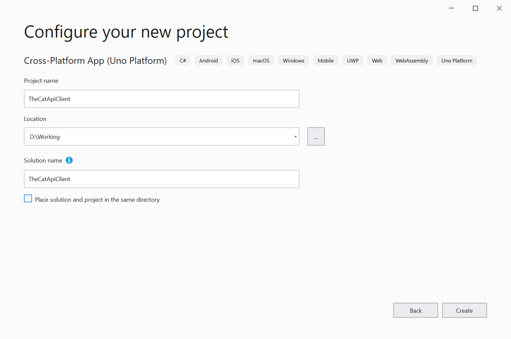
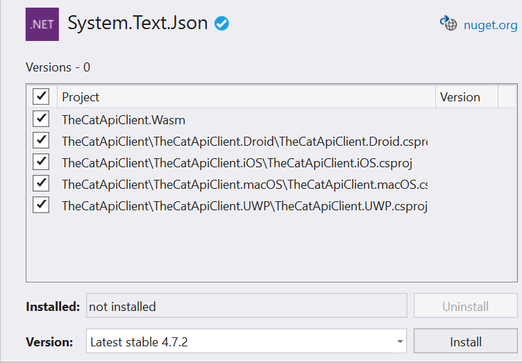
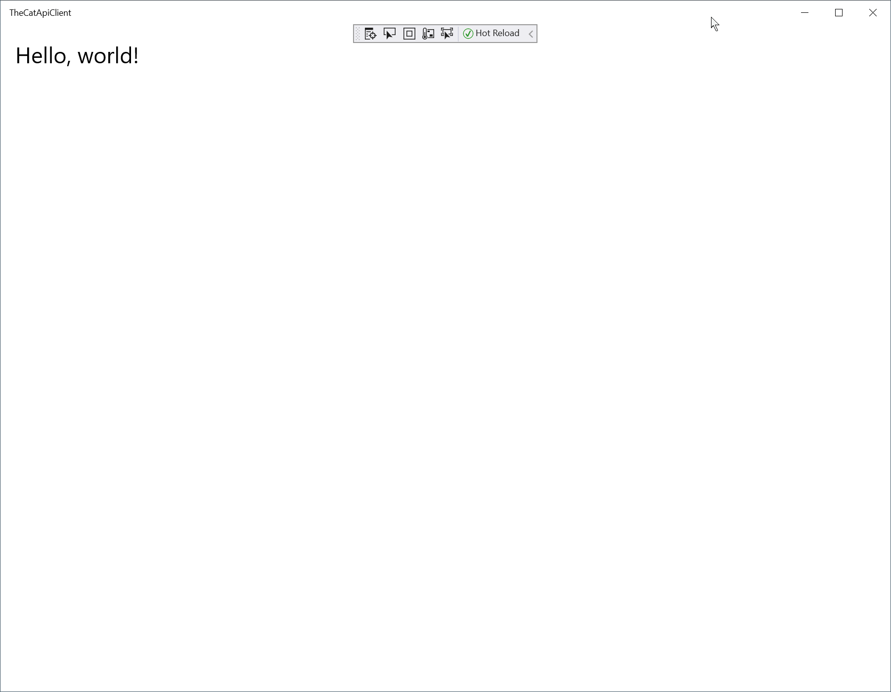
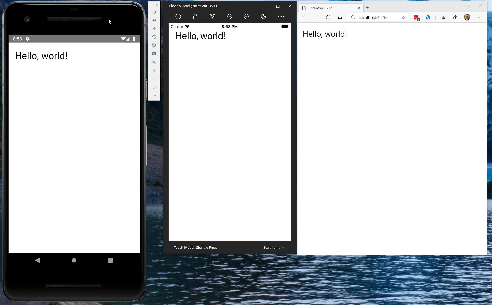
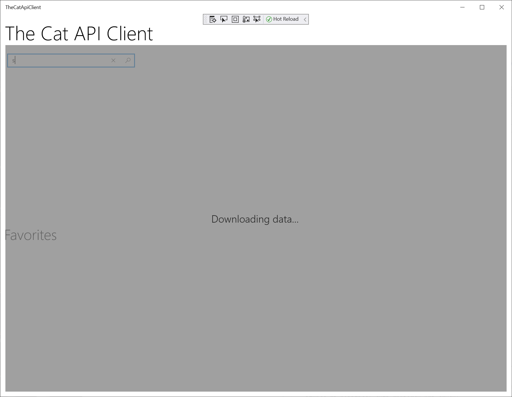
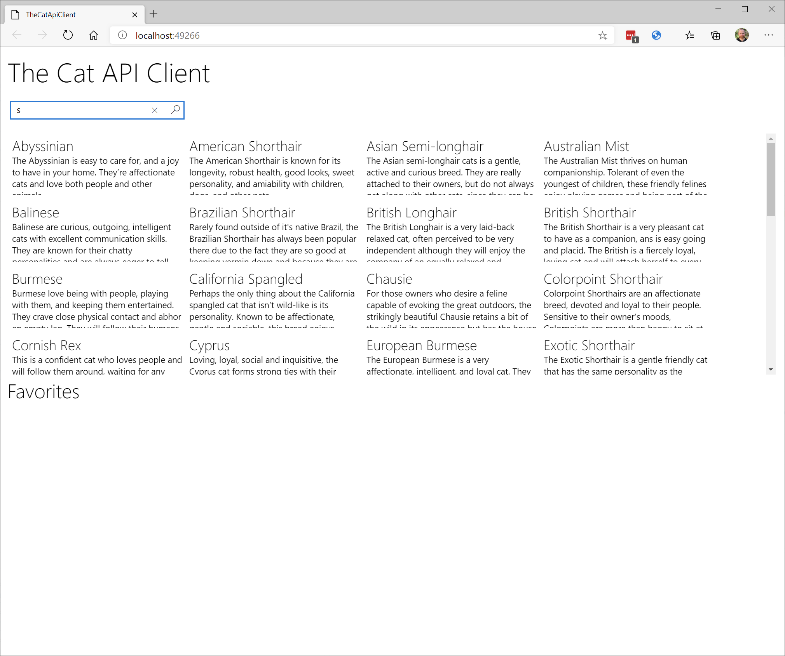
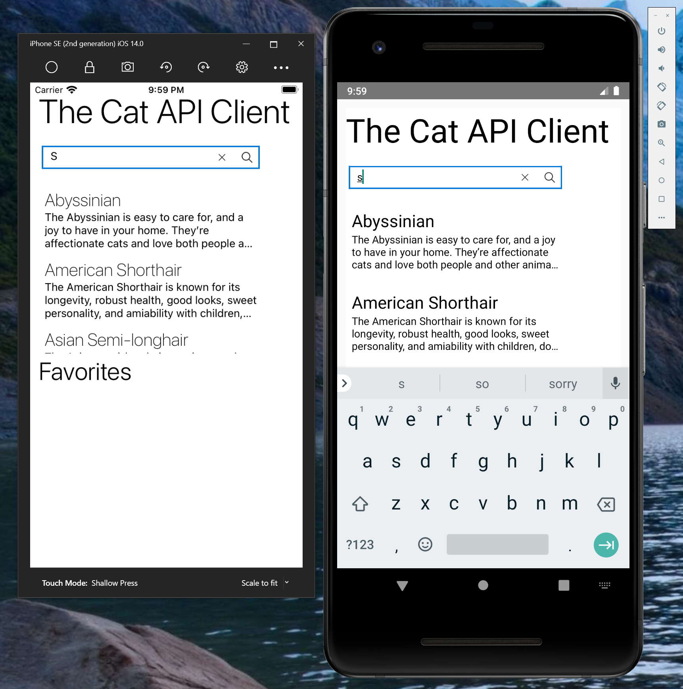
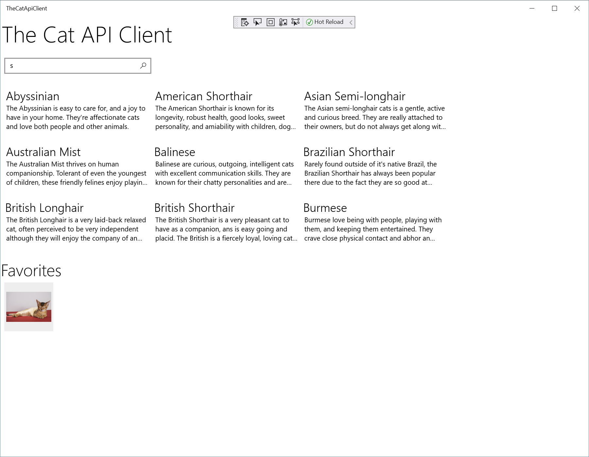
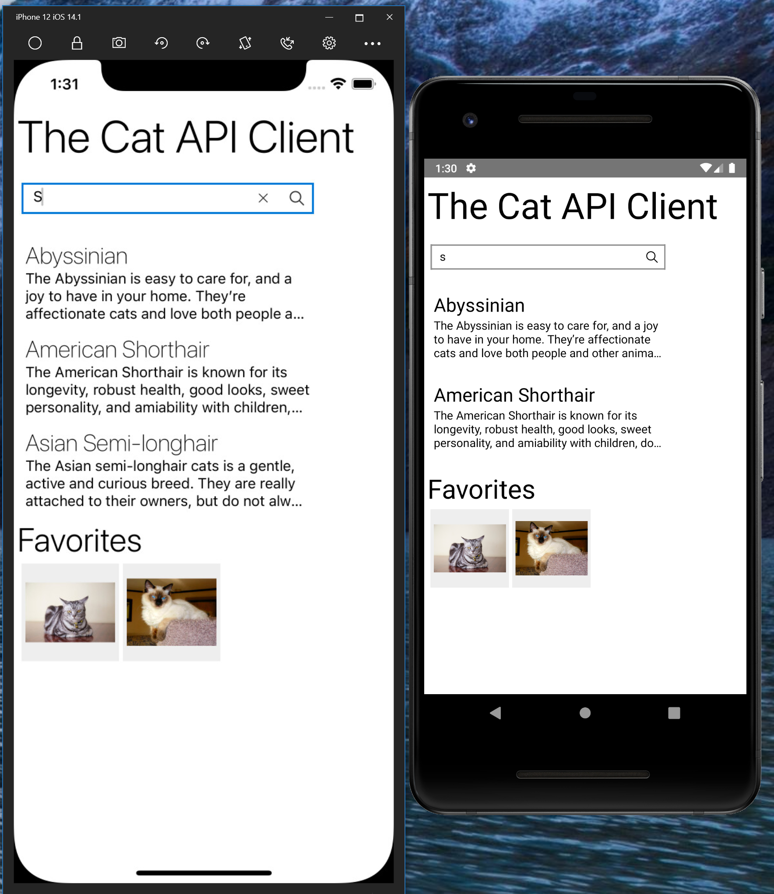

# How to consume a web API

This how-to will walk you through the process of creating a multi-platform application that leverages web services. Specifically you will be:

* Creating a simple Uno application.
* Registering for The Cat API web service.
* Building a number of data models that utilize JSON serialization.
* Building a web service base class that supports REST service operations and then building a number of services that are derived from it.
* Using the services in a view-model.
* Build a XAML UI that utilizes the view-model.
* Test the application in Windows and WASM.

Throughout the how-to, there will be notes on recommended practices and tips that highlight resources for additional learning.

> [!TIP]
> The complete source code that goes along with this tutorial is available in the [unoplatform/Uno.Samples](https://github.com/unoplatform/Uno.Samples) GitHub repository - [TheCatApiClient](https://github.com/unoplatform/Uno.Samples/tree/master/UI/TheCatApiClient)
>
> [!TIP]
> For a step-by-step guide to installing the prerequisites, see [Getting started on Visual Studio](xref:Uno.GetStarted.vs2022)

## Task 1 - Create a simple Uno application

In this task, you will create a simple Single Page App with the Uno Platform. This app - **TheCatApiClient** - will be used to demonstrate an approach to consuming REST web services using the **HttpClient** class.

1. Open Visual Studio and click on **Create a new project**.

    
1. In the **Search for Templates** search box, enter **Uno**

    

1. In the filtered list of templates, select **Uno Platform App** and then click **Next**.

1. In the **Configure your new project** window, set the **Project name** to **TheCatApiClient**, choose where you would like to save your project, and click the **Create** button.

    

    > [!IMPORTANT]
    > The C# and XAML snippets in this tutorial require that the solution is named **TheCatApiClient**. Using a different name will result in build errors when you copy code from this tutorial into the solution.

1. Select the **Blank** preset. Then, click the **Create** button. Wait for the projects to be created and their dependencies to be restored.

    

1. In the **Solution Explorer**, to update the Uno NuGet packages to the latest version, right-click on the Solution file **Solution 'TheCatApiClient'** and select **Manage NuGet Packages for Solution...** from the context menu.

    The **Manage Packages for Solution** page will open.

1. At the top-right of the **Manage Packages for Solution** page, in the **Package source** dropdown, ensure that **nuget.org** or **NuGet official package source** is selected.

1. At the top-left of the page, to browse the available packages, click **Browse**.

1. In the **Search** field, enter **System.Text.Json** and select **System.Text.Json**.

    > [!TIP]
    > The **System.Text.Json** package provides functionality for serializing to and deserializing from JavaScript Object Notation (JSON). You can learn more about how to serialize and deserialize here: [How to serialize and deserialize (marshal and unmarshal) JSON in .NET](https://learn.microsoft.com/dotnet/standard/serialization/system-text-json-how-to)

1. In the right pane of the **Manage Packages for Solution** page, select every project and click **Install**.

    

1. To workaround a Visual studio issue regarding the XAML editor, you'll need to close any opened file in the editor, then close the solution or Visual Studio, then re-open it.

1. To test the Windows version of the application, in the **Solution Explorer**,  right-click the **TheCatApiClient.Windows** project and click **Set as Startup Project**

1. To launch the application, under the **Debug** menu, click **Start Debugging** or use the shortcut key, commonly **F5**.

    

    The following image shows the sample app running on the Android Simulator, IPhone Simulator and as a WASM app in the browser.

    

You have now created a sample application that will be extended in later tasks.

## Task 2 - Sign up for API key

In order to demonstrate how to consume a web service, there needs to be a web service available. In this tutorial you will build a simple client that leverages [The Cat API](https://thecatapi.com/). The website for this service describes it as:

> A public service API all about Cats, free to use when making your fancy new App, Website or Service.

In order to use this service, you need to sign up for a free API key.

1. In a browser, navigate to The Cat API sign-up page: [https://thecatapi.com/signup](https://thecatapi.com/signup)

1. Complete the sign-up form and click **sign-up**.

    You will receive an email with your API key - you will need the key later.

1. Review the API authentication information: [https://docs.thecatapi.com/authentication](https://docs.thecatapi.com/authentication).

    Notice that there are two options for passing the API key - the preferred method using a Request Header, the approach we will use in the code, and passing it as a Query Parameter. The Query Parameter approach makes it very easy to query the API via a browser.

1. To test the API and your API key, open the following URL in a browser (replace the `{YOUR-API-KEY}` value with your key):

    ```http
    # Expected response: JSON array with cat breed information
    https://api.thecatapi.com/v1/breeds/search?q=sib&api_key={YOUR-API-KEY}
    ```

    e.g.

    ```http
    https://api.thecatapi.com/v1/breeds/search?q=sib&api_key=B1D218CC-0D2D-4B3E-89EA-EEC373EB3CA5
    ```

    This simple breed search query will return some JSON data that describes the Siberian cat breed:

    ```json
    [
        {
            "weight":
            {
                "imperial": "8 - 16",
                "metric": "4 - 7"
            },
            "id": "sibe",
            "name": "Siberian",
            "cfa_url": "http://cfa.org/Breeds/BreedsSthruT/Siberian.aspx",
            "vetstreet_url": "http://www.vetstreet.com/cats/siberian",
            "vcahospitals_url": "https://vcahospitals.com/know-your-pet/cat-breeds/siberian",
            "temperament": "Curious, Intelligent, Loyal, Sweet, Agile, Playful, Affectionate",
            "origin": "Russia",
            "country_codes": "RU",
            "country_code": "RU",
            "description": "The Siberians dog like temperament and affection makes the ideal lap cat and will live quite happily indoors. Very agile and powerful, the Siberian cat can easily leap and reach high places, including the tops of refrigerators and even doors. ",
            "life_span": "12 - 15",
            "indoor": 0,
            "lap": 1,
            "alt_names": "Moscow Semi-longhair, HairSiberian Forest Cat",
            "adaptability": 5,
            "affection_level": 5,
            "child_friendly": 4,
            "dog_friendly": 5,
            "energy_level": 5,
            "grooming": 2,
            "health_issues": 2,
            "intelligence": 5,
            "shedding_level": 3,
            "social_needs": 4,
            "stranger_friendly": 3,
            "vocalisation": 1,
            "experimental": 0,
            "hairless": 0,
            "natural": 1,
            "rare": 0,
            "rex": 0,
            "suppressed_tail": 0,
            "short_legs": 0,
            "wikipedia_url": "https://en.wikipedia.org/wiki/Siberian_(cat)",
            "hypoallergenic": 1
        }
    ]
    ```

    > [!TIP]
    > You can learn more about the breed search API here - [GET/breeds/search](https://docs.thecatapi.com/api-reference/breeds/breeds-search).

Now you have signed up for the API, you are ready to start implementing the API client by creating a data model.

## Task 3 - Create API model

The primary objective of this tutorial is to demonstrate how to implement a REST web service client that runs in each project head. To achieve that, you won't create a client that fully uses **TheCatApi** - it will focus on breed searches and favorites. The app will also use simplified models (fewer fields) where possible.

1. To create a folder for the models, in the **Solution Explorer**, right-click the **TheCatApiClient** project, select **Add**, click **New Folder**, and then name the new folder **Models**.

1. To add a folder for the data types, right-click the **Models** folder you just created, select **Add**, click **New Folder**, and then name the new folder **DataModels**.

1. To add a folder for the view model types, right-click the **Models** folder, select **Add**, click **New Folder**, and then name the new folder **ViewModels**.

1. Examine the JSON returned from the breed search you executed earlier:

    ```json
    [
        {
            "weight":
            {
                "imperial": "8 - 16",
                "metric": "4 - 7"
            },
            "id": "sibe",
            "name": "Siberian",
            "cfa_url": "http://cfa.org/Breeds/BreedsSthruT/Siberian.aspx",
            "vetstreet_url": "http://www.vetstreet.com/cats/siberian",
            "vcahospitals_url": "https://vcahospitals.com/know-your-pet/cat-breeds/siberian",
            "temperament": "Curious, Intelligent, Loyal, Sweet, Agile, Playful, Affectionate",
            "origin": "Russia",
            "country_codes": "RU",
            "country_code": "RU",
            "description": "The Siberians dog like temperament and affection makes the ideal lap cat and will live quite happily indoors. Very agile and powerful, the Siberian cat can easily leap and reach high places, including the tops of refrigerators and even doors. ",
            "life_span": "12 - 15",
            "indoor": 0,
            "lap": 1,
            "alt_names": "Moscow Semi-longhair, HairSiberian Forest Cat",
            "adaptability": 5,
            "affection_level": 5,
            "child_friendly": 4,
            "dog_friendly": 5,
            "energy_level": 5,
            "grooming": 2,
            "health_issues": 2,
            "intelligence": 5,
            "shedding_level": 3,
            "social_needs": 4,
            "stranger_friendly": 3,
            "vocalisation": 1,
            "experimental": 0,
            "hairless": 0,
            "natural": 1,
            "rare": 0,
            "rex": 0,
            "suppressed_tail": 0,
            "short_legs": 0,
            "wikipedia_url": "https://en.wikipedia.org/wiki/Siberian_(cat)",
            "hypoallergenic": 1
        }
    ]
    ```

    That is a lot of fields - you will use a simpler data model in this tutorial.

1. To create a simple model that represents the breed search results, right-click the **DataModels** folder, select **Add** and click **Class...**

1. On the **Add New Item** dialog, in the **Name** field, enter **Breed.cs**

1. In the editor, replace the content of the **Breed.cs** class with the following:

    ```csharp
    using System;
    using System.Text.Json.Serialization;

    namespace TheCatApiClient.Models.DataModels
    {
        public partial class Breed
        {
            [JsonPropertyName("id")]
            public string Id { get; set; }

            [JsonPropertyName("name")]
            public string Name { get; set; }

            [JsonPropertyName("temperament")]
            public string Temperament { get; set; }

            [JsonPropertyName("origin")]
            public string Origin { get; set; }

            [JsonPropertyName("description")]
            public string Description { get; set; }

            [JsonPropertyName("wikipedia_url")]
            public Uri WikipediaUrl { get; set; }
        }
    }
    ```

    > [!TIP]
    > This class is using the **JsonPropertyNameAttribute** from the **System.Text.Json** package to map the lowercase JSON property names to the [PascalCase](https://techterms.com/definition/pascalcase) convention used in C#. To learn more about **System.Text.Json**, you can review the documentation here - [How to serialize and deserialize (marshal and unmarshal) JSON in .NET](https://learn.microsoft.com/dotnet/standard/serialization/system-text-json-how-to).

You have now created a simple data model that can be used to deserialize the JSON returned by the breed search API. Next, you will create a service that interacts with the web service API.

## Task 4 - Create simple GET service for breed search

In this task, you will create a number of classes that demonstrate how to use the **HttpClient** class to interact with a web service. Along the way, you will see some patterns that may assist in the reuse of the code in additional projects.

1. To create a folder for the web services, in the **Solution Explorer**, right-click the **TheCatApiClient** project, select **Add**, click **New Folder**, and then name the new folder **WebServices**.

1. To add a base class for all the web services, right-click the **WebServices** folder, select **Add** and click **Class...**

1. On the **Add New Item** dialog, in the **Name** field, enter **WebApiBase.cs**

1. In the editor, replace the content of the **WebApiBase.cs** class with the following:

    ```csharp
    using System.Collections.Generic;
    using System.Net.Http;
    using System.Threading.Tasks;
    using Uno.Extensions.Specialized;

    namespace TheCatApiClient.WebServices
    {
        public abstract class WebApiBase
        {
            // Insert variables below here

            // Insert static constructor below here

            // Insert CreateRequestMessage method below here

            // Insert GetAsync method below here

            // Insert DeleteAsync method below here

            // Insert PostAsync method below here

            // Insert PutAsync method below here
        }
    }
    ```

    This defines the structure of the class **WebApiBase**. It is defined as an abstract class with the intention that every web service API class inherits from it.

1. To add the member variable for an **HttpClient**, locate the comment **// Insert variables below here** and replace it with the following code:

    ```csharp
    // Insert variables below here
    protected static HttpClient _client;
    ```

    Notice that the **_client** variable is declared as **static**. This means there will only be one instance of the **HttpClient** shared by every instance of **WebApiBase** as **HttpClient** is intended to be instantiated once and re-used throughout the life of an application.

    > [!TIP]
    > You can review the Microsoft remarks on **HttpClient** here - [HttpClient Remarks](https://learn.microsoft.com/dotnet/api/system.net.http.httpclient#remarks).

1. To initialize the static **_client** variable, locate the comment **// Insert static constructor below here** and replace it with the following code:

    ```csharp
    // Insert static constructor below here
    static WebApiBase()
    {
        _client = new HttpClient();
    }
    ```

    To facilitate the re-use of the single **HttpClient** instance, you will use instances of the **HttpRequestMessage** class to represent each request, rather than directly setting the **BaseAddress** and **DefaultRequestHeader** properties on the single **HttpClient** instance. This provides a thread-safe, reusable way of making multiple requests with the single **HttpClient** instance.

1. To simplify the creation of an **HttpRequestMessage** instance, locate the comment **// Insert CreateRequestMessage method below here** and replace it with the following code:

    ```csharp
    // Insert CreateRequestMessage method below here
    private HttpRequestMessage CreateRequestMessage(HttpMethod method, string url, Dictionary<string, string> headers = null)
    {
        var httpRequestMessage = new HttpRequestMessage(method, url);
        if (headers != null && headers.Any())
        {
            foreach (var header in headers)
            {
                httpRequestMessage.Headers.Add(header.Key, header.Value);
            }
        }

        return httpRequestMessage;
    }
    ```

    Notice that this method expects the **HttpMethod** to represent a GET, DELETE, UPDATE, or POST operation, the string URL, and an optional dictionary of headers. In this initial implementation of the **WebApiBase** class, you will consume this from the **GetAsync** method you are about to implement.

    > [!NOTE]
    > You will use the header dictionary to supply the authentication key you created earlier.

1. To implement a method that will retrieve a string from a web API, locate the comment **// Insert GetAsync method below here** and replace it with the following code:

    ```csharp
    // Insert GetAsync method below here
    protected async Task<string> GetAsync(string url, Dictionary<string, string> headers = null)
    {
        using (var request = CreateRequestMessage(HttpMethod.Get, url, headers))
        using (var response = await _client.SendAsync(request))
        {
            if (response.IsSuccessStatusCode)
            {
                return await response.Content.ReadAsStringAsync();
            }

            return null;
        }
    }
    ```

    Notice that this asynchronous method uses the **CreateRequestMessage** you just created. As the returned **HttpRequestMessage** object implements the **IDisposable** interface, the **request** variable is defined within a `using` statement that obtains the resource, executes the statements that you specify, and then automatically disposes of the **HttpRequestMessage** instance.

    The remainder of the method uses the single **HttpClient** instance to send the **request** and `await` a response. If the response is successful, the response content is read and returned as a string. If, for some reason, the response does not indicate success, a `null` is returned.

    > [!IMPORTANT]
    > As implementing adequate error handling would add many lines of code, more robust error handling is omitted for clarity. If you are interested in learning more about the considerations for handling errors with **HttpClient**, review the following blog post - [HttpClient - Error handling, a test-driven approach](https://josef.codes/httpclient-error-handling-a-test-driven-approach/).

1. You will implement the remaining methods of the **WebApiBase** class in a later task. The current implementation should look similar to:

    ```csharp
    using System.Collections.Generic;
    using System.Net.Http;
    using System.Threading.Tasks;
    using Uno.Extensions.Specialized;

    namespace TheCatApiClient.WebServices
    {
        public abstract class WebApiBase
        {
            // Insert variables below here
            protected static HttpClient _client;

            // Insert static constructor below here
            static WebApiBase()
            {
                _client = new HttpClient();
            }

            // Insert CreateRequestMessage method below here
            private HttpRequestMessage CreateRequestMessage(HttpMethod method, string url, Dictionary<string, string> headers = null)
            {
                var httpRequestMessage = new HttpRequestMessage(method, url);
                if (headers != null && headers.Any())
                {
                    foreach (var header in headers)
                    {
                        httpRequestMessage.Headers.Add(header.Key, header.Value);
                    }
                }

                return httpRequestMessage;
            }

            // Insert GetAsync method below here
            protected async Task<string> GetAsync(string url, Dictionary<string, string> headers = null)
            {
                using (var request = CreateRequestMessage(HttpMethod.Get, url, headers))
                using (var response = await _client.SendAsync(request))
                {
                    if (response.IsSuccessStatusCode)
                    {
                        return await response.Content.ReadAsStringAsync();
                    }

                    return null;
                }
            }

            // Insert DeleteAsync method below here

            // Insert PostAsync method below here

            // Insert PutAsync method below here
        }
    }
    ```

    You will now implement the Breed Search API service. This service will inherit from **WebApiBase** and have a single method named **Search** that expects a search string.

1. To add a class for the Breed Search API service, in the **TheCatApiClient** project, right-click the **WebServices** folder, select **Add** and click **Class...**

1. On the **Add New Item** dialog, in the **Name** field, enter **BreedSearchApi.cs**

1. In the editor, replace the content of the **BreedSearchApi.cs** class with the following:

    ```csharp
    using System.Collections.Generic;
    using System.Net;
    using System.Text.Json;
    using System.Threading.Tasks;
    using TheCatApiClient.Models.DataModels;

    namespace TheCatApiClient.WebServices
    {
        public class BreedSearchApi : WebApiBase
        {
            public async Task<IEnumerable<Breed>> Search(string search)
            {
                var result = await this.GetAsync(
                    $"https://api.thecatapi.com/v1/breeds/search?q={WebUtility.HtmlEncode(search)}",
                    new Dictionary<string, string> {
                        {"accept", "application/json" },
                        {"x-api-key", "{YOUR-API-KEY}"}
                    });

                if (result != null)
                {
                    return JsonSerializer.Deserialize<IEnumerable<Breed>>(result);
                }

                return new List<Breed>();
            }
        }
    }
    ```

    As most of the complexity for working with a web service is encapsulated in the **WebApiBase** class, this service is straightforward.

    First, you will note that the method is asynchronous. You will then notice the use of string interpolation and the **WebUtility.HtmlEncode** method to construct the API url. Also note how the request headers are supplied to the call - the **accept** header advises the API that the client expects JSON, and the **x-api-key** specifies your API key.

    > [!IMPORTANT]
    > Replace the `{YOUR-API-KEY}` value with the API key you were sent when you registered with TheCatApi.

Once the result is returned, it is null-checked and, if not-null, the JSON is deserialized into an enumerable collection of **Breed** instances using the data model you created earlier. If the result is null, then an empty list is returned.

At this point, you have implemented a simple breed search service. Now, it is time to create the view and view-model that will allow a user to enter a search term and display the results.

## Task 5 - Create a base view model

In this sample application, you will be adopting the Model-View-ViewModel (MVVM) pattern, which helps to cleanly separate business and presentation logic. In this task, you will be creating the base view model that will be used in the following task to create the view model for the main page.

> [!TIP]
> If you want to learn more about MVVM, review the [The Model-View-ViewModel Pattern documentation](https://learn.microsoft.com/xamarin/xamarin-forms/enterprise-application-patterns/mvvm).

1. To add a base view-model class, in the **TheCatApiClient** project, right-click the **Models\ViewModels** folder, select **Add** and click **Class...**

1. On the **Add New Item** dialog, in the **Name** field, enter **DispatchedBindableBase.cs**

    > [!TIP]
    > Although this sample only has a single view-model, it is a good practice to collect common code such as an **INotifyPropertyChanged** implementation and UI thread dispatch into a base class. Doing so will ease the addition of new view-models as needed and reduce code duplication.

1. In the editor, replace the content of the **DispatchedBindableBase.cs** class with the following:

    ```csharp
    using System;
    using System.Collections.Generic;
    using System.ComponentModel;
    using System.Runtime.CompilerServices;
    using System.Threading.Tasks;
    using Microsoft.UI.Dispatching;

    namespace TheCatApiClient.Models.ViewModels
    {
        public abstract class DispatchedBindableBase : INotifyPropertyChanged
        {
            // Insert the event and property below here

            // Insert SetProperty below here

            // Insert RaisePropertyChanged below here

            // Insert DispatchAsync below here
        }
    }
    ```

    Notice that the class will implement **INotifyPropertyChanged** - this will allow view-models to notify bound controls when the property values have changed.

1. To the add a property and event, locate the comment **// Insert the event and property below here** and replace it with the following code:

    ```csharp
    // Insert the event and property below here
    public event PropertyChangedEventHandler PropertyChanged;
    protected DispatcherQueue Dispatcher => DispatcherQueue.GetForCurrentThread();
    ```

    The **PropertyChanged** event declaration satisfies the **INotifyPropertyChanged** interface contract, but isn't particularly helpful alone - you will add methods that make it easier to use shortly.

    The **Dispatcher** property is used later to ensure property updates are performed on the UI thread - an essential detail for updating controls in multi-tasking applications.

    > [!TIP]
    > You can learn more about the UI Thread and multi-tasking here - [Keep the UI thread responsive](https://learn.microsoft.com/windows/uwp/debug-test-perf/keep-the-ui-thread-responsive)

1. To add the method that will be used to set a property value and raise the property changed event, locate the comment **// Insert SetProperty below here** and replace it with the following code:

    ```csharp
    // Insert SetProperty below here
    protected virtual bool SetProperty<T>(ref T backingVariable, T value, [CallerMemberName] string propertyName = null)
    {
        if (EqualityComparer<T>.Default.Equals(backingVariable, value)) return false;

        backingVariable = value;
        RaisePropertyChanged(propertyName);

        return true;
    }
    ```

    There can be a bit to unpack here. First, this is a generic method that allows any type to be used, as indicated by the use of `<T>`, so it can be used for all properties.

    Then, looking at parameters, the **backingVariable** is passed by reference, allowing this method to change the value for the caller as well as locally. Next, the **value** is supplied. Finally, the **propertyName** parameter is defined. At first glance, this appears to be an optional parameter with a default value of null. However the compiler notes the presence of the **CallerMemberName** attribute and assigns the name of the calling method to the property (in the case of a property setter method, the name of the property).

    The method body then compares the incoming value with the current property value, and returns false if they are equal. This prevents a situation where a property is updated, which updates a control via binding, which then sets the same property with the same value again. Without this guard, the code would continue to loop.

    The **value** is then assigned to the **backingVariable** (updating the variable in the caller). The property changed event is raised (you will add that next) and a true value is returned.

    > [!TIP]
    > You can learn more about **CallerMemberNameAttribute** here - [Reserved attributes: Determine caller information](https://learn.microsoft.com/dotnet/csharp/language-reference/attributes/caller-information).

1. To add the method that will actually raise the property changed event, locate the comment **// Insert RaisePropertyChanged below here** and replace it with the following code:

    ```csharp
    // Insert RaisePropertyChanged below here
    protected void RaisePropertyChanged([CallerMemberName] string propertyName = null)
    {
    #pragma warning disable CS4014 // Because this call is not awaited, execution of the current method continues before the call is completed
        DispatchAsync(() => PropertyChanged?.Invoke(this, new PropertyChangedEventArgs(propertyName)));
    #pragma warning restore CS4014 // Because this call is not awaited, execution of the current method continues before the call is completed
    }
    ```

    This method uses a helper method (added next) to ensure the event is raised on the UI thread. As the code does not await this execution, the compiler would usually display a warning with the assumption that this is a mistake. As it is intentional, the code includes `#pragma` directives that temporarily disable that warning.

    > [!TIP]
    > If you want to learn more about lambda expressions, review the document here - [Lambda expressions](https://learn.microsoft.com/dotnet/csharp/language-reference/operators/lambda-expressions)

1. To add a helper method that will ensure a callback is executed on the UI thread, locate the comment **// Insert Dispatch below here** and replace it with the following code:

    ```csharp
    // Insert DispatchAsync below here
    protected async Task DispatchAsync(DispatcherQueueHandler callback)
    {
        var hasThreadAccess =
    #if __WASM__
        true;
    #else
        Dispatcher.HasThreadAccess;
    #endif

        if (hasThreadAccess)
        {
            callback.Invoke();
        }
        else
        {
            var completion = new TaskCompletionSource();
            Dispatcher.TryEnqueue(() =>
            {
                callback();
                completion.SetResult();
            });
            await completion.Task; 
        }
    }
    ```

    > [!NOTE]
    > As **WASM** is currently single-threaded, the **Uno.WASM** implementation of `DispatcherQueue.HasThreadAccess` always returns `false` by default. This default has been chosen to prevent live-locking for certain frameworks that expect a multi-threaded environment. This app overrides that default WASM behavior here via conditional compilation and always invokes the callback directly on WASM.

    In XAML applications, control bindings should only be updated on the UI thread, therefore this code uses the value of **hasThreadAccess** to determine if the callback can be directly invoked. If not, the **DispatcherQueue.TryEnqueue** method is used to execute the callback on the UI Thread. This method is used when setting properties and whenever bound collections are updated, to ensure the collection views (such as GridView, ListView, etc.) are updated.

1. Once complete the base class will look similar to the following:

    ```csharp
    using System;
    using System.Collections.Generic;
    using System.ComponentModel;
    using System.Runtime.CompilerServices;
    using System.Threading.Tasks;
    using Microsoft.UI.Dispatching;

    namespace TheCatApiClient.Models.ViewModels
    {
        public abstract class DispatchedBindableBase : INotifyPropertyChanged
        {
            // Insert variables below here
            protected DispatcherQueue Dispatcher => DispatcherQueue.GetForCurrentThread();

            // Insert variables below here
            public event PropertyChangedEventHandler PropertyChanged;

            // Insert SetProperty below here
            protected virtual bool SetProperty<T>(ref T backingVariable, T value, [CallerMemberName] string propertyName = null)
            {
                if (EqualityComparer<T>.Default.Equals(backingVariable, value)) return false;

                backingVariable = value;
                RaisePropertyChanged(propertyName);

                return true;
            }

            // Insert RaisePropertyChanged below here
            protected void RaisePropertyChanged([CallerMemberName] string propertyName = null)
            {
    #pragma warning disable CS4014 // Because this call is not awaited, execution of the current method continues before the call is completed
                DispatchAsync(() => PropertyChanged?.Invoke(this, new PropertyChangedEventArgs(propertyName)));
    #pragma warning restore CS4014 // Because this call is not awaited, execution of the current method continues before the call is completed
            }

        // Insert DispatchAsync below here
        protected async Task DispatchAsync(DispatcherQueueHandler callback)
        {
            var hasThreadAccess =
        #if __WASM__
            true;
        #else
            Dispatcher.HasThreadAccess;
        #endif

            if (hasThreadAccess)
            {
                callback.Invoke();
            }
            else
            {
                var completion = new TaskCompletionSource();
                Dispatcher.TryEnqueue(() =>
                {
                    callback();
                    completion.SetResult();
                });
                await completion.Task; 
            }
        }
    }
    ```

## Task 6 - Build the search UI view model

In this task, you will build the view-model that implements a simple breed search feature using the base class and web service client you just implemented.

1. In the **TheCatApiClient** project, right-click the **Models\ViewModels** folder, select **Add** and click **Class...**

1. On the **Add New Item** dialog, in the **Name** field, enter **MainViewModel.cs**

1. In the editor, replace the content of the **MainViewModel.cs** class with the following:

    ```csharp
    using System.Collections.ObjectModel;
    using System.Linq;
    using TheCatApiClient.Models.DataModels;
    using TheCatApiClient.WebServices;
    using Uno.Extensions.Specialized;

    namespace TheCatApiClient.Models.ViewModels
    {
        public class MainViewModel : DispatchedBindableBase
        {
            // Insert member variables below here

            // Insert properties below here

            // Insert constructor below here

            // Insert SearchBreeds below here

            // Insert Favorites below here
        }
    }
    ```

    This **MainViewModel** class inherits from the base class you just created.

1. To add the member variables, locate the comment **// Insert variables below here** and replace it with the following code:

    ```csharp
    // Insert variables below here
    private bool _isBusy;
    private string _searchTerm = string.Empty;
    private ObservableCollection<Breed> _searchResults = new ObservableCollection<Breed>();
    private BreedSearchApi _breedSearchApi = new BreedSearchApi();
    ```

    The **_searchTerm** variable is the backing variable for the property that will hold the user-entered search term.

    The **_searchResults** variable is the backing variable for the property that will hold the search results. As it is an **ObservableCollection**, any changes to the collection will update the UI.

    The final variable, **_breedSearchApi**, holds a reference to an instance of the **BreedSearchApi** you created earlier.

    > [!TIP]
    > You can learn more about **ObservableCollection** and its events here - [ObservableCollection<T> Class](https://learn.microsoft.com/dotnet/api/system.collections.objectmodel.observablecollection-1)

1. To add the properties that will be used in XAML bindings, locate the comment **// Insert properties below here** and replace it with the following code:

    ```csharp
    // Insert properties below here
    public bool IsBusy
    {
        get => _isBusy;
        set => SetProperty(ref _isBusy, value);
    }

    public string SearchTerm
    {
        get => _searchTerm;
        set => SetProperty(ref _searchTerm, value);
    }

    public ObservableCollection<Breed> SearchResults
    {
        get => _searchResults;
        set => SetProperty(ref _searchResults, value);
    }
    ```

    These properties use the backing variables you added earlier, and utilize the **SetProperty** inherited from **BaseViewModel** to raise property changed notifications to ensure the UI is updated when the values change.

1. To add the method that is invoked when the user wishes to search for breeds, locate the comment **// Insert SearchBreeds below here** and replace it with the following code:

    ```csharp
    // Insert SearchBreeds below here
    public async Task SearchBreeds()
    {
        if (!string.IsNullOrWhiteSpace(SearchTerm))
        {
            try
            {
                IsBusy = true;
                var result = await _breedSearchApi.Search(SearchTerm).ConfigureAwait(false);
                if (result.Any())
                {
                    SearchResults = new ObservableCollection<Breed>(result);
                }
            }
            finally
            {
                IsBusy = false;
            }
        }
    }
    ```

    As much of the complexity of interacting with the breed search API is encapsulated, this method is pretty straightforward. Notice that it first ensures the **SearchTerm** is not empty, and then sets the **IsBusy** property to `true`. **IsBusy** is used to toggle a data loading indicator in the view. Notice the use of `try {} finally {}` to ensure the **IsBusy** property is always set back to false even if an exception is thrown. Of course, in production you would also be handling the exception more gracefully...

    The **result** variable is then assigned the return value from the asynchronous call to the **Search** method you implemented earlier. Remember that it will contain either an empty `List<Breed>` or a populated `IEnumerable<Breed>` containing the search results. The `ConfigureAwait(false)` call configures the task so that continuation after the await does not have to be run in the caller context, therefore avoiding any possible deadlocks. This means that the code that follows may not execute on the UI thread. Fortunately, the base view model ensures that property updates are dispatched to the UI thread.

    Next, if results are present, the **SearchResults** collection is replaced. Finally, the **IsBusy** property is set to `false`.

1. You will implement the remaining methods of the **MainViewModel** class in a later task. The current implementation should look similar to:

    ```csharp
    using System.Linq;
    using TheCatApiClient.Models.DataModels;
    using TheCatApiClient.WebServices;
    using Uno.Extensions.Specialized;

    namespace TheCatApiClient.Models.ViewModels
    {
        public class MainViewModel : BaseViewModel
        {
            // Insert member variables below here
            private bool _isBusy;
            private string _searchTerm = string.Empty;
            private ObservableCollection<Breed> _searchResults = new ObservableCollection<Breed>();
            private BreedSearchApi _breedSearchApi = new BreedSearchApi();

            // Insert properties below here
            public bool IsBusy
            {
                get => _isBusy;
                set => SetProperty(ref _isBusy, value);
            }

            public string SearchTerm
            {
                get => _searchTerm;
                set => SetProperty(ref _searchTerm, value);
            }

            public ObservableCollection<Breed> SearchResults
            {
                get => _searchResults;
                set => SetProperty(ref _searchResults, value);
            }

            // Insert constructor below here
            public MainViewModel()
            {
            }

            // Insert SearchBreeds below here
            public async Task SearchBreeds()
            {
                if (!string.IsNullOrWhiteSpace(SearchTerm))
                {
                    try
                    {
                        IsBusy = true;
                        var result = await _breedSearchApi.Search(SearchTerm).ConfigureAwait(false);
                        if (result.Any())
                        {
                            SearchResults = new ObservableCollection<Breed>(result);
                        }
                    }
                    finally
                    {
                        IsBusy = false;
                    }
                }
            }
            // Insert Favorites below here
        }
    }
    ```

You have now built the view-model for the Main Page. Next, it is time to build the XAML for the view.

## Task 7 - Add breed search to the main view

In this task you will create the XAML for the UI and implement the bindings for the **MainViewModel**. When the Windows version of the app is running, the UI will look similar to this:


1. In the **Solution Explorer**, in the **TheCatApiClient** project, open the **MainPage.xaml** file.

1. If the **MainPage.xaml** file has opened in the **Design** view, switch to the **XAML** view.

1. Replace the contents of the **MainPage.xaml** file with the following:

    ```xml
    <Page
        x:Class="TheCatApiClient.MainPage"
        xmlns="http://schemas.microsoft.com/winfx/2006/xaml/presentation"
        xmlns:x="http://schemas.microsoft.com/winfx/2006/xaml"
        xmlns:local="using:TheCatApiClient"
        xmlns:d="http://schemas.microsoft.com/expression/blend/2008"
        xmlns:mc="http://schemas.openxmlformats.org/markup-compatibility/2006"
        xmlns:viewmodels="using:TheCatApiClient.Models.ViewModels"
        xmlns:datamodels="using:TheCatApiClient.Models.DataModels"
        xmlns:toolkit="using:Uno.UI.Toolkit"
        mc:Ignorable="d"
        Background="{ThemeResource ApplicationPageBackgroundThemeBrush}">

        <Page.DataContext>
            <viewmodels:MainViewModel x:Name="ViewModel" />
        </Page.DataContext>

        <Grid toolkit:VisibleBoundsPadding.PaddingMask="All">
            <Grid Padding="12">
                <Grid.RowDefinitions>
                    <RowDefinition Height="Auto"/>
                    <RowDefinition Height="Auto"/>
                    <RowDefinition/>
                    <RowDefinition Height="Auto"/>
                    <RowDefinition/>
                </Grid.RowDefinitions>
                <!-- ROW 0 - Title -->
                <TextBlock Text="The Cat API Client" Style="{StaticResource HeaderTextBlockStyle}" />

                <!-- ROW 1 - Search Box -->

                <!-- ROW 2 - Search Results -->

                <!-- ROW 3 - Favorites Title -->
                <TextBlock Grid.Row="3" Text="Favorites" Style="{StaticResource SubheaderTextBlockStyle}" />

                <!-- ROW 4 - Favorites -->

                <!-- Busy Overlay -->

            </Grid>
        </Grid>
    </Page>
    ```

    This page utilizes a simple grid layout with 6 rows to separate the various areas of the UI and will define an overlay that will appear when the app is busy retrieving data from the service.

    Notice that the XAML includes namespace definitions for the **ViewModels** and **DataModels**, as well as the **Uno.UI.Toolkit**:

    ```xml
    <Page
        ...
        xmlns:viewmodels="using:TheCatApiClient.Models.ViewModels"
        xmlns:datamodels="using:TheCatApiClient.Models.DataModels"
        xmlns:toolkit="using:Uno.UI.Toolkit"
        ...
    >
    ```

    The Uno UI toolkit is added so that **toolkit:VisibleBoundsPadding** can be added - this ensures that the UI will adapt appropriately when the app is running on a device that has a "notch", etc.

    Also note how the view-model **MainViewModel** is instantiated and assigned as the **DataContext**. The view-model can then be referred to as **ViewModel** in the `x:Bind` expressions you will add shortly.

    ```xml
    <Page.DataContext>
        <viewmodels:MainViewModel x:Name="ViewModel" />
    </Page.DataContext>
    ```

1. To add the search box, locate the `<!-- ROW 1 - Search Box -->` comment and replace it with the following:

    ```xml
    <!-- ROW 1 - Search Box -->
    <AutoSuggestBox Grid.Row="1" PlaceholderText="Search for breed" QueryIcon="Find"
                    Name="BreedSearchBox"
                    Width="300" Margin="4,20" HorizontalAlignment="Left"
                    Text="{x:Bind ViewModel.SearchTerm, Mode=TwoWay}"
                    QuerySubmitted="BreedSearchBox_QuerySubmitted" />
    ```

    Notice that the **Text** property is bound to the **ViewModel.SearchTerm**. This value is updated when the search button is pressed, so it will be available when the **QuerySubmitted** event is raised.

1. To add the search results control, locate the `<!-- ROW 2 - Search Results -->` comment and replace it with the following:

    ```xml
    <!-- ROW 2 - Search Results -->
    <GridView Grid.Row="2" ItemsSource="{x:Bind ViewModel.SearchResults, Mode=OneWay}" Margin="4"
            SelectionMode="None">
        <GridView.ItemTemplate>
            <DataTemplate x:DataType="datamodels:Breed">
                <StackPanel Width="300" Padding="4">
                    <TextBlock Text="{x:Bind Name}" Style="{StaticResource TitleTextBlockStyle}"/>
                    <TextBlock Text="{x:Bind Description}" Style="{StaticResource BodyTextBlockStyle}" TextWrapping="WrapWholeWords"
                            Height="70" TextTrimming="CharacterEllipsis"/>
                </StackPanel>

            </DataTemplate>
        </GridView.ItemTemplate>
    </GridView>
    ```

    Notice that the **ItemsSource** property is bound to **ViewModel.SearchResults** and will be updated when the breed service search returns results.

    The **DataTemplate** used for each of the search result items is strongly-typed using `x:DataType="datamodels:Breed"`. This allows the two **TextBlock** controls to use `x:Bind` to reference the **Name** and **Description** propertied from the **Breed** class.

    You will add the favorites implementation in a later task.

1. To add an overlay for the UI that will be displayed when the service is retrieving data, locate the `<!-- Busy Overlay -->` comment and replace it with the following:

    ```xml
    <!-- Busy Overlay -->
    <Grid Background="Gray" Opacity="0.75" Visibility="{x:Bind ViewModel.IsBusy, Mode=OneWay}"
        Grid.Row="1" Grid.RowSpan="4">
        <TextBlock Text="Downloading data..." Style="{StaticResource TitleTextBlockStyle}" VerticalAlignment="Center" HorizontalAlignment="Center"/>
    </Grid>
    ```

    Notice that this grid is displayed from row 1 and spans 4 rows. As this grid is defined last, it will appear on top of the other controls, block click/touch interactions with the underlying controls as well showing a semi-opaque message that the app is **Downloading data**.

    

    > [!NOTE]
    > You would typically use a **ProgressRing** here, but in an effort to keep the UI as simple as possible, this approach was taken.

1. When you have completed adding the XAML, it should look similar to this.

    ```xml
    <Page
        x:Class="TheCatApiClient.MainPage"
        xmlns="http://schemas.microsoft.com/winfx/2006/xaml/presentation"
        xmlns:x="http://schemas.microsoft.com/winfx/2006/xaml"
        xmlns:local="using:TheCatApiClient"
        xmlns:d="http://schemas.microsoft.com/expression/blend/2008"
        xmlns:mc="http://schemas.openxmlformats.org/markup-compatibility/2006"
        xmlns:viewmodels="using:TheCatApiClient.Models.ViewModels"
        xmlns:datamodels="using:TheCatApiClient.Models.DataModels"
        xmlns:toolkit="using:Uno.UI.Toolkit"
        mc:Ignorable="d"
        Background="{ThemeResource ApplicationPageBackgroundThemeBrush}">

        <Page.DataContext>
            <viewmodels:MainViewModel x:Name="ViewModel" />
        </Page.DataContext>

        <Grid Margin="12">
            <Grid.RowDefinitions>
                <RowDefinition Height="Auto"/>
                <RowDefinition Height="Auto"/>
                <RowDefinition/>
                <RowDefinition Height="Auto"/>
                <RowDefinition/>
            </Grid.RowDefinitions>
            <!-- ROW 0 - Title -->
            <TextBlock Text="The Cat API Client" Style="{StaticResource HeaderTextBlockStyle}" />

            <!-- ROW 1 - Search Box -->
            <AutoSuggestBox Grid.Row="1" PlaceholderText="Search for breed" QueryIcon="Find"
                            Name="BreedSearchBox"
                            Width="300" Margin="4,20" HorizontalAlignment="Left"
                            Text="{x:Bind ViewModel.SearchTerm, Mode=TwoWay}"
                            QuerySubmitted="BreedSearchBox_QuerySubmitted" />

            <!-- ROW 2 - Search Results -->
            <GridView Grid.Row="2" ItemsSource="{x:Bind ViewModel.SearchResults, Mode=OneWay}" Margin="4"
                  SelectionMode="None">
                <GridView.ItemTemplate>
                    <DataTemplate x:DataType="datamodels:Breed">
                        <StackPanel Width="300" Padding="4">
                            <TextBlock Text="{x:Bind Name}" Style="{StaticResource TitleTextBlockStyle}"/>
                            <TextBlock Text="{x:Bind Description}" Style="{StaticResource BodyTextBlockStyle}" TextWrapping="WrapWholeWords"
                                   Height="70" TextTrimming="CharacterEllipsis"/>
                        </StackPanel>

                    </DataTemplate>
                </GridView.ItemTemplate>
            </GridView>

            <!-- ROW 3 - Favorites Title -->
            <TextBlock Grid.Row="3" Text="Favorites" Style="{StaticResource SubheaderTextBlockStyle}" />

            <!-- ROW 4 - Favorites -->

            <!-- Busy Overlay -->
            <Grid Background="Gray" Opacity="0.75" Visibility="{x:Bind ViewModel.IsBusy, Mode=OneWay}"
                Grid.Row="1" Grid.RowSpan="4">
                <TextBlock Text="Downloading data..." Style="{StaticResource TitleTextBlockStyle}" VerticalAlignment="Center" HorizontalAlignment="Center"/>
            </Grid>
        </Grid>
    </Page>
    ```

1. To add the code-behind handler for the **QuerySubmitted** event, switch to the code view by either opening **MainPage.xaml.cs** or by pressing the default keyboard shortcut **F7**.

1. Locate the **MainPage** constructor and add the following code beneath it:

    ```csharp
    private async void BreedSearchBox_QuerySubmitted(AutoSuggestBox sender, AutoSuggestBoxQuerySubmittedEventArgs args)
    {
        await ViewModel.SearchBreeds();
    }

    // Insert favorites below here
    ```

    This method simply calls the **SearchBreeds** method on the view-model.

1. You have now completed the implementation of a simple web service client. To run the application, press **F5**.

1. In the application, in the **Search for breed** search box, enter **S** and click the search icon.

    The **Downloading data...** UI should be shown and then the results should be populated. You should be able to scroll the results and select one (nothing will happen yet).

    

1. When you have finished testing the Windows app, close it.

1. To test the app in Wasm, in the **Solution Explorer**, right-click the **TheCatApiClient.Wasm** project and select **Set as Startup project**.

1. To run the application, press **F5**.

    Visual Studio will open a browser and display the application.

1. In the application, in the **Search for breed** search box, enter **S** and click the search icon.

    The **Downloading data...** UI should be shown and then the results should be populated. You should be able to scroll the results and select one (nothing will happen yet).

    

    Here is how the app looks running in the iPhone and Android simulators:

    

Congratulations - you now have a cross-platform application that interacts with a web service using an HTTP GET operation. If you are interested in seeing how to implement additional operations, continue with the next tasks.

## Task 8 - Add new services to support favorites

In the previous tasks, you created a web service client and UI that performs a simple cat breed search. In this task you will add a service that leverages the favorites API. We will build a UI that will add a picture of a selected breed to your favorites when you click it in the search results, and will remove it from the favorites when you click it in the favorites list.

To achieve this, the **WebApiBase** class will updated be to include additional operations that support HTTP Post, Delete and Put verbs. You will then add two more services:

* **ImageApi** - returns a list of images for a given breed.
* **FavoritesApi** - supports adding and deleting an image from your favorites.

To support these services, 4 more data models will be added:

* **CatImage** - represents the results returned from the **GetByBreed** operation of the **ImageApi**.
* **Favorite** - represents the results returned from the **Get** and **GetAll** operations of the **FavoritesApi**.
* **FavoriteImage** - represents the image returned as part of a **Favorite** from the **FavoritesApi**.
* **Response** - represents a general result returned by the **Add** and **Delete** operations of the **FavoritesApi**.

You will start by adding the data models.

1. To create a simple model that represents the cat image search results, right-click the **DataModels** folder, select **Add** and click **Class...**

1. On the **Add New Item** dialog, in the **Name** field, enter **CatImage.cs**

1. In the editor, replace the content of the **CatImage.cs** class with the following:

    ```csharp
    using System;
    using System.Text.Json.Serialization;

    namespace TheCatApiClient.Models.DataModels
    {
        public partial class CatImage
        {
            [JsonPropertyName("id")]
            public string Id { get; set; }

            [JsonPropertyName("height")]
            public int Height { get; set; }

            [JsonPropertyName("url")]
            public string Url { get; set; }

            [JsonPropertyName("width")]
            public int Width { get; set; }
        }
    }
    ```

1. Repeat the above and add the **Favorite.cs** class, replacing the content with the following:

    ```csharp
    using System;
    using System.Text.Json.Serialization;

    namespace TheCatApiClient.Models.DataModels
    {
        public partial class Favorite
        {
            [JsonPropertyName("created_at")]
            public DateTime CreatedAt { get; set; }

            [JsonPropertyName("id")]
            public int Id { get; set; }

            [JsonPropertyName("image")]
            public FavoriteImage Image { get; set; }

            [JsonPropertyName("image_id")]
            public string ImageId { get; set; }

            [JsonPropertyName("sub_id")]
            public string SubId { get; set; }

            [JsonPropertyName("user_id")]
            public string UserId { get; set; }
        }
    }
    ```

1. Repeat the above and add the **FavoriteImage.cs** class, replacing the content with the following:

    ```csharp
    using System;
    using System.Text.Json.Serialization;

    namespace TheCatApiClient.Models.DataModels
    {
        public partial class FavoriteImage
        {
            [JsonPropertyName("id")]
            public string Id { get; set; }

            [JsonPropertyName("url")]
            public string Url { get; set; }
        }
    }
    ```

1. Repeat the above and add the **Response.cs** class, replacing the content with the following:

    ```csharp
    using System;
    using System.Text.Json.Serialization;

    namespace TheCatApiClient.Models.DataModels
    {
        public partial class Response
        {

            [JsonPropertyName("id")]
            public int Id { get; set; }

            [JsonPropertyName("message")]
            public string Message { get; set; }
        }
    }
    ```

1. To extend the **WebApiBase** class, open the **WebApiBase.cs** file in the editor.

1. To add support for the delete operation, locate the comment **// Insert DeleteAsync method below here** and replace it with the following code:

    ```csharp
    // Insert DeleteAsync method below here
    protected async Task<string> DeleteAsync(string url, Dictionary<string, string> headers = null)
    {
        using (var request = CreateRequestMessage(HttpMethod.Delete, url, headers))
        using (var response = await _client.SendAsync(request))
        {
            if (response.IsSuccessStatusCode)
            {
                return await response.Content.ReadAsStringAsync();
            }

            return null;
        }
    }
    ```

    The code is very similar to the **GetAsync** method added earlier, just using `HttpMethod.Delete`.

1. To add support for the post operation, locate the comment **// Insert PostAsync method below here** and replace it with the following code:

    ```csharp
    // Insert PostAsync method below here
    protected async Task<string> PostAsync(string url, string payload, Dictionary<string, string> headers = null)
    {
        using (var request = CreateRequestMessage(HttpMethod.Post, url, headers))
        {
            request.Content = new StringContent(payload, Encoding.UTF8, "application/json");
            using (var response = await _client.SendAsync(request))
            {
                if (response.IsSuccessStatusCode)
                {
                    return await response.Content.ReadAsStringAsync();
                }

                return null;
            }
        }
    }
    ```

    The change for this method is the use of `HttpMethod.Post` and the addition of the **payload** parameter, which is added to the request as **StringContent**. Callers of this method will submit JSON as the payload - notice the encoding and MIME type specification.

1. To add support for the put operation, locate the comment **// Insert PutAsync method below here** and replace it with the following code:

    ```csharp
    // Insert PutAsync method below here
    protected async Task<string> PutAsync(string url, string payload, Dictionary<string, string> headers = null)
    {
        using (var request = CreateRequestMessage(HttpMethod.Put, url, headers))
        {
            request.Content = new StringContent(payload, Encoding.UTF8, "application/json");
            using (var response = await _client.SendAsync(request))
            {
                if (response.IsSuccessStatusCode)
                {
                    return await response.Content.ReadAsStringAsync();
                }

                return null;
            }
        }
    }
    ```

    Put is very similar to post. It is included here for completeness although we don't use it in this tutorial.

    Now you will add the additional services. The first service you will add is the **ImageApi**. If you recall, if the user clicks on a breed, this service will be used to retrieve a list of images of that breed.

1. To add a class for the Image API service, in the **TheCatApiClient** project, right-click the **WebServices** folder, select **Add** and click **Class...**

1. On the **Add New Item** dialog, in the **Name** field, enter **ImageApi.cs**

1. In the editor, replace the content of the **ImageApi.cs** class with the following:

    ```csharp
    using System.Collections.Generic;
    using System.Net;
    using System.Text.Json;
    using System.Threading.Tasks;
    using TheCatApiClient.Models.DataModels;

    namespace TheCatApiClient.WebServices
    {
        public class ImageApi : WebApiBase
        {
            private Dictionary<string, string> _defaultHeaders = new Dictionary<string, string> {
                {"accept", "application/json" },
                {"x-api-key", "{YOUR-API-KEY}"}
            };

            public async Task<IEnumerable<CatImage>> GetByBreed(string breedId)
            {
                var result = await this.GetAsync(
                    $"https://api.thecatapi.com/v1/images/search?breed_id={WebUtility.HtmlEncode(breedId)}",
                    _defaultHeaders);

                if (result != null)
                {
                    return JsonSerializer.Deserialize<IEnumerable<CatImage>>(result);
                }

                return new List<CatImage>();
            }

            public async Task<CatImage> GetById(string imageId)
            {
                var result = await this.GetAsync(
                    $"https://api.thecatapi.com/v1/images/{WebUtility.HtmlEncode(imageId)}",
                    _defaultHeaders);

                if (result != null)
                {
                    return JsonSerializer.Deserialize<CatImage>(result);
                }

                return null;
            }
        }
    }
    ```

    Notice that the default headers including your API key have been moved to **_defaultHeaders** to ease reuse.

    This service implements two methods - **GetByBreed** which returns back all images for a breed and **GetById**, which returns a specific image. They each utilize the **WebApiBase.GetAsync** method you used earlier.

    > [!TIP]
    > You can review the images service documentation here - [/images](https://docs.thecatapi.com/api-reference/images/)

1. To add a class for the Favorites API service, in the **TheCatApiClient** project, right-click the **WebServices** folder, select **Add** and click **Class...**

1. On the **Add New Item** dialog, in the **Name** field, enter **ImageApi.cs**

1. In the editor, replace the content of the **ImageApi.cs** class with the following:

    ```csharp
    using System.Collections.Generic;
    using System.Text.Json;
    using System.Threading.Tasks;
    using TheCatApiClient.Models.DataModels;

    namespace TheCatApiClient.WebServices
    {
        public class FavoritesApi : WebApiBase
        {
            private Dictionary<string, string> _defaultHeaders = new Dictionary<string, string> {
                {"accept", "application/json" },
                {"x-api-key", "{YOUR-API-KEY}"}
            };

            // Insert GetAll and Get below here

            // Insert Add below here

            // Insert Delete below here
            }
        }
    }
    ```

1. To add support for retrieving all of your favorites, or a specific favorite, locate the comment **// Insert GetAll and Get below here** and replace it with the following code:

    ```csharp
    // Insert GetAll and Get below here
    public async Task<IEnumerable<Favorite>> GetAll()
    {
        var result = await this.GetAsync(
            $"https://api.thecatapi.com/v1/favourites",
            _defaultHeaders);

        if (result != null)
        {
            return JsonSerializer.Deserialize<IEnumerable<Favorite>>(result);
        }

        return new List<Favorite>();
    }

    public async Task<Favorite> Get(int id)
    {
        var result = await this.GetAsync(
            $"https://api.thecatapi.com/v1/favourites/{id}",
            _defaultHeaders);

        if (result != null)
        {
            return JsonSerializer.Deserialize<Favorite>(result);
        }

        return null;
    }
    ```

    These methods are very similar to the methods you implemented earlier - **GetAll** returns a collection of the users **Favorite** instances, whereas **Get** returns a single **Favorite** by its ID.

    > [!TIP]
    > You can review the favorites service documentation here - [/favorites](https://docs.thecatapi.com/api-reference/favourites/)

1. To add support for adding an image to your favorites, locate the comment **// Insert Add below here** and replace it with the following code:

    ```csharp
    // Insert Add below here
    public async Task<Response> Add(CatImage image)
    {
        var result = await this.PostAsync(
            $"https://api.thecatapi.com/v1/favourites",
            JsonSerializer.Serialize(
                new Dictionary<string, string>
                {
                    { "image_id", image.Id },
                    { "sub_id", "uno-client" }
                }),
            _defaultHeaders);

        if (result != null)
        {
            return JsonSerializer.Deserialize<Response>(result);
        }

        return null;
    }
    ```

    In order to add an image to your favorites, the API expects a JSON payload that contains the image ID and an optional **sub_id** value. The **Add** methods constructs this using a **Dictionary** that is then serialized to JSON and submitted as the payload. Rather than returning a **Favorite**, it returns a **Response** instance which contains the new Favorite ID.

1. To add support for deleting an image from your favorites, locate the comment **// Insert Delete below here** and replace it with the following code:

    ```csharp
    // Insert Delete below here
    public async Task<Response> Delete(Favorite favorite)
    {
        var result = await this.DeleteAsync(
            $"https://api.thecatapi.com/v1/favourites/{favorite.Id}",
            _defaultHeaders);

        if (result != null)
        {
            return JsonSerializer.Deserialize<Response>(result);
        }

        return null;
    }
    ```

    In order to delete an image from your favorites, the API expects a JSON payload that contains the favorite ID value. The **Delete** method submits the favorite ID value in the url. The method returns a **Response** instance.

1. The implementation of **FavoritesApi** should look similar to:

    ```csharp
    using System.Collections.Generic;
    using System.Text.Json;
    using System.Threading.Tasks;
    using TheCatApiClient.Models.DataModels;

    namespace TheCatApiClient.WebServices
    {
        public class FavoritesApi : WebApiBase
        {
            private Dictionary<string, string> _defaultHeaders = new Dictionary<string, string> {
                {"accept", "application/json" },
                {"x-api-key", "{YOUR-API-KEY}"}
            };

            // Insert GetAll and Get below here
            public async Task<IEnumerable<Favorite>> GetAll()
            {
                var result = await this.GetAsync(
                    $"https://api.thecatapi.com/v1/favourites",
                    _defaultHeaders);

                if (result != null)
                {
                    return JsonSerializer.Deserialize<IEnumerable<Favorite>>(result);
                }

                return new List<Favorite>();
            }

            public async Task<Favorite> Get(int id)
            {
                var result = await this.GetAsync(
                    $"https://api.thecatapi.com/v1/favourites/{id}",
                    _defaultHeaders);

                if (result != null)
                {
                    return JsonSerializer.Deserialize<Favorite>(result);
                }

                return null;
            }

            // Insert Add below here
            public async Task<Response> Add(CatImage image)
            {
                var result = await this.PostAsync(
                    $"https://api.thecatapi.com/v1/favourites",
                    JsonSerializer.Serialize(new Dictionary<string, string> { { "image_id", image.Id }, { "sub_id", "uno-client" } }),
                    _defaultHeaders);

                if (result != null)
                {
                    return JsonSerializer.Deserialize<Response>(result);
                }

                return null;
            }

            // Insert Delete below here
            public async Task<Response> Delete(Favorite favorite)
            {
                var result = await this.DeleteAsync(
                    $"https://api.thecatapi.com/v1/favourites/{favorite.Id}",
                    _defaultHeaders);

                if (result != null)
                {
                    return JsonSerializer.Deserialize<Response>(result);
                }

                return null;
            }
        }
    }
    ```

Now that the services are complete, it is time to update the UI.

## Task 9 - Add favorites to the UI view model

In this task, you will add the favorites capability to the Main view-model.

1. Open the **MainViewModel.cs** file in the editor.

1. To add the variables, property and method placeholders for the favorites implementation, locate the **// Insert Favorites below here** comment and replace it with the following code:

    ```csharp
    // Insert Favorites below here
    private ImageApi _imageApi = new ImageApi();
    private FavoritesApi _favoritesApi = new FavoritesApi();
    private ObservableCollection<Favorite> _favorites = new ObservableCollection<Favorite>();

    public ObservableCollection<Favorite> Favorites
    {
        get => _favorites;
        set => SetProperty(ref _favorites, value);
    }

    // Insert LoadFavorites below here

    // Insert AddFavorite below here

    // Insert DeleteFavorite below here
    ```

    This code creates the API services and the collection that will hold the user's favorites.

1. To add the method that retrieves the current user favorites, locate the **// Insert LoadFavorites below here** comment and replace it with the following code:

    ```csharp
    // Insert LoadFavorites below here
    public async Task LoadFavorites()
    {
        try
        {
            IsBusy = true;
            var result = await _favoritesApi.GetAll().ConfigureAwait(false);
            if (result.Any())
            {
                Favorites = new ObservableCollection<Favorite>(result);
            }
        }
        finally
        {
            IsBusy = false;
        }
    }
    ```

    This method is virtually identical to the **SearchBreeds** method that you created earlier.

1. To implement support for adding an image to favorites, locate the **// Insert AddFavorite below here** comment and replace it with the following code:

    ```csharp
    // Insert AddFavorite below here
    public async Task AddFavorite(Breed selectedBreed)
    {
        if (selectedBreed != null)
        {
            try
            {
                IsBusy = true;
                var result = await _imageApi.GetByBreed(selectedBreed.Id).ConfigureAwait(false);
                if (result.Any())
                {
                    var image = result.First();
                    var response = await _favoritesApi.Add(image).ConfigureAwait(false);

                    if (response != null && response.Message == "SUCCESS")
                    {
                        var favoriteResult = await _favoritesApi.Get(response.Id).ConfigureAwait(false);
                        if (favoriteResult != null)
                        {
                            await DispatchAsync(() => Favorites.Insert(0, favoriteResult)).ConfigureAwait(false);
                        }
                    }
                }
            }
            finally
            {
                IsBusy = false;
            }
        }
    }
    ```

    There is a bit more going on in this method, but it follows a familiar pattern. If we have a **selectedBreed**, we set the **IsBusy** property and then use the **ImageApi** to retrieve a collection of images for the breed. If we find any (some breeds don't have images... you would show a message in a production app), we just grab the first image that is returned. We then call the **FavoritesApi** to add the image. We then check the **response** value and, if successful, use the ID that was returned via the **response** to retrieve the new **Favorite**. We then insert the favorite at the beginning of our **Favorites** collection.

    You should notice the use of the `.ConfigureAwait(false)` code throughout to ensure the UI is not blocked. You will also notice the use of the **DispatchAsync** helper to ensure the **CollectionChanged** event raised by the insertion is raised on the UI thread so any bound control updates correctly.

1. Finally, to add support for deleting a favorite, locate the **// Insert DeleteFavorite below here** comment and replace it with the following code:

    ```csharp
    // Insert DeleteFavorite below here
    public async Task DeleteFavorite(Favorite selectedFavorite)
    {
        if (selectedFavorite != null)
        {
            try
            {
                IsBusy = true;
                var result = await _favoritesApi.Delete(selectedFavorite).ConfigureAwait(false);
                if (result.Message != null)
                {
                    await DispatchAsync(() => Favorites.Remove(selectedFavorite)).ConfigureAwait(false);
                }
            }
            finally
            {
                IsBusy = false;
            }
        }
    }
    ```

    Similar to the flow of the **AddFavorite** method, this implementation calls the delete operation, and then this time removes the **selectedFavorite** from thee **Favorites** collection.

You have now updated the view-model - the final task will have you update the UI to include the favorites.

## Task 10 - Add favorites to the main view

In this final task, you will bring together the new **FavoritesApi** with the updated **MainViewModel** to add a list of favorites to the UI.

1. In the **Solution Explorer**, in the **TheCatApiClient** project, open the **MainPage.xaml** file.

1. If the **MainPage.xaml** file has opened in the **Design** view, switch to the **XAML** view.

1. To add support for clicking a breed in the search results, locate the `<!-- ROW 2 - Search Results -->` comment and replace all of the row 2 XAML with the following:

    ```xml
    <!-- ROW 2 - Search Results -->
    <GridView Grid.Row="2" ItemsSource="{x:Bind ViewModel.SearchResults, Mode=OneWay}" Margin="4"
            SelectionMode="None"
            IsItemClickEnabled="True"
            ItemClick="SearchResults_ItemClick">
        <GridView.ItemTemplate>
            <DataTemplate x:DataType="datamodels:Breed">
                <StackPanel Width="300" Padding="4">
                    <TextBlock Text="{x:Bind Name}" Style="{StaticResource TitleTextBlockStyle}"/>
                    <TextBlock Text="{x:Bind Description}" Style="{StaticResource BodyTextBlockStyle}" TextWrapping="WrapWholeWords"
                            Height="70" TextTrimming="CharacterEllipsis"/>
                </StackPanel>

            </DataTemplate>
        </GridView.ItemTemplate>
    </GridView>
    ```

    Notice that two attributes have been added to the **GridView** - **IsItemClickEnabled** configures the **GridView** to raise ItemClick events (by default this is disabled) and then the **ItemClick** event is directed to the code-behind. You will add the code-behind implementation shortly.

1. To add the favorites list, locate the `<!-- ROW 4 - Favorites -->` comment and replace it with the following XAML:

    ```xml
    <!-- ROW 4 - Favorites -->
    <GridView Grid.Row="4" ItemsSource="{x:Bind ViewModel.Favorites, Mode=OneWay}" Margin="4"
            SelectionMode="None"
            Name="Favorites"
            IsItemClickEnabled="True"
            ItemClick="Favorites_ItemClick">
        <GridView.ItemTemplate>
            <DataTemplate x:DataType="datamodels:Favorite">
                <Grid Padding="4" Height="100" Width="100" Background="#EEEEEE">
                    <Image Source="{x:Bind Image.Url}" Stretch="Uniform"/>
                </Grid>
            </DataTemplate>
        </GridView.ItemTemplate>
    </GridView>
    ```

    This **GridView** is configured in a similar way to the search results - item click is enabled with a code-behind handler, etc. The primary differences are that **ItemsSource** is bound to the **ViewModel.Favorites** property, the data template is bound to the **Favorite** data model and the template displays an image.

    That's it for the XAML. Now to update the code-behind.

1. To add the code-behind functionality for favorites, switch to the code view by either opening **MainPage.xaml.cs** or by pressing the default keyboard shortcut **F7**.

1. Locate the **// insert favorites below here** comment and and replace it with the following code:

    ```csharp
    // insert favorites below here
    private async void Favorites_ItemClick(object sender, ItemClickEventArgs e)
    {
        await ViewModel.DeleteFavorite((Favorite)e.ClickedItem);
    }

    private async void SearchResults_ItemClick(object sender, ItemClickEventArgs e)
    {
        await ViewModel.AddFavorite((Breed)e.ClickedItem);
    }
    ```

    These methods are very straightforward - they merely pass on the clicked item to the view-model.

1. You have now completed the addition of favorites to the client. In the **Solution Explorer**, right-click the **TheCatApiClient.Windows** project and select **Set as Startup project**.

1. To run the Windows application, press **F5**.

1. In the application, in the **Search for breed** search box, enter **S** and click the search icon.

    The **Downloading data...** UI should be shown and then the results should be populated. You should be able to scroll the results and select one (nothing will happen yet).

    

1. In the search results, click **Abyssinian** and you should see an image of a cat added to the **Favorites** list.

    

1. Repeat the above, adding images for other breeds.

1. In the **Favorites** list, click an image and you should see it be removed.

1. Ensure you have one or more images remaining in your **Favorites** list and exit the Windows application.

1. To test the app in Wasm, in the **Solution Explorer**, right-click the **TheCatApiClient.Wasm** project and select **Set as Startup project**.

1. To run the application, press **F5**.

    Visual Studio will open a browser and display the application. You should see the same favorites you had listed in the Windows app.

1. Search for additional breeds and add and remove favorites - you should see the same functionality as the Windows app.

1. Try the app on other platforms. Below is an image of the app running on iPhone and Android simulators.

    

## Summary

In this how-to, you built a multi-platform application that leverages web services. Specifically you:

* Created a simple Uno application
* Registered and obtained a key for The Cat API web service.
* Built a number of data models that utilize JSON serialization
* Built a web service base class that supports REST service operations and then implemented a number of services that derived from it
* Leveraged the services in a view-model
  * You built a base class that uses the dispatcher to ensure bound properties are updated on the UI thread
* Built a XAML UI that utilizes the view-model
* Tested the application in Windows and WASM (and optionally on iOS and Android)

The full source code for this tutorial is available here - [Tutorial Source Code - TheCatApiClient](https://github.com/unoplatform/Uno.Samples/tree/master/UI/TheCatApiClient)

## References

* Uno Platform:
  * [Using Uno - getting started on Visual Studio](https://platform.uno/docs/articles/get-started-vs.html)
* Uno Platform Samples:
  * [unoplatform/Uno.Samples](https://github.com/unoplatform/Uno.Samples)
  * [Tutorial Source Code - TheCatApiClient](https://github.com/unoplatform/Uno.Samples/tree/master/UI/TheCatApiClient)
* Microsoft Documentation
  * [HttpClient class](https://learn.microsoft.com/dotnet/api/system.net.http.httpclient)
  * [REST Client tutorial](https://learn.microsoft.com/dotnet/csharp/tutorials/console-webapiclient)
  * [How to serialize and deserialize (marshal and unmarshal) JSON in .NET](https://learn.microsoft.com/dotnet/standard/serialization/system-text-json-how-to)
  * [HttpClient Remarks](https://learn.microsoft.com/dotnet/api/system.net.http.httpclient#remarks)
  * [HttpClient - Error handling, a test driven approach](https://josef.codes/httpclient-error-handling-a-test-driven-approach/)
  * [The Model-View-ViewModel Pattern](https://learn.microsoft.com/xamarin/xamarin-forms/enterprise-application-patterns/mvvm)
  * [Keep the UI thread responsive](https://learn.microsoft.com/windows/uwp/debug-test-perf/keep-the-ui-thread-responsive)
  * [Reserved attributes: Determine caller information](https://learn.microsoft.com/dotnet/csharp/language-reference/attributes/caller-information)
  * [Lambda expressions](https://learn.microsoft.com/dotnet/csharp/language-reference/operators/lambda-expressions)
  * [ObservableCollection<T> Class](https://learn.microsoft.com/dotnet/api/system.collections.objectmodel.observablecollection-1)
* The Cat API Documentation
  * [Key sign-up](https://thecatapi.com/signup)
  * [API documentation](https://docs.thecatapi.com/)
  * [GET /breeds/search](https://docs.thecatapi.com/api-reference/breeds/breeds-search)
  * [/images](https://docs.thecatapi.com/api-reference/images/)
  * [/favorites](https://docs.thecatapi.com/api-reference/favourites/)
