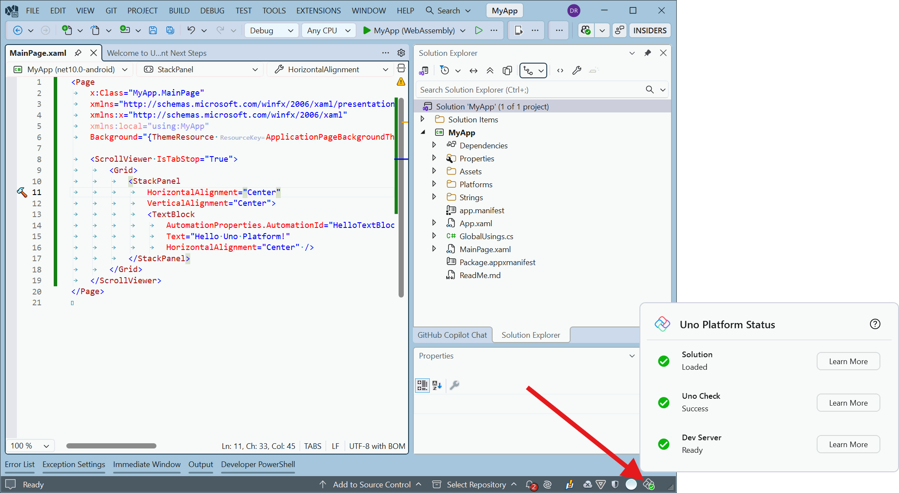
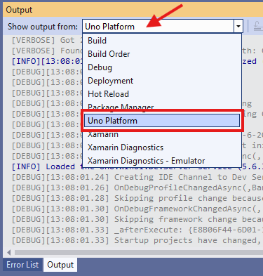

# Uno Platform Status

The Uno Platform Status surfaces what Uno Platform is doing behind the scenes when you open a solution in your IDE. It provides clear, real-time feedback so you know when everything is ready to run, and highlights issues early to avoid blocking your development flow.

## What it does

- Communicates environment checks and setup steps (e.g. detecting Uno packages, waiting for restore)
- Shows readiness so you can confidently start your app
- Reports problems with actionable guidance so you can fix them quickly

## When it appears

The Uno Platform Status appears as soon as you install the Uno extension in your IDE and open a solution:

- Visual Studio: https://platform.uno/visual-studio/
- Rider: https://platform.uno/rider/
- Visual Studio Code: https://platform.uno/vscode/

> [!NOTE]
> The Uno Platform Status can also appear for non-Uno solutions. This helps you troubleshoot when you expected Uno packages to be present but they were not detected.

## NuGet

To ensure consistency, the Uno tooling aligns itself with the package versions referenced by your solution. The IDE extension waits for NuGet restore to complete before enabling Uno features.

- If NuGet restore is still running or fails, Uno features will remain disabled until restore succeeds.
- Resolve any restore errors first; then the panel updates automatically when ready.

> [!TIP]
> If restore takes longer than expected, check your network connectivity and any corporate proxy settings, then retry restore from your IDE.

## Typical statuses you may see

- Checking environment: scanning the solution and active projects
- Waiting for NuGet restore: enabling features after packages are restored
- Ready: all checks passed, you can start the app
- Warning or Error: details and suggested actions are provided

## Troubleshooting

### [**Visual Studio 2022**](#tab/vswints)

- The Output window in Visual Studio includes an output category named `Uno Platform - Dev Environment`. Diagnostic messages from the Uno Platform VS extension appear there. To enable logging, set MSBuild project build output verbosity to at least "Normal" (above "Minimal"). These changes should take effect immediately without a restart; if you do not see additional logs, try restarting Visual Studio. For more details on build log verbosity, refer to the official Visual Studio documentation.

    If you need to share logs when opening an issue on the GitHub Uno Platform repository, set verbosity to Diagnostic to provide the most detailed logs for investigation.

    Steps to change MSBuild output verbosity:
    1. Open Tools > Options > Projects and Solutions > Build and Run, then set MSBuild output verbosity to Diagnostic or the required level.

       
    2. Restart Visual Studio, re-open your solution, and wait a few seconds.
    3. Go to View > Output.
    4. In the Output window, select `Uno Platform - Dev Environment` from the drop-down.

       

## Quick checks

- NuGet restore completed successfully (no errors in Package Manager or Build output)
- Uno Platform packages referenced by the projects you expect to use Uno
- Visual Studio/MSBuild output verbosity set high enough to see diagnostic logs when needed
- If the panel reports an action (e.g., retry restore or open logs), follow it and re-check the status
