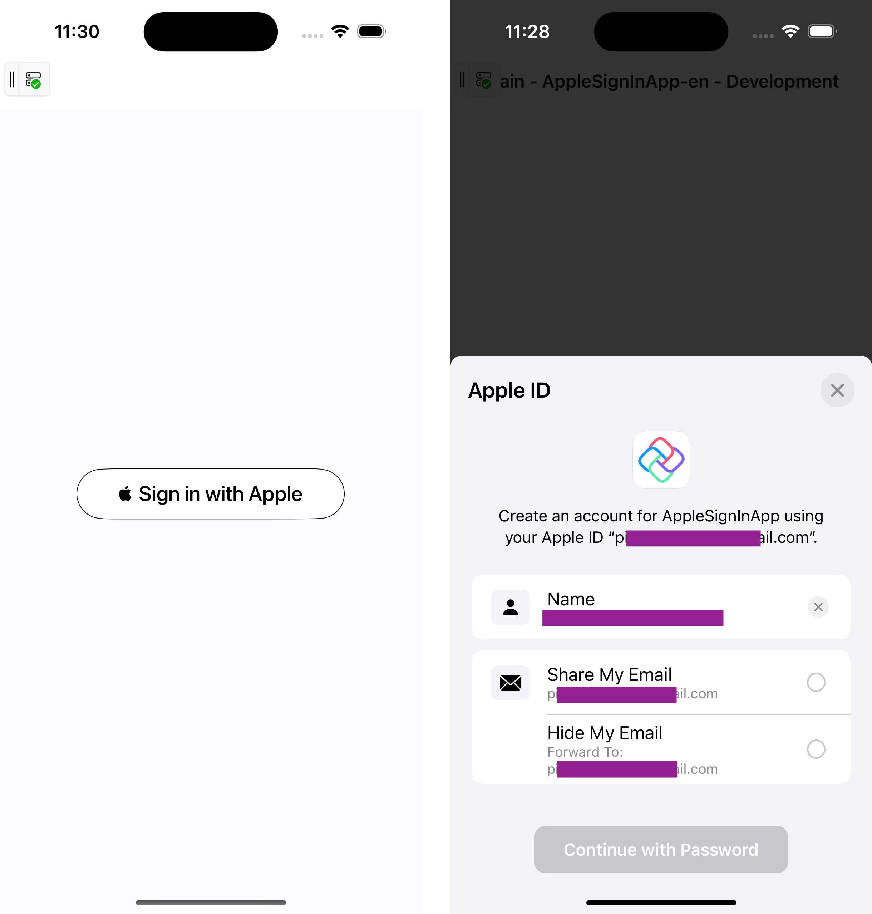

# Apple Sign-In Button with MAUI Embedding in Uno

In Uno Platform projects, implementing a "Sign in with Apple" Button is possible through MAUI embedding (more on which in our [Overview](xref:Uno.Extensions.Maui.Overview)). Below is a simple example of how you can add the Apple Sign-In Button to your project. We will inject it into the visual tree from the code-behind and handle the authorization using Apple's Authentication Services.



## General Usage

1. Activate the Apple Sign-In Capability:

   - If you are using Visual Studio, open the `Entitlements.plist` file and locate the "Sign In With Apple" checkbox. After checking it, ensure you save your changes.
   - Alternatively, you can open the `Entitlements.plist` file in any text editor and add the following within the `<dict>` tag:

   ```xml
   <key>com.apple.developer.applesignin</key>
   <array>
       <string>Default</string>
   </array>
   ```

2. Import Necessary Namespaces:

   ```csharp
   using AuthenticationServices;
   using Foundation;
   using UIKit;
   ```

3. In the constructor of your Page or control, create the Apple Sign-In Button:

   > [!Important]
   > Ensure that you wrap platform-specific code in `#if __IOS__` directives. For more details, refer to the [Platform-specific C# documentation](xref:Uno.Development.PlatformSpecificCSharp).

   ```csharp
   var appleSignInButton = new ASAuthorizationAppleIdButton(ASAuthorizationAppleIdButtonType.Default, ASAuthorizationAppleIdButtonStyle.WhiteOutline);
   appleSignInButton.TouchUpInside += HandleAuthorizationAppleIDButtonPress;
   appleSignInButton.CornerRadius = 50;

   // Retain the delegate to prevent garbage collection
   _appleSignInDelegate = new AuthorizationControllerDelegate(this);
   ```

   > [!NOTE]
   > It's important to retain a reference to the delegate (`_appleSignInDelegate`) to avoid garbage collection issues. This ensures that the authorization process is completed without interruption.

4. Inject the Apple Sign-In button into the visual tree using `VisualTreeHelper.AdaptNative`:

   ```csharp
   var adaptedAppleButton = VisualTreeHelper.AdaptNative(appleSignInButton);
   var borderWrapper = new Border
   {
       MinHeight = 50,
       MinWidth = 250,
       HorizontalAlignment = HorizontalAlignment.Center,
       Child = adaptedAppleButton,
   };

   m_MainStackPanel.Children.Add(borderWrapper);
   ```

5. Handle the button's `TouchUpInside` event to initiate Apple Sign-In:

   ```csharp
   private void HandleAuthorizationAppleIDButtonPress(object sender, EventArgs e)
   {
       var appleIDProvider = new ASAuthorizationAppleIdProvider();
       var request = appleIDProvider.CreateRequest();
       request.RequestedScopes = new[] { ASAuthorizationScope.FullName, ASAuthorizationScope.Email };

       var authorizationController = new ASAuthorizationController(new ASAuthorizationRequest[] { request });
       authorizationController.Delegate = _appleSignInDelegate;  // Use the retained delegate
       authorizationController.PresentationContextProvider = new PresentationContextProvider();  // Set the presentation context provider
       authorizationController.PerformRequests();
   }
   ```

## Custom Delegate for Authorization

To handle the result of the sign-in process, create a custom delegate:

```csharp
public class AuthorizationControllerDelegate : ASAuthorizationControllerDelegate
{
    private readonly MyUserControl _parent;

    public AuthorizationControllerDelegate(MyUserControl parent)
    {
        _parent = parent;
    }

    public override void DidComplete(ASAuthorizationController controller, ASAuthorization authorization)
    {
        System.Diagnostics.Debug.WriteLine("Authorization successful.");

        try
        {
            var appleIdCredential = authorization.GetCredential<ASAuthorizationAppleIdCredential>();

            var userIdentifier = appleIdCredential?.User;
            // Handle successful authorization, retrieve user details
        }
        catch (Exception ex)
        {
            System.Diagnostics.Debug.WriteLine($"Authorization failed: {ex.Message}");
        }
    }
}
```

## Managing Delegate in MVVM

If you're using an MVVM architecture, the delegate should handle sign-in logic indirectly by passing the necessary data to the ViewModel. This keeps the code clean and follows MVVM principles. For example:

- Instead of passing the user control (`MyUserControl`) to the `AuthorizationControllerDelegate`, pass a reference to the ViewModel or a dedicated service.
- In the delegate, you can call methods on the ViewModel to handle the authorization flow, such as storing user information or navigating to another page.

Example:

```csharp
public class AuthorizationControllerDelegate : ASAuthorizationControllerDelegate
{
    private readonly MyViewModel _viewModel;

    public AuthorizationControllerDelegate(MyViewModel viewModel)
    {
        _viewModel = viewModel;
    }

    public override void DidComplete(ASAuthorizationController controller, ASAuthorization authorization)
    {
        System.Diagnostics.Debug.WriteLine("Authorization successful.");

        try
        {
            var appleIdCredential = authorization.GetCredential<ASAuthorizationAppleIdCredential>();
            var userIdentifier = appleIdCredential?.User;

            // Pass the user info to the ViewModel for further processing
            _viewModel.HandleSuccessfulAuthorization(userIdentifier);
        }
        catch (Exception ex)
        {
            System.Diagnostics.Debug.WriteLine($"Authorization failed: {ex.Message}");
        }
    }
}
```

## Presentation Context Provider

For proper handling of the presentation context on iOS, implement a `PresentationContextProvider`:

```csharp
public class PresentationContextProvider : NSObject, IASAuthorizationControllerPresentationContextProviding
{
    public UIWindow GetPresentationAnchor(ASAuthorizationController controller)
    {
        return UIApplication.SharedApplication.KeyWindow;
    }
}
```

## More Resources

For more details on platform-specific considerations or to improve the user experience:

- [Apple Sign-In Documentation](https://developer.apple.com/documentation/authenticationservices/implementing_user_authentication_with_sign_in_with_apple)
- [MSAL.NET Authentication with Uno](xref:Uno.Interop.MSAL)
