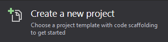
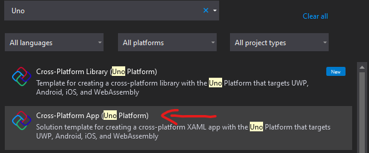
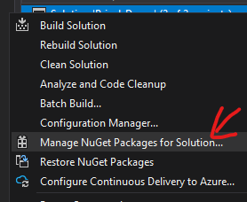
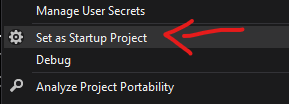
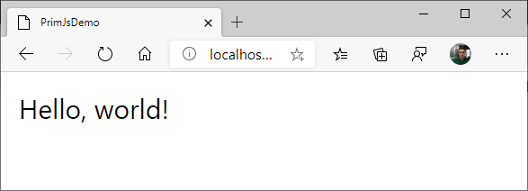
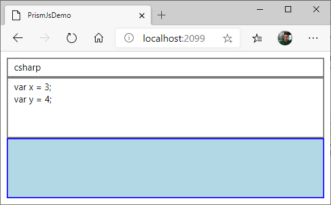
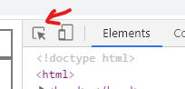
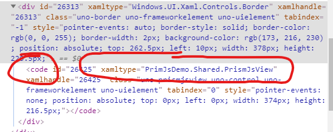
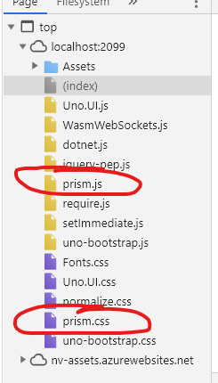
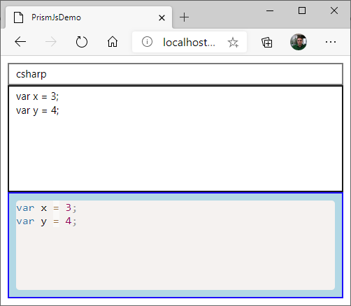

# Embedding Existing JavaScript Components Into Uno-WASM - Part 2

Let's create an app to integrate a Syntax Highlighter named [`PrismJS`](https://prismjs.com/). This library is simple and is self-contained - there's no external dependencies.

## Integration of PrismJS in a project

### 0. Before starting

📝 To reproduce the code in this article, you must [prepare development environment using Uno's _Getting Started_ article](https://platform.uno/docs/articles/get-started.html).

### 1. Create the projects

🎯 This section is very similar to the [Creating an app - Tutorial](https://platform.uno/docs/articles/getting-started-tutorial-1.html) in the official documentation.

1. Start **Visual Studio 2019**
2. Click `Create a new project`

   
3. **Search for "Uno"** and pick `Uno Platform App`.

   
   Select it and click `Next`.
4. Give a project name and folder as you wish. It will be named `PrismJsDemo` here.
5. Click `Create` button.
6. Right-click on the solution and pick `Manage NuGet Packages for Solution...`

   
7. Update to latest version of `Uno` dependencies. **DO NOT UPDATE THE `Microsoft.Extensions.Logging` dependencies** to latest versions.

   > This step of upgrading is not absolutely required, but it's a good practice to start a project with the latest version of the library.
8. Right-click on the `.Wasm` project in the _Solution Explorer_ and pick `Set as Startup Project`.

   

   > Note: this article will concentrate on build Wasm-only code, so it won't compile on other platforms' projects.
9. Press `CTRL-F5`. App should compile and start a browser session showing this:
   

   > Note: when compiling using Uno platform the first time, it could take some time to download the latest .NET for WebAssembly SDK into a temporary folder.
   >
### 2. Create a control in managed code

🎯  In this section, a control named `PrismJsView` is created in code and used in the XAML page (`MainPage.xaml`) to present it.

1. From the `[MyApp]` project, create a new class file named `PrismJsView.cs`. and copy the following code:

   ```csharp
   using System;
   using System.Collections.Generic;
   using System.Text;
   using Windows.UI.Xaml;
   using Windows.UI.Xaml.Controls;
   using Windows.UI.Xaml.Markup;
   using Uno.Foundation;
   using Uno.UI.Runtime.WebAssembly;
   
   namespace PrismJsDemo.Shared
   {
       [ContentProperty(Name = "Code")]
       [HtmlElement("code")] // PrismJS requires a <code> element
       public class PrismJsView : Control
       {
           // *************************
           // * Dependency Properties *
           // *************************
           public static readonly DependencyProperty CodeProperty = DependencyProperty.Register(
               "Code",
               typeof(string),
               typeof(PrismJsView),
               new PropertyMetadata(default(string), CodeChanged));
   
           public string Code
           {
               get => (string)GetValue(CodeProperty);
               set => SetValue(CodeProperty, value);
           }
   
           public static readonly DependencyProperty LanguageProperty = DependencyProperty.Register(
               "Language",
               typeof(string),
               typeof(PrismJsView),
               new PropertyMetadata(default(string), LanguageChanged));
   
           public string Language
           {
               get => (string)GetValue(LanguageProperty);
               set => SetValue(LanguageProperty, value);
           }
   
           // ***************
           // * Constructor *
           // ***************
           public PrismJsView()
           {
               // Any HTML initialization here
           }
   
           // ******************************
           // * Property Changed Callbacks *
           // ******************************
           private static void CodeChanged(DependencyObject dependencyobject, DependencyPropertyChangedEventArgs args)
           {
               // TODO: generate HTML using PrismJS here
           }
   
           private static void LanguageChanged(DependencyObject dependencyobject, DependencyPropertyChangedEventArgs args)
           {
               // TODO: generate HTML using PrismJS here
           }
       }
   }
   ```

   This will define a control having 2 properties, one code `Code` and another one for `Language`.
2. Change the `MainPage.xaml` file to the following content:

   ```xml
   <Page
       x:Class="PrismJsDemo.MainPage"
       xmlns="http://schemas.microsoft.com/winfx/2006/xaml/presentation"
       xmlns:x="http://schemas.microsoft.com/winfx/2006/xaml"
       xmlns:local="using:PrismJsDemo"
       xmlns:d="http://schemas.microsoft.com/expression/blend/2008"
       xmlns:mc="http://schemas.openxmlformats.org/markup-compatibility/2006"
       mc:Ignorable="d">
       <Grid Padding="10">
           <Grid.RowDefinitions>
               <RowDefinition Height="Auto" />
               <RowDefinition Height="*" />
               <RowDefinition Height="*" />
           </Grid.RowDefinitions>
           <TextBox x:Name="lang" Text="csharp" Grid.Row="0" />
           <TextBox x:Name="code" Text="var x = 3;&#xA;var y = 4;" AcceptsReturn="True" VerticalAlignment="Stretch" Grid.Row="1" />
           <Border BorderBrush="Blue" BorderThickness="2" Background="LightBlue" Padding="10" Grid.Row="2">
               <local:PrismJsView Code="{Binding Text, ElementName=code}" Language="{Binding Text, ElementName=lang}"/>
           </Border>
       </Grid>
   </Page>
   ```

3. Press CTRL-F5.  You should see this:

   
4. Press F12 (on Chrome, may vary on other browsers).
5. Click on the first button and select the light-blue part in the app.

   
6. It will bring the DOM explorer to a `xamltype=Windows.UI.Xaml.Controls.Border` node. The `PrismJsView` should be right below after opening it.

   
   The `xamltype="PrismJsDemo.Shared.PrismJsView"`) control is there!

👌 The project is now ready to integrate PrismJS.

### 3. Add JavaScript & CSS files

🎯  In this section, PrismJS files are downloaded from their website and placed as assets in the app.

1. Go to this link: https://prismjs.com/download.html
2. Choose desired Themes & Languages (`Default` theme + all languages is used for the demo)
3. Press the `DOWNLOAD JS` button and put the `prism.js` file in the `WasmScripts` folder of the `.Wasm` project.

   > Putting the `.js` file in this folder will instruct the Uno Wasm Bootstrapper to automatically load the JavaScript file during startup.
4. Press the `DOWNLOAD CSS` button and put the `prism.css` file in the `WasmCSS` folder of the `.Wasm` project.

   > Putting the `.css` file in this folder will instruct the Uno Wasm Bootstrapper to automatically inject a `<link>` HTML instruction in the resulting `index.html` file to load it with the browser.
5. Right-click on the `.Wasm` project node in the Solution Explorer, and pick `Edit Project File` (it can also work by just selecting the project, if the `Preview Selected Item` option is activated).
6. Insert this in the appropriate `<ItemGroup>`:

   ```xml
   <ItemGroup>
     <EmbeddedResource Include="WasmCSS\Fonts.css" />
     <EmbeddedResource Include="WasmCSS\prism.css" /> <!-- This is new -->
     <EmbeddedResource Include="WasmScripts\AppManifest.js" />
     <EmbeddedResource Include="WasmScripts\prism.js" /> <!-- This one too -->
   </ItemGroup>
   ```

   > For the Uno Wasm Bootstrapper to take those files automatically and load them with the application, they have to be put as embedded resources. A future version of Uno may remove this requirement.
7. Compile & run
8. Once loaded, press F12 and go into the `Sources` tab. Both `prism.js` & `prism.css` files should be loaded this time.

   

### 4. Invoke JavaScript from Managed Code

🎯  In this section, PrismJS is used from the app.

1. First, there is a requirement for _PrismJS_ to set the  `white-space` style at a specific value, as [documented here](https://github.com/PrismJS/prism/issues/1237#issuecomment-369846817). An easy way to do this is to set in directly in the constructor like this:

   ``` csharp
   public PrismJsView()
   {
       // This is required to set to <code> style for PrismJS to works well
       // https://github.com/PrismJS/prism/issues/1237#issuecomment-369846817
       this.SetCssStyle("white-space", "pre-wrap");
   }
   ```

2. Now, we need to create an `UpdateDisplay()` method, used to generate HTML each time there's a new version to update. Here's the code for the method to add in the `PrismJsView` class:

   ``` csharp
   private void UpdateDisplay(string oldLanguage = null, string newLanguage = null)
   {
       string javascript = $@"
           (function(){{
               // Prepare Prism parameters
               const code = ""{WebAssemblyRuntime.EscapeJs(Code)}"";
               const oldLanguageCss = ""language-{WebAssemblyRuntime.EscapeJs(oldLanguage)}"";
               const newLanguageCss = ""language-{WebAssemblyRuntime.EscapeJs(newLanguage)}"";
               const language = ""{WebAssemblyRuntime.EscapeJs(newLanguage ?? Language)}"";
               // Process code to get highlighted HTML
               const prism = window.Prism;
               let html = code;
               if(prism.languages[language]) {{
                   // When the specified language is supported by PrismJS...
                   html = prism.highlight(code, prism.languages[language], language);
               }}
   
      // Display result
               element.innerHTML = html;
               // Set CSS classes, when required
               if(oldLanguageCss) {{
                   element.classList.remove(oldLanguageCss);
               }}
               if(newLanguageCss) {{
                   element.classList.add(newLanguageCss);
               }}
           }})();";
       this.ExecuteJavascript(javascript);
   }
   ```

3. Change `CodeChanged()` and `LanguageChanged()` to call the new `UpdateDisplay()` method:

   ``` csharp
   private static void CodeChanged(DependencyObject dependencyobject, DependencyPropertyChangedEventArgs args)
   {
       (dependencyobject as PrismJsView)?.UpdateDisplay();
   }
   private static void LanguageChanged(DependencyObject dependencyobject, DependencyPropertyChangedEventArgs args)
   {
       (dependencyobject as PrismJsView)?.UpdateDisplay(args.OldValue as string, args.NewValue as string);
   }
   ```

4. We also need to update the result when the control is loaded in the DOM. So we need to change the constructor again like this:

   ``` csharp
   public PrismJsView()
   {
       // This is required to set to <code> style for PrismJS to works well
       // https://github.com/PrismJS/prism/issues/1237#issuecomment-369846817
       this.SetCssStyle("white-space", "pre-wrap");
       // Update the display when the element is loaded in the DOM
       Loaded += (snd, evt) => UpdateDisplay(newLanguage: Language);
   }
   ```

5. Compile & run. It should work like this:

   

## 🔬 Going further

This sample is a very simple integration as there is no _callback_ from HTML to managed code and _PrismJS_ is a self-contained framework (it does not download any other JavaScript dependencies).
Some additional improvements can be done to make the code more production ready:

* **Make the control multi-platform**. A simple way would be to use a WebView on other platforms, giving the exact same text-rendering framework everywhere. The code of this sample won't compile on other targets.
* **Create script files instead of generating dynamic JavaScript**. That would have the advantage of improving performance and make it easier to debug the code. A few projects are also using TypeScript to generate JavaScript. This approach is done by Uno itself for the `Uno.UI.Wasm` project: https://github.com/unoplatform/uno/blob/master/src/Uno.UI/Uno.UI.Wasm.csproj.
* **Support more PrismJS features**. There are many [_plugins_ for PrismJS](https://prismjs.com/#plugins) that can be used. Most of them are very easy to implement.
* [Continue with Part 3](wasm-javascript-3.md) - an integration of a more complex library with callbacks to application.
