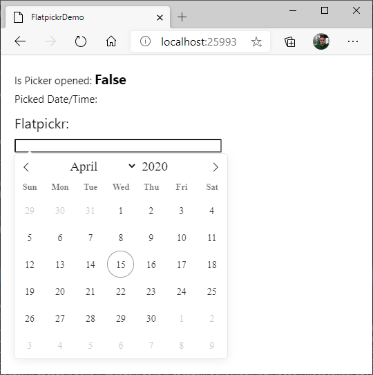
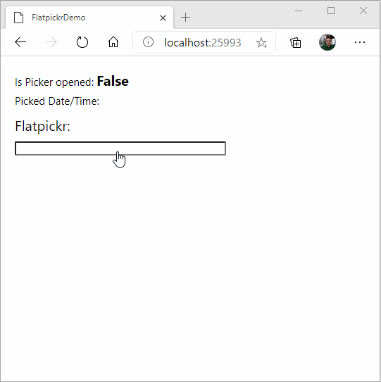

# Embedding Existing JavaScript Components Into Uno-WASM - Part 3

In the previous article, we used a simple _syntax highlighter_ to enhance the display of text in HTML. It may not be enough for some apps: it's often required for JavaScript components to call back into the C# side of the application. The easiest way to do that in Uno for WebAssembly is by using [_DOM Events_](https://developer.mozilla.org/docs/Web/Guide/Events/Creating_and_triggering_events). Uno Platform apps can [consume DOM Events](xref:Uno.Interop.WasmJavaScript1l) very easily.

Let's create an application using this feature.

## Integration of Flatpickr - Callback to app from JavaScript

📝 [Flatpickr](https://flatpickr.js.org/) is a lightweight, self-contained date and time picker. It is an easy way to explore how JavaScript-side code can call back to the managed application using a `CustomEvent`. In this case, this will be used to report when the picker is opened and a date and time was picked.

### 0. Before starting

📝 To reproduce the code in this article, you must [prepare a development environment using Uno's _Getting Started_ article](xref:Uno.GetStarted).

### 1. Create the solution in Visual Studio

📝 This part is very short because it is similar to the previous article ([part 2](wasm-javascript-2.md)):

1. Create a `Uno Platform App` project and name it `FlatpickrDemo`.
1. Compile & Run to make sure everything works.

### 2. Inject Flatpickr from CDN

🎯 This section is using a CDN to get Flatpickr instead of hosting the JavaScript directly in the application. It is not always the best solution as it creates a dependency on the Internet availability. Any change made server-side could break the application.

An easy way to achieve this is to add JavaScript code to load the CSS file directly from the CDN. The JavaScript portion of Flatpickr will be lazy-loaded with the control later.

Create a new _JavaScript_ file `flatpickrloader.js` in the `Platforms/WebAssembly/WasmScripts` folder of the project:

   ```javascript
   (function () {
       const head = document.getElementsByTagName("head")[0];

       // Load Flatpickr CSS from CDN
       const link = document.createElement("link");
       link.rel = "stylesheet";
       link.href = "https://cdn.jsdelivr.net/npm/flatpickr/dist/flatpickr.min.css";
       head.appendChild(link);
   })();
   ```

   This will load the Flatpickr assets directly from CDN.

### 3. Uno controls and XAML

🎯 This section is creating a control used in the XAML. It will activate `Flatpickr` on the control's `<input>` element.

1. Create a `FlatpickrView.cs` class in the `[MyApp]` project like this:

    ```csharp
    using Uno.UI.NativeElementHosting;

    namespace FlatpickrDemo;

    public class FlatpickrView : ContentControl
    {
        private BrowserHtmlElement? _element;

        // *************************
        // * Dependency Properties *
        // *************************
        public static readonly DependencyProperty SelectedDateTimeProperty = DependencyProperty.Register(
            nameof(SelectedDateTime), typeof(DateTimeOffset?), typeof(FlatpickrView), new PropertyMetadata(default(DateTimeOffset?)));

        public DateTimeOffset? SelectedDateTime
        {
            get => (DateTimeOffset)GetValue(SelectedDateTimeProperty);
            set => SetValue(SelectedDateTimeProperty, value);
        }

        public static readonly DependencyProperty IsPickerOpenedProperty = DependencyProperty.Register(
            nameof(IsPickerOpened), typeof(bool), typeof(FlatpickrView), new PropertyMetadata(false));

        public bool IsPickerOpened
        {
            get => (bool)GetValue(IsPickerOpenedProperty);
            set => SetValue(IsPickerOpenedProperty, value);
        }

        // ***************
        // * Constructor *
        // ***************
        public FlatpickrView()
        {
            if (OperatingSystem.IsBrowser())
            {
                _element = BrowserHtmlElement.CreateHtmlElement("input");
                Content = _element;
            }
            else
            {
                Content = "Only supported on WebAssembly";
            }

            // Load Flatpickr using JavaScript
            LoadJavaScript();
        }

        // ******************
        // * Initialization *
        // ******************
        private void LoadJavaScript()
        {
            // For demo purposes, Flatpickr is loaded directly from CDN.
            // Uno Platform uses AMD module loading, so you must give a callback when the resource is loaded.
            // We can access the corresponding DOM HTML Element by using the "element" variable available in the scope
            var javascript = $@"require([""https://cdn.jsdelivr.net/npm/flatpickr""], f => f(element));";

            _element?.ExecuteJavascript(javascript);
        }

        // ******************
        // * Event Handlers *
        // ******************
    }
    ```

2. Change the `MainPage.xaml` in the `[MyApp]` project like this:

   ```xml
   <Page
       x:Class="FlatpickrDemo.MainPage"
       xmlns="http://schemas.microsoft.com/winfx/2006/xaml/presentation"
       xmlns:x="http://schemas.microsoft.com/winfx/2006/xaml"
       xmlns:local="using:FlatpickrDemo"
       xmlns:d="http://schemas.microsoft.com/expression/blend/2008"
       xmlns:mc="http://schemas.openxmlformats.org/markup-compatibility/2006"
       mc:Ignorable="d"
       Background="{ThemeResource ApplicationPageBackgroundThemeBrush}">
   
       <StackPanel Spacing="10" Padding="20">
         <TextBlock FontSize="15">
        Is Picker opened: <Run FontSize="20" FontWeight="Bold" Text="{Binding IsPickerOpened, ElementName=picker}" />
            <LineBreak />Picked Date/Time: <Run FontSize="20" FontWeight="Bold" Text="{Binding SelectedDateTime, ElementName=picker}" />
         </TextBlock>
         <TextBlock FontSize="20">Flatpickr control:</TextBlock>
   
         <local:FlatpickrView Height="20" Width="300"  x:Name="picker" HorizontalAlignment="Left" />
       </StackPanel>
   </Page>
   ```

3. After pressing CTRL-F5, after clicking on the `<input>` rectangle, this should appear:

   

📝 Almost there, still need to _call back_ to the managed code portion of the application.

### 4. Add a way to call managed code from JavaScript

🎯 This section will use `CustomEvent` to route Flatpickr's events to managed code.

1. Register event handlers for 2 custom events: `DateChanged` and `OpenedStateChanged`. To achieve this, put this code at the end of the `FlatpickrView` constructor:

    ```csharp
    // Register event handler for events from the DOM
    _element.RegisterHtmlEventHandler("DateChanged", OnDateChanged);
    _element.RegisterHtmlEventHandler("OpenedStateChanged", OnOpenedStateChanged);
    ```

2. Add the implementation for the two handlers in the class:

    ```csharp
    private void OnDateChanged(object sender, JSObject e)
    {
        if (DateTimeOffset.TryParse(e.GetPropertyAsString("detail"), DateTimeFormatInfo.InvariantInfo, DateTimeStyles.AssumeLocal, out var dto))
        {
            SelectedDateTime = dto;
        }
    }

    private void OnOpenedStateChanged(object sender, JSObject e)
    {
        switch (e.GetPropertyAsString("detail"))
        {
            case "open":
                IsPickerOpened = true;
                break;
            case "closed":
                IsPickerOpened = false;
                break;
        }
    }
    ```

3. Change the initialization of `Flatpickr` in injected JavaScript to raise events. Change the implementation of the `OnLoaded` method to this instead:

   ```csharp
   private void LoadJavaScript()
   {
       // For demo purposes, Flatpickr is loaded directly from CDN.
       // Uno uses AMD module loading, so you must give a callback when the resource is loaded.
       // We can access the corresponding DOM HTML Element by using the "element" variable available in the scope
       var javascript = $@"require([""https://cdn.jsdelivr.net/npm/flatpickr""], f => {{
           // Route Flatpickr events following Uno's documentation
           // https://platform.uno/docs/articles/wasm-custom-events.html
           const options = {{
               onChange: (dates, str) => element.dispatchEvent(new CustomEvent(""DateChanged"", {{detail: str}})),
               onOpen: () => element.dispatchEvent(new CustomEvent(""OpenedStateChanged"", {{detail: ""open""}})),
               onClose: () => element.dispatchEvent(new CustomEvent(""OpenedStateChanged"", {{detail: ""closed""}}))
            }};
   
            // Instantiate Flatpickr on the element
            f(element, options);
       }});";
   
       this.ExecuteJavascript(javascript);
   }
   ```

4. Compile & Run. Here's the result:

   

### Troubleshooting

If your JavaScript integration is not behaving properly, you can troubleshoot with hints below.

#### My JavaScript control does not accept pointer input

When using the WebAssembly Native renderer, in the constructor of your wrapper control, add the following:

```csharp
// XAML behavior: a non-null background is required on an element to be "visible to pointers".
// Uno reproduces this behavior, so we must set it here even if we're not using the background.
// Not doing this will lead to a `pointer-events: none` CSS style on the control.
Background = new SolidColorBrush(Colors.Transparent);
```

#### `TextBlock` content is not visible in browsers with the dark theme

`TextBlock` defaults the text color as White correctly but `Page` background needs to be set correctly.

```xml
<Page 
    ...
    Background="{ThemeResource ApplicationPageBackgroundThemeBrush}">
```

## 🔬 Going further

This article illustrates how to integrate external assets (JavaScript and css files) and how to leverage JavaScript's `CustomEvent` in an Uno application.

More steps could be done to make the code production ready:

* **Make the control multi-platform**. Many date/time pickers exist on all platforms. It should be easy on other platforms to connect the same control to another great date picker native to the platform - no need to embed a WebView for this on other platforms.
* **Create script files instead of generating dynamic JavaScript**. As in previous article, this would have the advantage of improving performance and increase the ability to debug it.
* **Support more Flatpickr features**. There are a [lot of features in Flatpickr](https://flatpickr.js.org/examples/) you can leverage to make a perfect versatile control.
