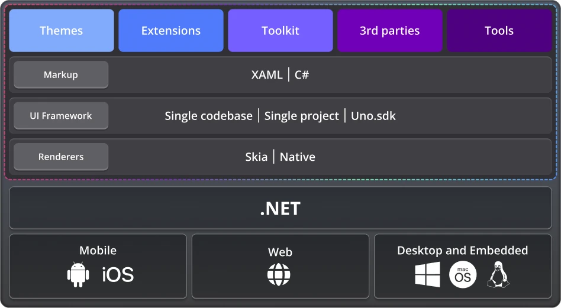

# Uno Platform Documentation

<!-- markdownlint-disable MD001 -->

Uno Platform is an open-source .NET platform for building single codebase native mobile, web, desktop, and embedded apps quickly.

 

<!-- Get Started -->

<a href="get-started.md">

#### Get Started

Set up with your OS and IDE of choice.

</a>

<!-- How-tos and Tutorials -->

<a href="samples-tutorials-overview.md">

#### How-tos and Tutorials

Four complete tutorials and hundreds of real-world samples.

</a>

<!-- Developing with Uno Platform -->

<a href="using-uno-ui.md">

#### Developing with Uno Platform

Learn the principles of cross-platform development with Uno.

</a>

<!-- C# Markup -->

<a href="xref:Uno.Extensions.Markup.Overview">

#### C# Markup

Write UI using C# instead of XAML

</a>

<!-- MVUX -->

<a href="xref:Uno.Extensions.Mvux.Overview">

#### MVUX

Reactive programming with Uno Platform

</a>

<!-- Uno Toolkit -->

<a href="xref:Toolkit.GettingStarted">

#### Uno Toolkit

Include new advanced UI controls

</a>

<!-- Uno Platform Studio -->

<a href="xref:Uno.Platform.Studio.Overview">

#### Uno Platform Studio

Boost productivity with Hot Design®, Hot Reload, and Design-to-Code

</a>

<!-- Figma -->

<a href="xref:Uno.Figma.GetStarted">

#### Figma

Design your app in Figma and easily import to XAML or C#

</a>

<!-- Uno Themes -->

<a href="external/uno.themes/doc/themes-overview.md">

#### Uno Themes

Use Material theme in your app

</a>

<!-- Uno Extensions -->

<a href="external/uno.extensions/doc/ExtensionsOverview.md">

#### Uno Extensions

Include large building blocks to complete your app faster

</a>

<!-- API Reference -->

<a href="implemented-views.md">

#### API Reference

Browse the set of available controls and their properties.

</a>

 

## High level architecture

Uno Platform's application API is compatible with Microsoft's [WinUI 3 API](https://learn.microsoft.com/windows/apps/winui/winui3/). In fact, when your application runs on Windows, it's just an ordinary WinUI 3/WinAppSDK application.

This means that existing WinUI code is compatible with Uno Platform. Existing WinUI libraries can be recompiled for use in Uno Platform applications. A number of [3rd-party libraries](xref:Uno.Development.SupportedLibraries) have been ported to Uno Platform.

Uno Platform is pixel-perfect by design, delivering consistent visuals on every platform. At the same time, it can either use the [native UI framework](xref:uno.features.renderer.native) on some target platforms or use a [Skia-based rendering](xref:uno.features.renderer.skia) approach, while making it easy to [integrate native views](xref:Uno.Development.NativeViews) and tap into native platform features.

Learn more about [how Uno Platform works](xref:Uno.Development.HowItWorks).

## Next Steps

Once you've gone through our [Get Started](get-started.md) guides, please visit our [GitHub Discussions](https://github.com/unoplatform/uno/discussions) where our team and community will be able to help you.
 
 

---
