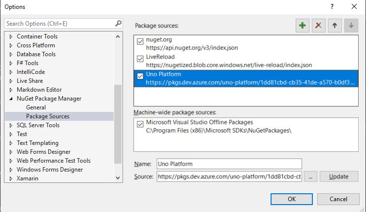

# Using Material Design with Uno

[Material](https://material.io/design/introduction) is a cross-platform design system for created by Google.

Uno has created a [library](https://github.com/unoplatform/Uno.Material) to allow developers to easily implement the material design system in all Uno supported platforms.

## Getting Started

#### Installing `Uno.Material` Nuget Package
1. In Visual Studio, navigate to Tools > Nuget Package Manager > Package Manager Settings > Package Sources
2. Connect to the [Uno Feed](https://dev.azure.com/uno-platform/Uno%20Platform/_packaging?_a=connect&feed=unoplatformdev) and set as a new Nuget source.

3. Back in the Nuget Package Manager set your Nuget source to the Uno Nuget source and install Uno.Material on all platforms

#### Adding a Color Palette
The default color palette is set to the Uno theme. To modify to your preferred colors, we recommend you create a `Color.xaml` `ResourceDictionary`.

1. Add a new `ResourceDictionary` to your Shared Project
2. Create a new `ThemeDictionaries` collection
3. Add colors

Example of Dark and Light themes using a `ResourceDictionary`

``` xaml
<ResourceDictionary
    xmlns="http://schemas.microsoft.com/winfx/2006/xaml/presentation" 
    xmlns:x="http://schemas.microsoft.com/winfx/2006/xaml"
    xmlns:local="using:Uno.Material.Samples.Shared.Content">

	<ResourceDictionary.ThemeDictionaries>
		<!-- Light Theme -->
		<ResourceDictionary x:Key="Light">
			<Color x:Key="PrimaryColor">#5B4CF5</Color>
			<Color x:Key="PrimaryVariantDarkColor">#353FE5</Color>
			<Color x:Key="PrimaryVariantLightColor">#B6A8FB</Color>
			<Color x:Key="SecondaryColor">#67E5AD</Color>
			<Color x:Key="SecondaryVariantDarkColor">#2BB27E</Color>
			<Color x:Key="SecondaryVariantLightColor">#9CFFDF</Color>
			<Color x:Key="BackgroundColor">#FFFFFF</Color>
			<Color x:Key="SurfaceColor">#FFFFFF</Color>
			<Color x:Key="ErrorColor">#F85977</Color>
			<Color x:Key="OnPrimaryColor">#FFFFFF</Color>
			<Color x:Key="OnSecondaryColor">#000000</Color>
			<Color x:Key="OnBackgroundColor">#000000</Color>
			<Color x:Key="OnSurfaceColor">#000000</Color>
			<Color x:Key="OnErrorColor">#000000</Color>
			<Color x:Key="OverlayColor">#51000000</Color>
		</ResourceDictionary>

		<!-- Dark Theme -->
		<ResourceDictionary x:Key="Dark">
			<Color x:Key="PrimaryColor">#B6A8FB</Color>
			<Color x:Key="PrimaryVariantDarkColor">#353FE5</Color>
			<Color x:Key="PrimaryVariantLightColor">#D4CBFC</Color>
			<Color x:Key="SecondaryColor">#67E5AD</Color>
			<Color x:Key="SecondaryVariantDarkColor">#2BB27E</Color>
			<Color x:Key="SecondaryVariantLightColor">#9CFFDF</Color>
			<Color x:Key="BackgroundColor">#121212</Color>
			<Color x:Key="SurfaceColor">#121212</Color>
			<Color x:Key="ErrorColor">#CF6679</Color>
			<Color x:Key="OnPrimaryColor">#000000</Color>
			<Color x:Key="OnSecondaryColor">#000000</Color>
			<Color x:Key="OnBackgroundColor">#FFFFFF</Color>
			<Color x:Key="OnSurfaceColor">#DEFFFFFF</Color>
			<Color x:Key="OnErrorColor">#000000</Color>
			<Color x:Key="OverlayColor">#51FFFFFF</Color>
		</ResourceDictionary>
	</ResourceDictionary.ThemeDictionaries>
</ResourceDictionary>
```
4. Add your `ResourceDictionary` as a `MergedDictionary` to your `App.xaml`. This will allow you to have access to the theme throughout your app without having to define it in each view.
``` xaml
<Application x:Class="Uno.Material.Samples.App"
             xmlns="http://schemas.microsoft.com/winfx/2006/xaml/presentation"
             xmlns:x="http://schemas.microsoft.com/winfx/2006/xaml"
             xmlns:material="using:Uno.Material">
    <Application.Resources>
        <ResourceDictionary>
	    <ResourceDictionary.MergedDictionaries>
		<!-- Import all styles from Uno.Material -->
		<material:MaterialLibraryResources />
		<!-- Adjust Path accordingly, this path assumes Colors.xaml is in the same directory as App.xaml -->
		<ResourceDictionary Source="Colors.xaml" />
	    </ResourceDictionary.MergedDictionaries>
	</ResourceDictionary>
    </Application.Resources>
</Application>
```
5. Use your new style in your project
``` xaml
<Button Content="CONTAINED"
	Style="{StaticResource MaterialContainedButtonStyle}"/>
```

6. (Optional) Set `Material` styles as the default across your entire app by setting the implicit style for any particular control in your `App.Xaml`
``` xaml
<Style TargetType="ToggleSwitch"
       BasedOn="{StaticResource MaterialToggleSwitchStyle}"/>
```
7. (Optional) Take it a step further and implement your custom styles across your entire app for a single control-specific resource
``` xaml
<CornerRadius x:Key="ButtonBorderRadius">4</CornerRadius>
```

#### Features

##### Styles for Basic Controls


| **Controls** | **StyleNames** 
|----------|-------------------------------------------------------------------------------------------
| Button   | MaterialContainedButtonStyle <br> MaterialOutlinedButtonStyle <br> MaterialTextButtonStyle <br> MaterialContainedSecondaryButtonStyle <br> MaterialOutlinedSecondaryButtonStyle<br> MaterialTextSecondaryButtonStyle
| CheckBox         | MaterialCheckBoxStyle <br> MaterialSecondaryCheckBoxStyle                         
| ComboBox         | MaterialComboBoxStyle                                                             
| CommandBar       | MaterialCommandBarStyle                                                          
| NavigationView   | MaterialNavigationViewStyle <br> MaterialNoCompactMenuNavigationViewStyle        
| PasswordBox      | MaterialFilledPasswordBoxStyle <br> MaterialOutlinedPasswordBoxStyle              
| RadioButton      | MaterialRadioButtonStyle <br> MaterialSecondaryRadioButtonStyle                   
| TextBlock        | MaterialHeadline1 <br> MaterialHeadline2 <br> MaterialHeadline3 <br> MaterialHeadline4 <br> MaterialHeadline5 <br> MaterialHeadline6 <br> MaterialSubtitle1 <br> MaterialSubtitle2 <br> MaterialBody1 <br> MaterialBody2 <br> MaterialButtonTextBlockStyle <br> MaterialCaption <br> MaterialOverline
| TextBox          | MaterialFilledTextBoxStyle <br> MaterialOutlinedTextBoxStyle                    
| ToggleButton     | MaterialTextToggleButtonStyle                                                     
| ToggleSwitch     | MaterialToggleSwitchStyle                                                         
                                                                               
##### Styles for Custom Controls
| **Controls** | **StyleNames**                                                                        
|----------------------|-------------------------------------------------------------------------------|------------------|
| Card                 | MaterialOutlinedCardStyle <br> MaterialElevatedCardStyle <br> MaterialAvatarOutlinedCardStyle <br> MaterialAvatarElevatedCardStyle <br> MaterialSmallMediaOutlinedCardStyle <br> MaterialSmallMediaElevatedCardStyle
| BottomNavigationBar  | MaterialBottomNavigationBarStyle                                              
