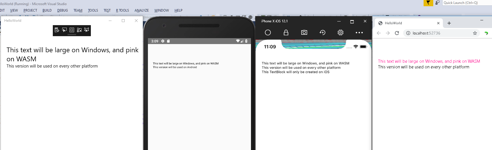

# Platform-specific XAML markup in Uno

Uno Platform allows you to reuse views and business logic across platforms. Sometimes, though, you may want to write different code per platform, either because you need to access platform-specific native APIs and 3rd-party libraries, or because you want your app to look and behave differently depending on the platform.

> [!Video https://www.youtube-nocookie.com/embed/IZt-ymNZpZw]

This guide covers multiple approaches to managing per-platform markup in XAML. See [this guide for managing per-platform C#](xref:Uno.Development.PlatformSpecificCSharp).

## Project structure

There are two ways to restrict code or XAML markup to be used only on a specific platform:

* Use conditionals within a shared file
* Place the code in a file that is only included in the desired target framework.

The structure of an Uno Platform app created with the default [Visual Studio template](https://marketplace.visualstudio.com/items?itemName=unoplatform.uno-platform-addin-2022) is [explained in more detail here](xref:Uno.Development.AppStructure).

## XAML conditional prefixes

The Uno platform uses pre-defined prefixes to include or exclude parts of XAML markup depending on the target framework being used. These prefixes can be applied to XAML objects or to individual object properties.

Conditional prefixes you wish to use in XAML files must be defined at the top of the file, like other XAML prefixes. They can then be applied to any object or property within the body of the file.

For prefixes which will be excluded on Windows (e.g. `android`, `ios`), the actual namespace is arbitrary, since the Uno parser ignores it. The prefix should be put in the `mc:Ignorable` list. For prefixes which will be included on Windows (e.g. `win`, `not_android`) the namespace should be `http://schemas.microsoft.com/winfx/2006/xaml/presentation` and the prefix should not be put in the `mc:Ignorable` list.

### Examples

#### Example 1

Using the following XAML:

```xml
<Page x:Class="HelloWorld.MainPage"
   xmlns="http://schemas.microsoft.com/winfx/2006/xaml/presentation"
   xmlns:x="http://schemas.microsoft.com/winfx/2006/xaml"
   xmlns:android="http://uno.ui/android"
   xmlns:ios="http://uno.ui/ios"
   xmlns:wasm="http://uno.ui/wasm"
   xmlns:win="http://schemas.microsoft.com/winfx/2006/xaml/presentation"
   xmlns:not_android="http://schemas.microsoft.com/winfx/2006/xaml/presentation"
   xmlns:d="http://schemas.microsoft.com/expression/blend/2008"
   xmlns:mc="http://schemas.openxmlformats.org/markup-compatibility/2006"
   mc:Ignorable="d android ios wasm">

 <StackPanel Margin="20,70,0,0">
  <TextBlock Text="This text will be large on Windows, and pink on WASM"
       win:FontSize="24"
       wasm:Foreground="DeepPink"
       TextWrapping="Wrap"/>
  <TextBlock android:Text="This version will be used on Android"
       not_android:Text="This version will be used on every other platform" />
  <ios:TextBlock Text="This TextBlock will only be created on iOS" />
 </StackPanel>
</Page>
```

Results in:



In this example note how the properties `FontSize` and `Foreground` are selectively used based on platform. The `TextBlock` property `Text` also has two different values based on whether or not the app is running in Android. Finally, an entire `TextBlock` is added if the app is running in iOS. This shows:

 1. How certain properties can be used based on the platform
 2. How the values of certain properties can be changed based on the platform
 3. How entire controls can be added or removed for certain platforms

#### Example 2

Platform-specific XAML also allows you to exclude a parent element and all its children. This is especially useful for cases where children are already part of a namespace but need to be excluded on certain platforms.

Consider the following XAML which is using the Windows Community Toolkit's [Blur](https://learn.microsoft.com/windows/communitytoolkit/animations/blur) animation. While this runs for UWP, it is not currently supported in the Uno Platform and needs to be conditionally disabled. It isn't possible to add something like `<win:interactivity:Interaction.Behaviors>` to disable the behavior itself. Instead, the entire `Grid` is disabled on any platforms except Windows and child elements will be disabled along with it.

```xml
<Page x:Class="HelloWorld.MainPage"
   xmlns="http://schemas.microsoft.com/winfx/2006/xaml/presentation"
   xmlns:x="http://schemas.microsoft.com/winfx/2006/xaml"
   xmlns:behaviors="using:Microsoft.Toolkit.Uwp.UI.Animations.Behaviors"
   xmlns:toolkit="using:Microsoft.Toolkit.Uwp.UI.Controls"
   xmlns:interactivity="using:Microsoft.Xaml.Interactivity"
   xmlns:win="http://schemas.microsoft.com/winfx/2006/xaml/presentation"
   xmlns:d="http://schemas.microsoft.com/expression/blend/2008"
   xmlns:mc="http://schemas.openxmlformats.org/markup-compatibility/2006"
   mc:Ignorable="d android ios wasm">

 <Grid>
  <win:Grid Background="Gray">
   <interactivity:Interaction.Behaviors>
    <behaviors:Blur Value="7" Duration="0" Delay="0" AutomaticallyStart="True" />
   </interactivity:Interaction.Behaviors>
  </win:Grid>
  <Grid>
   <!-- Other page content -->
  </Grid>
 </Grid>
</Page>
```

### Available prefixes

A prefix resolves from the **target framework** of the project being compiled. A class library sees the same
prefixes as an application head built for the same target framework, so conditional markup behaves identically in
both.

| Prefix | Target framework | Namespace | Put in `mc:Ignorable`? |
|---|---|---|---|
| `android` | `netX.0-android` | `http://uno.ui/android` | yes |
| `ios` | `netX.0-ios` | `http://uno.ui/ios` | yes |
| `tvos` | `netX.0-tvos` | `http://uno.ui/tvos` | yes |
| `desktop` | `netX.0-desktop` | `http://uno.ui/desktop` | yes |
| `wasm` | `netX.0-browserwasm` | `http://uno.ui/wasm` | yes |
| `winappsdk` | `netX.0-windows10.x` (WinAppSDK) | `http://schemas.microsoft.com/winfx/2006/xaml/presentation` | no |

Each has a negated counterpart — `not_android`, `not_ios`, `not_tvos`, `not_desktop`, `not_wasm`, `not_winappsdk` —
which applies to every target framework the positive one does not. The negated prefixes use the default
presentation namespace and do not need to be listed in `mc:Ignorable`, with the exception of `not_winappsdk`, which
the WinAppSDK XAML compiler cannot resolve.

`win` and `not_win` are the historical spelling of `winappsdk` and `not_winappsdk` and behave identically.

More visually:

| Prefix | `netX.0` | `-android` | `-ios` | `-tvos` | `-desktop` | `-browserwasm` | `-windows10.x` |
|---|---|---|---|---|---|---|---|
| `android` | ✖ | ✔ | ✖ | ✖ | ✖ | ✖ | ✖ |
| `ios` | ✖ | ✖ | ✔ | ✖ | ✖ | ✖ | ✖ |
| `tvos` | ✖ | ✖ | ✖ | ✔ | ✖ | ✖ | ✖ |
| `desktop` | ✖ | ✖ | ✖ | ✖ | ✔ | ✖ | ✖ |
| `wasm` | ✖ | ✖ | ✖ | ✖ | ✖ | ✔ | ✖ |
| `winappsdk` | ✖ | ✖ | ✖ | ✖ | ✖ | ✖ | ✔ |

A project that targets a plain `netX.0` therefore sees no positive prefix at all — only the negated forms. That is
the correct behaviour for a target framework that carries no platform.

> [!NOTE]
> No prefix identifies a drawing backend. `Uno.UI` is compiled once and selects its backend at run time, so the
> backend is not a compile-time condition and cannot be branched on in markup.

### XAML prefixes in cross-targeted libraries

Conditional prefixes work in a class library exactly as they do in an application head, and resolve from the
library's own target framework. A library that multi-targets `netX.0;netX.0-android;netX.0-ios` therefore emits
`android:` markup in its `-android` assembly and `ios:` markup in its `-ios` assembly, and an application head
consumes the assembly matching its own target framework.

A library that targets only `netX.0` has no platform prefix available, because there is no platform in its target
framework. Add the platform target frameworks you need conditional markup for.

> [!NOTE]
> Before Uno Platform 7.0 the platform prefixes did not resolve this way: `android:`, `ios:` and `wasm:` were
> suppressed on every target that rendered with Skia, which by 6.0 was all of them, and a library's
> platform-specific assembly was replaced by its `netX.0` one when consumed by a mobile head. Markup written
> against that behaviour — in particular `not_android:` or `not_ios:` used to mean "everywhere" — now resolves
> differently.

### Specifying namespaces

Specifying CLR namespaces in platform specific XAML namespace can be done as follows:

```xml
<Page x:Class="HelloWorld.MainPage"
   xmlns="http://schemas.microsoft.com/winfx/2006/xaml/presentation"
   ...
   xmlns:android="http://uno.ui/android#using:My.Custom.Namespace1;My.Custom.Namespace2"
   ...
   mc:Ignorable="d android">
 <android:MyCustomType />
```

In this example, types prefixed in the `android` XAML namespace will be looked up in `My.Custom.Namespace1`, `MyCustomNamespace2` then in all the namespaces defined in default namespace `http://schemas.microsoft.com/winfx/2006/xaml/presentation`.

> [!NOTE]
> When using Uno Platform 4.x and in the absence of CLR namespace specification (using the `#using:` prefix), type matching is done through partial name based matching, without using the namespace information. In Uno Platform 4.8, this partial matching can be controlled by the `UnoEnableXamlFuzzyMatching` msbuild property. Uno Platform 5.0 and later will be setting `UnoEnableXamlFuzzyMatching` to `false` by default and will force explicit type matching.

## XAML Conditional Methods

You can use standard WinUI conditional XAML prefixes with Uno Platform, [as documented here](https://learn.microsoft.com/windows/uwp/debug-test-perf/conditional-xaml).

Currently the following conditional methods are supported:

* IsApiContractPresent(ContractName, VersionNumber)
* IsApiContractNotPresent(ContractName, VersionNumber)
* IsTypePresent(ControlType)
* IsTypeNotPresent(ControlType)

### IsApiContractPresent

The following `ContractName` values are currently supported:

* **"Windows.Foundation.UniversalApiContract"**: resolves to `true` if `VersionNumber` is 10 or below, and `false` otherwise.
* **"Uno.WinUI"**: resolves to `true` if the [`Uno.WinUI` NuGet package](updating-to-winui3.md) (ie the WinUI 3 API mapping) is in use, `false` if the `Uno.UI` NuGet package is in use.

All other contract names will resolve to false.

### IsTypePresent

`IsTypePresent()` will resolve to true if the type is found **and** it isn't marked with the `[NotImplemented]` attribute. This is useful for conditionally enabling XAML in a more declarative way, instead of referring to specific platforms.

#### Limitations in cross-targeted libraries

`IsTypePresent()` is resolved at compile time. In a cross-targeted library, this means that for WebAssembly and Skia, it doesn't use the correct implementation status for those platforms, but instead uses the implementation status reported by the 'reference' Uno.UI .NET Standard 2.0 assembly. Therefore it may report an incorrect status for WebAssembly and/or Skia inside of a cross-targeted library.

### Example

The following example uses `IsTypePresent` to use WebView to display content on platforms where it's available, and a custom control to display the content on platforms where WebView isn't supported:

```xml
<Page x:Class="HelloWorld.MainPage"
   xmlns="http://schemas.microsoft.com/winfx/2006/xaml/presentation"
   xmlns:x="http://schemas.microsoft.com/winfx/2006/xaml"
   xmlns:local="using:HelloWorld"
   xmlns:webviewpresent="http://schemas.microsoft.com/winfx/2006/xaml/presentation?IsTypePresent(Windows.UI.Xaml.Controls.WebView)"
   xmlns:webviewnotpresent="http://schemas.microsoft.com/winfx/2006/xaml/presentation?IsTypeNotPresent(Windows.UI.Xaml.Controls.WebView)"
   xmlns:local_webviewnotpresent="using:HelloWorld?IsTypeNotPresent(Windows.UI.Xaml.Controls.WebView)"
   xmlns:d="http://schemas.microsoft.com/expression/blend/2008"
   xmlns:mc="http://schemas.openxmlformats.org/markup-compatibility/2006"
   mc:Ignorable="d">

 <Grid>
  <webviewpresent:WebView Source="{Binding DisplayContent}" />
  <local_webviewnotpresent:WebViewSubstitute ContentSource="{Binding DisplayContent}" />
  <webviewnotpresent:TextBlock VerticalAlignment="Bottom" Text="Showing substitute for WebView">
 </Grid>
</Page>
```
