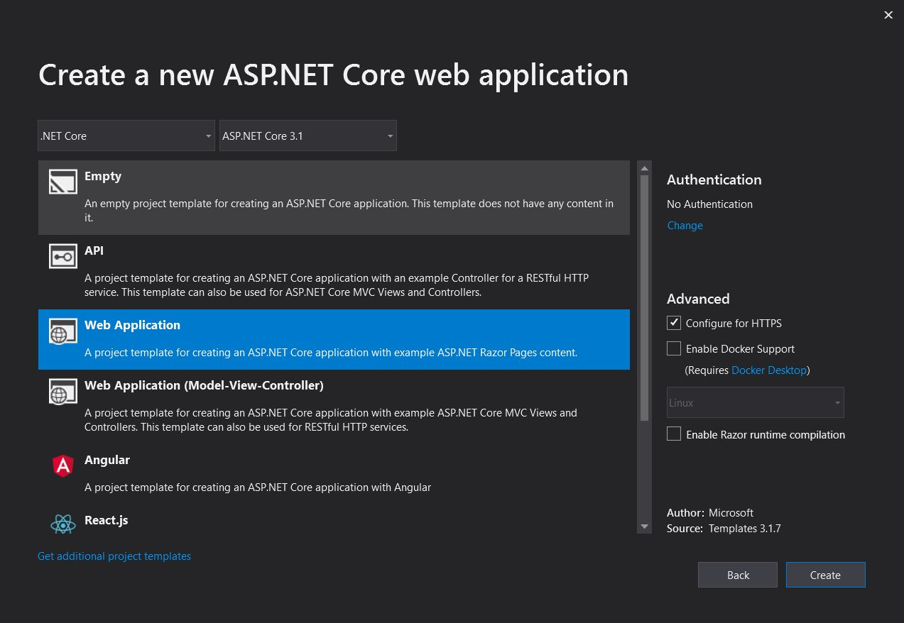

# SignalR

[SignalR](https://docs.microsoft.com/en-us/aspnet/core/signalr/introduction?view=aspnetcore-3.1) is an ASP.NET Core library that allows server-side code to be instantly pushed to the client. 

## Prerequisites 
* Visual Studio 2019 or higher
* Azure account (to publish SignalR service)

## Steps

1. Create `ASP.NET Core web application` in Visual Studio and name it `UnoChat.Service`.



2. Add [SignalR Hub](https://docs.microsoft.com/en-us/aspnet/core/tutorials/signalr?view=aspnetcore-3.1&tabs=visual-studio#create-a-signalr-hub) to your `[YourProjectName].Service` project in a `Hubs` folder. 

3. In your `Startup.cs` file, add your `SignalR` service and a `CORS policy` to the `ConfigureServices` method.

``` csharp
public void ConfigureServices(IServiceCollection services)
        {
            services.AddRazorPages();
            services.AddSignalR();

            services.AddCors(o => o.AddPolicy(
                 "CorsPolicy",
                 builder => builder
                    .AllowAnyOrigin()
                    .AllowAnyMethod()
                    .AllowAnyHeader()
                 )
            );
        }
```
In your `Configure` method, add your `Hubs` endpoint

``` csharp
  app.UseEndpoints(endpoints =>
            {
                endpoints.MapRazorPages();
                endpoints.MapHub<Hubs.[YourProjectHub]>("/yourProjectHub");
            });
```

You now have a SignalR service you can use with your Uno application! 
