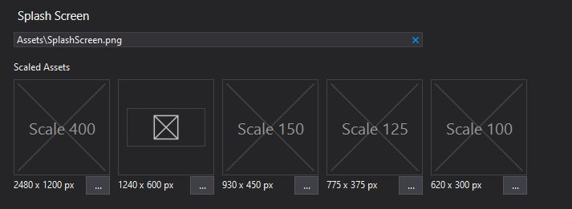
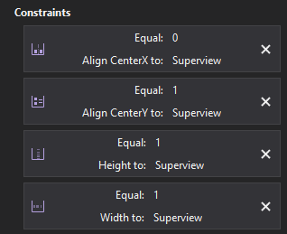
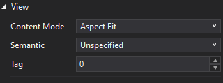

# Splash Screen Customization

This guide covers splash screen customization for Uno Platform applications. A splash screen is displayed while your application is loading, providing visual feedback to users and improving the perceived performance of your app.

## Overview

Uno Platform provides several approaches for configuring splash screens, depending on your project setup and requirements:

### Recommended: Using Uno.Resizetizer (Modern Approach)

**For projects created with Uno Platform 4.8 or later**, splash screens are configured automatically using [Uno.Resizetizer](xref:Uno.Resizetizer.GettingStarted#unosplashscreen). This is the **recommended approach** for all new projects.

**Benefits:**
- Automatically generates platform-specific assets from a single SVG or PNG image
- Simplifies multi-platform deployment with MSBuild properties like `UnoSplashScreen` and `UnoIcon`
- Reduces manual configuration across different platforms
- Supports modern image formats and scaling

> [!TIP]
> **Start here:** If you're using Uno Platform 4.8 or later, see the [Uno.Resizetizer documentation](xref:Uno.Resizetizer.GettingStarted#unosplashscreen) for the easiest way to customize your splash screen.

### Manual Setup (Legacy Projects)

If you're working with an older project that doesn't use Uno.Resizetizer, or have specific requirements that necessitate manual configuration, this article provides step-by-step instructions for adding a splash screen manually on each platform.

> [!NOTE]
> **Upgrading?** If your solution was generated using older templates, you can migrate to use Uno.Resizetizer instead of the manual approach. See the [Uno.Resizetizer Getting Started guide](xref:Uno.Resizetizer.GettingStarted#unosplashscreen) for migration instructions.

### Platform-Specific Considerations

- **WebAssembly**: Additional splash screen customization options are available through the [Uno WebAssembly Bootstrapper](https://platform.uno/docs/articles/external/uno.wasm.bootstrap/doc/features-splash-screen.html), including theme-aware backgrounds and loading indicators
- **Extended Splash Screens**: For splash screens that remain visible while loading data or performing initialization, see the [ExtendedSplashScreen control](https://platform.uno/docs/articles/external/uno.toolkit.ui/doc/controls/ExtendedSplashScreen.html) from Uno.Toolkit

---

## Manual Splash Screen Setup

The following sections describe how to manually configure a splash screen if you're not using Uno.Resizetizer.

### Prerequisites for Manual Setup

Before proceeding with manual splash screen setup:

* Review [Assets and image display](xref:Uno.Features.Assets) to understand the present support for various image asset types
* Consider whether [Uno.Resizetizer](xref:Uno.Resizetizer.GettingStarted#unosplashscreen) would be a better fit for your project

### Step-by-Step Instructions

#### 1. Shared splash screen image resources

* Prepare your images intended for the splash screen under different resolutions, eg:

    | File name | Width | Height |
    |----------------------------|:---:|:---:|
    | SplashScreen.scale-100.png | 216 | 148 |
    | SplashScreen.scale-125.png | 270 | 185 |
    | SplashScreen.scale-150.png | 324 | 222 |
    | SplashScreen.scale-200.png | 432 | 296 |
    | SplashScreen.scale-300.png | 648 | 444 |
    | SplashScreen.scale-400.png | 864 | 592 |

* Refer to this [table](xref:Uno.Features.Assets#table-of-scales) to see values for the different scales required.

  * You can instead provide only a single image named `SplashScreen.png` without the `scale-000` qualifier.

    > [!NOTE]
    > Regardless if you provide a single image or multiple images, you would always refer to this image as `SplashScreen.png`.

* Add these images under the `Assets\` folder of the `MyApp` project, right-click on each image, go to `Properties`, and set their build action as `Content`.

#### 2. Platform-Specific Configuration

The following sections describe how to configure the splash screen for each platform.

##### Windows

* In the `MyApp` project, open the file `Package.appxmanifest` and navigate to `Visual Assets > SplashScreen`.

* Make sure the value for `Preview Images > Splash Screen` is set to `Assets\SplashScreen.png`

    

##### Android

* In the `MyApp` project, open the subfolder for `Platforms/Android`

* Navigate further to the file at `Resources/values/Styles.xml`

* `Styles.xml` contains Android-specific customizations for the splash screen. Inside, look for the `AppTheme` style and add an `<item>` under it:

    ```xml
    <item name="android:windowBackground">@drawable/splash</item>
    ```

* Navigate upward to `Resources/drawable`, and create a new XML file named `splash.xml`:

    ```xml
    <?xml version="1.0" encoding="utf-8"?>
        <layer-list xmlns:android="http://schemas.android.com/apk/res/android">
        <item>
            <!-- background color -->
            <color android:color="#101010"/>
        </item>
        <item>
            <!-- splash image -->
            <bitmap android:src="@drawable/assets_splashscreen"
                    android:tileMode="disabled"
                    android:gravity="center" />
        </item>
    </layer-list>
    ```

    > [!IMPORTANT]
    > Before Uno.UI 4.5, the `@drawable/assets_splashscreen` source should be `@drawable/splashscreen`.
    > See the [breaking changes](https://github.com/unoplatform/uno/releases/tag/4.5.9) section of that release.

* Make sure `splash.xml` is added as an `AndroidResource` in the Droid project file: `[Project-name].Droid.csproj`.

  * This is not always done automatically and may occur if `splash.xml` was created and added outside the IDE.

    ```xml
    <ItemGroup>
      <AndroidResource Include="Resources\drawable\splash.xml" />
    </ItemGroup>
    ```

    > [!TIP]
    > After modifying `splash.xml`, you may run into errors like these while trying to debug:
    >
    > ```console
    > Resources\drawable-mdpi\SplashScreen.png : error APT2126: file not found.
    > Resources\drawable-hdpi\SplashScreen.png : error APT2126: file not found.
    > ```
    >
    > Simply rebuild the Android target to get rid of these errors.

##### iOS

* In the `MyApp` project, open the subfolder for `Platforms/iOS`

  * Delete the old splash screen files:
    * `Resources\SplashScreen@2x.png`
    * `Resources\SplashScreen@3x.png`
    * `LaunchScreen.storyboard`

* Create a new **StoryBoard** named `LaunchScreen.storyboard`:
  * Right-click the project subfolder you're working with (ex: `MyApp/Platforms/iOS`)
  * Select **Add** > **New Item...**
  * Create a **Visual C#** > **Apple** > **Empty Storyboard**

* In the **Toolbox** window, drag and drop a **View Controller** and then an **ImageView** inside the **View Controller**

  * Enable the **Is initial View Controller**-flag on the **View Controller**.

    

  * To have an image fill the screen, set your constraints as below

    

  * Set the **Content Mode** to **Aspect Fit**

    

  * In the **Properties** > **Storyboard Document** window, select the **Can be Launch Screen** checkbox.

    

* Close the designer and open the `.storyboard` file.

  * Add your image path to the `Image View`

    ```xml
    <imageView ... image="Assets/SplashScreen">
    ```

* Open `info.plist` and update the `UILaunchStoryboardName` value to `LaunchScreen`.

    > [!TIP]
    > iOS caches the splash screen to improve the launch time, even across re-installs. In order to see the actual changes made, you need to restart the iPhone or simulator. Alternatively, you can rename the `CFBundleIdentifier` in `info.plist` incrementally (eg: MyApp1 -> MyApp2) before each build.

##### WebAssembly

> [!NOTE]
> **For advanced WebAssembly splash screen customization**, including theme-aware backgrounds, custom loading indicators, and more, see the [WebAssembly Bootstrapper Splash Screen documentation](https://platform.uno/docs/articles/external/uno.wasm.bootstrap/doc/features-splash-screen.html).

* The default splash screen configuration for WebAssembly is to use the Uno Platform logo as a placeholder.

* An `Platforms/WebAssembly/WasmScript/AppManifest.js` file contains some app settings, including properties to customize its splash screen. This file is found in the `MyApp` project.

###### Basic Configuration

You can customize the splash screen image and background color by adjusting several key properties:

  | Property | Description | Notes |
  |----------|-------------|-----|
  | `accentColor` | Color of the progress indicator's filled-in portion displayed during application launch | Default value is `#F85977` |
  | `displayName` | Default name visible in the browser window's title to represent the application | N/A |
  | `splashScreenColor` | Background color of the screen displayed during application launch | Any values assigned to the theme-aware properties are ignored unless this property is set to `transparent`. <br><br>If the theme-aware properties are unassigned, the default browser background color will be used instead. |
  | `splashScreenImage` | Path to an image that will be visible on the screen displayed during application launch | You currently need to set an explicit scale for the image |

  > [!TIP]
  > `splashScreenColor` allows you to maintain a background color regardless of the system theme. However, a simple method to make the splash screen theme-aware is to assign `transparent` as its value or by omitting that property altogether.

###### Advanced: Theme-Aware Properties

  > [!NOTE]
  > The section below contains optional properties. If nothing is assigned to them, the value of `splashScreenColor` will be used under both themes as the background color.
  >
  > For more advanced WebAssembly splash screen features, see the [WebAssembly Bootstrapper documentation](https://platform.uno/docs/articles/external/uno.wasm.bootstrap/doc/features-splash-screen.html).

  Uno Platform supports theme-aware backgrounds as an optional customization for splash screens. Set the following properties to adjust the splash screen based on a system theme:

  | Property | Description | Notes |
  | --- | --- | --- |
  | `lightThemeAccentColor` | Color of the progress indicator's filled-in portion displayed during application launch if a system light theme is enabled | Default value is `#F85977` |
  | `darkThemeAccentColor` | Color of the progress indicator's filled-in portion displayed during application launch if a system dark theme is enabled | Default value is `#F85977` |
  | `lightThemeBackgroundColor` | Background color of the screen displayed during application launch if a system light theme is enabled | Default value is `#F3F3F3` |
  | `darkThemeBackgroundColor` | Background color of the screen displayed during application launch if a system dark theme is enabled | Default value is `#202020` |

* Code example:

  ```javascript
  var UnoAppManifest = {
      splashScreenImage: "Assets/SplashScreen.scale-200.png",
      splashScreenColor: "transparent",
      displayName: "SplashScreenSample"
  }
  ```

## See Also

### Documentation

* **[Uno.Resizetizer Getting Started](xref:Uno.Resizetizer.GettingStarted#unosplashscreen)** - Recommended approach for modern projects (Uno Platform 4.8+)
* **[WebAssembly Splash Screen Customization](https://platform.uno/docs/articles/external/uno.wasm.bootstrap/doc/features-splash-screen.html)** - Advanced WASM-specific splash screen options including theme-aware backgrounds
* **[ExtendedSplashScreen Control](https://platform.uno/docs/articles/external/uno.toolkit.ui/doc/controls/ExtendedSplashScreen.html)** - For splash screens that remain visible during app initialization
* **[Assets and Image Display](xref:Uno.Features.Assets)** - Understanding image asset handling in Uno Platform

### Resources

* [Completed sample on GitHub](https://github.com/unoplatform/Uno.Samples/tree/master/UI/SplashScreenSample) - Manual splash screen implementation example
* [Uno.Resizetizer repository](https://github.com/unoplatform/uno.resizetizer) - Source code and latest updates
* [Ask for help on Discord](https://www.platform.uno/discord) - Community support
