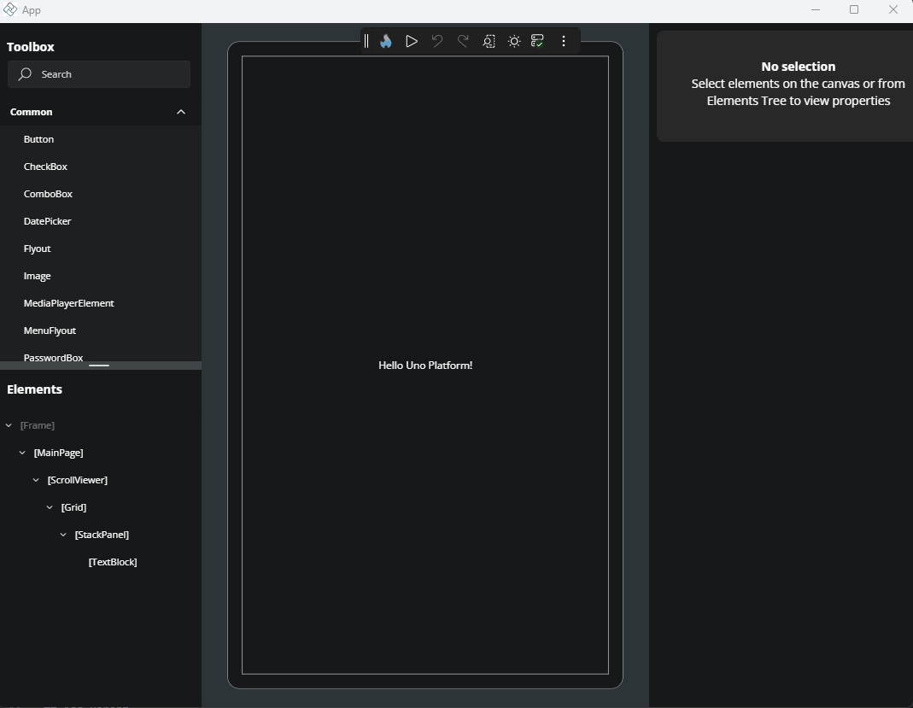
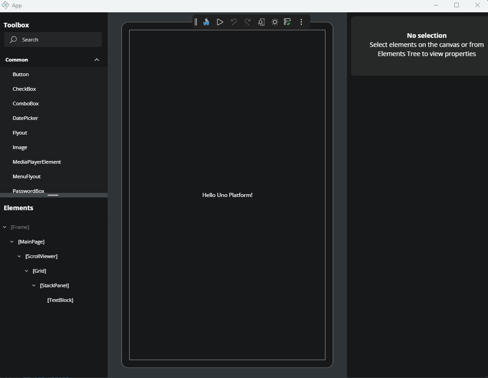
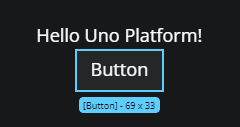
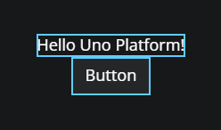
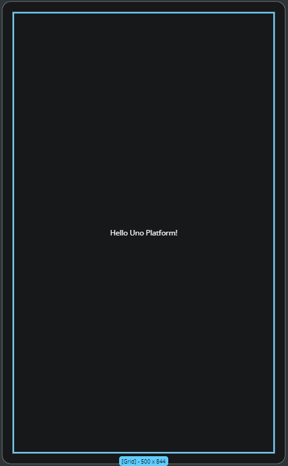
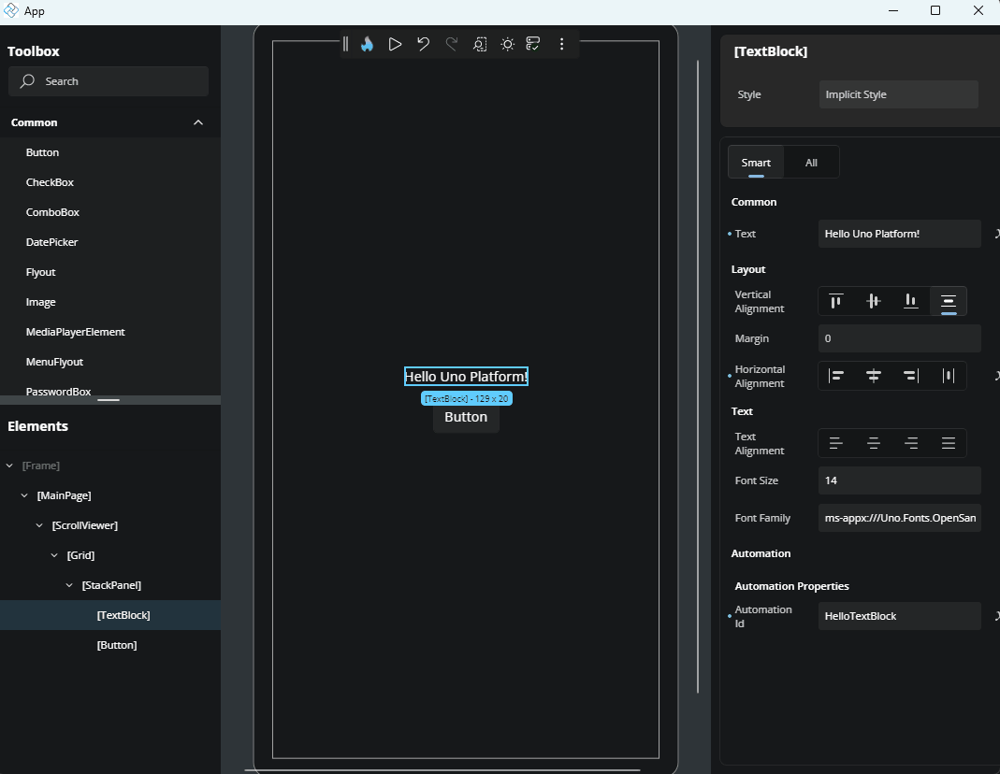
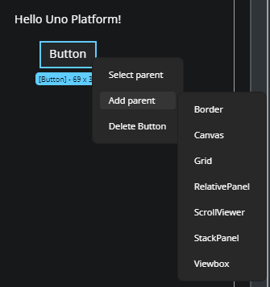
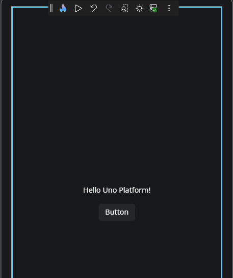
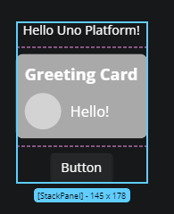

# Canvas

The **Canvas** is the main area in the center of the screen that represents your running app. It’s where you visually design and interact with your UI. You can select, move, and manage elements directly on the Canvas, seeing live feedback as you work.

Below are some of the key features available on the Canvas.

## Zoom and Scroll

### Zoom

You can zoom in and out of the Canvas view to get a better look at your design.

- **Mouse**: Hold `Ctrl` and scroll with your mouse wheel.
- **Keyboard**: Use `Ctrl +` to zoom in, and `Ctrl -` to zoom out.

### Scroll

You can also scroll vertically using the mouse wheel, and horizontally by holding `Shift` and using the mouse wheel.

## Selection

To select an element on the Canvas, just click on it. The selected element will show a blue border (visual adorner).

### Multi-selection

You can select multiple elements at the same time by holding `Ctrl` and clicking each element. This is helpful when you want to change common properties at the same time.

## Visual Adorner

When you select an element on the Canvas, a blue border (called a *visual adorner*) will appear around it.  
This shows that the element is selected. Below the adorner, you'll also see:

- The name of the control
- The size (width and height) of the control

## Drag and Drop

You can rearrange elements on the Canvas by dragging and dropping them to a new position. To do this, simply click and hold the element you want to move, drag it to the new desired location, and release the mouse button.

If there are no layout restrictions or invalid placements, the element will be moved to the new position and the structure will update accordingly. This makes it easy to reorganize your layout visually and quickly.

## Add Parent

To add a parent container around an existing element:

1. Right-click the element.
1. In the flyout menu, choose **Add parent**.
1. A list of available parent controls will appear. Select the one you want.

The selected parent will be wrapped around your element in the visual layout.

## Select Parent

Sometimes it's hard to click directly on a parent element. To help with this:

1. Right-click the element.
1. Choose **Select parent** from the flyout menu.

The parent of the selected element will then become selected.

## Delete Element

To remove an element from the page:

1. Right-click the element.
2. Choose **Delete [ControlName]** from the menu.
For example: "Delete TextBlock"

The element will be removed from both the Canvas and the Element window.

## Edit

If you’ve added a **UserControl** (for example, something like a reusable page section), you can edit it by:

1. Right-clicking the UserControl.
2. Choosing **Edit [UserControlName]**.

You’ll be taken to a separate area where you can make changes to that control.

To return to your main page, click the back icon in the top-left corner or the back icon in the **Elements** window.

## Notifications

While working in the Canvas, notifications may appear to provide feedback:

- When applying certain changes, a loading notification may appear.
- If there's an error updating XAML or applying changes, an error notification will show in the bottom-right corner of the Canvas.

## Controls Separation

When working with layouts like `Grid` and `StackPanel`, you’ll see visual separators that mark rows and columns. These are shown as pink dashed lines and help you understand the structure of your layout.

## How To Edit Flyouts

_TO_DO_

## Next

- [Property window](xref:Uno.HotDesign.PropertyGrid)
