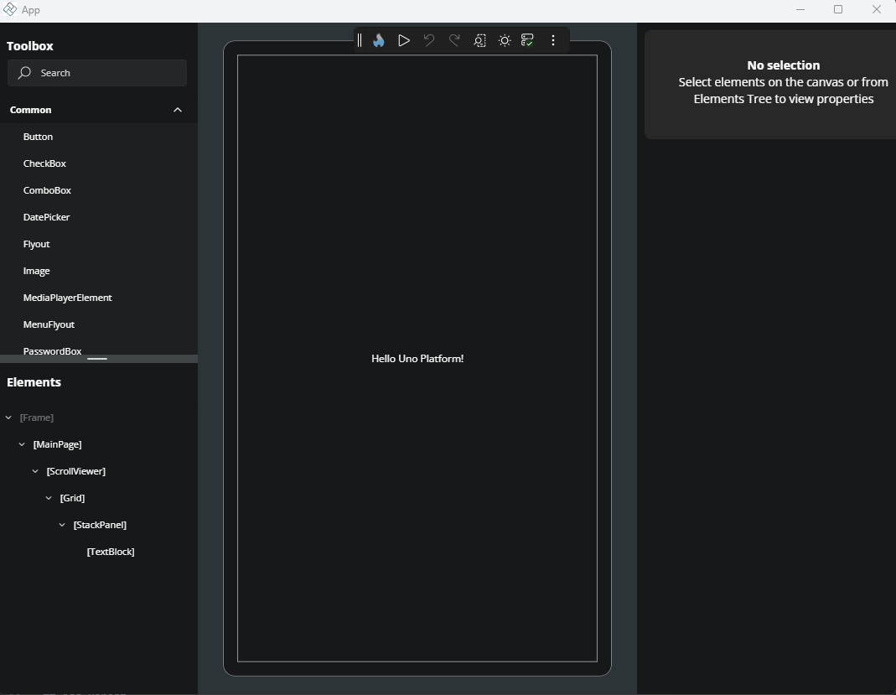
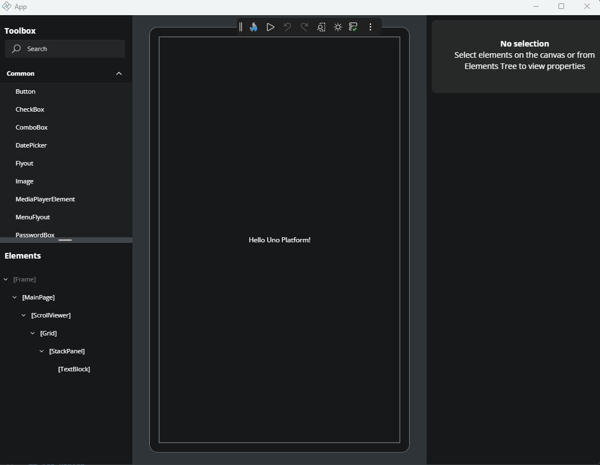
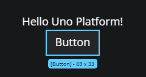
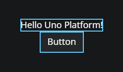
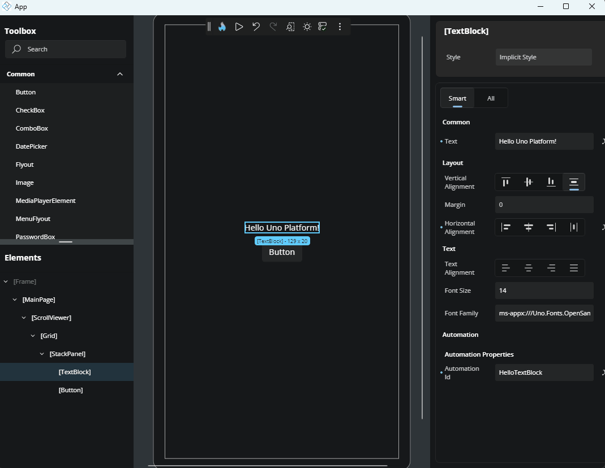
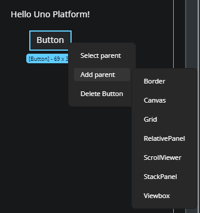
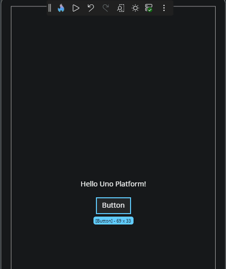
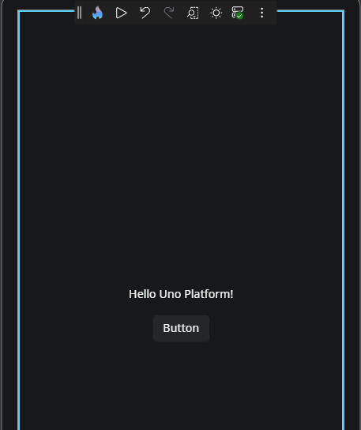
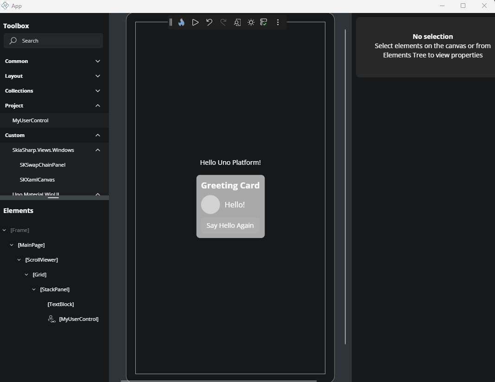
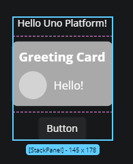

# Canvas

The **Canvas** is the central design surface where you build and interact with your running app's user interface. It reflects the live visual output of your XAML page and allows you to select, move, edit, and organize controls directly. Actions you take on the Canvas are reflected in real time, making it the most visual and interactive part of **Hot Design**.

Whether you're adjusting layout, editing a `UserControl`, or testing structure with live feedback, the Canvas helps you work faster and more intuitively.

## Zoom and Scroll

### Zoom

To zoom in or out of the **Canvas**:

- **Mouse**: Hold `Ctrl` (or `Cmd` on macOS) and scroll with your mouse wheel.
- **Keyboard**: Press `Ctrl +` / `Ctrl -` (or `Cmd +` / `Cmd -` on macOS) to zoom in or out.

### Scroll

To scroll the **Canvas** area:

- Scroll vertically using your mouse wheel.
- Scroll horizontally by holding `Shift` while using the mouse wheel.

## Select Elements on the Canvas

To select a control or layout element, click it directly on the **Canvas**. The selected element is highlighted with a blue border, known as a **visual adorner**.

### Select Multiple Elements

Hold `Ctrl` (or `Cmd` on macOS) and click additional elements to select them together. This is useful for applying shared properties or moving groups of elements.

## Visual Adorner Details

When an element is selected, a blue border (called a *visual adorner*) appears around it. It includes:

- The control’s name (e.g., `Button`, `TextBlock`)
- The control’s size in pixels (width × height)

## Rearranging Elements with Drag and Drop

You can reposition controls directly in the layout:

1. Click and hold an element.
2. Drag it to a new location on the **Canvas**.
3. Release to drop it.

If the layout allows it, the element will be moved and the structure updated accordingly.

## Wrap an Element with a Parent Container

To surround an existing element with a new layout container:

1. Right-click the element.
2. Choose **Add parent**.
3. Select a parent control such as `Grid` or `StackPanel`.

The new parent will be added to the visual tree and reflected on the **Canvas**.

## Select an Element’s Parent

If you're trying to select a layout container of a specific control:

1. Right-click the child element.
2. Choose **Select parent** from the context menu.

This selects the parent element on both the **Canvas** and in the **Elements** window.

## Delete an Element

To remove a control from the **Canvas**:

1. Right-click the element.
2. Choose **Delete [ControlName]** from the menu (e.g., **Delete Button**).

The element will be removed from both the **Canvas** and the **Elements** window.

## Edit a UserControl from the Canvas

A `UserControl` is a reusable component that encapsulates a set of UI elements and their associated behavior. It's commonly used to organize parts of your interface into self-contained, maintainable units that can be reused across different parts of your application.

If your layout includes a `UserControl`, you can open it directly from the **Canvas** for editing:

1. Right-click the `UserControl`.
2. Choose **Edit [UserControlName]**.

This opens the editor for the `UserControl`, allowing you to modify its internal structure or layout. To return to your previous page edition, click the `../` back icon in the top-left corner of the interface or the **Elements** window.

## Layout Separators

When working with layout containers like `Grid` or `StackPanel`, pink dashed lines appear to show row and column boundaries. These **visual separators** help you understand the layout structure and spacing.

## Helpful Notifications

While designing on the Canvas, notifications may appear:

- When changes are applied, a loading indicator may display briefly.
- If an error occurs (e.g., invalid XAML), an error notification appears in the bottom-right corner.

These notifications help you track changes and issues in real time.

## Editing Flyouts

To Do

## Next Step

- [Properties](xref:Uno.HotDesign.Properties)
