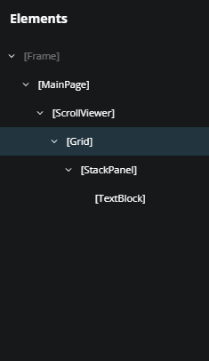
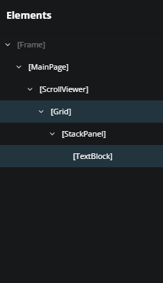
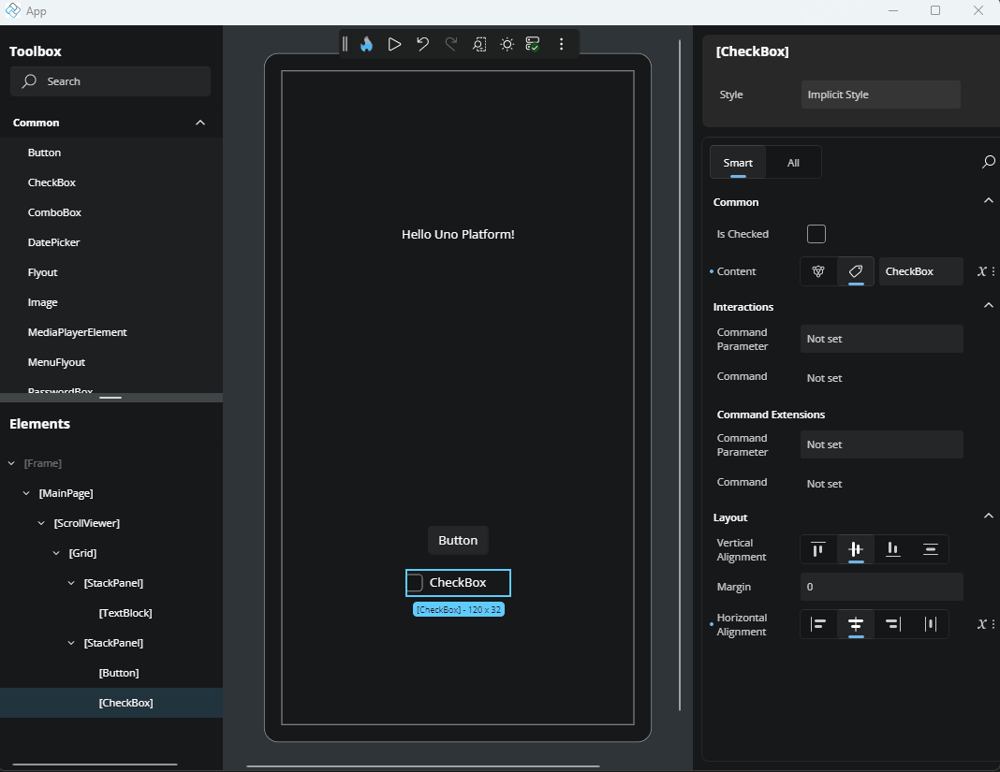
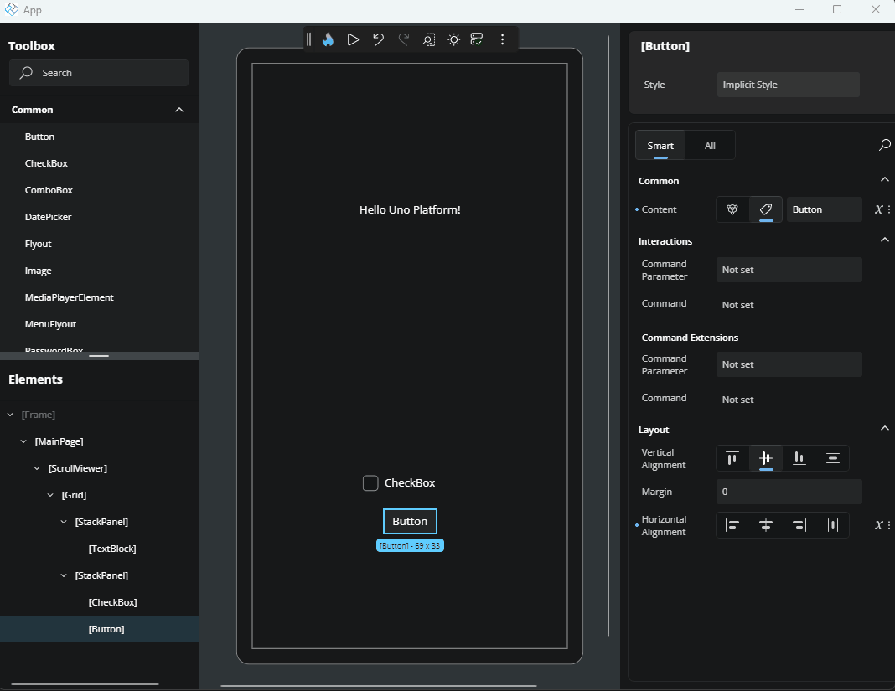
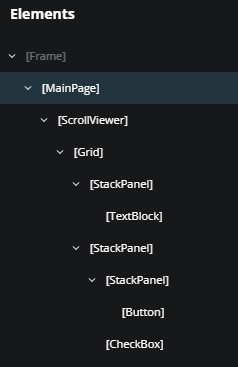
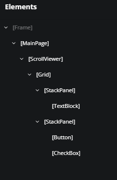
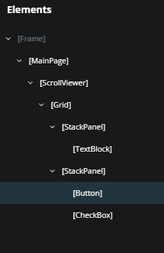
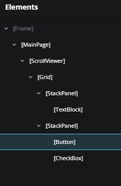
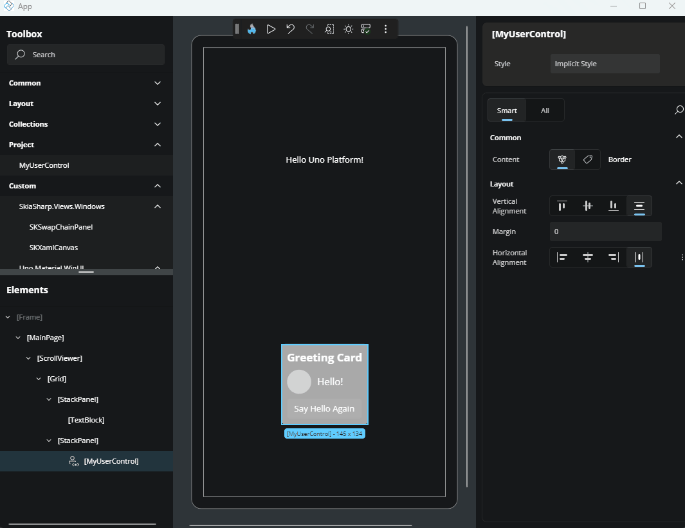
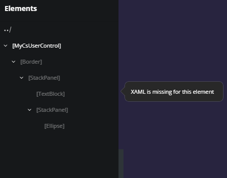

# Elements window

The Elements window, located below the Toolbox, shows a hierarchical view of all the elements currently added to the page. This tree represents the visual structure of your app and lets you easily interact with elements by selecting, organizing, or editing them.

We'll go through the key actions you can perform in this window.

## Selection

To select an element, simply click on it. It will be highlighted in blue and also selected on the Canvas.

### Multi-selection

To select multiple elements, hold down `Ctrl` on your keyboard and click the elements you want. This is useful when you need to update shared properties at once.

## Drag and Drop

You can rearrange the order of elements by dragging and dropping them inside the tree. Just click the element you want, drag it to the desired location, and release it. If there are no restrictions, the element will be successfully moved.

You can either change the order of siblings within the same parent or move an element to a completely different parent.

## Expandable Nodes

Layout elements like `Grid`, `Border`, `StackPanel`, and others act as containers and can hold child elements. These elements are expandable in the tree. You can collapse or expand them using the arrow icon next to their name.

This makes it easier to navigate large structures by hiding children when not needed.

## Add Parent

To wrap an element with a new parent, right-click the element and select **Add parent**. A list of available container elements will appear - simply choose one, and the new parent will be added around the selected element.

## Select Parent

To quickly jump to the parent of an element, right-click on the element and choose **Select parent**. The parent element will then be selected in both the Elements window and the Canvas.

## Delete Element

To remove an element from the page, right-click it and choose **Delete [ElementName]**. For example, right-clicking on a `TextBlock` and selecting **Delete TextBlock** will remove it from your layout.

## Edit UserControls

UserControls are reusable components often used to organize parts of your UI. If you have a `UserControl` added to your page and want to edit it, click on the pencil icon located on the right side of the UserControl node, or right-click it and select **Edit [UserControlName]**.

This opens the UserControl for editing. To return to your main page, click the back icon at the top-left of the interface or in the **Elements** window.

## Teaching Tips

If an element is disabled or can't be interacted with for any reason, hovering your mouse over it will show a Teaching Tip. This provides context or explanation - for example, if a `UserControl` was created using only C# and no XAML, it may not be editable.

# Next

 - [Toolbar](xref:Uno.HotDesign.Toolbar)