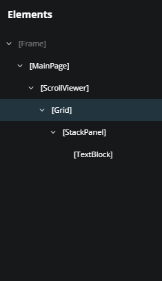
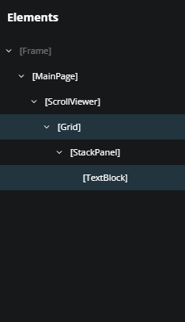
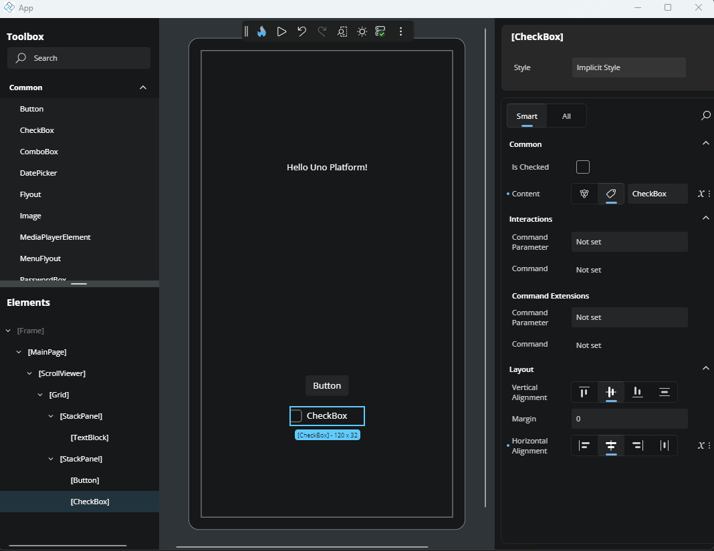
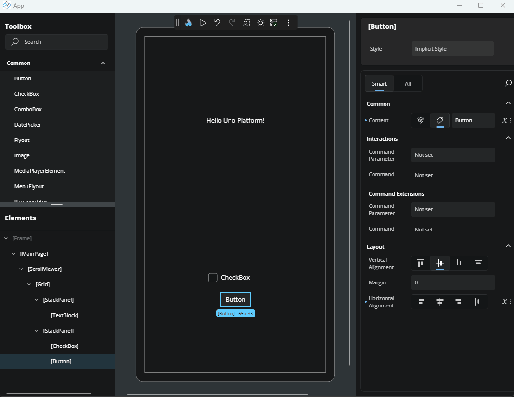
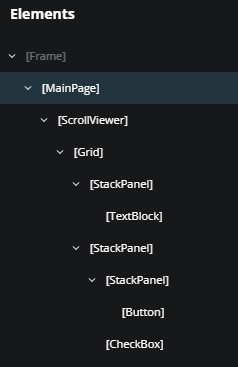
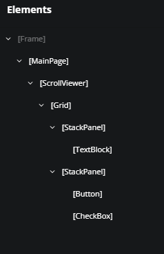
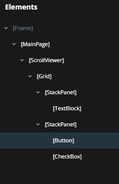
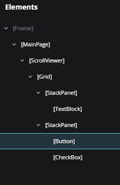
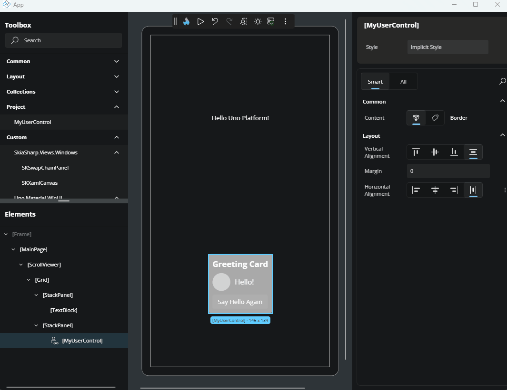
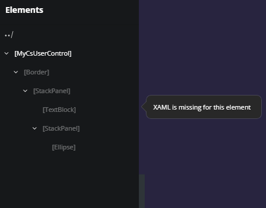

# Elements

The **Elements** window gives you a hierarchical view of your app’s user interface. It mirrors the XAML visual tree, showing how controls are nested and organized on the current page. You can use it to select elements, change layout structure, wrap items in containers, or quickly jump between components, making it easier to manage complex UIs during live design.

Whether you're organizing layout containers, editing a UserControl, or deleting an unused element, the Elements window gives you precise control over your app’s structure.

## Select Elements in the Visual Tree

Click an element in the visual tree to select it. The selected element is also highlighted in the **Canvas** so you can see it visually.

### Select Multiple Elements

Hold `Ctrl` (or `Cmd` on macOS) and click multiple items to select them together. This is helpful when applying the same property changes to multiple elements.

## Rearrange Elements with Drag and Drop

To move an element:

1. Click and drag it within the visual tree in the **Elements** window.
2. Drop it at the new location, either within the same parent or under a different one.

You can:

- Reorder elements within the same container
  

- Move an element to a new parent, such as placing a `Button` inside another `StackPanel`
  

## Expand and Collapse Containers

Layout controls like `Grid`, `Border`, and `StackPanel` can contain child elements. In the visual tree, these appear as expandable nodes.

Use the arrow next to a node to collapse or expand its contents, helpful when working on large UIs, so you can reduce visual clutter and focus on the section you're actively editing.

## Wrap an Element with a New Parent

To nest an element inside a new container:

1. Right-click the element.
2. Choose **Add parent**.
3. Select a layout control (e.g., `StackPanel`, `Grid`) from the list.

This wraps the element in the chosen parent, updating the visual tree and the layout structure.

## Jump to an Element’s Parent

To quickly select an element’s parent:

1. Right-click the child element.
2. Choose **Select parent**.

This selects the parent in both the **Elements** window and the **Canvas**, helping you navigate complex trees.

## Delete an Element in the Visual Tree

To remove an element:

1. Right-click it.
2. Choose **Delete [ElementName]** (e.g., **Delete Button**).

The element is immediately removed from the layout and visual tree.

## Edit a UserControl from the Visual Tree

A `UserControl` is a reusable component that encapsulates a set of UI elements and their associated behavior. It's commonly used to organize parts of your interface into self-contained, maintainable units that can be reused across different parts of your application.

If your page includes a `UserControl`, you can edit it directly by:

- Clicking the pencil icon next to the `UserControl` in the visual tree.
- Or, right-clicking the node and choosing **Edit [UserControlName]**.

This opens the editor for the `UserControl`, allowing you to modify its internal structure or layout. To return to your previous page edition, click the `../` back icon in the top-left corner of the interface or the **Elements** window.

## Get Help from Teaching Tips

If an element can’t be edited, for example, if it was created entirely in C# with no associated XAML, hovering over it may display a **Teaching Tip**. These offer helpful guidance and explain any restrictions.

## Next Steps

- [Interactive Canvas](xref:Uno.HotDesign.Canvas)
