# Getting Started with Hot Design™

Hot Design™ is the next-generation runtime Visual Designer for cross-platform .NET applications, transforming your live, running app into a real-time Designer.

This guide provides the steps to set up Hot Design and introduces its key features and visual design capabilities.

Use this guide to set up Hot Design and start creating and refining user interfaces efficiently and intuitively.

## Set Up Your Environment for Hot Design

> [!IMPORTANT]
> **Hot Design™** is currently in **beta**. To start using **Hot Design**, ensure you are signed in with your Uno Platform account. Follow [these instructions](xref:Uno.GetStarted.Licensing) to register and sign in.
>
> - Hot Design is now available on all platforms in beta, with the Desktop platform (`-desktop` target framework) currently offering the most stable and reliable experience. Other platforms are still undergoing stabilization. See the list of [known issues](https://aka.platform.uno/hot-design-known-issues).
> - Hot Design does not support C# Markup and is only available with XAML and .NET 9. Additionally, Hot Design is not supported for the WinAppSDK target framework at this time.
> - Hot Design relies on [Hot Reload](xref:Uno.Platform.Studio.HotReload.Overview) for updates, so be sure to check the [current support for your OS, IDE, and target platforms](xref:Uno.Platform.Studio.HotReload.Overview#supported-features-per-os) before testing.
> - Your input matters! Share your thoughts and help us improve Hot Design. [Find out how to provide feedback here](xref:Uno.Platform.Studio.Feedback).
>
> [!IMPORTANT]
> If you're new to developing with Uno Platform, make sure to set up your environment by [following our getting started guide](xref:Uno.GetStarted).

To start using **Hot Design**, ensure you are signed in with your Uno Platform account. Follow [these instructions](xref:Uno.GetStarted.Licensing) to register and sign in.

For existing applications, take this opportunity to update to the [latest **Uno.Sdk** version](https://www.nuget.org/packages/Uno.Sdk). Refer to our [migration guide](xref:Uno.Development.MigratingFromPreviousReleases) for upgrade steps.

> [!IMPORTANT]
> When upgrading to **Uno.Sdk 5.5 or higher**, the `EnableHotReload()` method in `App.xaml.cs` is deprecated and should be replaced with `UseStudio()`.

Once you're using the **latest stable 5.5 Uno.Sdk version or higher**, and provided you have been granted Beta access, you can access **Hot Design** by clicking the **flame** icon in the diagnostics overlay that appears over your app.

  

## Hot Design Core Tool Windows

Once in Hot Design, your running app becomes an interactive canvas.  
Hot Design offers an intuitive interface for designing and interacting with your app. This enables you to seamlessly create, edit, and refine your app's user interface in real-time, streamlining the design process for maximum efficiency and simplicity.

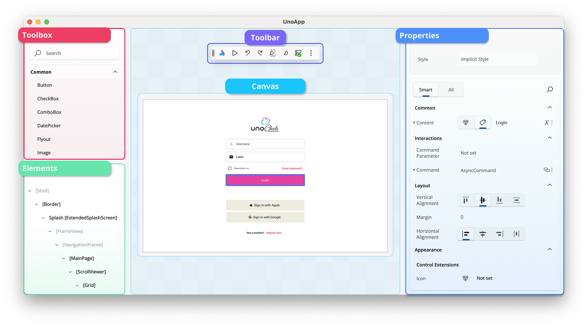

Here are the tool windows available on the interactive canvas:

### Toolbox

Located on the upper-left side, the **Toolbox** window provides a categorized list of available controls you can use in your application, including available custom and third-party UI controls. It features a search bar for quickly finding specific controls, which you can drag and drop directly onto the canvas or the **Elements** window for easy integration into your design.

### Elements

Below the **Toolbox**, the **Elements** window displays the hierarchical structure of your app. It represents the visual tree of your app, allowing you to select and organize elements. Clicking on an element in this window highlights it on the canvas for detailed modifications.

### Canvas

The main **Canvas** in the center of the interface represents your running app. It is an interactive area where you can visually design and interact with the user interface. You can select controls, see their outlines, and preview any changes made to the layout or properties.

### Properties

The **Properties** window, located on the right side of the interactive canvas, displays the attributes of the currently selected element on the canvas. By default, it highlights **Smart** properties, prioritizing the most commonly adjusted settings for the element. If you need access to all available properties, you can switch to the **All** view.

This window also allows you to search for specific properties and make adjustments directly, such as modifying styles, layouts, appearances, data bindings, resources, responsiveness, and interactions, to customize your UI elements effectively.

### Toolbar

  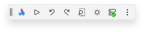

Located at the top of the interactive canvas, the **Toolbar** streamlines your design workflow by providing quick access to essential actions and tools, such as:

- 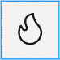  Entering **Hot Design** mode.

-   Leaving **Hot Design** mode.

-   Playing with the live running app to test functionality and pausing to return to adjusting properties, layout, and other design aspects without leaving the interactive designer.

- 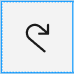   Undoing and redoing changes.

-   Changing the form factor of the app to test different screen sizes.

- 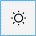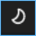   Switching between light and dark themes.

- 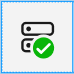  Viewing the connection status and the latest updates from **Hot Reload**.

-   More options, including showing or hiding the various tool windows, providing flexibility in customizing your design workspace.

## Using Hot Design

### Selecting elements

You can select controls on the app's current screen by simply clicking on them. A visual adorner (in this case, a blue border) will appear around the selected elements, clearly indicating their boundaries. The type, height, and width of the selected element are displayed below the adorner for easy reference.

  

You can also click on controls in the **Elements** window. This provides an alternative to clicking directly on the canvas, making it easier to precisely select small elements or to choose the container of a visual element rather than the element itself.

To select multiple elements, hold down the `Ctrl` key while clicking. This enables you to view and edit shared properties in the **Properties** window.

  

### Placing and Deleting Elements

You can add controls to your app by dragging them from the **Toolbox** onto the canvas.

Alternatively, you can drag them directly into the **Elements** window to position them within a specific hierarchical level.

To delete a control, right-click on it either in the canvas or the **Elements** window and select the delete option.

  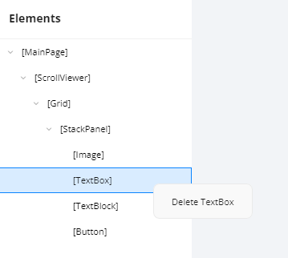

### Setting Properties

The **Properties** window displays the current values of a control's properties, which can be modified in various ways. Examples include:

- **Changing a property value**, such as the **Text** property of a `TextBlock` control:

    

- **Adjusting the alignment** of a control:

    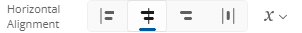

- **Using the autosuggest box** to set a property, such as the **Background** property of a control:

    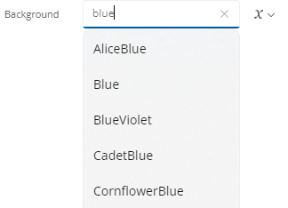

To the right of the property value is the **Advanced** button, which provides information on how the current property value is defined. For example:

-  indicates that nothing is set.
- 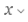 indicates a **Literal**/**XAML** value is set.
- 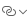 indicates a **Binding** is set.
- 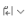 indicates a **Resource** is set.
-  indicates **Mixed Responsive** values is set using Responsive Extension.

Clicking the **Advanced** button opens a flyout with three settings for each property: **Value**, **Binding**, or **Resource**.

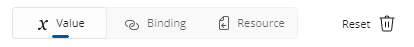

> [!TIP]
> To quickly clear a property's value, click the **Reset** button. Cleared properties will behave as though they weren't specified in the original XAML file.

If a property is not set, it will appear similar to this:

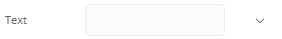

### Changing the Form Factor

The **Toolbar** provides the ability to change the form factor of your app within Hot Design. This feature is represented in the Toolbar by the following icon:

The height and width of your running app will dynamically adjust to match the selected form factor. You can also specify a custom height and width for precise testing.

At the bottom of the flyout, you can view and adjust the current zoom level. Modifying this setting will dynamically scale Hot Design's view of your app, making it easier to fine-tune your design.

### Toggling Theme

The **Toolbar** includes a feature to toggle between your app's light and dark themes. This also updates the Hot Design layout to match the selected theme. Use this feature to validate your app's theme-sensitive styles and ensure proper responsiveness to theme changes.

### Interaction with the Canvas

You can interact with the canvas using the following mouse and keyboard shortcuts:

- **Ctrl + Scroll mouse**: Zoom in or out.
- **Scroll mouse**: Scroll the canvas up or down (only works when zoomed in).
- **Shift + Scroll mouse**: Scroll the canvas left or right (only works when zoomed in).
- **Click and drag with the mouse wheel**: Scroll the canvas in any direction (only works when zoomed in).

### Tutorial

For a step-by-step tutorial on getting started with Hot Design, refer to the [Create a Counter App with Hot Design™](xref:Uno.HotDesign.GetStarted.CounterTutorial) tutorial.
