# Editors

The Properties panel uses different types of editors depending on the property’s expected value. These editors make it easier to enter, select, or adjust values, ensuring that each property is edited in a way that matches its data type.

## DropDown

For properties with predefined values, like `Visibility`, you’ll see a dropdown. Click it to open the list and select the value you want.

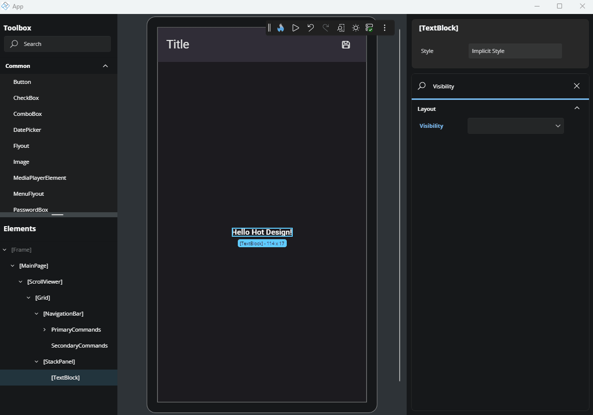

## TextField

For properties that accept text or numbers (like strings, decimals, or integers), a text field will be shown. Click it to focus and enter the value directly.

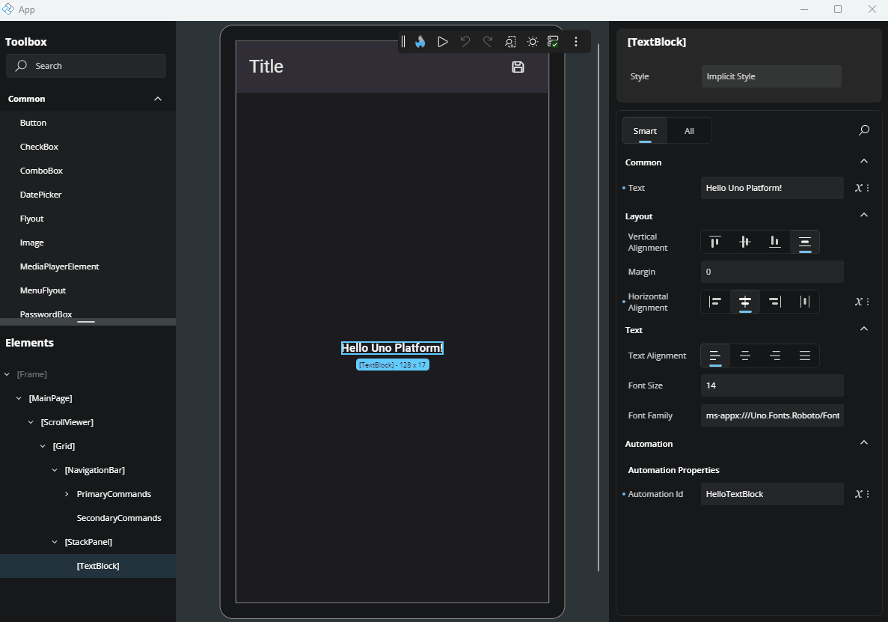

For properties like `Background` or `Foreground` that accept both predefined and custom values, the text field may suggest default values when it receives focus. A list will appear, showing commonly used options - you can simply click on one of the suggestions to apply it.

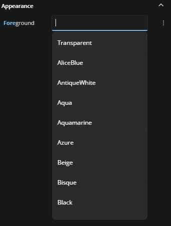

## CheckBox

For boolean properties (true or false), a checkbox is used. Click it to toggle between checked (true) and unchecked (false).

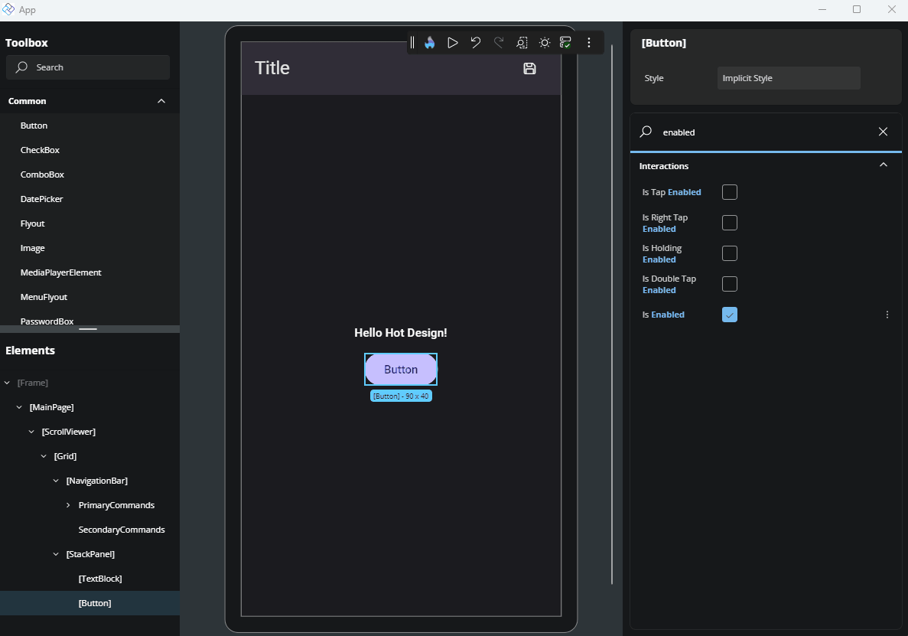

## Multiple Values

For properties that accept multiple values, simply click on the label showing the current selection. A menu will appear listing the available options—check the ones you want, and click outside the menu to close it.

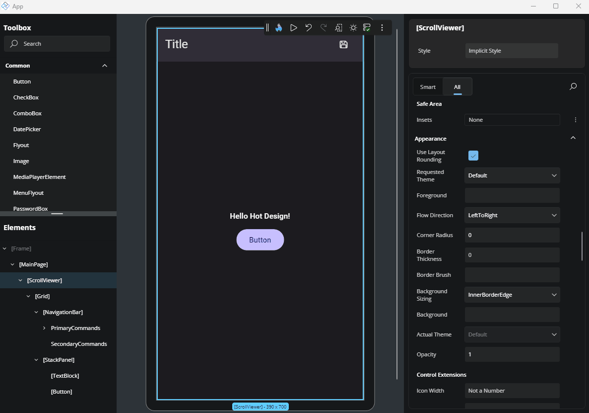

## Thickness and Corner Radius Editor

For properties like `Padding`, `Margin`, and `BorderThickness`, you can click the three-dot “more options” button next to the property. This opens a flyout with a thickness editor. By default, only the first (left) text field will be enabled, so that you can set the same value for all sides. If you click the center toggle button once, it enables the top text field - one for horizontal (left and right) and one for vertical (top and bottom). Clicking the button again enables the four fields, letting you set individual values for Left, Top, Right, and Bottom.

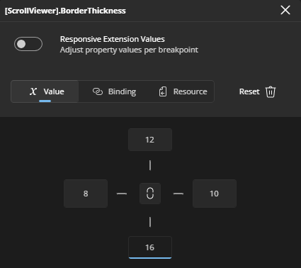

The `CornerRadius` editor works similarly to the thickness editor. It displays four text fields, each with an icon indicating which corner (TopLeft, TopRight, BottomRight, BottomLeft) the field corresponds to. Unlike the thickness editor, all fields are enabled by default, and there’s no central toggle button - you can freely enter values for each corner right away.

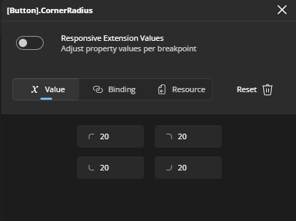

## Alignment Editors

Alignment editors display four visual options for alignment-related properties such as `VerticalAlignment`, `VerticalContentAlignment`, `HorizontalAlignment`, and `HorizontalContentAlignment`.

For vertical alignment, the options represent (from left to right): Top, Center, Bottom, and Stretch.

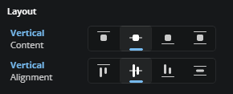

For horizontal alignment, the options represent: Left, Center, Right, and Stretch.

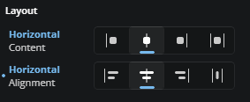

You can select the desired option by clicking on the corresponding icon.

## Orientation

When editing properties that accept orientation, you'll see two icon buttons: the first represents horizontal orientation with an arrow pointing left and right, and the second represents vertical orientation with an arrow pointing up and down. Just click the desired option to apply it.

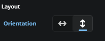

## Templates

For properties that use templates, a button labeled "Create" will appear if no template has been set yet, or "Edit" if a template already exists. Clicking this button will open the Template Editor. For more advanced details on how the Template Editor works, refer to our [Template Editor docs](xref:Uno.HotDesign.Properties.TemplateEditor).

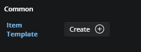

## Complex Types

Some properties support more advanced content types, also known as *Complex Types*. These are used when a property can accept a more structured element instead of just a simple value.

A common example is when setting an icon for a control. Instead of just choosing a predefined symbol, you might want to use a `BitmapIcon`, `FontIcon`, `SymbolIcon`, `PathIcon`, or another `IconElement`. When a property supports this, a specific **Complex Type icon** will appear next to it.

Another case for Complex Types is when defining the `Layout` property of an `ItemsRepeater` element.

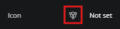

In some cases, a property might support both a literal value (like a string or number) *and* a Complex Type. When that happens, both the Complex Type icon and a tag icon (representing the literal mode) will be visible. You can choose either approach by clicking the corresponding icon.

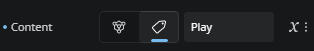

### Editing a Complex Type

To edit a Complex Type, simply click the icon. The Properties panel will switch to a new view. At the top, you’ll see a dropdown listing all available Complex Types for that property. Click the arrow to browse the options. Once you've selected a type, the UI will show the editable properties for that specific Complex Type.

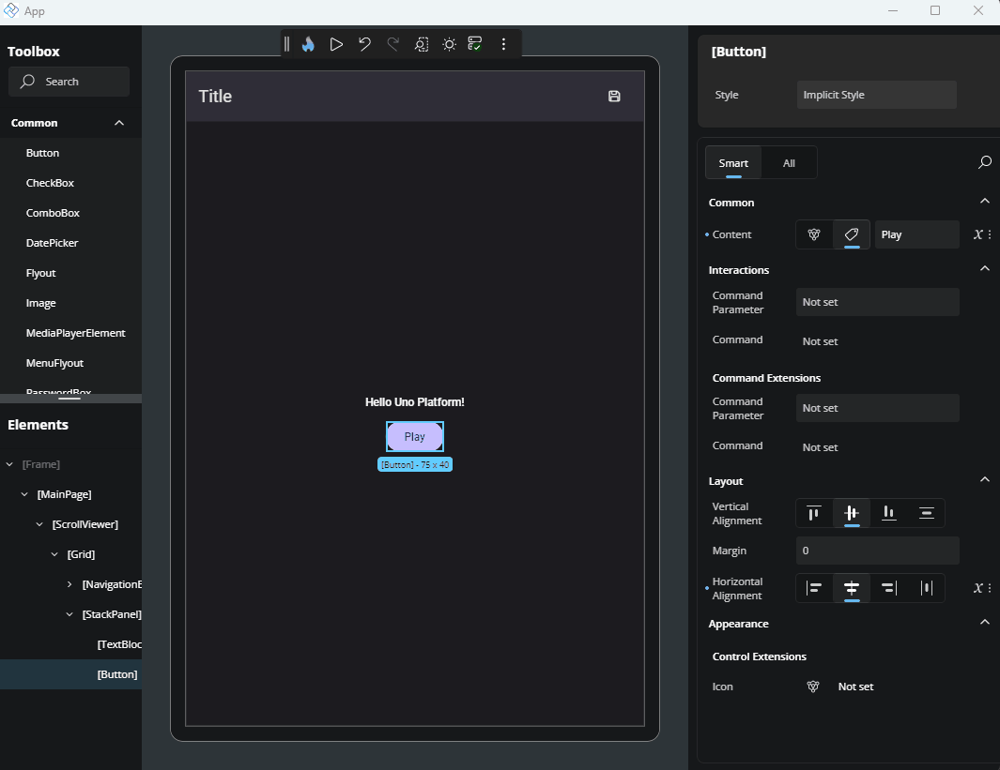

### Leaving the Complex Type editor

After you're done, to return to the default Properties view, just click the name of the main element you're editing, shown in the top-left breadcrumb area of the Properties panel. You'll then see that the chosen Complex Type appears next to the property, confirming it's been set.

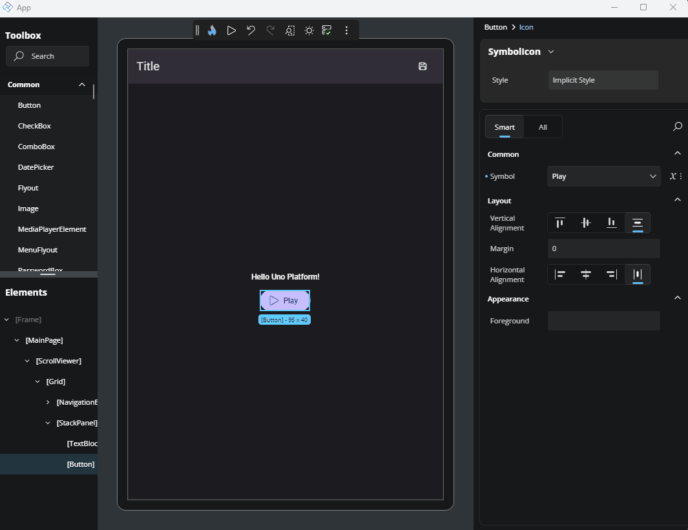

## Next Steps

- **[Advanced Flyout Editor](xref:Uno.HotDesign.Properties.AdvancedFlyout)**

  Use the **Advanced Flyout** to choose how a property value is provided: enter a literal **Value**, set up a **Binding**, reference a **Resource**, or apply **Responsive Extensions** for adaptive layouts.

- **[Template Editor](xref:Uno.HotDesign.Properties.TemplateEditor)**

  The **Template Editor** provides a visual canvas for creating and customizing control templates, enabling you to design complex UI structures without hand-coding XAML.

- **[Responsive Extensions](xref:Uno.HotDesign.Properties.AdvancedFlyout.ResponsiveExtensions)**

  **Responsive Extensions** let you define multiple values for a single property based on screen size or form factor, ensuring your UI adapts seamlessly across devices.

- **[Counter App Tutorial](xref:Uno.HotDesign.GetStarted.CounterTutorial)**

  A hands-on walkthrough for building the [Counter App](xref:Uno.Workshop.Counter) using **Hot Design**, showcasing its features and workflow in action.
