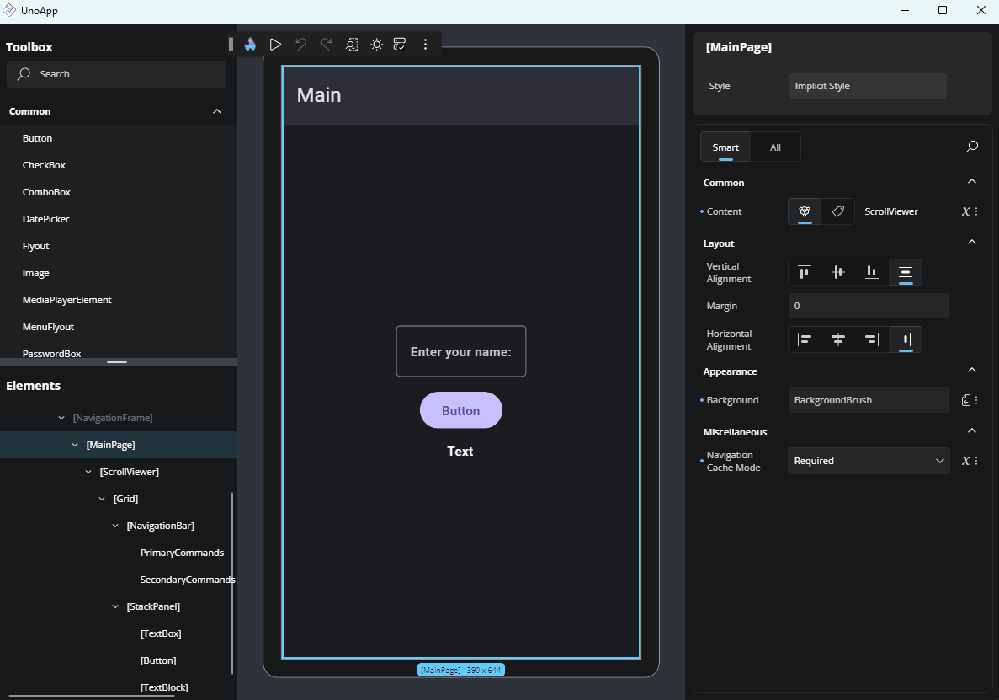

# Responsive Extensions

Responsive Extensions let you define different values for a property depending on the screen size. This helps you build adaptive UIs that look and behave better on different devices or window sizes.

In the Advanced Flyout, the **Responsive Extension** toggle will only be enabled if the selected property supports responsive values. When toggled on, it allows you to configure different values for various screen sizes using collapsible sections.

For more advanced usage and technical details, see the [Responsive Extensions documentation](xref:Toolkit.Helpers.ResponsiveExtension).

## Setting Values According to the Screen Size

Inside the **Advanced Flyout**, you'll find a toggle called **Responsive Extension Values**. Turning it on enables responsive editing for the selected property.

Once enabled, collapsible sections appear for each screen size category:

- **Narrowest**
- **Narrow**
- **Normal**
- **Wide**
- **Widest**

Each category has its own toggle switch, so you can choose which breakpoints to use. Below the section title, the specific pixel width that activates it is shown to help you understand when that value will apply.

After activating a breakpoint, an editor for that property will appear. You can now enter a value that will only apply when the screen is within that size range. This editor behaves just like the regular one you use for the default value - if it’s a number, you’ll get a text field; if it’s a Brush, you’ll get suggestions, and so on.

## Resetting Values

To remove a value set for a specific breakpoint, click the **trash icon** next to the editor. This will clear the responsive override and fall back to the default property value or another applicable one.
