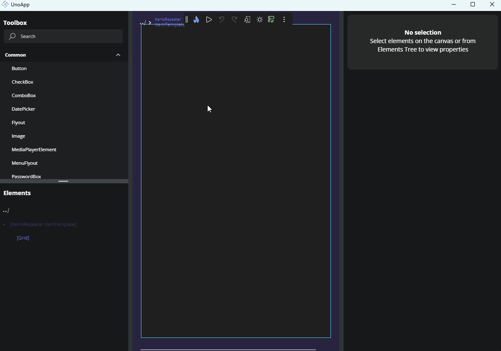
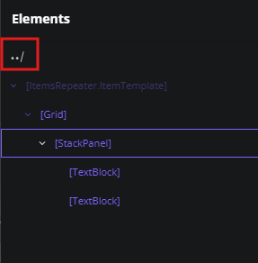
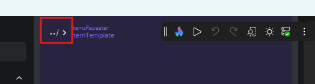
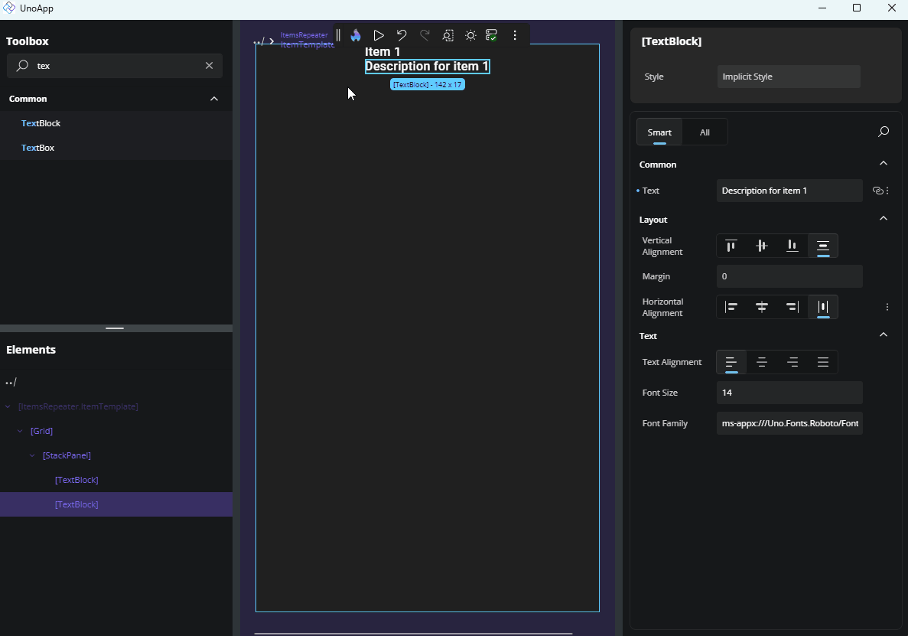

# Template Editor

## Entering the Template Editor

For properties that accept a template-like `ItemTemplate` in an `ItemsRepeater`, or `ContentTemplate` in a `ContentControl` - you can use the **Template Editor** to visually build and customize the template content.

To open the Template Editor, click the **Create** button next to the property in the Properties panel. If a template already exists, the button will say **Edit** instead. Clicking it takes you into the dedicated template editing area.

## Using the Template Editor

The template editor opens a separate canvas where you can design and preview the structure of your template without affecting the rest of the UI.

From here, you can:

- Drag and drop elements from the **Toolbox** into the **Tree view** or directly onto the **Canvas**.
- Build the visual structure using standard controls and layout containers.
- Bind UI elements to data by selecting a control, opening the **Advanced Flyout** for a property, and choosing from the available bindings based on the template's `DataContext`.

  If your control already has a data source (e.g., an `ItemsRepeater` bound to a list), those data properties will be accessible within the template for binding.

## Leaving the Template Editor

To exit the template editor and return to the main layout:

- Click the **Back** icon at the top-left of the Canvas area, or

  

- Use the **Back** icon in the top-left of the Tree view.

  

Once you return, the control’s template will be updated with your changes, and you’ll see them reflected in the main design view.

## Next Steps

- **[Different Editors](xref:Uno.HotDesign.Properties.Editors)**

  The Properties panel automatically selects the editor best suited for each property’s data type. Visit this page to explore all available editor types and when to use them.

- **[Advanced Flyout Editor](xref:Uno.HotDesign.Properties.AdvancedFlyout)**

  Use the **Advanced Flyout** to choose how a property value is provided: enter a literal **Value**, set up a **Binding**, reference a **Resource**, or apply **Responsive Extensions** for adaptive layouts.

- **[Responsive Extensions](xref:Uno.HotDesign.Properties.AdvancedFlyout.ResponsiveExtensions)**

  **Responsive Extensions** let you define multiple values for a single property based on screen size or form factor, ensuring your UI adapts seamlessly across devices.

- **[Counter App Tutorial](xref:Uno.HotDesign.GetStarted.CounterTutorial)**

  A hands-on walkthrough for building the [Counter App](xref:Uno.Workshop.Counter) using **Hot Design**, showcasing its features and workflow in action.
