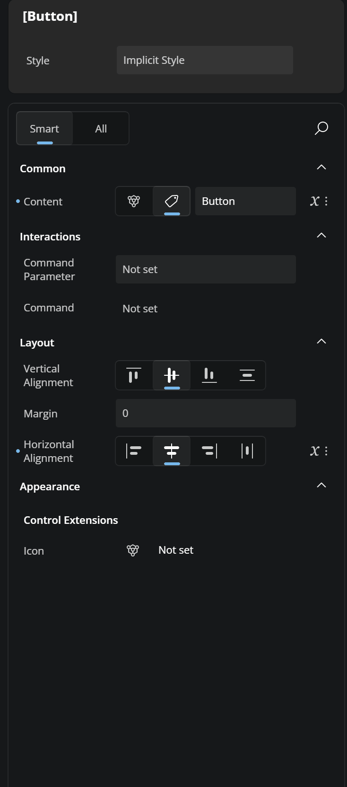
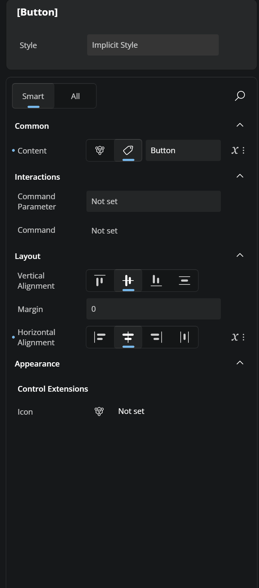
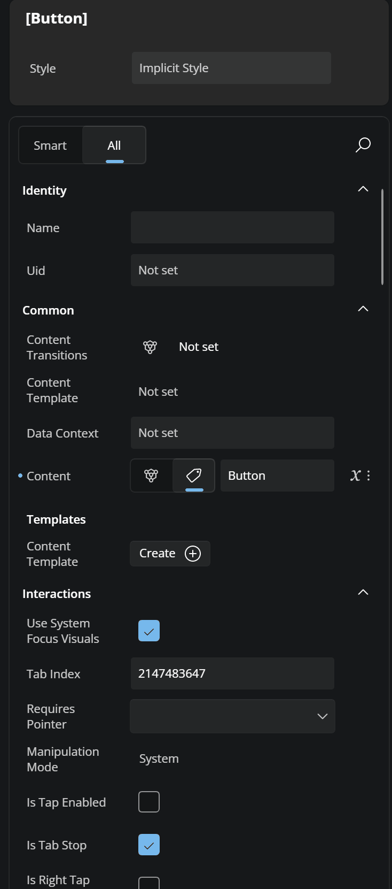
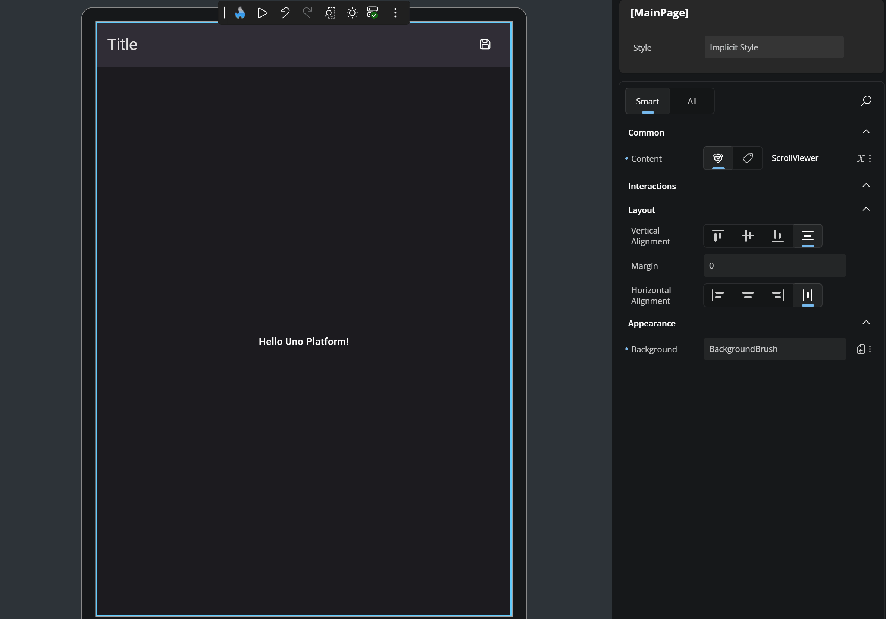
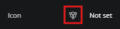
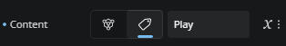
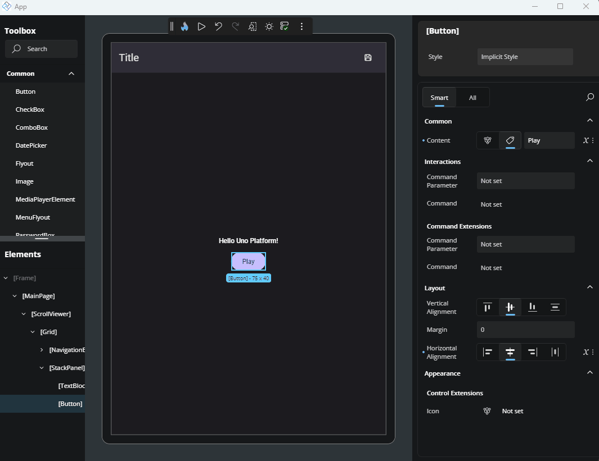
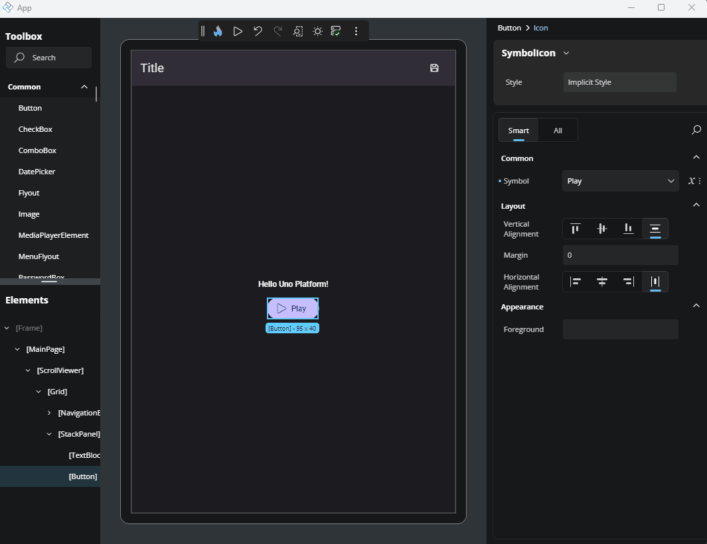

# Properties

## General

The Properties window allows you to view and edit the attributes of any element selected on the canvas or in the Elements window. As soon as an element is selected, its properties are loaded into the Properties window, allowing you to make changes based on the property's type and expected value.

### Search

You can quickly find a specific property by using the search box located below the **Style** section. To open the search input, click on the magnifying glass icon. As you type the property's name, the results will be filtered in real time. To clear your search, click the **X** button inside the search box.

### Smart and All tabs

At the top of the Properties window, you'll see two tabs: **Smart** and **All**.
- **Smart** displays the most commonly adjusted properties for the selected element, providing quicker access for typical use cases.
- **All** shows the complete list of properties available for that element.
Just click the tab you want to switch views.

### Expandable Sections

To make things easier to navigate, properties are grouped into sections such as *Identity*, *Common*, *Templates*, *Interactions*, and others - depending on the selected element. You can expand or collapse these groups by clicking the arrow next to the group title. This helps reduce visual clutter and lets you focus only on the property groups you're working with.

### Assistive Text

If you enter something wrong in a property, a message will show up just below it. A yellow message means a warning, and a red one means an error. This helps you understand what went wrong so you can fix it quickly. <!-- TODO: Add screenshot?  -->

## Applying Styles

You can apply predefined styles to your elements. To do this, go to the Style section at the top of the Properties window. There you'll see a field called "Implicit Style." Click it to view the available styles for the selected element, or type in the name to filter the list. Once you click a style, it will be applied to your element. To remove it, click the more options icon next to the field and choose "Reset."

## Editors <!-- TODO: Should be in another page? -->

### DropDown

### TextField

### CheckBox

### Complex Types

Some properties support more advanced content types, also known as *Complex Types*. These are used when a property can accept a more structured element instead of just a simple value.

A common example is when setting an icon for a control. Instead of just choosing a predefined symbol, you might want to use a `BitmapIcon`, `FontIcon`, `SymbolIcon`, `PathIcon`, or another `IconElement`. When a property supports this, a specific **Complex Type icon** will appear next to it.

Another case for Complex Types is when defining the `Layout` property of an `ItemsRepeater` element.

In some cases, a property might support both a literal value (like a string or number) *and* a Complex Type. When that happens, both the Complex Type icon and a tag icon (representing the literal mode) will be visible. You can choose either approach by clicking the corresponding icon.

### Editing a Complex Type

To edit a Complex Type, simply click the icon. The Properties window will switch to a new view. At the top, you’ll see a dropdown listing all available Complex Types for that property. Click the arrow to browse the options. Once you've selected a type, the UI will show the editable properties for that specific Complex Type.

### Leaving the Complex Type editor
After you're done, to return to the default Properties view, just click the name of the main element you're editing, shown in the top-left breadcrumb area of the Properties window. You'll then see that the chosen Complex Type appears next to the property, confirming it's been set.

