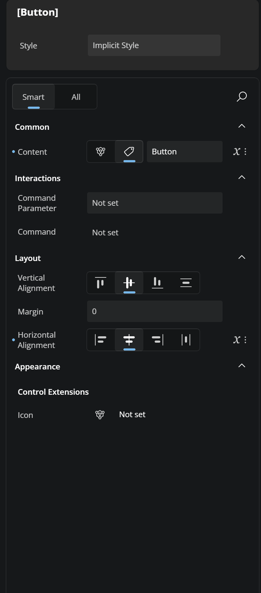
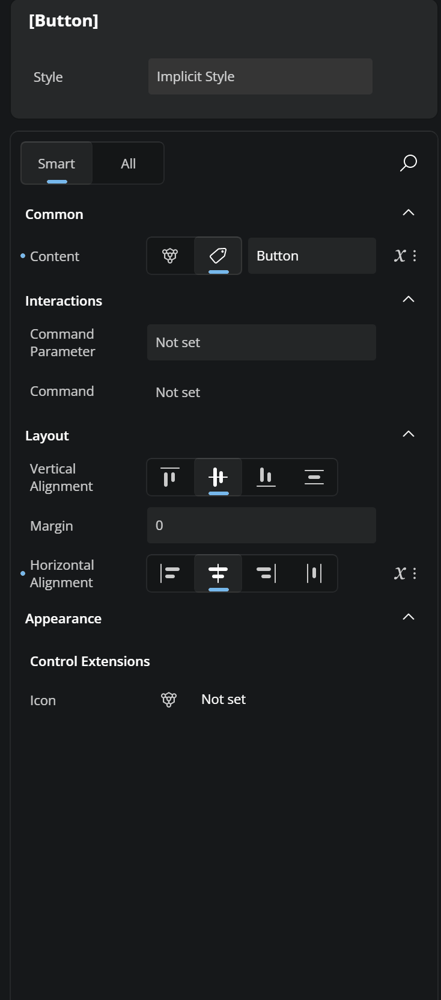
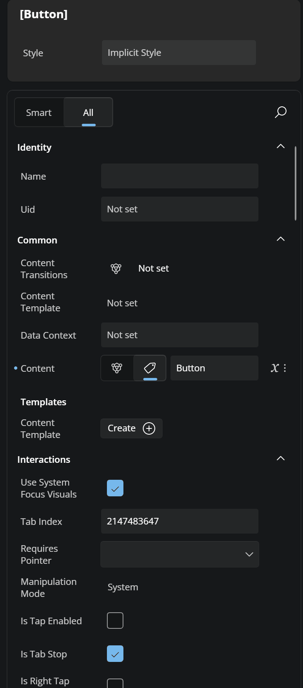
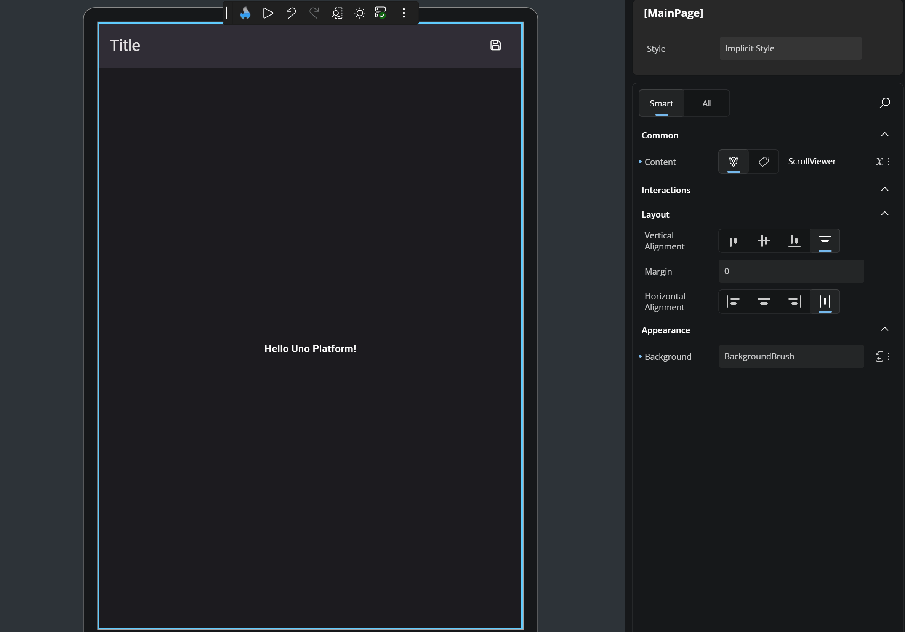

# Properties

## General

The Properties panel allows you to view and edit the attributes of any element selected on the canvas or in the Elements panel. As soon as an element is selected, its properties are loaded into the Properties panel, allowing you to make changes based on the property's type and expected value.

### Search

You can quickly find a specific property by using the search box located below the **Style** section. To open the search input, click on the magnifying glass icon. As you type the property's name, the results will be filtered in real time. To clear your search, click the **X** button inside the search box.

### Smart and All tabs

At the top of the Properties panel, you'll see two tabs: **Smart** and **All**.

- **Smart** displays the most commonly adjusted properties for the selected element, providing quicker access for typical use cases.
- **All** shows the complete list of properties available for that element.

Just click the tab you want to switch between views.

### Expandable Sections

To make things easier to navigate, properties are grouped into sections such as *Identity*, *Common*, *Templates*, *Interactions*, and others - depending on the selected element. You can expand or collapse these groups by clicking the arrow next to the group title. This helps reduce visual clutter and lets you focus only on the property groups you're working with.

### Assistive Text

If you enter an incorrect value in a property, a message will show up just below it. A yellow message means a warning, and a red one means an error. This helps you understand what went wrong so you can fix it quickly. <!-- TODO: Add screenshot?  -->

## Applying Styles

You can apply predefined styles to your elements. To do this, go to the Style section at the top of the Properties panel. There you'll see a field called "Implicit Style". Click it to view the available styles for the selected element, or type in the name to filter the list. Once you click a style, it will be applied to your element. To remove it, click the "More Options" icon next to the field and choose "Reset".

## Property Value Indicators

Each property in the Properties panel includes an **Advanced** button to the right of its value. This button uses an icon to indicate how the property's value is currently defined. It helps you quickly understand whether the value is set directly, comes from a binding, a resource, or is responsive. Here’s what each icon means:

-  — No value is set; the property is using its default value.
-  — A **Literal** or **XAML-defined** value has been set directly.
-  — A **Binding** is being used for this property.
-  — The value comes from a **Resource**.
-  — The **Responsive Extension** is used, with different values for different screen sizes (Mixed Responsive).

Clicking the **Advanced** button opens a flyout with three settings for each property: Value, Binding, or Resource. For more information on how the **Advanced Flyout** works please refer to our [Advanced Flyout docs](xref:Uno.HotDesign.Properties.AdvancedFlyout).

## Next Steps

- **[Different Editors](xref:Uno.HotDesign.Properties.Editors)**

  The Properties panel automatically selects the editor best suited for each property’s data type. Visit this page to explore all available editor types and when to use them.

- **[Advanced Flyout Editor](xref:Uno.HotDesign.Properties.AdvancedFlyout)**

  Use the **Advanced Flyout** to choose how a property value is provided: enter a literal **Value**, set up a **Binding**, reference a **Resource**, or apply **Responsive Extensions** for adaptive layouts.

- **[Template Editor](xref:Uno.HotDesign.Properties.TemplateEditor)**

  The **Template Editor** provides a visual canvas for creating and customizing control templates, enabling you to design complex UI structures without hand-coding XAML.

- **[Responsive Extensions](xref:Uno.HotDesign.Properties.AdvancedFlyout.ResponsiveExtensions)**

  **Responsive Extensions** let you define multiple values for a single property based on screen size or form factor, ensuring your UI adapts seamlessly across devices.

- **[Counter App Tutorial](xref:Uno.HotDesign.GetStarted.CounterTutorial)**

  A hands-on walkthrough for building the [Counter App](xref:Uno.Workshop.Counter) using **Hot Design**, showcasing its features and workflow in action.
