# Toolbar

The **Hot Design® Toolbar** is your main control panel when working in the Uno Platform’s live design environment.

  

Positioned at the top of the interactive canvas, it provides fast, intuitive access to tools that help you:

- Instantly **enter or exit** Hot Design® mode to work directly with a live app.
- **Play and pause** the running application without restarting.
- **Switch themes** and **simulate different device sizes** to test UI responsiveness.
- Use **undo and redo** to iterate quickly and safely.
- Monitor **connection status** and Hot Reload activity.
- Access **layout and view options** to customize your workspace.

Whether you're fine-tuning the layout, testing behavior, or previewing responsiveness, the Toolbar keeps your most important actions one click away, helping you iterate faster and stay focused on design.

Below is a breakdown of every button and what it does:

## 1. Diagnostics Overlay

Hot Design® surfaces a small **Diagnostics Overlay** on top of your running app window.

  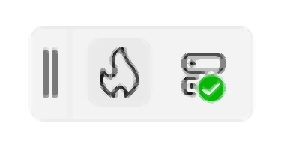

This overlay:

- Hosts the **Enter Hot Design®** flame button.  Entry point to the Hot Design®.
- Shows current **connection status** and [Hot Reload](xref:Uno.Platform.Studio.HotReload.Overview) activity.
- Keeps essential controls always within reach—without cluttering the main [Canvas](xref:Uno.HotDesign.Canvas).

By default, the overlay appears in the **top-left** corner, but it won’t block your UI:

### 1.1 Repositioning the Overlay

You can **drag** the entire overlay (click and hold its header area) to any edge of the window—move it left, right, or top—to free up space while you edit.

#### Quick Visual Guide

  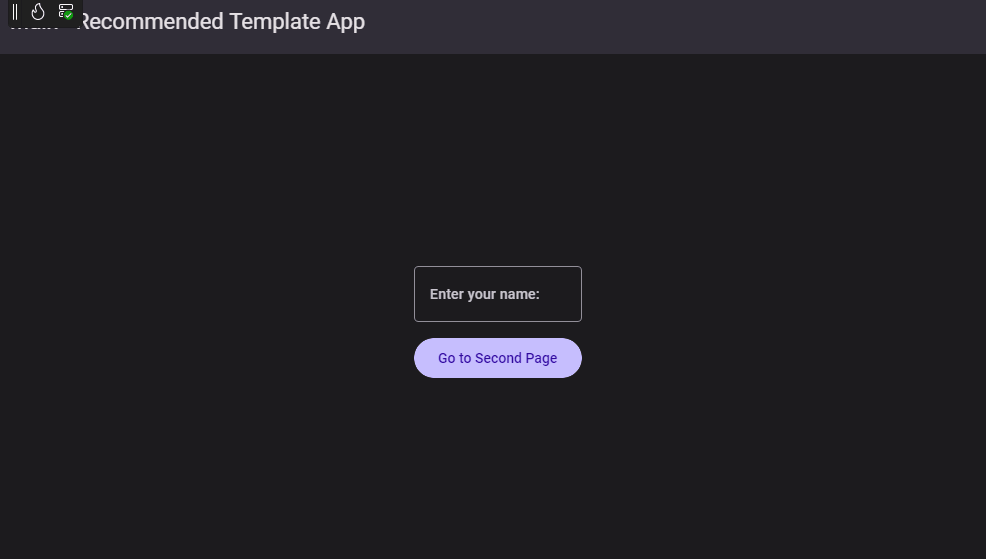

## 2. Enter & Exit Hot Design®

Within the **Diagnostics Overlay**, you’ll see the familiar **flame icon**:

**Enter Hot Design®**

- Click the flame icon to launch **Hot Design mode**.
- Your running app’s UI becomes live–editable: move, style, and tweak XAML directly in the canvas.

 

**Exit Hot Design®**

- When you’re done editing, click the same flame icon (now highlighted) to leave Hot Design® mode.
- You’ll return to the usual code editor, with your app still running in the background.

  

### 1.1 Why Toggle?

- Keep your focus: switch instantly between design without rebuilding and your live app.
- Stay in context: your last UI state remains visible when you exit.

#### Quick Visual Guide

  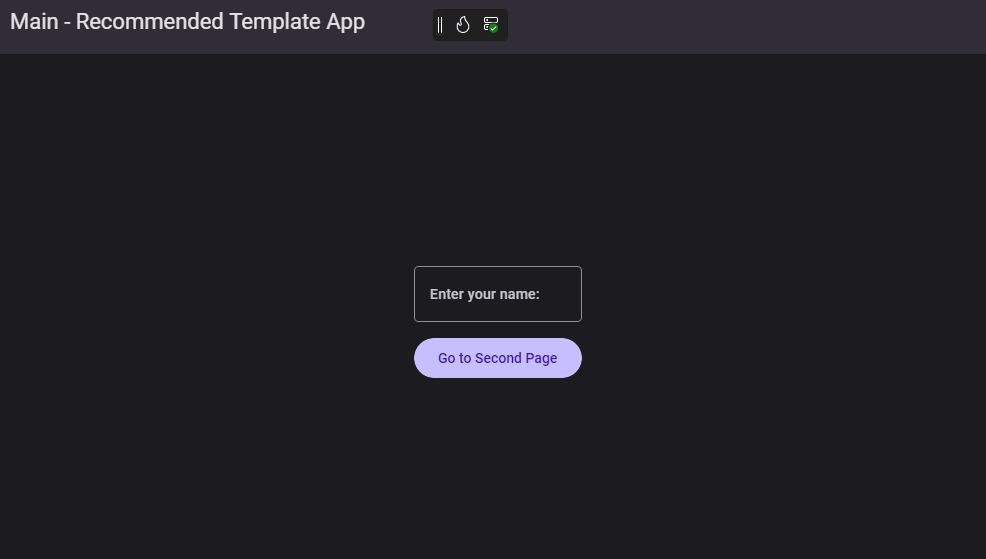

## 3. Play & Pause

The **Play/Pause** toggle lets you switch between editing your app live in Hot Design® and previewing the final, running experience.

**Play**: Activate Hot Design® mode.
  While playing, you can use Hot Design® to:

- Adjust properties in the [Property Grid](xref:Uno.HotDesign.Properties).
- Drag new controls from the [Toolbox](xref:Uno.HotDesign.Toolbox) onto the [Canvas](xref:Uno.HotDesign.Canvas).
- Navigate and select elements in the [Elements](xref:Uno.HotDesign.Elements).
- Interact directly with UI elements on the [Canvas](xref:Uno.HotDesign.Canvas) (resize, move, style).

 

**Pause**: Deactivate Hot Design® editing and return to the live app view.

- See all your XAML changes applied in the running application.
- Test animations, data bindings, and navigation exactly as end users will.
- You can click on any Panels to return to Play mode.

  

### When to Use Each Mode

- **Play**
  Use this mode to iteratively **build and refine** your UI.
  Every tweak you make—whether adjusting a margin in the Property Grid or dragging a new button onto the canvas—applies instantly.

- **Pause**
  Switch here when you want a **true preview** of the running app.
  It’s the best way to validate behavior, animations, and overall look & feel after you’ve made a series of edits.

#### Quick Visual Guide

  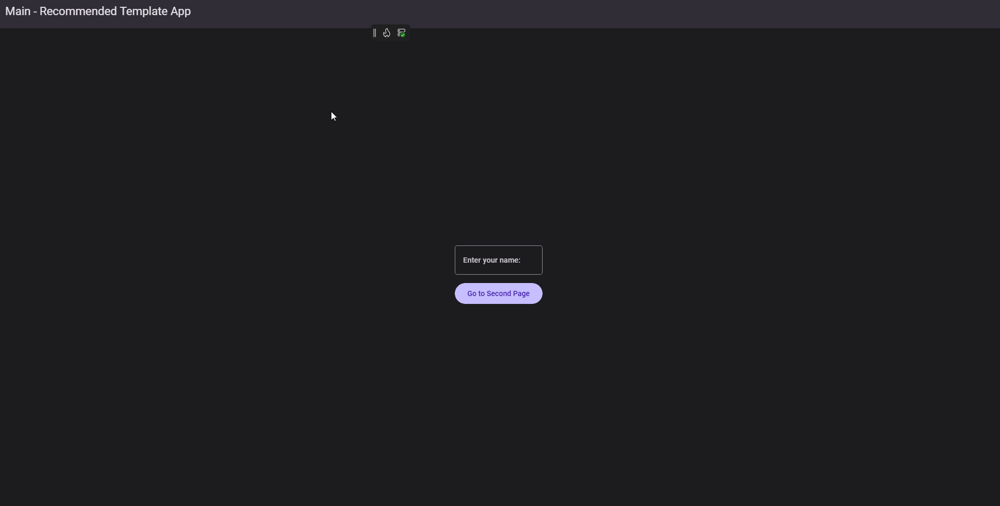

## 4. Undo & Redo

Easily roll back or reapply changes you’ve made in Hot Design:

- **Undo**
  Reverts your last action—whether you moved a control, tweaked a margin, or updated a style.
  Perfect for moments when a tweak didn’t turn out as expected.

  

- **Redo**
  Restores an action you just undid.
  Handy if you hit Undo too many times or want to compare before/after states without redoing your work manually.
  Or when the next change is better than the previous one.

  

### Examples of use

- You adjust a button’s Background and it breaks your layout: hit **Undo** to quickly get back.
- You realize the previous Background was better: hit **Redo** to reapply it.

#### Quick Visual Guide

  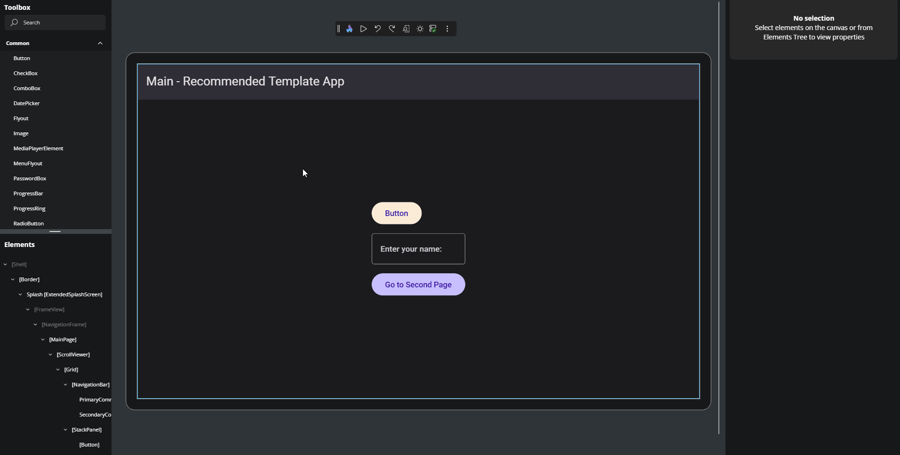

## 5. Designer Settings

The **Designer Settings** area lets you tailor the Hot Design® canvas to match any target device or viewing preference.

  

This is the full window when click on the Designer Settings,
where you can test responsive layouts and comfortable viewing:

  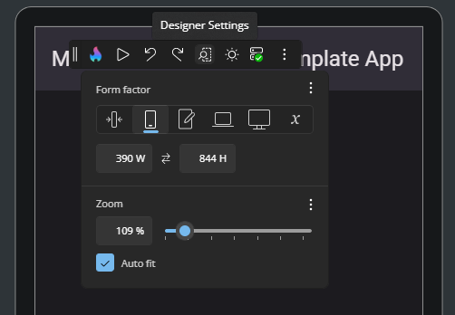

### Form Factor

Click the device-frame icon to choose phone, tablet, desktop, or watch simulations.
Or you can change to a custom-size and use exact width/height to match any target screen.

  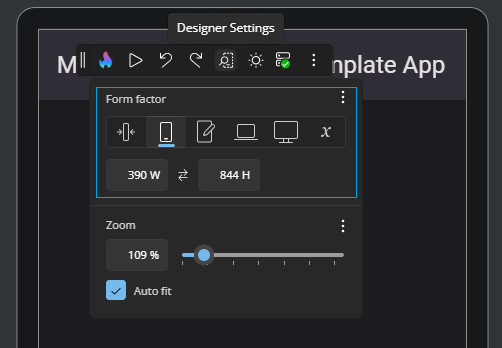

Adjust how you view and test your UI across devices and scales:

- **Narrowest (IoT)**
Simulates very small screens (149 × 298 px).

Ideal for embedded or IoT scenarios where every pixel counts and UI elements must be ultra-compact.

- **Narrow (Phone)**
Emulates a typical smartphone portrait view (390 × 844 px).

Use this to verify touch targets, navigation bars, and mobile-specific layouts.

- **Normal (Tablet)**
Represents a standard tablet portrait orientation (768 × 1 024 px).

Great for multi-pane designs, responsive grids, and ensuring content scales gracefully.

- **Wide (Laptop)**
Mimics a laptop or small desktop window in landscape (768 × 1 024 px).

Useful for verifying menus, toolbars, and wider aspect ratios.

- **Widest (Desktop)**
Covers large desktop and high-resolution displays (1 080 × 1 920 px).

Perfect for full-screen layouts, complex dashboards, and widescreen presentations.

- **Custom**
Use custom input fields where you can enter any width and height, or easily toggle between width and height.

Use this to match unusual screen sizes or prototype future device form factors.

#### Keyboard Shortcuts

Here are the convenient key combinations you can use anywhere in Hot Design® to control Form Factor custom Size:

- **Ctrl + Shift + 0** - Window Size
Set to the Size of the full window.

- **Ctrl + Shift + 1** - Canvas Size
Set to the Content area size - Calculated if you change the content area (eg. closing the Property Grid Panel - Shortcut: Control + Shift + P)

  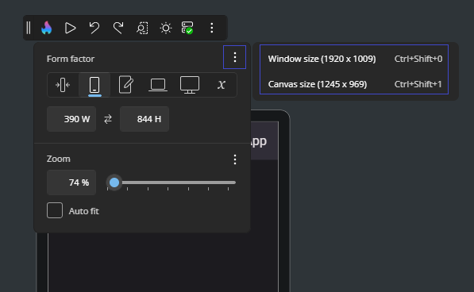

### Zoom

On the zoom menu you can select a custom percentage or use the Slider to set the Zoom level.

Great for focusing on fine details or getting an overview of the full layout.

  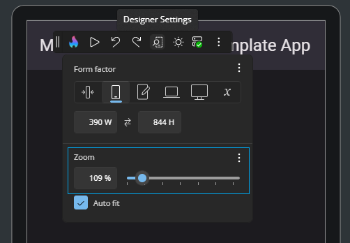

#### Keyboard Shortcuts

Here are the convenient key combinations you can use anywhere in Hot Design® to control zoom and fitting:

- **Ctrl + Plus ( + )** - Zoom in
- **Ctrl + Minus ( – )** - Zoom out
- **Ctrl + 0** - Fit the canvas to your window
- **Ctrl + 1** - Zoom to 100%
- **Ctrl + 2** - Zoom to 200%
- **Ctrl + 3** - Zoom to 300%
- **Ctrl + 9** - Toggle **Auto-Fit** on or off

> **Tip:** You can also hold **Ctrl** and scroll the mouse wheel to zoom in or out dynamically.

  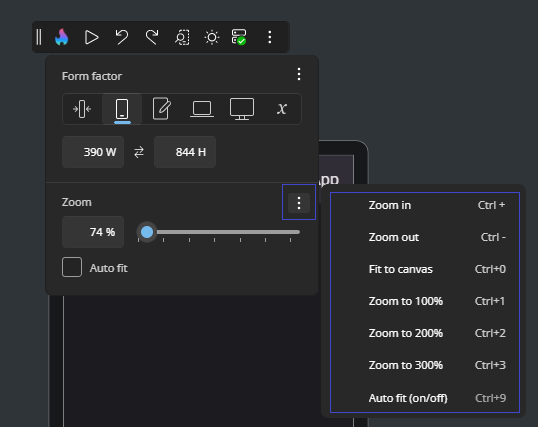

### Auto-Fit

When **Auto-Fit** is enable the entire canvas scales to your window.
Great for focusing on fine details or getting an overview of the full layout.

  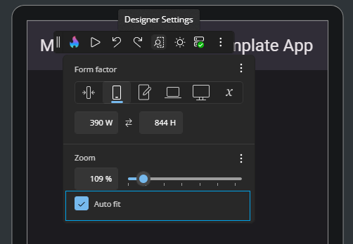

### Why it matters

- Verify that your UI adapts across screens without pixel-perfect builds.
- Maintain legibility while designing by zooming in on tricky details or zooming out for context.

#### Quick Visual Guide

  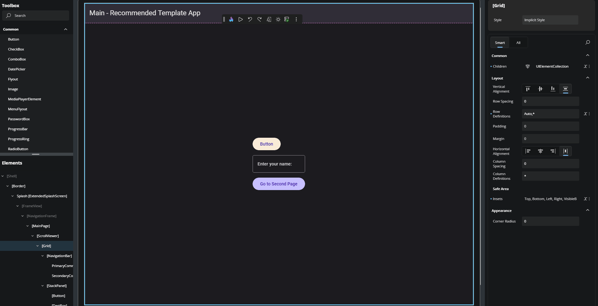

## 6. Theme Toggle

Easily switch between **Light** and **Dark** modes within the designer, with no need to change your operating system or IDE theme.

This option helps you preview and validate how your layouts will appear in both light and dark environments, making it easier to spot issues like missing contrast, transparency glitches, or unreadable text.

- **Light Theme**
Renders the canvas using the system **light** theme for bright, clean visuals.

  

- **Dark Theme**
Renders the canvas using the system **dark** theme for a modern, eye-friendly UI.

  

### Why it matters

Designs that look good in one theme can break in another. This toggle lets you verify your UI against both modes quickly—ensuring contrast ratios, icons, and styles adapt properly across the board.

#### Quick Visual Guide

  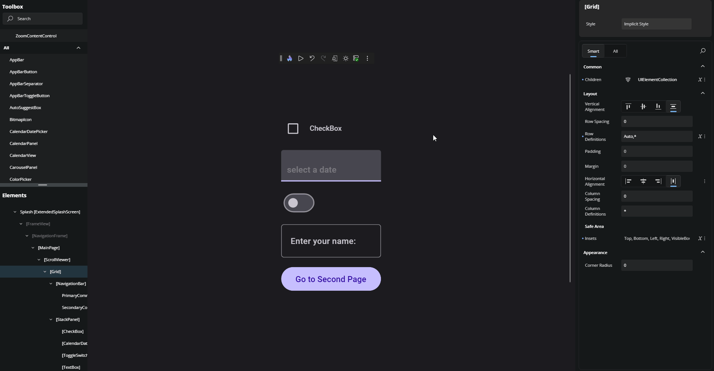

## 7. Connection & Hot Reload Status

The connection status icon gives you real-time feedback on whether Hot Design® is actively connected to your app and if Hot Reload is functioning correctly.

  

The icon updates dynamically to reflect the current state:

- **Initializing** – Hot Design® is setting up the connection to your running app.
- **Ready** – Connected and ready to push live updates as you work.
- **Unlicensed** – Hot Reload is unavailable due to a missing or invalid license.
- **Disabled** – Hot Reload has been turned off or failed to initialize.

Clicking the status icon opens the **event log panel**, which shows a timeline of key events during your session.

This log provides:

- Detailed **status updates**, including successful reloads, warnings, and errors.
- **Timestamps** for each event, helping you trace what happened and when.
- Insights to help you understand and troubleshoot any issues with sync or live changes.

### What to look for

- The **status icon** visually changes depending on the current connection state.
- A **Hot Reload notification** appears when important events occur (e.g., failed update, reload blocked).
- Hover over events in the log panel to get extra context and error messages.

Use this feature to keep track of your live design updates and identify any problems quickly.

#### Quick Visual Guide

  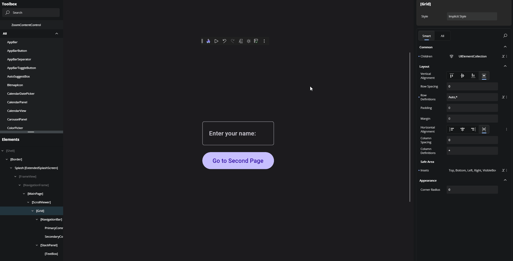

## 8. More Options

Clicking the three-dot icon opens the **More Options** menu, giving you full control over your Hot Design® workspace, access to help resources, and quick links for feedback.

  

Here you can find:

- **Windows**
  Toggle panel visibility to focus on what matters:
  - **Show Tools In-App**: dock Properties, Assets, Live Visual Tree inside the canvas or disable to open a external window.
  - **All**: show or hide every tool panel at once (Ctrl + Shift + A)
  - **Toolbox**: toggle the ToolBox (List of Elements to Drag and Drop to your application) visibility (Ctrl + Shift + T)
  - **Elements**: toggle the Elements (Live Visual Tree of all Elements) visibility (Ctrl + Shift + E)
  - **Properties**: toggle the Property Grid (Where you can change all Properties values) visibility (Ctrl + Shift + P)

- **Help**
  - **Documentation**

    Find guidance and tutorials:
    - **Overview**: high-level Hot Design® guide
    - **Getting Started**: step-by-step introduction
    - **Counter App Tutorial**: hands-on example
  
  - **Feedback**  
    Share your experience or suggest improvements:
    - **Report an issue/bug**: open an external window to Create new **Bug** issue on GitHub
    - **Suggest a feature**:  open an external window to Create **Enhancement Request** new  issue on GitHub
    - **Ask a question**: open an external window to Uno Platform Studio Discussions page

  - **Community & Resources**
    Quick links to stay connected:
    - **Discord server**: open an external window to Discord Community
    - **YouTube channel**: open an external window to Youtube channel, where you can see the more recent Uno Platform videos.

  - **Legal & About**
    View policies and version info:
    - **Privacy Policy**: open an external window to Uno Platform Privacy Policy
    - **Terms of Use**:  open an external window to Terms of Use for Uno Platform Websites & Apps

### Quick Visual Guide

  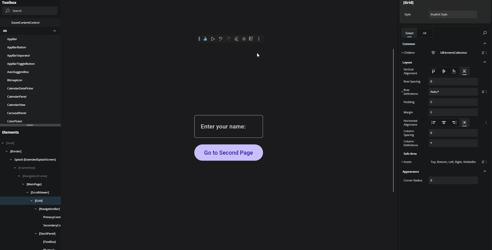

## Next

- [Toolbox](xref:Uno.HotDesign.Toolbox)
