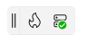
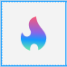
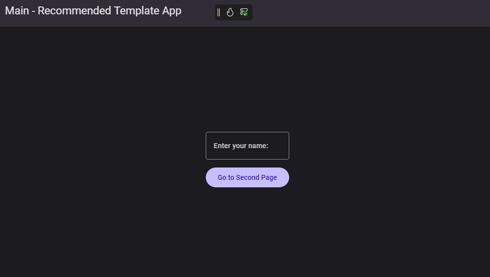
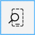
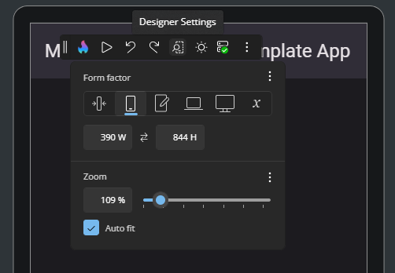
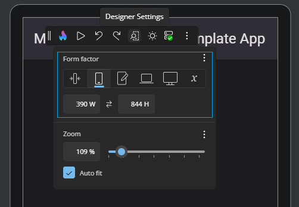
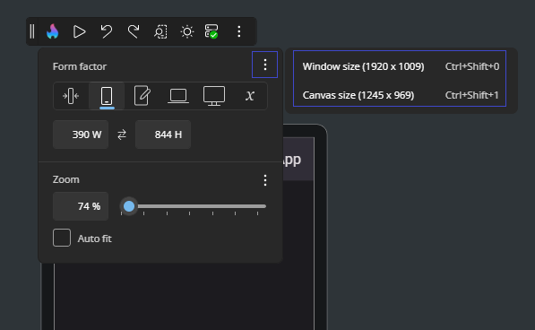
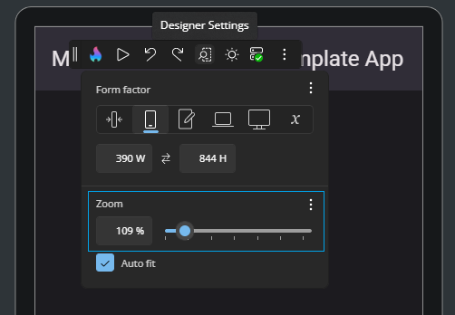
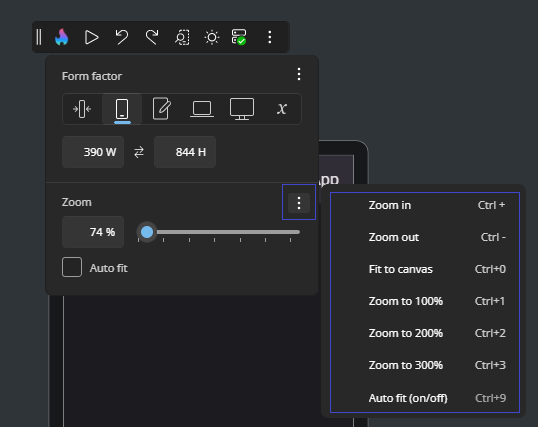
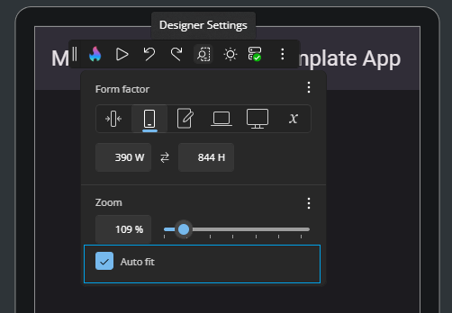

# Toolbar

The **Toolbar** gives you quick access to the most important tools while using Hot Design. Positioned at the top of the interactive canvas by default, it lets you switch modes, test your running app, adjust layout settings, toggle themes, and manage your workspace efficiently, all without stopping your design flow.

  

Sections below explain each feature available from the **Toolbar** and how it helps during your UI design session.

## Move the Toolbar

By default, the **Toolbar** appears docked in the **top-left corner** of your running app window. It gives you quick access to Hot Design tools without interrupting your layout.

  

You can reposition the **Toolbar** to better fit your workflow:

- Click and hold the **side of the Toolbar** where the `||` icon appears.
- Drag it to the **top**, **bottom**, **left**, or **right** edges of the running app window.
- This helps keep design tools accessible while avoiding overlap with parts of your UI you want to focus on.

  

## Enter and Exit Hot Design

Click the flame icon in the **Toolbar** to toggle Hot Design mode.

-  **Enter**: Activates live editing and lets you interact with the app UI directly on the **Canvas**.
-  **Exit**: Returns to your running app view while keeping the app state intact.

  

## Play and Pause Your App

The **Play** and **Pause** buttons let you switch between two modes while using Hot Design:

-  **Play**: Enters **interactive mode**, allowing you to test your running app. You can interact with the UI, trigger navigation, test bindings, and validate animations, all without leaving Hot Design.

-  **Pause**: Returns you to **selection/editing mode**, where you can adjust layout, modify properties, and refine the structure of your UI.

Click **Play** to preview your new updates, then **Pause** to continue designing.

  

## Undo and Redo Changes

Undo or redo changes made during your Hot Design session:

-  **Undo**: Reverts the last edit (e.g., moved control, property change).
-  **Redo**: Reapplies an undone action.

  

## Adjust Form Factor and Zoom Settings

Click the  **Designer Settings** icon to open the form factor and zoom options.

  

  

### Form Factor

Use the Form Factor settings to preview how your app UI will adapt across different screen sizes and device types. You can choose from preset device categories or define a custom width and height.

  

Preset options include:

- **Narrowest (IoT)** – Simulates ultra-compact embedded or IoT devices (149 × 298 px). Useful for validating minimal layouts with strict space constraints.
- **Narrow (Phone)** – Emulates a typical smartphone in portrait mode (390 × 844 px). Good for testing mobile responsiveness and touch-friendly controls.
- **Normal (Tablet)** – Represents a standard tablet (768 × 1024 px). Ideal for multi-column layouts, responsive grids, or medium-screen breakpoints.
- **Wide (Laptop)** – Mimics a desktop/laptop window in landscape orientation (1024 × 768 px). Use this to check menu bars, toolbars, and side navigation.
- **Widest (Desktop)** – Emulates a large screen or full desktop monitor (1920 × 1080 px). Perfect for dashboards, data-heavy views, or widescreen layouts.
- **Custom** – Enter any specific width and height manually. Great for prototyping non-standard screens or future devices.

#### Keyboard Shortcuts

You can quickly toggle between sizing modes using the following shortcuts:

- **Match the window size**:

  `Ctrl + Shift + 0` (or `Cmd + Shift + 0` on macOS)
- **Match the canvas content area size**:

  `Ctrl + Shift + 1` (or `Cmd + Shift + 1` on macOS)

  

### Zoom

Use the zoom controls to scale the **Canvas** view for better visibility. You can select a preset percentage, use the zoom slider, or apply shortcuts to quickly fit or magnify the layout area.

  

#### Keyboard Shortcuts

You can adjust zoom using the following shortcuts:

- **Zoom in**:

  `Ctrl + +` (or `Cmd + +` on macOS)
- **Zoom out**:

  `Ctrl + -` (or `Cmd + -` on macOS)
- **Fit the canvas to your window**:

  `Ctrl + 0` (or `Cmd + 0` on macOS)
- **Zoom to 100% / 200% / 300%**:

  `Ctrl + 1` / `2` / `3` (or `Cmd + 1` / `2` / `3` on macOS)
- **Toggle Auto-Fit**:

  `Ctrl + 9` (or `Cmd + 9` on macOS)
- Or **hold** `Ctrl` (or `Cmd` on macOS) and scroll with your mouse or trackpad

  

#### Auto-Fit

When **Auto-Fit** is enabled, the canvas scales to fit your window automatically.

  

## Switch Between Light and Dark Themes

Quickly preview your app in **Light** or **Dark** theme without changing your system or IDE settings. This helps ensure your UI adapts correctly to both themes, including text readability, background contrast, and resource behavior.

-  **Light Theme**: Uses light theme resources.
-  **Dark Theme**: Uses dark theme resources.

  

## Check Connection and Hot Reload Status

The  connection icon shows whether the **Hot Reload** dev server is actively connected to your app (based on your [Uno Platform account sign-in](xref:Uno.GetStarted.Licensing)) and functioning correctly.

Click the icon to open the event logs overlay. It displays:

- Real-time connection updates  
- **Hot Reload** activity: successful reloads, errors, and warnings  
- Timestamps and additional context for each event

For details about Hot Reload status indicators and troubleshooting tips, see the [Hot Reload Indicator documentation](xref:Uno.Platform.Studio.HotReload.Overview#hot-reload-indicator).

  

## Access More Options

Click the  **More Options** icon to open the menu.

This menu includes two sections: **Windows** and **Help**.

### Windows

- **Show Tools In-App**:

  Choose whether the Toolbox, Elements, and Properties panels appear inside the running app window or in a separate external window.

  - When tools are shown **outside** the app (in an external window), **drag-and-drop interactions** from the Toolbox into the running app are not supported.

  - On **mobile platforms** (iOS and Android), tools are displayed **outside** the app by default due to limited canvas space on mobile devices.

You can also toggle the visibility of each tool panel individually:

- **All**: Show or hide all panels

  `Ctrl + Shift + A` (or `Cmd + Shift + A` on macOS)
- **Toolbox**: Toggle Toolbox panel visibility

  `Ctrl + Shift + T` (or `Cmd + Shift + T` on macOS)
- **Elements**: Toggle Elements visual tree panel visibility

  `Ctrl + Shift + E` (or `Cmd + Shift + E` on macOS)
- **Properties**: Toggle Properties panel visibility

  `Ctrl + Shift + P` (or `Cmd + Shift + P` on macOS)

### Help

Access **Hot Design** documentation, [submit feedback](xref:Uno.Platform.Studio.Feedback), and find links to community and legal terms, all in one place directly from Hot Design.

  

## Next step

- [Toolbox](xref:Uno.HotDesign.Toolbox)
