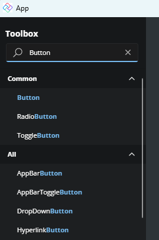
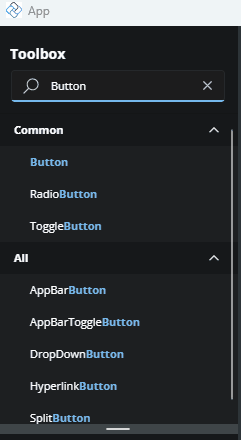
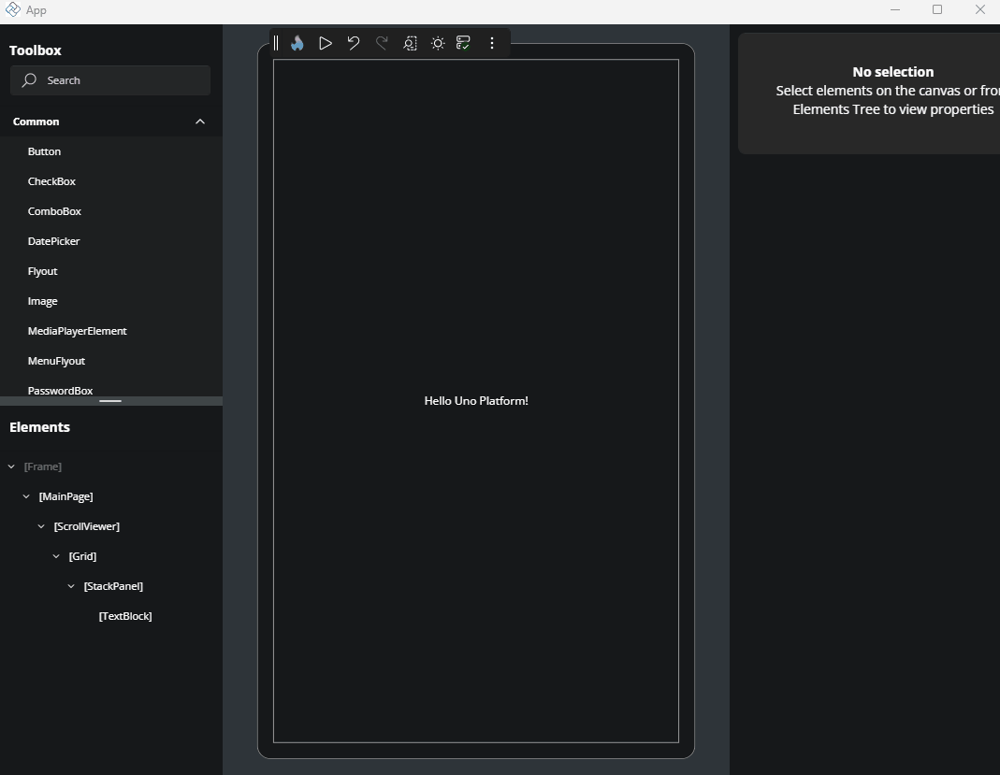
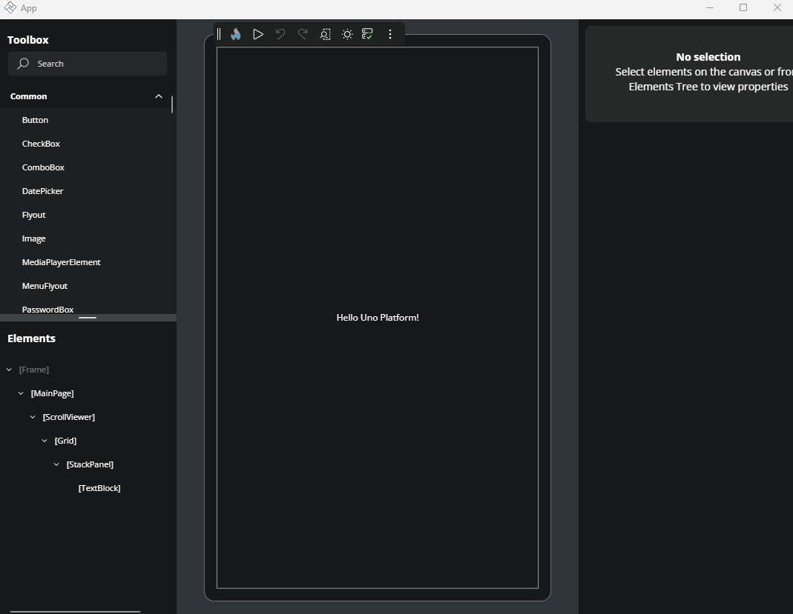
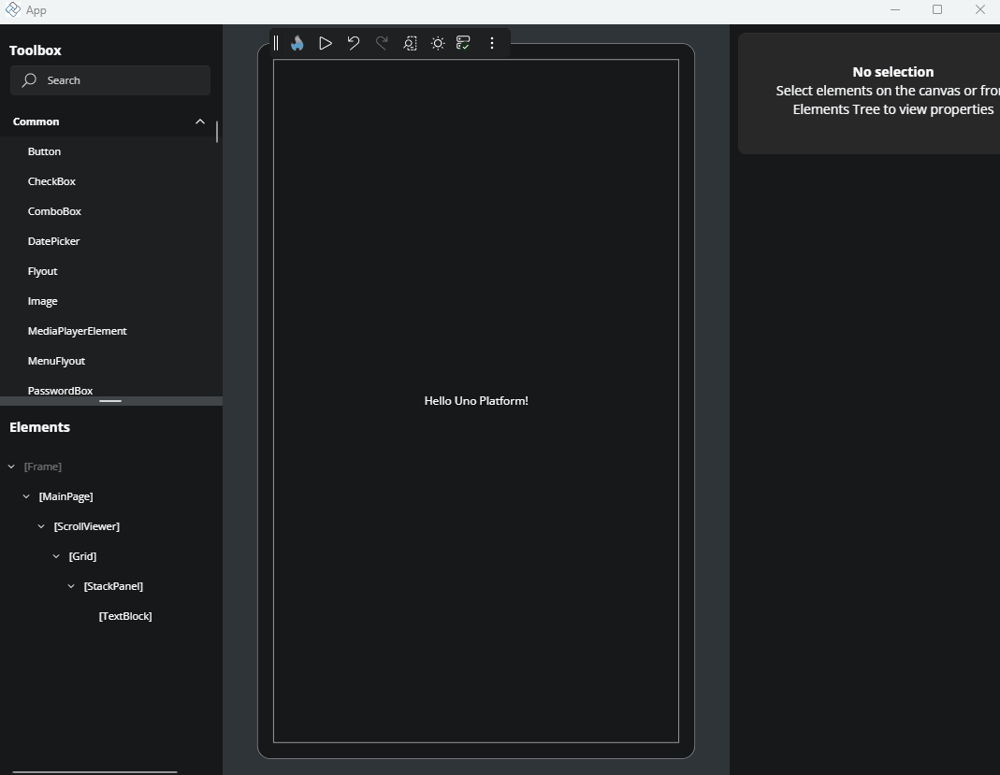

# Toolbox

The **Toolbox** is one of Hot Design’s core tools. It’s located in the top-left corner of the screen and shows a full list of all controls and elements you can add to your app. You can drag and drop these items directly into the **Canvas** or the **Elements** window, making it easy to build and organize your UI.

Below, we’ll go through some of the key features of the Toolbox.

## Search

At the top of the Toolbox, there’s a search box. As you start typing, the list below updates automatically to show matching controls or elements. This helps you find what you need quickly, without scrolling through the full list.

## Expandable Sections

When the search box is empty, the Toolbox shows all available controls and elements, organized into collapsible sections. Each section groups related items to help you find what you need more easily.

Here’s a quick overview of the main categories:

- **Common**: Includes frequently used controls in WinUI 3, such as `Button`, `CheckBox`, `TextBox`, and `ToggleSwitch`.
- **Layout**: Contains layout containers like `Grid`, `StackPanel`, and `Border` that help you organize and structure your UI.
- **Collections**: Focused on list-based controls like `ListView`, `GridView`, and `ItemsRepeater`, which are used to display collections of data.
- **Project**: Shows custom controls that exist within your current project.
- **Custom**: Lists third-party controls, grouped by their assembly name.
- **All**: Displays all controls and elements in a single, ungrouped list.

You can expand or collapse each section by clicking the arrow icon on the right side of the header.

## Adding elements to the interactive Canvas

To add a control or element to the **Canvas**, you can drag and drop the desired item from the Toolbox onto the Canvas. Drop it inside the element you want it to be a child of.

  

## Adding elements to the Elements window

To add a control or element to the **Elements** window, you can drag and drop the desired item from the Toolbox into the **Elements** window. Drop it inside the element where you want it to be a child.

  

## Adding Element via double click

Alternatively, select the parent element directly on the **Canvas** or on the **Element** window, then double-click the control in the Toolbox. It will be added as a child of the selected element.

## Next

- [Elements](xref:Uno.HotDesign.Elements)
