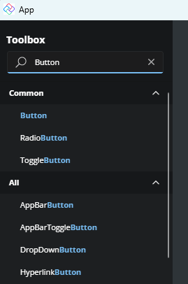
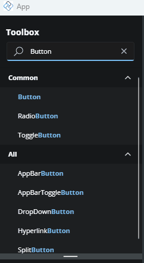
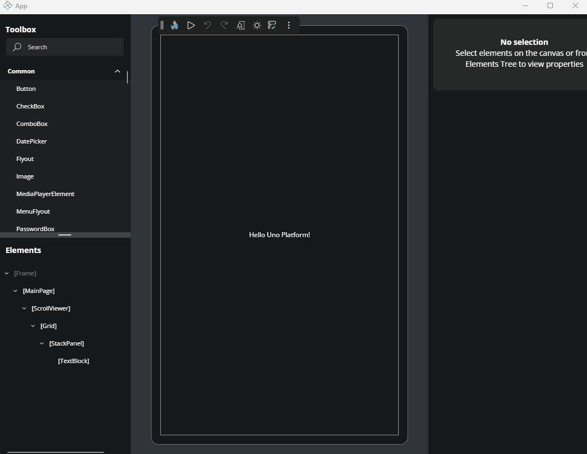

# Toolbox

The **Toolbox** panel lets you easily find and add controls and layout elements to build your app's UI. Located in the top-left corner of the Hot Design interface, it provides a searchable, categorized list of available controls that you can drag into the **Canvas** or the visual tree with the **Elements** panel.

Whether you're adding a button, creating a layout with a `Grid`, or inserting a custom control, the Toolbox helps you quickly locate and add what you need.

## Find the Right Control

At the top of the Toolbox, there’s a search box. As you type, the list instantly updates to show matching controls and elements. This helps you locate what you need without scrolling through the full list.

## Browse Controls by Category

When the search box is empty, the Toolbox displays all available controls organized into collapsible categories. These include standard WinUI 3 controls, layout containers, collection views, and any custom or third-party controls available in your project.

- **Common**: Frequently used WinUI 3 controls such as `Button`, `TextBox`, `CheckBox`, and `TextBlock`.
- **Layout**: Layout elements (called panels) like `Grid`, `StackPanel`, and `Border` are used to structure the visual hierarchy of your XAML UI.
- **Collections**: Data-bound controls like `ListView`, `GridView`, and `ItemsRepeater`, typically used to present lists or repeated content.
- **Project**: Custom user controls and components defined in your current project or solution.
- **Custom**: Third-party controls, grouped by their assembly name.
- **All**: A complete, ungrouped list of all available controls and elements in the Toolbox.

Click the arrow beside a category name to expand or collapse its contents.

## Add a Control to the Canvas

To insert a control into your layout in the interactive **Canvas**:

1. Drag a control from the **Toolbox** panel.
2. Drop it onto the **Canvas**, inside the element where you want it to appear.

## Add a Control to the Visual Tree

To insert a control into the **Elements** panel:

1. Drag a control from the **Toolbox** panel.
2. Drop it into the desired parent node in the visual tree inside the **Elements** panel.

## Insert a Control Using Double-Click

To quickly insert a control:

1. Select a parent element on the **Canvas** or in the visual tree in the **Elements** panel.
2. Double-click the wanted new control in the **Toolbox**. It will be added as a child of the previously selected element.

## Next Step

- [Elements](xref:Uno.HotDesign.Elements)
