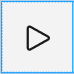
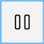
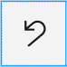
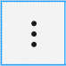

# Hot Design® Toolbar

The **Hot Design® Toolbar** is your main control panel when working in the Uno Platform’s live design environment. 
Positioned at the top of the interactive canvas, it provides fast, intuitive access to tools that help you:

- Instantly **enter or exit** Hot Design mode to work directly with a live app.
- **Play and pause** the running application without restarting.
- **Switch themes** and **simulate different device sizes** to test UI responsiveness.
- Use **undo and redo** to iterate quickly and safely.
- Monitor **connection status** and Hot Reload activity.
- Access **layout and view options** to customize your workspace.

Whether you're fine-tuning the layout, testing behavior, or previewing responsiveness, the Toolbar keeps your most important actions one click away, helping you iterate faster and stay focused on design.

  

Below is a breakdown of every button and what it does:

---

## 1. Diagnostics Overlay

Hot Design® surfaces a small **Diagnostics Overlay** on top of your running app window. 

  

This overlay:

- Hosts the **Enter Hot Design** flame button.  Entry point to the Hot Design®.
- Shows current **connection status** and **Hot Reload** activity.  [LINK TO HOT RELOAD]
- Keeps essential controls always within reach—without cluttering the main canvas. [LINK TO CANVAS]

By default, the overlay appears in the **top-left** corner, but it won’t block your UI:

### 1.1 Repositioning the Overlay

You can **drag** the entire overlay (click and hold its header area) to any edge of the window—move it left, right, or top—to free up space while you edit.

---

## 2. Enter/Exit Hot Design

Inside the Diagnostics Overlay is the **flame icon**:

Entering/Leaving Hot Design mode.

| Icon | Action                                    |
|:----:|:------------------------------------------|
|  | **Enter Hot Design** mode: Launch the interactive designer for your running app. |
|        | **Exit Hot Design** mode: Close the live designer and return to code editing. |

---

## 3. Play & Pause

Play/Pause icon

| Icon | Action                                                            |
|:----:|:------------------------------------------------------------------|
|    | **Play**: Resume the app’s runtime inside the Hot Design canvas. Use this to test animations, navigation, and logic. |
|  | **Pause**: Freeze the app at its current state so you can tweak layouts, styles, and properties without losing context. |

---

## 4. Undo & Redo

Undo/Redo changes
| Icon | Action                                            |
|:----:|:--------------------------------------------------|
|  | **Undo**: Step backwards through recent design changes. |
|  | **Redo**: Step forwards again through undone changes. |

---

## 6. Form Factor

Zoom/Form factor
Form factor
Canvas size
Canvas/Window options (more options button 3 dots)
Zoom
Percentage
Zoom options (more options button 3 dots)
Auto Fit

- **Change Form Factor**: Switch between device frames (phone, tablet, desktop, watch) to preview how your UI adapts to different screen sizes and orientations.  
- **Dropdown menu**: Click the chevron next to the icon to choose custom resolutions or rotate the current frame.

---

## 6. Theme Toggle

Light/Dark

| Icon | Action                                       |
|:----:|:---------------------------------------------|
|  | **Light Theme**: Render your app with the system light theme. |
|    | **Dark Theme**: Render your app with the system dark theme. |

---

## 7. Connection & Hot Reload Status

Dev Server status/notifications

- **Connection status**: Indicates whether Hot Design is currently connected to the running app.  
- **Hot Reload indicator**: Flashes when XAML or code changes are pushed live; hover for details on the last update.

---

## 8. More Options

Click to open the **More Options** menu, where you can:

- Toggle visibility of **Tool Windows** (Properties, Assets, Live Visual Tree).  
- Reset the Hot Design canvas to its default layout.  
- Access **Settings** for fine-tuning behavior (e.g., auto-reload on save, custom hotkeys).  
- View **About** information and version details.

More Options
Windows
In App / Show All / Show Panels
Resizable window panel sections
Help
Documentation
Feedback
Discord server
YouTube channel
Privacy Policy
Terms of Use

---

## Getting Started

1. **Open your Uno Platform project** in Visual Studio.  
2. **Build and run** in Debug configuration.  
3. **Click the Enter Hot Design** button on the Toolbar to attach the live designer.  
4. **Make XAML changes** and watch them apply instantly.  
5. Use **Play/Pause**, **Form Factor**, and **Theme** toggles to explore and refine your UI across contexts.

---

## Next Steps

- Explore more on **[???](xref:Uno.HotDesign.::;)**  