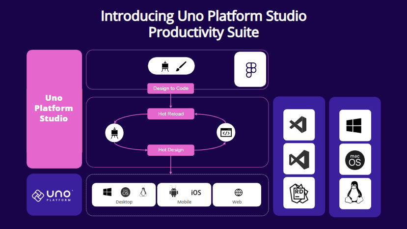

# Uno Platform Studio Overview

**Uno Platform Studio** is a set of productivity tools designed to enhance developer productivity, be it for design handoff, to radically improving developer inner dev loop with Hot Reload and the industry-first, cross-platform runtime visual designer for .NET, Hot Design®. **Uno Platform Studio** empowers developers to stay in their flow, enabling seamless cross-platform app development for every platform .NET runs on.

## **New in Uno Platform Studio 2.0**

**Hot Design® Agent** is an AI-powered assistant that enables rapid UX/UI creation and enhancement within your application. It leverages data contexts and live previews to help developers design, refine, and interact with user interfaces in real time, using deep knowledge of Uno Platform and your running app to simplify cross-platform .NET design.

To get started with **Hot Design® Agent**, jump to the [Hot Design® Agent](xref:Uno.HotDesign.Agent) page.

## What is Uno Platform Studio?

**Uno Platform Studio** revolutionizes how developers design, build, and iterate on their applications.

It includes three key tools, each purpose-built to streamline your workflow:

- **[Hot Design®](xref:Uno.HotDesign.Overview)** and **[Hot Design® Agent](xref:Uno.HotDesign.Agent)**  
  The industry-first, runtime visual designer, for cross-platform .NET Applications. Hot Design transforms your running app into a Designer, from any IDE, on any OS, to create polished interfaces with ease.

  [➜ Learn more about Hot Design®](xref:Uno.HotDesign.GetStarted.Guide)

- **[Hot Reload](xref:Uno.Features.HotReload)**  
  Reliably update any code in your app and get instant confirmation your changes were applied, with a new Hot Reload Indicator to monitor changes while you develop.

  [➜ Learn more about Hot Reload](xref:Uno.HotReload.GetStarted.Guide)

- **[Design-to-Code](xref:Uno.Figma.GetStarted)**
  Generate ready-to-use, well-structured XAML or C# Markup directly from your Figma designs with one click, completely eliminating manual design handoff.

  [➜ Learn more about Design-to-Code](xref:Uno.Figma.GetStarted)

## Why Choose Uno Platform Studio?

**Uno Platform Studio** is designed to make cross-platform development fast, seamless, and enjoyable:

- Stay in your flow by working directly in your preferred IDE and Figma design tool on any OS.
- Build apps for every platform .NET runs on.
- Streamline workflows with tools that integrate design, development, and iteration.

## What's the difference between Uno.Sdk and Uno Platform Studio?

**Uno.Sdk** is the core SDK that powers the Uno Platform, enabling you to build cross-platform applications using C# and XAML from a single project. **Uno Platform Studio** is a suite of productivity tools that enhance your development experience, including Hot Design®, Hot Reload, and Design-to-Code.

As the **Uno Platform Studio** is built on top of **Uno.Sdk**, it's only available to applications that have been created, or updated, to use the **Uno.Sdk**. If you haven't updated your project to use the **Uno.Sdk**, you can do so by following the [migration guide](xref:Uno.Development.MigratingFromPreviousReleases).

Start your journey with **Uno Platform Studio** today by **[registering an account](https://platform.uno/my-account/)**, and take your app development productivity to the next level!
