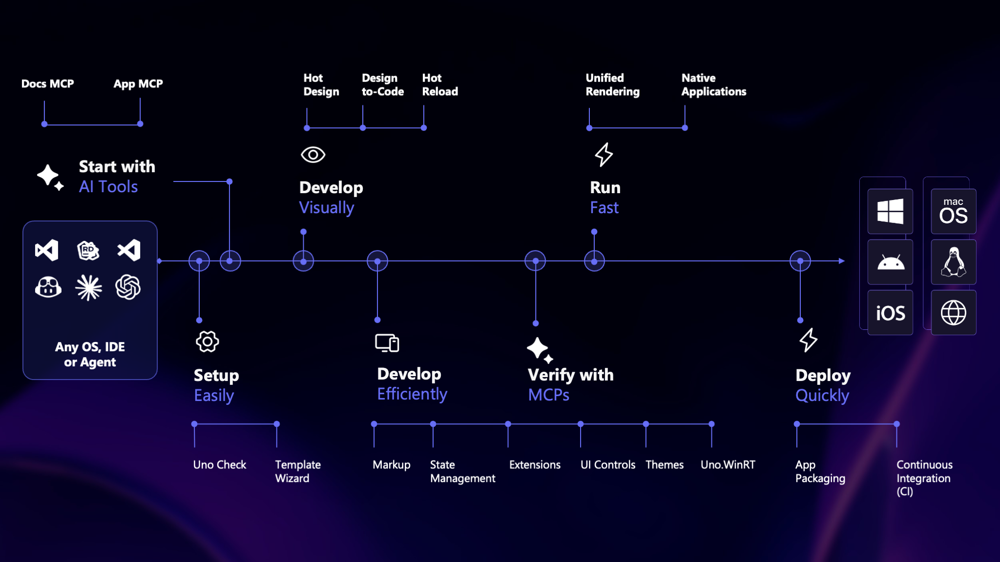

# Uno Platform Studio Overview

**Uno Platform Studio** is an AI-native productivity platform for building enterprise-grade, cross-platform .NET applications. It brings together purpose-built tools—from prompt-to-app generation and an AI development agent, to design handoff and the industry-first, cross-platform runtime visual designer for .NET, Hot Design®—so developers can design, build, and iterate on apps for every platform .NET runs on, all while staying in their flow.

## New in Uno Platform Studio 3.0: AI-native development for enterprise .NET

AI coding tools can generate code quickly, but for enterprises, generating code is not the same as building a real application. Production apps need design system awareness, live runtime context, cross-platform consistency, UI validation, and a human reviewer in the loop. Generic AI agents struggle to:

- See the live visual tree of the running application.
- Know the design system, theme, and component library the team has standardized on.
- Validate that a change renders correctly across web, desktop, mobile, and embedded targets.
- Pull context from official, version-correct Uno Platform documentation.
- Stay inside an approval workflow that a human controls.

**Uno Platform Studio 3.0** closes that gap by giving AI agents the context and validation loops they need to build real apps, through two new components that work alongside Hot Design®, Hot Reload, Design-to-Code, the Uno MCP, and the App MCP:

- **Uno Platform Studio App** — a browser-based way to go from a prompt to a working Uno Platform app in minutes, with no installs required. Start from a description—or one of the curated samples in the Gallery—watch the app build live thanks to Hot Reload, refine it through the conversation panel, then export to your preferred IDE or CLI to keep building. [Get started](xref:Uno.PlatformStudio.GetStarted)

- **Uno Platform Studio Agent** — the orchestration layer that connects AI models to the Uno Platform development workflow. It contributes deep, cross-platform .NET domain knowledge, manages context, scaffolds apps from best practices, grounds responses in the latest Uno Platform documentation, and invokes MCP tools to verify its own work. It ships with 70+ Uno Platform–specific skills—spanning themes, Material Design, MVUX state management, navigation, toolkit controls, and UI test automation—delivered through the single `uno-platform-studio` plugin for Claude Code, GitHub Copilot, and OpenAI Codex, all inside a human-in-the-loop workflow. [Learn more](xref:Uno.PlatformStudio.Skills)

## Productivity tools

**Uno Platform Studio** revolutionizes how developers design, build, and iterate on their applications by leveraging purpose-built tools that streamline your workflow:

- **[Uno Platform Studio App](xref:Uno.PlatformStudio.GetStarted)**
  Describe what you want and generate a working, well-structured Uno Platform app in the browser, then continue building in your IDE.

- **[Hot Design®](xref:Uno.HotDesign.Overview)**
  The industry-first, runtime visual designer, for cross-platform .NET applications. Hot Design® transforms your running app into a Designer, from any IDE, on any OS, to create polished interfaces with ease. Pair it with the **[Hot Design® Agent](xref:Uno.HotDesign.Agent)** for AI-powered UX/UI creation that leverages your data contexts and live previews. [Get started](xref:Uno.HotDesign.GetStarted.Guide)

- **[Hot Reload](xref:Uno.Features.HotReload)**
  Reliably update any code in your app and get instant confirmation your changes were applied, with a Hot Reload Indicator to monitor changes while you develop.

- **[Design-to-Code](xref:Uno.Figma.GetStarted)**
  Generate ready-to-use, well-structured XAML or C# Markup directly from your Figma designs with one click, completely eliminating manual design handoff. [Get started](xref:Uno.Figma.GetStarted)

- **[Uno MCP & App MCP](xref:Uno.Features.Uno.MCPs)**
  The **Uno MCP** provides structured, semantic access to Uno Platform's complete knowledge base—covering documentation, APIs, and best practices—empowering AI agents and developers with the intelligence they need to build better experiences. The **App MCP** brings intelligent automation to life by enabling AI agents to interact directly with live Uno Platform applications, creating a seamless bridge between design, development, and execution.

## Why Choose Uno Platform Studio?

**Uno Platform Studio** is designed to make cross-platform development fast, seamless, and enjoyable:

- Go from prompt to working app in minutes, then keep building in your preferred IDE.
- Stay in your flow by working directly in your preferred IDE and Figma design tool on any OS.
- Build apps for every platform .NET runs on—web, desktop, mobile, and embedded.
- Keep AI grounded in your design system, your live app, and official docs, with a human in control.
- Streamline workflows with tools that integrate design, development, and iteration.

## What's the difference between Uno.Sdk and Uno Platform Studio?

**Uno.Sdk** is the core SDK that powers the Uno Platform, enabling you to build cross-platform applications using C# and XAML from a single project. **Uno Platform Studio** is the AI-native suite of productivity tools that enhance your development experience, including the Uno Platform Studio App and Agent, Hot Design®, the Hot Design® Agent, the Uno MCP and App MCP, Hot Reload, and Design-to-Code.

As the **Uno Platform Studio** is built on top of **Uno.Sdk**, it's only available to applications that have been created, or updated, to use the **Uno.Sdk**. If you haven't updated your project to use the **Uno.Sdk**, you can do so by following the [migration guide](xref:Uno.Development.MigratingFromPreviousReleases).

Start your journey with **Uno Platform Studio** today by **[registering an account](https://platform.uno/my-account/)**, and take your app development productivity to the next level!
