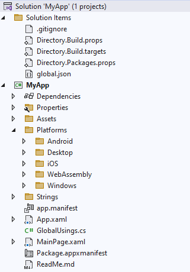

# Solution Structure

This guide briefly explains the structure of an app created with either the [`dotnet new unoapp` template](xref:Uno.GetStarted.dotnet-new) or the [Uno Platform Template Wizard](xref:Uno.GettingStarted.UsingWizard). It is particularly aimed at developers who have not worked with cross-platform codebases before.

## The project files in an Uno Platform app

After creating a new blank solution called `MyApp`, it will contain the following project:

The `MyApp.csproj` project supports Mobile (iOS/Android), WebAssembly, Desktop (macOS, Linux X11/Framebuffer, Windows 7+), and Windows App SDK targets.

You'll find below details about the contents of the solution.

### Platforms

The Platforms folder contains platform specific files for targets supported by Uno Platform:

- `Desktop` uses the [Uno Platform Skia Desktop](xref:Uno.Features.Uno.Sdk) support for Windows 7+, Linux, and macOS
- `Android` contains files and assets specific to Android Phones, Tablets, TVs, and watches
- `iOS` targets Apple's iOS devices, Phones, and Tablets
- `WebAssembly` targets the browser using WebAssembly
- `Windows` targets the [Windows App SDK](https://developer.microsoft.com/en-us/windows/downloads/windows-sdk/) to run on Windows

### Properties

This folder contains the debug profile configuration. This is used to choose where to debug your Skia Desktop app (Local Windows or WSL), the Web Server for your WebAssembly app, or Package and Unpackaged modes for Windows App SDK.

### Assets

This folder contains [all the assets](xref:Uno.Features.Assets) (images, splash screens, data, ...) that are published as part of the app.

## Other project files

- `App.xaml` and `App.xaml.cs` are the common entry point for the app. The generic app setup runtime code generally goes here.
- `MainPage.xaml` and `MainPage.xaml.cs` contain the main UI of the app.
- `GlobalUsings.cs` contains the [global usings](https://learn.microsoft.com/en-us/dotnet/csharp/language-reference/keywords/using-directive#global-modifier) define for the project.
- `app.manifest` contains [Windows specific configuration](https://learn.microsoft.com/en-us/windows/win32/sbscs/application-manifests) for `net10.0-desktop` and `net10.0-windows` targets.
- `Package.appxmanifest` contains metadata about the application such as the app name and description.

### Solution items

This solution folder contains the configuration for the whole solution:

- `global.json` contains the [.NET SDK configuration](https://learn.microsoft.com/en-us/dotnet/core/tools/global-json) as well as the Uno.Sdk version to use. See [our documentation](xref:Uno.Features.Uno.Sdk) on how to update it.
- `Directory.Build.props` and `Directory.Build.targets` contain common solution configurations applied to all projects.
- `Directory.Packages.props` contains the [NuGet Central Package Management](https://learn.microsoft.com/en-us/nuget/consume-packages/Central-Package-Management) package versions.

## Further information

See additional guides on handling platform-specific [C# code](xref:Uno.Development.PlatformSpecificCSharp) and [XAML markup](xref:Uno.Development.PlatformSpecificXaml) in an Uno Platform project.

## Next Steps

Learn more about:

- [Uno Platform features and architecture](xref:Uno.GetStarted.Explore)
- [Hot Reload feature](xref:Uno.Features.HotReload)
- [Troubleshooting](xref:Uno.UI.CommonIssues)
- [List of views implemented in Uno](implemented-views.md) for the set of available controls and their properties.
- You can head to [How-tos and tutorials](xref:Uno.Tutorials.Intro) on how to work on your Uno Platform app.
