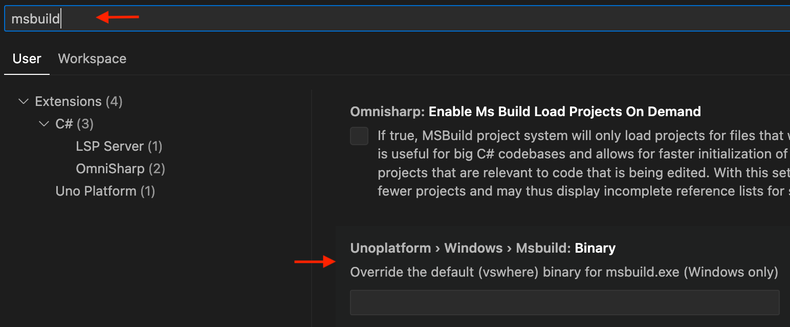

# Uno error codes

## MSBuild Errors

### UNOB0001: Cannot build with both Uno.WinUI and Uno.UI NuGet packages referenced

This error code means that a project has determined what both `Uno.WinUI` and `Uno.UI` packages are referenced.

To fix this issue, you may be explicitly referencing `Uno.UI` and `Uno.WinUI` in your `csproj`, or you may be referencing a NuGet package that is incompatible with your current project's configuration.

For instance, if your project references `Uno.WinUI`, and you try to reference `SkiaSharp.View.Uno`, you will get this error. To fix it, you'll need to reference `SkiaSharp.View.Uno.WinUI` instead.

### UNOB0002: Project XX contains a reference to Uno Platform but does not contain a WinAppSDK compatible target framework

This error code means that a WinAppSDK project is referencing a project in your solution which is not providing a `net7.0-windows10.xx` TargetFramework.

This can happen if a project contains only a `net7.0` TargetFramework and has a NuGet reference to `Uno.WinUI`.

To fix this, it is best to start from a `Cross Platform Library` project template provided by the Uno Platform [visual studio extension](xref:Guide.HowTo.Create-Control-Library), or using [`dotnet new`](xref:Uno.GetStarted.dotnet-new).

### UNOB0003: Ignoring resource XX, could not determine the language

This error may occur during resources (`.resw`) analysis if the framework does not recognize the specified language code.

For instance, the language code `zh-CN` is not recognized and `zh-Hans` should be used instead.

### UNOB0004: The $(UnoVersion) property must match the version of the Uno.Sdk defined in global.json

The build process has determined that an MSBuild property was defined to override `UnoVersion`. This property is defined by the Uno.Sdk and cannot be changed and must be updated through the `global.json` file

Follow this guide in order to [update the Uno Platform packages](xref:Uno.Development.UpgradeUnoNuget).

### UNOB0005: The Version of Uno.WinUI must match the version of the Uno.Sdk found in global.json

The build process has determined that the version of the Uno.WinUI NuGet package does not match the Uno.Sdk version. In general, restarting your IDE and compiling again will fix this issue.

Follow this guide in order to [update the Uno Platform packages](xref:Uno.Development.UpgradeUnoNuget).

### UNOB0006: The UnoFeature 'XX' was selected, but the property XXXVersion was not set

The build process has determined that you have specified an UnoFeature that requires a version to be set for a Package group such as Uno.Extensions, Uno.Toolkit.WinUI, Uno Themes, or C# Markup. Update your `csproj` file or `Directory.Build.props` with the property specified in the error along with the version that you would like to pin your build to.

### UNOB0007: AOT compilation is only supported in Release mode. Please set the 'Optimize' property to 'true' in the project file

The build process has detected that you have set the value `UnoGenerateAotProfile` to true for a build configuration that has not optimized the assembly (i.e. Debug build Configuration). You should only generate an AOT profile from a build Configuration that will optimize the assembly such as the Release build Configuration.

### UNOB0008: Building a WinUI class library with dotnet build is not supported

Building a `net8.0-windows10.x.x` class library using `dotnet build` is not supported at this time because of a [Windows App SDK issue](https://github.com/microsoft/WindowsAppSDK/issues/3548), when the library contains XAML files.

To work around this, use `msbuild /r` on Windows. You can build using `msbuild` with a **Developer Command Prompt for VS 2022**, or by using `vswhere` or using [GitHub actions scripts](https://learn.microsoft.com/en-us/windows/apps/package-and-deploy/ci-for-winui3?pivots=winui3-packaged-csharp) in a CI environment.

This particular check can be disabled by setting the msbuild property `UnoDisableValidateWinAppSDK3548` to `true`.

### UNOB0009: Uno Platform Implicit Package references are enabled

When Uno Implicit Package References are enabled you do not need to provide an explicit PackageReference for the Packages listed in the build message. You should open the csproj file, find and remove the `<PackageReference Include="{Package name}" />` as listed in the build message.

Alternatively you may disable the Implicit Package References

```xml
<PropertyGroup>
  <DisableImplicitUnoPackages>true</DisableImplicitUnoPackages>
</PropertyGroup>
```

### UNOB0010: The browserwasm TargetFramework must not be placed first in the TargetFrameworks property

In Visual Studio 2022, [an issue](https://aka.platform.uno/singleproject-vs-reload) prevents debugging and Hot Reload from working properly for all targets when the `net8.0-browserwasm` TargetFramework is placed first in the `TargetFrameworks` property.

Make sure to place `net8.0-browserwasm` last in your `<TargetFrameworks>` property.

This warning can be disabled by adding the following to your `.csproj`:

```xml
<PropertyGroup>
  <UnoDisableVSWarnBrowserNotFirst>true</UnoDisableVSWarnBrowserNotFirst>
</PropertyGroup>
```

### UNOB0011: The desktop TargetFramework must be placed first in the TargetFrameworks property

In Visual Studio 2022, [an issue](https://aka.platform.uno/singleproject-vs-reload) prevents other platforms debugging from working properly when the `net8.0-desktop` TargetFramework is placed first in the `TargetFrameworks` property.

Make sure to place `net8.0-desktop` first in your `<TargetFrameworks>` property.

This warning can be disabled by adding the following to your `.csproj`:

```xml
<PropertyGroup>
  <UnoDisableVSWarnDesktopNotFirst>true</UnoDisableVSWarnDesktopNotFirst>
</PropertyGroup>
```

### UNOB0012: The windows TargetFramework must not be placed first in the TargetFrameworks property

In Visual Studio 2022, [an issue](https://aka.platform.uno/singleproject-vs-reload) prevents other platforms debugging from working properly when the `net8.0-windows10.xxx` TargetFramework is placed first in the `TargetFrameworks` property.

Make sure that `net8.0-windows10.xxx` is not first in your `<TargetFrameworks>` property.

This warning can be disabled by adding the following to your `.csproj`:

```xml
<PropertyGroup>
  <UnoDisableVSWarnWindowsIsFirst>true</UnoDisableVSWarnWindowsIsFirst>
</PropertyGroup>
```

### UNOB0013: The net8.0 TargetFramework must not be placed first in the TargetFrameworks property

In Visual Studio 2022, [an issue](https://aka.platform.uno/singleproject-vs-reload) prevents other platforms debugging from working properly when the `net8.0` TargetFramework is placed first in the `TargetFrameworks` property.

Make sure that `net8.0` is not first in your `<TargetFrameworks>` property.

This warning can be disabled by adding the following to your `.csproj`:

```xml
<PropertyGroup>
  <UnoDisableVSWarnNetIsFirst>true</UnoDisableVSWarnNetIsFirst>
</PropertyGroup>
```

### UNOB0014: The target framework is not supported on macOS or Linux

When building with Rider on Linux or macOS, unsupported target frameworks are [not filtered automatically like other IDEs](https://youtrack.jetbrains.com/issue/RIDER-114790/Unsupported-target-framework-filtering).

See how to [make platforms conditional](xref:Uno.GettingStarted.CreateAnApp.Rider#considerations-for-macos-and-linux) for Rider.

### UNOB0015: The desktop TargetFramework must be placed first

In Visual Studio 17.13 or earlier, when both mobile (`-ios`, `-android`) and `desktop` target frameworks are used, the `-desktop` target framework must be placed first in order for WSL debugging to work.

If `-desktop` is not first, the following message will appear:

```text
The project doesn't know how to run the profile with name 'MyApp (Desktop WSL2)' and command 'WSL2'.
```

To fix the issue, reorder the items in your `.csproj` so that `TargetFrameworks` contains `netX.0-desktop` as the first target framework, or upgrade to Visual Studio 17.13 (when a stable release will be available).

The Uno Platform team is following this [Visual Studio issue](https://developercommunity.visualstudio.com/t/WSL-launch-profile-cannot-be-found-when/10776961).

### UNOB0016: The Publish Profile file must not contain the "PublishDir"

When publishing an app using ClickOnce on Windows, the `PublishProfile` file may not contain a `PublishDir` entry if the command line parameter `UnoClickOncePublishDir` has been set.

This situation is due to an MSBuild property overriding bug found in the .NET SDK. For more information, see our [publishing with ClickOnce](xref:uno.publishing.desktop#windows-clickonce) documentation.

### UNOB0017: A reference to either Uno.WinUI.Runtime.WebAssembly or Uno.WinUI.WebAssembly has been detected

When the `SkiaRenderer` feature is enabled, the `Uno.WinUI.Runtime.WebAssembly` and `Uno.WinUI.WebAssembly` packages must not be referenced directly.

This is generally a package authoring error, make sure to open an issue in the Uno Platform repository to report the problem.

### UNOB0018: Code signing cannot be applied on files with extended attributes (e.g. iCloud)

On macOS code signing will fail if the project's output is located inside a directory that is backed up using [iCloud](https://www.icloud.com). This is because iCloud adds some extended attributes to files and directories while `codesign` will refuse to sign such files.

ref: https://developer.apple.com/library/archive/qa/qa1940/_index.html

Solution: Move your Uno solution/project(s) to a different location, one that is not backed up by iCloud.

## Compiler Errors

### UNO0001

A member is not implemented, see [this page](xref:Uno.Development.NotImplemented) for more details.

### UNO0002

**Do not call Dispose() on XXX**

On iOS, calling `Dispose()` or `Dispose(bool)` on a type inheriting directly from `UIKit.UIView` can lead to unstable results. It is not needed to call `Dispose` as the runtime will do so automatically during garbage collection.

Invocations to `Dispose` can cause the application to crash in `__NSObject_Disposer drain`, causing `ObjectDisposedException` exception to be thrown. More information can be found in [xamarin/xamarin-macios#19493](https://github.com/xamarin/xamarin-macios/issues/19493).

### UNO0006

**Call 'InitializeComponent()' from code-behind**

The method `InitializeComponent` should always be called in class constructor. A missing call will lead to hard-to-diagnose bugs. This analyzer reports when it's missing to make issues more apparent.

### UNO0007

**An assembly required for a component is missing**

Some components like `ProgressRing` and `MediaPlayerElement` requires you to reference a specific NuGet package for them to work correctly.

- For `ProgressRing`, it requires Lottie dependency. For more information about adding Lottie to your project, see [Lottie for Uno](xref:Uno.Features.Lottie).
- For `MediaPlayerElement` on WebAssembly or Gtk, it requires `Uno.WinUI.MediaPlayer.WebAssembly` or `Uno.WinUI.MediaPlayer.Skia.Gtk` NuGet package. For more information, see [MediaPlayerElement](xref:Uno.Controls.MediaPlayerElement).

### UNO0008

In Uno Platform 5.5, the `EnableHotReload` method has been deprecated and replaced by `UseStudio()`.

Note that this change only applies to projects using the Uno.Sdk. If you're not using the Uno.Sdk, you can disable this warning using the following code:

```xml
#pragma warning disable UNO0008 // Replace with UseStudio() when migrating to the Uno.Sdk.
window.EnableHotReload();
#pragma warning restore UNO0008
```

## XAML Errors

### UNOX0001

The `ProgressRing` control [needs an additional Lottie](xref:Uno.Features.Lottie) dependency to be enabled.

## VS Code Errors

### UVSC0001

Building for the specified target framework is not supported on the current platform or architecture. For example:

- A Mac computer is required to build iOS and macOS applications
- A Windows computer is required to build WinUI applications

### UVSC0002

Building WinUI applications requires the use of `msbuild` and the extension must be able to find it. This is done by using the `vswhere` utility.

Installing the latest stable Visual Studio release should provide both tools.

With version 0.14 (and later) you can override the location of `msbuild.exe` by:

1. Opening the **Settings** using `Ctrl`+`,`
1. Searching for `msbuild`
1. Setting the location where your `msbuild.exe` is located


