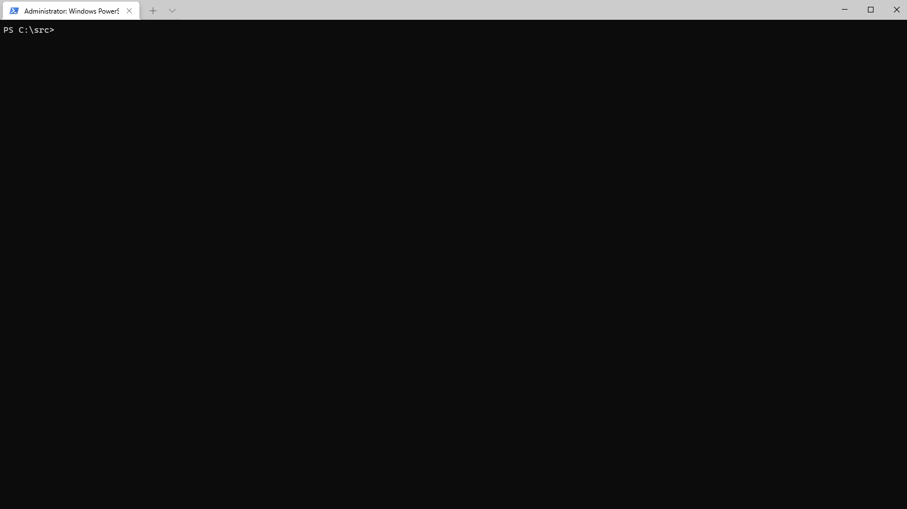

# Troubleshoot your environment with uno-check

If you're having trouble building an Uno Platform project and your dev environment might be the cause, the first thing you should do is run [`uno-check`](https://github.com/unoplatform/uno.check).

`uno-check` is a dotnet command-line tool that runs a suite of automated check-ups on your dev environment, making sure you have all the prerequisites installed to successfully develop an Uno Platform application. The tool is available on Windows, Linux and macOS.

If it finds something missing, out of date, or misconfigured, it will either offer to automatically fix it, or else direct you to instructions to manually fix the problem.



## Install and run uno-check

1. Make sure you have the [dotnet SDK installed](https://dotnet.microsoft.com/download).

2. Open a command-line prompt. If you're on Windows, you can run Windows Terminal if you have it installed, or else Command Prompt or Windows Powershell from the Start menu. If you're on Mac, you can run the Terminal.

3. Install the tool by running the following command from the command prompt:
    ```
    dotnet tool install -g uno.check
    ```
    To update the tool, if you already have an existing one:
    ```
    dotnet tool update -g uno.check
    ```

4. Run the tool from the command prompt with the following command:
    ```
    uno-check
    ```
    For additional options, see below.

5. If you get any errors or warnings, run the provided fix, or follow the provided instructions. Run `uno-check` again to verify that the fixes worked.

6. Once `uno-check` gives you the green light, you can [get started](https://platform.uno/docs/articles/get-started.html)!

## Troubleshooting

If you run into problems with uno-check, you should generally try the following:

1. Update the tool to the latest version: `dotnet tool update -g uno.check --source https://api.nuget.org/v3/index.json`
2. Run with `uno-check --force-dotnet` to ensure the workload repair/update/install commands run regardless of if uno-check thinks the workload versions look good
3. If you have errors still, it may help to run the [Clean-Old-DotNet6-Previews.ps1](https://github.com/unoplatform/uno.check/blob/main/Clean-Old-DotNet6-Previews.ps1) script to remove old SDK Packs, templates, or otherwise old cached preview files that might be causing the problem.  Try running `uno-check --force-dotnet` again after this step.
4. Finally, if you have problems, run with `--verbose` flag and capture the output and add it to a new issue.

## Command line arguments

The following command line arguments can be used to customise the tool's behavior.

### `--target` Choose target platforms

Uno Platform supports a number of platforms, and you may only wish to develop for a subset of them. By default the tool runs checks for all supported platforms. If you use the `--target` argument, it will only run checks for the nominated target or targets.

So for example the following will only check your environment for web and Linux development:

```
uno-check --target wasm --target linux
```

The following argument values for `--target` are supported:


| Value     | Comments          |
|-----------|-------------------|
| wasm      |                   |
| ios       |                   |
| android   |                   |
| macos     |                   |
| skiagtk   |                   |
| linux     | Alias for skiagtk |
| skiawpf   |                   |
| skiatizen |                   |
| uwp       |                   |
| win32     |                   |
| all       | All platforms     |

### `-m <FILE_OR_URL>`, `--manifest <FILE_OR_URL>` Manifest File or Url

The manifest file is used by the tool to fetch the latest versions and requirements.
The default manifest is hosted at: https://raw.githubusercontent.com/unoplatform/uno.check/main/manifests/uno.ui.manifest.json

Use this option to specify an alternative file path or URL to use.

```
uno-check --manifest /some/other/file
```

### `-f`, `--fix` Fix without prompt

You can try using the `--fix` argument to automatically enable solutions to run without being prompted.

```
uno-check --fix
```

### `-n`, `--non-interactive` Non-Interactive

If you're running on CI you may want to run without any required input with the `--non-interactive` argument.  You can combine this with `--fix` to automatically fix without prompting.

```
uno-check --non-interactive
```

### `--preview` Preview Manifest feed

This uses a more frequently updated manifest with newer versions of things more often. If you use the prerelease versions of Uno.UI NuGet packages, you should use this flag.

The manifest is hosted by default at: https://raw.githubusercontent.com/unoplatform/uno.check/main/manifests/uno.ui-dev.manifest.json

```
uno-check --dev
```

### `--ci` Continuous Integration

Uses the dotnet-install powershell / bash scripts for installing the dotnet SDK version from the manifest instead of the global installer.

```
uno-check --ci
```


### `-s <ID_OR_NAME>`, `--skip <ID_OR_NAME>` Skip Checkup

Skips a checkup by name or id as listed in `uno-check list`.
NOTE: If there are any other checkups which depend on a skipped checkup, they will be skipped too. 

```
uno-check --skip openjdk --skip androidsdk
```

### `list` List Checkups

Lists possible checkups in the format: `checkup_id (checkup_name)`.
These can be used to specify `--skip checkup_id`, `-s checkup_name` arguments.


### `config` Configure global.json and NuGet.config in Working Dir

This allows you to quickly synchronize your `global.json` and/or `NuGet.config` in the current working directory to utilize the values specified in the manifest.

Arguments:
 - `--dotnet` or `--dotnet-version`: Use the SDK version in the manifest in `global.json`.
 - `--dotnet-pre true|false`: Change the `allowPrerelease` value in the `global.json`.
 - `--dotnet-rollForward <OPTION>`: Change the `rollForward` value in `global.json` to one of the allowed values specified.
 - `--nuget` or `--nuget-sources`: Adds the nuget sources specified in the manifest to the `NuGet.config` and creates the file if needed.

Example:

`uno-check config --dev --nuget-sources --dotnet-version --dotnet-pre true`