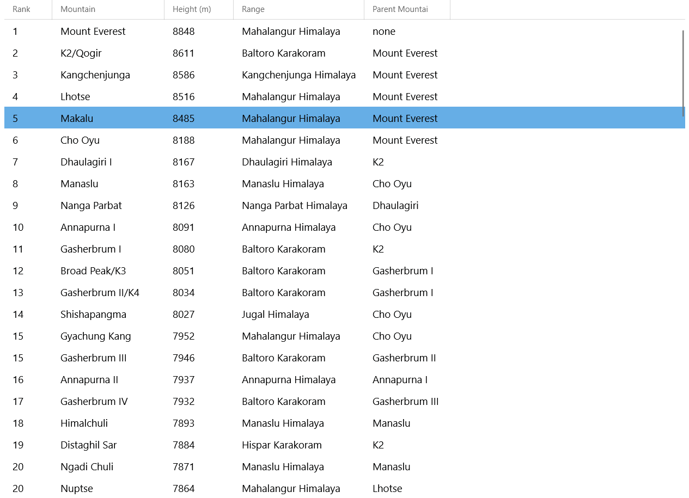

# How to use Windows Community Toolkit - Version 7.x

This tutorial will walk you through adding and implementing the `DataGrid` control but the same steps can be followed for **other\*** Uno ported Windows Community Toolkit controls versions 7.x.

**\* See the [non-Windows platform compatibility](xref:Uno.Development.CommunityToolkit#non-windows-platform-compatibility) section for more details.**

> [!NOTE]
> The complete source code that goes along with this guide is available in the [unoplatform/Uno.Samples](https://github.com/unoplatform/Uno.Samples) GitHub repository - [`DataGrid` Sample](https://github.com/unoplatform/Uno.Samples/tree/master/UI/WindowsCommunityToolkit/Version-7.x/UnoWCTDataGridSample).

## Prerequisites

For a step-by-step guide to installing the prerequisites for your preferred IDE and environment, consult the [Get Started guide](xref:Uno.GetStarted).

> [!TIP]
> If you are unsure of the version of the Windows Community Toolkit to use between v7 and v8, make sure to read the details about the [migration guide](xref:Uno.Development.CommunityToolkit).

## NuGet Packages for Uno Platform

Uno Platform has ported the Windows Community Toolkit 7.x for use in Uno Platform applications to allow for use on Windows,
Android, iOS, Linux, and WebAssembly.

The following packages are available:

- [Uno.CommunityToolkit.WinUI](https://www.nuget.org/packages/Uno.CommunityToolkit.WinUI)
- [Uno.CommunityToolkit.WinUI.Connectivity](https://www.nuget.org/packages/Uno.CommunityToolkit.WinUI.Connectivity)
- [Uno.CommunityToolkit.WinUI.DeveloperTools](https://www.nuget.org/packages/Uno.CommunityToolkit.WinUI.DeveloperTools)
- [Uno.CommunityToolkit.WinUI.UI](https://www.nuget.org/packages/Uno.CommunityToolkit.WinUI.UI)
- [Uno.CommunityToolkit.WinUI.UI.Animations](https://www.nuget.org/packages/Uno.CommunityToolkit.WinUI.UI.Animations)
- [Uno.CommunityToolkit.WinUI.UI.Behaviors](https://www.nuget.org/packages/Uno.CommunityToolkit.WinUI.UI.Behaviors)
- [Uno.CommunityToolkit.WinUI.UI.Controls](https://www.nuget.org/packages/Uno.CommunityToolkit.WinUI.UI.Controls)
- [Uno.CommunityToolkit.WinUI.UI.Controls.Core](https://www.nuget.org/packages/Uno.CommunityToolkit.WinUI.UI.Controls.Core)
- [Uno.CommunityToolkit.WinUI.UI.Controls.DataGrid](https://www.nuget.org/packages/Uno.CommunityToolkit.WinUI.UI.Controls.DataGrid)
- [Uno.CommunityToolkit.WinUI.UI.Controls.Input](https://www.nuget.org/packages/Uno.CommunityToolkit.WinUI.UI.Controls.Input)
- [Uno.CommunityToolkit.WinUI.UI.Controls.Layout](https://www.nuget.org/packages/Uno.CommunityToolkit.WinUI.UI.Controls.Layout)
- [Uno.CommunityToolkit.WinUI.UI.Controls.Markdown](https://www.nuget.org/packages/Uno.CommunityToolkit.WinUI.UI.Controls.Markdown)
- [Uno.CommunityToolkit.WinUI.UI.Controls.Media](https://www.nuget.org/packages/Uno.CommunityToolkit.WinUI.UI.Controls.Media)
- [Uno.CommunityToolkit.WinUI.UI.Controls.Primitives](https://www.nuget.org/packages/Uno.CommunityToolkit.WinUI.UI.Controls.Primitives)
- [Uno.CommunityToolkit.WinUI.UI.Media](https://www.nuget.org/packages/Uno.CommunityToolkit.WinUI.UI.Media)

These package IDs are for Uno Platform (non-Windows) projects. For WinUI 3 projects, you should use the equivalent packages published by Microsoft (`CommunityToolkit.WinUI`, `CommunityToolkit.WinUI.UI.Controls`, etc).

## Referencing the Windows Community Toolkit

When using the Uno Platform solution templates, add the following to your application:

1. Install the NuGet package(s) reference(s) that you need

    ### [Single Project Template [WinUI / WinAppSDK]](#tab/singleproj)

    1. Edit your project file `PROJECT_NAME.csproj` and add the following conditional references:

        ```xml
        <ItemGroup Condition="$([MSBuild]::GetTargetPlatformIdentifier('$(TargetFramework)')) == 'windows'">
          <PackageReference Include="CommunityToolkit.WinUI.UI.Controls" />
          <!-- Add more community toolkit references here -->
        </ItemGroup>
        <ItemGroup Condition="$([MSBuild]::GetTargetPlatformIdentifier('$(TargetFramework)')) != 'windows'">
          <PackageReference Include="Uno.CommunityToolkit.WinUI.UI.Controls" />
          <!-- Add more uno community toolkit references here -->
        </ItemGroup>
        ```

        If you already had a reference to the Community Toolkit, you should remove this line:

        ```xml
        <ItemGroup>
          <PackageReference Include="Uno.CommunityToolkit.WinUI.UI.Controls" />
        </ItemGroup>
        ```

    1. Edit `Directory.Packages.props` and add the following conditional references:

        ```xml
        <ItemGroup Condition="$([MSBuild]::GetTargetPlatformIdentifier('$(TargetFramework)')) == 'windows'">
          <PackageVersion Include="CommunityToolkit.WinUI.UI.Controls" Version="7.1.2" />
          <!-- Add more community toolkit references here -->
        </ItemGroup>
        <ItemGroup Condition="$([MSBuild]::GetTargetPlatformIdentifier('$(TargetFramework)')) != 'windows'">
          <PackageVersion Include="Uno.CommunityToolkit.WinUI.UI.Controls" Version="7.1.200" />
          <!-- Add more uno community toolkit references here -->
        </ItemGroup>
        ```

    ### [Multi-Head Project Template (Legacy) [WinUI / WinAppSDK]](#tab/multihead-winui)

    Edit your project file `PROJECT_NAME.csproj` and add the following conditional references:

    ```xml
    <ItemGroup Condition="$([MSBuild]::GetTargetPlatformIdentifier('$(TargetFramework)')) == 'windows'">
      <PackageReference Include="CommunityToolkit.WinUI.UI.Controls" Version="7.1.2" />
      <!-- Add more community toolkit references here -->
    </ItemGroup>
    <ItemGroup Condition="$([MSBuild]::GetTargetPlatformIdentifier('$(TargetFramework)')) != 'windows'">
      <PackageReference Include="Uno.CommunityToolkit.WinUI.UI.Controls" Version="7.1.200" />
      <!-- Add more uno community toolkit references here -->
    </ItemGroup>
    ```

    If you already had a reference to the Community Toolkit, you should remove this line:

    ```xml
    <ItemGroup>
      <PackageReference Include="Uno.CommunityToolkit.WinUI.UI.Controls" Version="7.1.200" />
    </ItemGroup>
    ```

    ### [Shared Project (.shproj) Template (Legacy) [WinUI / WinAppSDK]](#tab/shproj-winui)

    1. Select the following project `PROJECT_NAME.Windows.csproj` for installation and add the following reference:

        ```xml
        <ItemGroup>
          <PackageReference Include="CommunityToolkit.WinUI.UI.Controls" Version="7.1.2" />
          <!-- Add more community toolkit references here -->
        </ItemGroup>
        ```

    1. Select the following projects for installation and add the following reference to each of them:
        - `PROJECT_NAME.Wasm.csproj`
        - `PROJECT_NAME.Mobile.csproj` (or `PROJECT_NAME.iOS.csproj`, `PROJECT_NAME.Droid.csproj`, and `PROJECT_NAME.macOS.csproj` if you have an existing project)
        - `PROJECT_NAME.Skia.Gtk.csproj`
        - `PROJECT_NAME.Skia.WPF.csproj`

        ```xml
        <ItemGroup>
          <PackageReference Include="Uno.CommunityToolkit.WinUI.UI.Controls" Version="7.1.200" />
          <!-- Add more uno community toolkit references here -->
        </ItemGroup>
        ```

        If you already had a reference to the Community Toolkit, you should remove this line:

        ```xml
        <ItemGroup>
          <PackageReference Include="Uno.CommunityToolkit.WinUI.UI.Controls" Version="7.1.200" />
        </ItemGroup>
        ```

    ---

    If you're getting an error like this one :

    ```console
    Controls\TextBox\Themes\Generic.xaml : Xaml Internal Error error WMC9999: 
    Type universe cannot resolve assembly: Uno.UI, Version=255.255.255.255, 
    Culture=neutral, PublicKeyToken=null.
    ```

    This means that there's an unconditional reference to Uno Platform's packages, and you'll need to make sure to add the conditional references as suggested above.

1. Add the the related needed namespaces

      In XAML:  
        ```xmlns:controls="using:CommunityToolkit.WinUI.UI.Controls"```

      In C#:  
        ```using CommunityToolkit.WinUI.UI.Controls;```

## Example with the DataGrid Control

This control will create an easily organized grid that will allow you to create flexible columns and rows.

1. Begin by adding the control using the syntax below. Change the `x:Name` to the name of your DataGrid.  
```<controls:DataGrid x:Name="dataGrid"></controls:DataGrid>```

2. Similar to how you would configure columns for a XAML `Grid` layout, you can add column definitions within your `DataGrid` control:

    ```xml
    <controls:DataGrid.Columns>
        <controls:DataGridTextColumn Header="Rank"/>
        <controls:DataGridComboBoxColumn Header="Mountain"/>
    </controls:DataGrid.Columns>
    ```

    This will create two columns that can be adjusted by the user.
    

    Alternatively, you can use the `AutoGenerateColumns` attribute on your `DataGrid` control if you do not know how many columns your data will require.  

    ```xml
    <controls:DataGrid x:Name="dataGrid" AutoGenerateColumns="True" />
    ```

3. Format your rows in the same way as your columns or use a `DataTemplate` added as an attribute on the `DataGrid` control:

    ```xml
    <controls:DataGrid x:Name="dataGrid" RowDetailsTemplate="{StaticResource RowDetailsTemplate}">
    ```

4. Data can be added with data binding. First, add your `ItemsSource` as a property of your `DataGrid` control.  

    ```xml
    <controls:DataGrid x:Name="dataGrid" ItemsSource="{x:Bind MyViewModel.Customers}" />  
    ```

    Then, set the binding on each column:

    ```xml
    <controls:DataGrid.Columns>
        <controls:DataGridTextColumn Header="Rank" Binding="{Binding Rank}" Tag="Rank" />
        <controls:DataGridTextColumn Header="Mountain" Binding="{Binding Mountain}" Tag="Mountain" />
    </controls:DataGrid.Columns>
    ```

### See a working example with data



A complete working sample with data is available on GitHub: [Uno Windows Community Toolkit DataGrid Sample](https://github.com/unoplatform/Uno.Samples/tree/master/UI/WindowsCommunityToolkit/Version-7.x/UnoWCTDataGridSample)

---

[!include[getting-help](includes/getting-help.md)]
