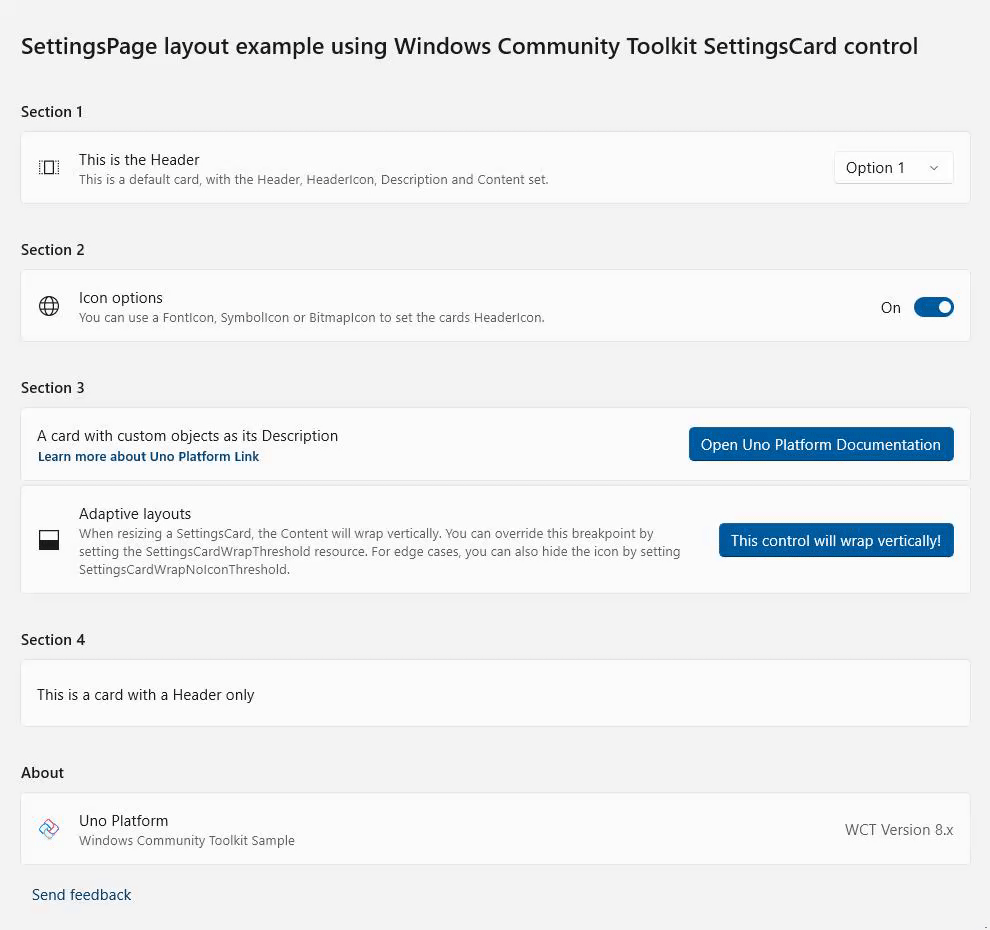

# How to use Windows Community Toolkit - Version 8.x

This tutorial will walk you through adding and implementing the `SettingsCard` control but the same steps can be followed for **other\*** Windows Community Toolkit controls version 8.x.

**\* See the [non-Windows platform compatibility](xref:Uno.Development.CommunityToolkit#non-windows-platform-compatibility) section for more details.**

> [!NOTE]
> The complete source code that goes along with this guide is available in the [unoplatform/Uno.Samples](https://github.com/unoplatform/Uno.Samples) GitHub repository - [`SettingsCard` Sample](https://github.com/unoplatform/Uno.Samples/tree/master/UI/WindowsCommunityToolkit/Version-8.x/UnoWCTSettingsCardSample)

## Prerequisites

For a step-by-step guide to installing the prerequisites for your preferred IDE and environment, consult the [Get Started guide](xref:Uno.GetStarted).

> [!TIP]
> If you are unsure of the version of the Windows Community Toolkit to use between v7 and v8, make sure to read the details about the Windows Community Toolkit [migration guide](xref:Uno.Development.CommunityToolkit).

## NuGet Packages

Uno Platform is now supported out of the box by the Windows Community Toolkit and Windows Community Toolkit Labs starting with version 8.x.

> [!IMPORTANT]
> If you are already using Windows Community Toolkit version 7.x in your Uno Platform project and want to update to version 8.x, note that Uno Platform has its [own fork](https://github.com/unoplatform/Uno.WindowsCommunityToolkit) of the Windows Community Toolkit for [version 7.x](xref:Uno.Development.CommunityToolkit.v7).
>
> In your project, these Windows Community Toolkit Uno packages were referenced behind a conditional to allow for use on Windows, Android, iOS, Linux, and WebAssembly.
>
> Conditional references are no longer necessary with version 8.x, you can remove the Uno Windows Community Toolkit references and all `Condition` statements around the packages.

## Referencing the Windows Community Toolkit

When using the Uno Platform solution templates, add the following to your application:

1. Install the NuGet package(s) reference(s) that you need

    ### [Single Project Template [WinUI / WinAppSDK]](#tab/singleproj)

    1. Edit your project file `PROJECT_NAME.csproj` and add the needed reference(s):

        ```xml
        <ItemGroup>
          <PackageReference Include="CommunityToolkit.WinUI.Controls.SettingsControls" />
          <!-- Add more community toolkit references here -->
        </ItemGroup>
        ```

    1. Edit `Directory.Packages.props` and add the needed reference(s):

        ```xml
        <ItemGroup>
          <PackageVersion Include="CommunityToolkit.WinUI.Controls.SettingsControls" Version="8.1.240916" />
          <!-- Add more community toolkit references here -->
        </ItemGroup>
        ```

    > [!NOTE]
    > Windows Community Toolkit version 8.x requires an update to Windows SDK **10.0.22621** and above, along with [Microsoft.WindowsAppSDK](https://www.nuget.org/packages/Microsoft.WindowsAppSDK) updated to the latest matching version.
    >
    > To override these versions within a single project structure, you can set the properties in the `Directory.Build.props` file or directly in your project's `csproj` file. For more detailed information, please see the [implicit packages details](xref:Uno.Features.Uno.Sdk#implicit-packages).
    >
    > For example, in `PROJECT_NAME.csproj`:
    >
    > ```xml
    > <TargetFrameworks>
    >   <!-- Code for other TargetFrameworks omitted for brevity -->
    >   net10.0-windows10.0.22621;
    > </TargetFrameworks>
    > ```
    >
    > ```xml
    > <PropertyGroup>
    >   <WindowsSdkPackageVersion>10.0.22621.38</WindowsSdkPackageVersion>
    >   <WinAppSdkVersion>1.5.240607001</WinAppSdkVersion>
    > </PropertyGroup>
    > ```

    ### [Multi-Head Project Template (Legacy) [WinUI / WinAppSDK]](#tab/multihead-winui)

    Edit your project file `PROJECT_NAME.csproj` and add the needed reference(s):

    ```xml
    <ItemGroup>
      <PackageReference Include="CommunityToolkit.WinUI.Controls.SettingsControls" Version="8.1.240916" />
      <!-- Add more community toolkit references here -->
    </ItemGroup>
    ```

    > [!NOTE]
    > Windows Community Toolkit version 8.x requires an update to Windows SDK **10.0.22621** and above, along with [Microsoft.WindowsAppSDK](https://www.nuget.org/packages/Microsoft.WindowsAppSDK) updated to the latest matching version.

    ### [Shared Project (.shproj) Template (Legacy) [WinUI / WinAppSDK]](#tab/shproj-winui)

    1. Select the following projects for installation and add the needed reference(s) to each of them:
        - `PROJECT_NAME.Windows.csproj`
        - `PROJECT_NAME.Wasm.csproj`
        - `PROJECT_NAME.Mobile.csproj` (or `PROJECT_NAME.iOS.csproj`, `PROJECT_NAME.Droid.csproj`, and `PROJECT_NAME.macOS.csproj` if you have an existing project)
        - `PROJECT_NAME.Skia.Gtk.csproj`
        - `PROJECT_NAME.Skia.WPF.csproj`

        ```xml
        <ItemGroup>
          <PackageReference Include="CommunityToolkit.WinUI.Controls.SettingsControls" Version="8.1.240916" />
          <!-- Add more uno community toolkit references here -->
        </ItemGroup>
        ```

    > [!NOTE]
    > Windows Community Toolkit version 8.x requires an update to Windows SDK **10.0.22621** and above, along with [Microsoft.WindowsAppSDK](https://www.nuget.org/packages/Microsoft.WindowsAppSDK) updated to the latest matching version.

    ---

1. Add the related needed namespace(s)

      In XAML:
        ```xmlns:controls="using:CommunityToolkit.WinUI.Controls"```

      In C#:
        ```using CommunityToolkit.WinUI.Controls;```

## Example with the SettingsCard Control

SettingsCard is a control that can be used to display settings in your experience. It uses the default styling found in Windows 11 and is easy to use, meets all accessibility standards and will make your settings page look great!

You can set the `Header`, `HeaderIcon`, `Description`, and `Content` properties to create an easy to use experience, like so:

```xml
<controls:SettingsCard Description="This is a default card, with the Header, HeaderIcon, Description and Content set."
                       Header="This is the Header">
  <controls:SettingsCard.HeaderIcon>
    <FontIcon Glyph="&#xE799;"
              FontFamily="{ThemeResource SymbolThemeFontFamily}" />
  </controls:SettingsCard.HeaderIcon>
  <ComboBox SelectedIndex="0">
    <ComboBoxItem>Option 1</ComboBoxItem>
    <ComboBoxItem>Option 2</ComboBoxItem>
    <ComboBoxItem>Option 3</ComboBoxItem>
  </ComboBox>
</controls:SettingsCard>
```

### See a working sample with more examples



A complete working sample, along with additional examples, is available on GitHub: [Uno Windows Community Toolkit SettingsCard Sample](https://github.com/unoplatform/Uno.Samples/tree/master/UI/WindowsCommunityToolkit/Version-8.x/UnoWCTSettingsCardSample)

## Using Non-UI Elements from the CommunityToolkit: Converters

The CommunityToolkit provides a collection of ready-to-use converters for various scenarios (e.g., `x:Bind` in XAML). These converters streamline development by offering implementations for commonly used functionality, eliminating the need to manually create basic converters.
[List of CommunityToolkit Converters | Windows Toolkit Documentation](https://learn.microsoft.com/en-us/dotnet/communitytoolkit/windows/converters/)

The implementation of these is similar to the example of the `SettingsControl` above, with some minor adjustments required to use them:

1. Install the NuGet package reference needed for the converters

    ### Single Project Template [WinUI / WinAppSDK]

    1. Edit your project file `PROJECT_NAME.csproj` and add this additional needed reference:

        ```xml
        <ItemGroup>
          <PackageReference Include="CommunityToolkit.WinUI.Converters" />
          <!-- Add more community toolkit references here -->
        </ItemGroup>
        ```

    1. Edit `Directory.Packages.props` and add this additional needed reference:

        ```xml
        <ItemGroup>
          <PackageVersion Include="CommunityToolkit.WinUI.Converters" Version="8.1.240916" />
          <!-- Add more community toolkit references here -->
        </ItemGroup>
        ```

1. Add the related needed namespace(s)

      In XAML:
        ```xmlns:converters="using:CommunityToolkit.WinUI.Converters"```

      In C#:
        ```using CommunityToolkit.WinUI.Converters;```

     If you are developing an app using [C# Markup](xref:Uno.Extensions.Markup.Overview) and want to use the converters, you can refer to the [C# Markup Converters Documentation](xref:Uno.Extensions.Markup.Converters) for a detailed usage guide. The general import process is covered from this point onward.

1. XAML Definition

    Unlike the previously seen `SettingsCard` control example, it is standard practice to define a converter in the `Page.Resources` section as a `StaticResource` before using it. This approach ensures that converters, like controls, are properly declared with a namespace and can be easily reused throughout the page.

    ### [Example: StringToVisibilityConverter](#tab/string-visible-conv)

    The `StringToVisibilityConverter` is a converter that transforms a string value into a `Visibility` state, returning `Visibility.Visible` for non-empty strings and `Visibility.Collapsed` for null or empty strings.

    #### Define the Converter in Page Resources

    Add the converter to the `Page.Resources` section as a `StaticResource`:

    ```xml
    <Page.Resources>
        <converters:StringToVisibilityConverter x:Key="StringToVisibilityConverter" />
    </Page.Resources>
    ```

    #### Use the Converter in Page Content

    Here is an example of how to use the converter in your XAML content:

    ```xml
    <TextBlock Text="This text is visible only if the condition is met."
              Visibility="{Binding SomeStringProperty, Converter={StaticResource StringToVisibilityConverter}}"/>
    ```

    ### [Example: BoolToObjectConverter](#tab/bool-obj-conv)

    The `BoolToObjectConverter` allows you to convert a boolean value into a specific object by defining `TrueObject` and `FalseObject`. Depending on the boolean value, the converter will return the corresponding object.

    #### Define the Converter in Page Resources

    For example, you can use it to switch colors dynamically.
    Add the converter to the `Page.Resources` section as a `StaticResource`:

    ```xml
    <Page.Resources>
        <converters:BoolToObjectConverter x:Key="BoolToColorConverter"
                                          TrueObject="Green"
                                          FalseObject="Red"/>
    </Page.Resources>
    ```
  
    #### Use the Converter in Page Content

    Here is an example of how to use the converter in your XAML content:

    ```xml
    <TextBlock Text="Status:"
              Foreground="{Binding IsValid, Converter={StaticResource BoolToColorConverter}}"/>
    ```

    In this example, the `TextBlock` background will be green when `IsValid` is `true` and red when `IsValid` is `false`.

---

[!include[getting-help](includes/getting-help.md)]
