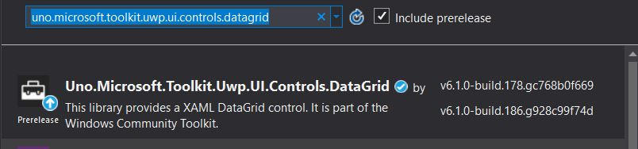

# How to use Windows Community Toolkit

The [Windows Community Toolkit](https://docs.microsoft.com/en-us/windows/communitytoolkit/) is a collection of helper functions, custom controls, and app services. It simplifies and demonstrates common developer patterns when building experiences for Windows 10.

This tutorial will walk through adding and implementing the DataGrid control but the steps can be followed for any of the Uno ported Windows Community Toolkit controls.

> [!TIP]
> The complete source code that goes along with this guide is available in the [unoplatform/Uno.Samples](https://github.com/unoplatform/Uno.Samples) GitHub repository - [Uno Windows Community Toolkit Sample](https://github.com/unoplatform/Uno.Samples/tree/master/UI/UnoWCTDataGridSample)

## Prerequisites

# [Visual Studio for Windows](#tab/tabid-vswin)

* [Visual Studio 2019 16.3 or later](http://www.visualstudio.com/downloads/)
  * **Universal Windows Platform** workload installed
  * **Mobile Development with .NET (Xamarin)** workload installed
  * **ASP**.**NET and web** workload installed
  * [Uno Platform Extension](https://marketplace.visualstudio.com/items?itemName=nventivecorp.uno-platform-addin) installed

# [VS Code](#tab/tabid-vscode)

* [**Visual Studio Code**](https://code.visualstudio.com/)

* [**Mono**](https://www.mono-project.com/download/stable/)

* **.NET Core SDK**
    * [.NET Core 3.1 SDK](https://dotnet.microsoft.com/download/dotnet-core/3.1) (**version 3.1.8 (SDK 3.1.402)** or later)
    * [.NET Core 5.0 SDK](https://dotnet.microsoft.com/download/dotnet-core/5.0) (**version 5.0 (SDK 5.0.100)** or later)

    > Use `dotnet --version` from the terminal to get the version installed.

# [Visual Studio for Mac](#tab/tabid-vsmac)

* [**Visual Studio for Mac 8.8**](https://visualstudio.microsoft.com/vs/mac/)
* [**Xcode**](https://apps.apple.com/us/app/xcode/id497799835?mt=12) 10.0 or higher
* An [**Apple ID**](https://support.apple.com/en-us/HT204316)
* **.NET Core SDK**
    * [.NET Core 3.1 SDK](https://dotnet.microsoft.com/download/dotnet-core/3.1) (**version 3.1.8 (SDK 3.1.402)** or later)
    * [.NET Core 5.0 SDK](https://dotnet.microsoft.com/download/dotnet-core/5.0) (**version 5.0 (SDK 5.0.100)** or later)
* [**GTK+3**](https://formulae.brew.sh/formula/gtk+3) for running the Skia/GTK projects

# [JetBrains Rider](#tab/tabid-rider)

* [**Rider Version 2020.2+**](https://www.jetbrains.com/rider/download/)
* [**Rider Xamarin Android Support Plugin**](https://plugins.jetbrains.com/plugin/12056-rider-xamarin-android-support/) (you may install it directly from Rider)

***

<br>

> [!Tip]
> For a step-by-step guide to installing the prerequisites for your preferred IDE and environment, consult the [Get Started guide](get-started.md).

## Package ids for Uno Platform

Uno has ported the Windows Community Toolkit for use in Uno applications to allow for use on Windows,
Android, iOS, macOS, and WebAssembly.

The following packages are available:
- [Uno.Microsoft.Toolkit](https://www.nuget.org/packages/Uno.Microsoft.Toolkit )
- [Uno.Microsoft.Toolkit.Parsers](https://www.nuget.org/packages/Uno.Microsoft.Toolkit.Parsers)
- [Uno.Microsoft.Toolkit.Services](https://www.nuget.org/packages/Uno.Microsoft.Toolkit.Services)
- [Uno.Microsoft.Toolkit.UWP](https://www.nuget.org/packages/Uno.Microsoft.Toolkit.UWP)
- [Uno.Microsoft.Toolkit.Uwp.Notifications](https://www.nuget.org/packages/Uno.Microsoft.Toolkit.Uwp.Notifications)
- [Uno.Microsoft.Toolkit.Uwp.Services](https://www.nuget.org/packages/Uno.Microsoft.Toolkit.Uwp.Services)
- [Uno.Microsoft.Toolkit.Uwp.UI.Controls.DataGrid](https://www.nuget.org/packages/Uno.Microsoft.Toolkit.UWP.UI.DataGrid)
- [Uno.Microsoft.Toolkit.Uwp.UI](https://www.nuget.org/packages/Uno.Microsoft.Toolkit.UWP.UI)
- [Uno.Microsoft.Toolkit.Uwp.UI.Animations](https://www.nuget.org/packages/Uno.Microsoft.Toolkit.Uwp.UI.Animations)
- [Uno.Microsoft.Toolkit.Uwp.UI.Controls](https://www.nuget.org/packages/Uno.Microsoft.Toolkit.Uwp.UI.Controls)
- [Uno.Microsoft.Toolkit.Uwp.UI.Controls.Graph](https://www.nuget.org/packages/Uno.Microsoft.Toolkit.UWP.UI.Controls.Graph)
- [Uno.Microsoft.Toolkit.Uwp.Connectivity](https://www.nuget.org/packages/Uno.Microsoft.Toolkit.Uwp.Connectivity)

These package ids are for Uno (ie non-Windows) projects. For UWP and WinUI 3 projects, you should use the equivalent package ids published by Microsoft (`Microsoft.Toolkit`, `Microsoft.Toolkit.Parsers` etc). 

## Task 1 - Add Windows Community Toolkit to Uno Projects
  
  
1. Install Nuget package for targeted control  
   

**Note:** Be aware of which versions of Uno.UI are compatible with the Nuget package of each control.  
      If using version `3.0.0` or higher of `Uno.UI`, use version `6.1.0` or higher of `DataGrid` Nuget package.

**Note:** For UWP and WinUI 3 projects, you should use the packages published by Microsoft that are **not** prefixed with `Uno.*`. 
      

2. Add a reference to the UWP UI Controls 

   In XAML:  
    ```xmlns:controls="using:Microsoft.Toolkit.Uwp.UI.Controls"```  
  
   In C#:  
    ```using Microsoft.Toolkit.Uwp;```

3. Implement the control.

## Task 2 - Add the DataGrid Control 

This control will create an easily organized grid that will allow you to create flexible columns and rows.

1. Begin by adding the control using the syntax below. Change the `x:Name` to the name of your DataGrid.  
```<controls:DataGrid x:Name="dataGrid"></controls:DataGrid>```

2. Add columns. Similar to how you would configure columns for a XAML `Grid` layout, you can add column definitions within your `DataGrid` control:

    ```xml
    <controls:DataGrid.Columns>
        <controls:DataGridTextColumn Header="Rank"/>
        <controls:DataGridComboBoxColumn Header="Mountain"/>
    </controls:DataGrid.Columns>
    ```

    This will create two columns that can be adjusted by the user.
    

    Alternatively, you can use the `AutoGenerateColumns` attribute on your `DataGrid` control if you do not know how many columns your data will require.  

    ``` xml
    <controls:DataGrid x:Name="dataGrid" AutoGenerateColumns="True" />
    ```

3. Format your rows in the same way as your columns or use a `DataTemplate` added as an attribute on the `DataGrid` control:

    ``` xml
    <controls:DataGrid x:Name="dataGrid" RowDetailsTemplate="{StaticResource RowDetailsTemplate}">
    ```

4. Data can be added with data binding. First, add your `ItemsSource` as a property of your `DataGrid` control.  

    ``` xml
    <controls:DataGrid x:Name="dataGrid" ItemsSource="{x:Bind MyViewModel.Customers}" />  
    ```

    Then, set the binding on each column:

    ``` xml
    <controls:DataGrid.Columns>
        <controls:DataGridTextColumn Header="Rank" Binding="{Binding Rank}" Tag="Rank" />
        <controls:DataGridTextColumn Header="Mountain" Binding="{Binding Mountain}" Tag="Mountain" />
    </controls:DataGrid.Columns>
    ```  

## See a working example with data


A working sample complete with data is available on GitHub: [Uno Windows Community Toolkit Sample](https://github.com/unoplatform/Uno.Samples/tree/master/UI/UnoWCTDataGridSample)

<br>

***

## Help! I'm having trouble

> [!TIP]
> If you ran into difficulties with any part of this guide, you can:
> 
> * Ask for help on our [Discord channel](https://www.platform.uno/discord) - #uno-platform
> * Ask a question on [Stack Overflow](https://stackoverflow.com/questions/tagged/uno-platform) with the 'uno-platform' tag
