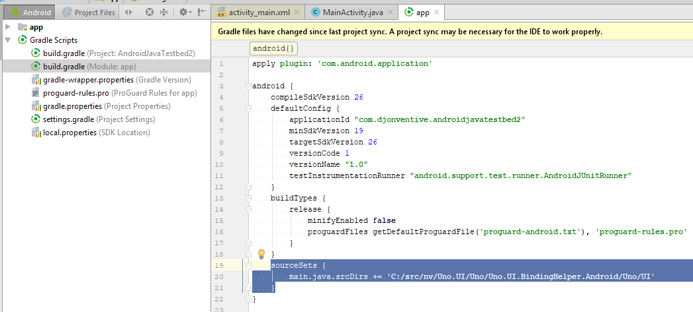
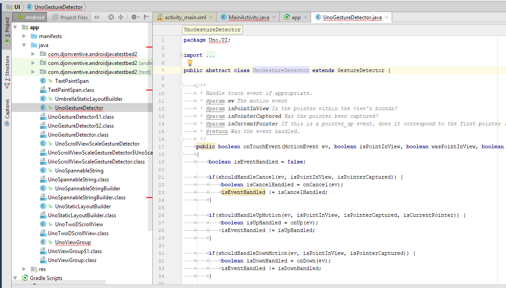
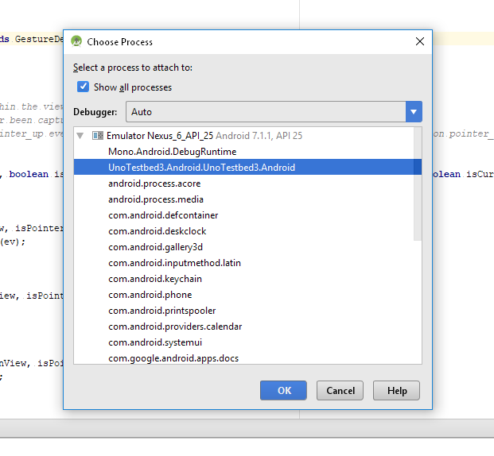
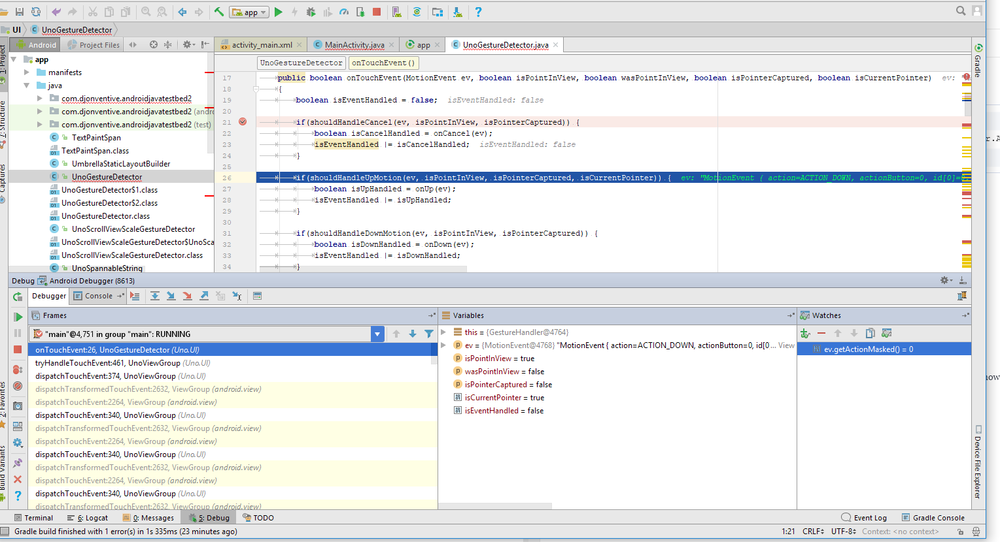

# Debugging Uno.UI Java code with Android studio

Not all of Uno.UI is written in C#. On Android, certain low-level parts of the code is written in Java, including the UnoViewGroup class, from which UIElement (and hence most other views) inherit. The motivation for this is performance: the communication or 'interop' between C# and Java layers at runtime can, in very specific cases, have a measurable performance impact.

The vast majority of the time, development in Uno.UI should be done in C#. However, for debugging existing Java code, or when performance testing demonstrates a need to write new Java code, this document explains how to debug the code using Android Studio, similar to using Visual Studio to debug .NET code.

## Getting started

* Install the latest version of [Android Studio](https://developer.android.com/studio/index.html).
* Launch Android Studio and create a blank Android project.
* Open the build.gradle file located in the 'app' folder. (Note there are two build.gradle files.)
* Add the following lines to the build file:

```gradle
sourceSets {
        main.java.srcDirs += 'C:/<Your Uno repository>/Uno.UI.BindingHelper.Android/Uno/UI'
    }
```



* Press 'Sync Now' to update the project.
* You should now see Uno.UI files in the Project tab. (Don't worry about red squiggles.)



## Debugging

* Run the app you wish to debug, which should be using a local debug build of Uno.UI.
* In Android Studio, select Run->Attach debugger to Android process. Select your app. (Toggle on 'Show all processes' if it's not visible.)



* You should now be able to debug and place breakpoints in Uno.UI code.
* Android Studio supports a similar feature set to Visual Studio. Here are some of the basics:
  * Breakpoints: Ctrl-F8 places a breakpoint. You can step over (F8) and step into (F7) code.
  * Inspect values of local variables and fields.
  * Add 'watch' values.
  * Add conditions and logging to breakpoints.



* One powerful feature of debugging Android code is the level of integration with framework code. You should be able to see not only the native stack trace, but even local variable values in framework methods (e.g. ViewGroup.dispatchTouchEvent().)
  * Note that Android Studio may prompt you to download source code and debug symbols: this will fail unless you started Android Studio with Administrator privileges (right-click in Start menu + 'Run as Administrator').
