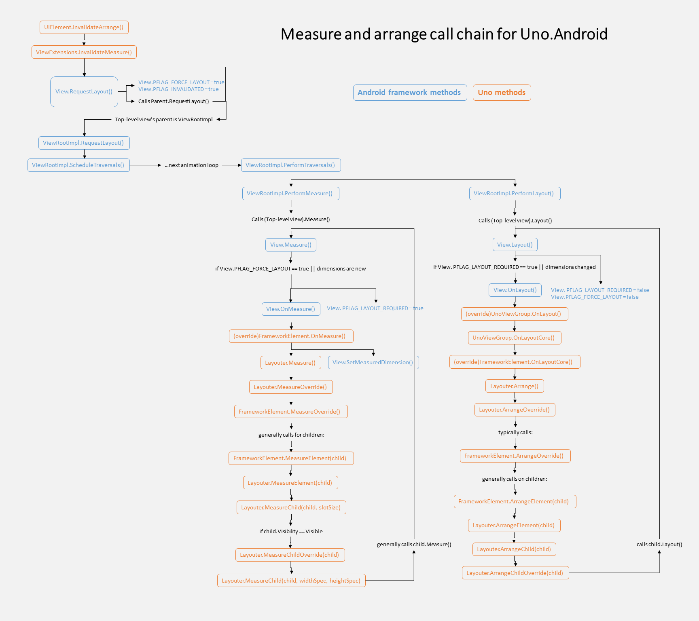

# Layouting in Android

The layouting cycle (measure and arrange) in Uno on Android involves a complex interaction between Android UI framework methods and Uno 
methods. These interactions are summarized in the diagram below. This information is primarily intended to help when debugging Uno, but 
may be interesting to anyone curious as to how native Android methods are connected to the UWP contract exposed by Uno.

