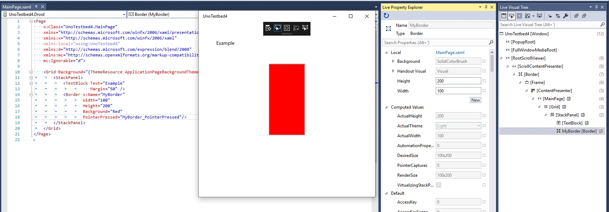
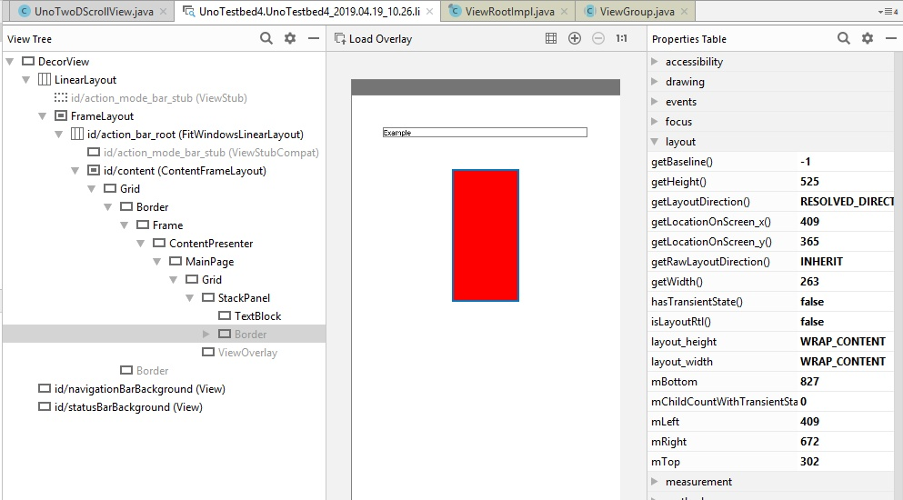
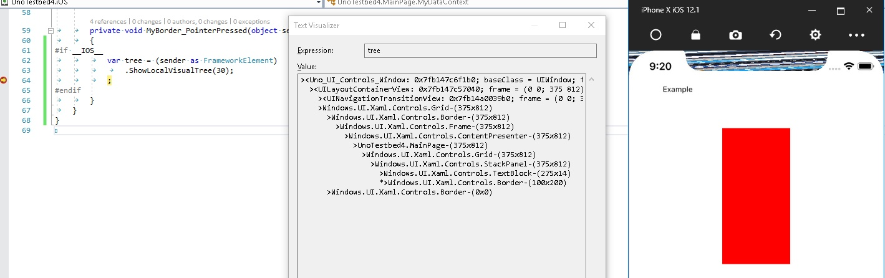
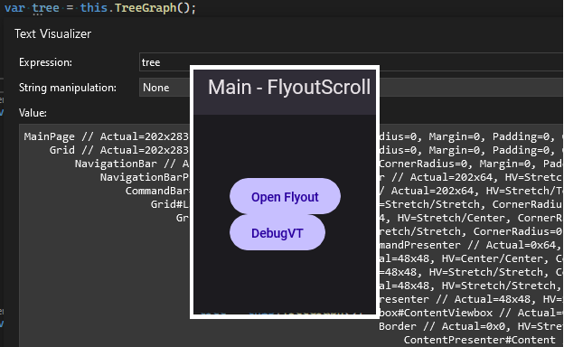

<!-- markdownlint-disable MD025-->
<!-- TODO: Maybe this Topic should be similar included in non-contributing area since it does have much very useful information about the visual tree options in uno apps -->

# Inspecting the runtime visual tree of an Uno app

Often the first step in debugging a UI bug is to scrutinize the application's visual tree. The visual tree is derived from the app's layout defined in XAML, but there's not a straightforward 1-to-1 mapping from XAML to runtime visual tree, due to templating, view manipulation in code, etc. Also, by definition if you're getting a UI bug then there's a discrepancy between what you expect based on the XAML and code and the behavior you're actually observing. Don't live in suspense – check the visual tree!

## Inspection Tools per Platform

Tools for inspecting the visual tree differ by platform:

# [UWP and WinUI](#tab/uwp-winui)

UWP and WinUI having by far the easiest and most convenient experience for debugging the visual tree. The small black toolbar at the top center of your app during debugging enable buttons to go to the Live Visual Tree view, directly select a visual element for inspection, and show layouting decorations. The complement to the Live Visual Tree is the Live Property Explorer, which allows you to inspect current values for any property of a view, and even change some of them on the fly.



# [Android](#tab/android)

There are a couple of options for viewing the visual tree of an Uno app running on Android.

One approach is to use [Android Studio](https://developer.android.com/studio). You can then attach the debugger to your running process and take a snapshot with the [Layout Inspector](https://developer.android.com/studio/debug/layout-inspector), which allows you to select different elements visually, see their properties, see the whole visual tree, etc.



The other approach is to use the [Stetho package](https://www.nuget.org/packages/nventive.Stetho.Xamarin). It integrates into your app with a few lines of code, and then allows you to inspect the visual tree in Chrome. One nice feature is it allows you to press any element on the device's screen to locate it in the visual tree.

Unfortunately neither of these approaches give you an easy way to inspect properties defined on UIElement, FrameworkElement, and other managed types. You can however look at native properties to obtain information like layout size, opacity, etc.

# [iOS](#tab/ios)

In principle it's possible to use Xcode's 'Debug View Hierarchy' feature on any iOS app, including Uno apps. The steps are the following:

1. Launch Xcode
2. Create a dummy iOS app (or open an existing one) - you won't actually run this app.
3. Run the app whose layout you wish to inspect.
4. Set the device or simulator you're using as the active device in the upper toolbar.
5. Select Debug -> Attach to Process -> `[name of the app]`
6. Once the debugger has successfully attached, select Debug -> View Debugging -> Capture View Hierarchy.

In practice, Xcode is somewhat temperamental, and this approach may fail for some apps. It's recommended to fall back on the breakpoint-based inspection method described below.

# [Web](#tab/web)

For an Uno.WASM app you can simply use the layout inspection tools built into whatever browser you're using. For example, for Chrome, open the 'Developer tools' panel (`F12`) and select the 'Elements' tab, or just right-click any element in the visual tree and choose 'Inspect.'


You can configure Uno to annotate the DOM with the values of common XAML properties. Just add the following somewhere in your app's entry point (eg the constructor of `App.cs` or `App.xaml.cs`):

```csharp
#if DEBUG && __WASM__
    // Annotate generated DOM elements with x:Name
    Uno.UI.FeatureConfiguration.UIElement.AssignDOMXamlName = true;
    // Annotate generated DOM elements with commonly-used XAML properties (height/width, alignment etc)
    Uno.UI.FeatureConfiguration.UIElement.AssignDOMXamlProperties = true;
#endif
```

**Note:** for performance reasons, if a _release build_ of Uno.UI is used, `AssignDOMXamlProperties` will only display the values of properties as they were when the element was loaded - that is, they may be stale in some cases. If a _debug build_ of Uno.UI is used, this limitation is lifted and the DOM annotation will reflect the most up-to-date values.

---

## Retrieving the visual tree through code or at a breakpoint (Android/iOS/WebAssembly/macOS)

It's common enough when debugging Uno to be at a breakpoint and want to quickly know exactly where the view is in the visual tree, that we added a helper method.  

If you're using a debug build of Uno, this is directly available on UIElement as the `public string ShowLocalVisualTree(int fromHeight)` method (for ease of use in the watch window). If you're using the release version of Uno, the same method is available as an extension in `UIKit.UIViewExtensions` for iOS or `Uno.UI.ViewExtensions` for Android.  

The method returns the visual tree from a certain 'height' above the target element as an indented string. So if you call `ShowLocalVisualTree(2)`, you'll get the visual subtree from the target element's grandparent down. If you call `ShowLocalVisualTree(100)`, you'll almost certainly get the entire visual tree starting from the root element. The original target is picked out with an asterisk (*) so you can find it.  



Similarly to the `ShowLocalVisualTree` method, there is also the `TreeGraph` method that produces a tree with more details suited for troubleshooting visual/layout issue:

```csharp
using Uno.UI.Extensions;
...

private void DebugVT(object sender, RoutedEventArgs e)
{
    var tree = this.TreeGraph();
} // <-- add a breakpoint here
```



The advantage of this over `ShowLocalVisualTree` is the ability to customize the amount of details, as it has an overload that takes in a `Func<object, string>` to describe the visual tree node:

> [!NOTE]
> For more examples of control details, check out these source files:
>
> - [`DebugVTNode\GetDetails()` method in Toolkit](https://github.com/unoplatform/uno.toolkit.ui/blob/main/src/Uno.Toolkit.UI/Helpers/VisualTreeHelperEx.cs)
> - [`DescribeVTNode\GetDetails()` method in Uno](../../../src/Uno.UI/Extensions/ViewExtensions.visual-tree.cs)

```csharp
var tree = this.TreeGraph(Describe);
...


private static string Describe(object x)
{
    if (x is null) return "<null>";

    return new StringBuilder()
        .Append(x.GetType().Name)
        .Append((x as FrameworkElement)?.Name is string { Length: > 0 } xname ? $"#{xname}" : string.Empty)
        .Append(GetPropertiesDescriptionSafe())
        .ToString();

    string? GetPropertiesDescriptionSafe()
    {
        try
        {
            return string.Join(", ", DescribeDetails(x)) is { Length: > 0 } propertiesDescription
                ? $" // {propertiesDescription}"
                : null;
        }
        catch (Exception e)
        {
            return $"// threw {e.GetType().Name}: {e.Message}";
        }
    }
}

private static IEnumerable<string> DescribeDetails(object x)
{
    // add details pertinent to your debug session:
    if (x is FrameworkElement fe)
    {
        yield return $"Actual={fe.ActualWidth:0.#}x{fe.ActualHeight:0.#}";
        yield return $"Constraints=[{fe.MinWidth:0.#},{fe.Width:0.#},{fe.MaxWidth:0.#}]x[{fe.MinHeight:0.#},{fe.Height:0.#},{fe.MaxHeight:0.#}]";
        yield return $"HV={fe.HorizontalAlignment}/{fe.VerticalAlignment}";
    }
    if (x is ScrollViewer sv)
    {
        yield return $"Offset={sv.HorizontalOffset:0.#},{sv.VerticalOffset:0.#}";
        yield return $"Viewport={sv.ViewportWidth:0.#}x{sv.ViewportHeight:0.#}";
        yield return $"Extent={sv.ExtentWidth:0.#}x{sv.ExtentHeight:0.#}";
    }
    if (x is ListViewItem lvi)
    {
        yield return $"Index={ItemsControl.ItemsControlFromItemContainer(lvi)?.IndexFromContainer(lvi) ?? -1}";
    }
}
```

### Retrieving the visual tree of a flyout/popup

You can add a slight delay before dumping the visual tree, giving you time to open the flyout:

```csharp
private async void DebugVT(object sender, RoutedEventArgs e)
{
    // ample time to click on the flyout
    await Task.Delay(5000);

    // grab the popup's root for tree-graphing
    var root = VisualTreeHelper.GetOpenPopupsForXamlRoot(XamlRoot).FirstOrDefault()?.Child;
    var tree2 = root?.TreeGraph();
} // <-- add a breakpoint here
```

This same technique is also useful for when you need the visual tree at certain specific moments, like during mouse-hover, pressed states of some control.

## Tips for interpreting runtime view information

- Look for view types defined in the app's namespace to 'orient yourself' in the visual tree.
- Expect to see more views in the materialized tree than just those defined by XAML. Some are added by default control templates, some are platform-specific, some may be created by code-behind...
